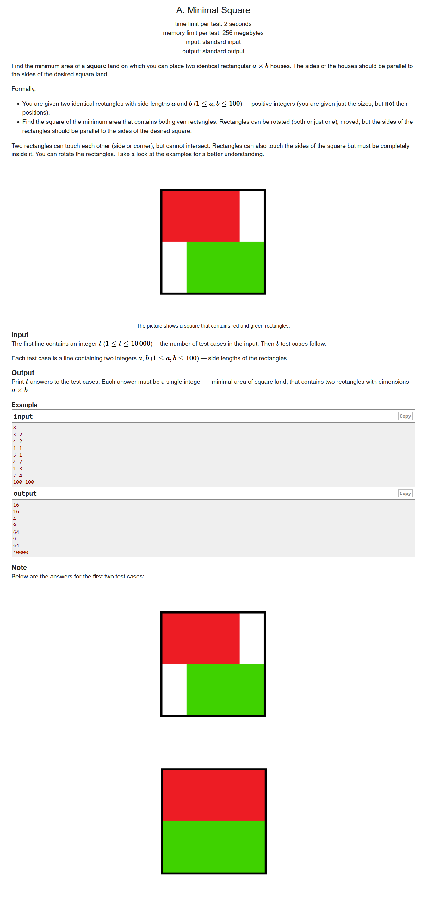
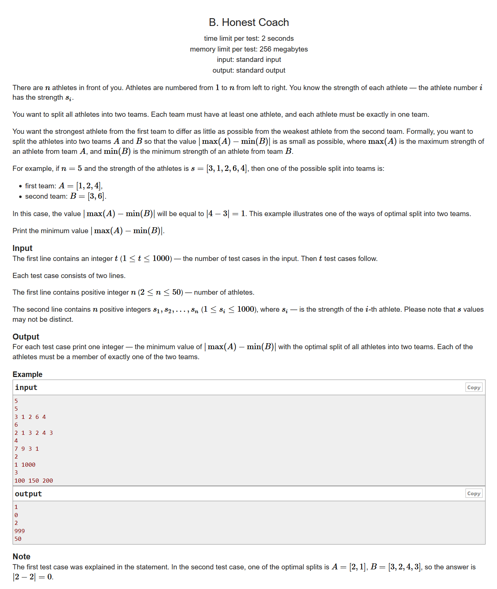
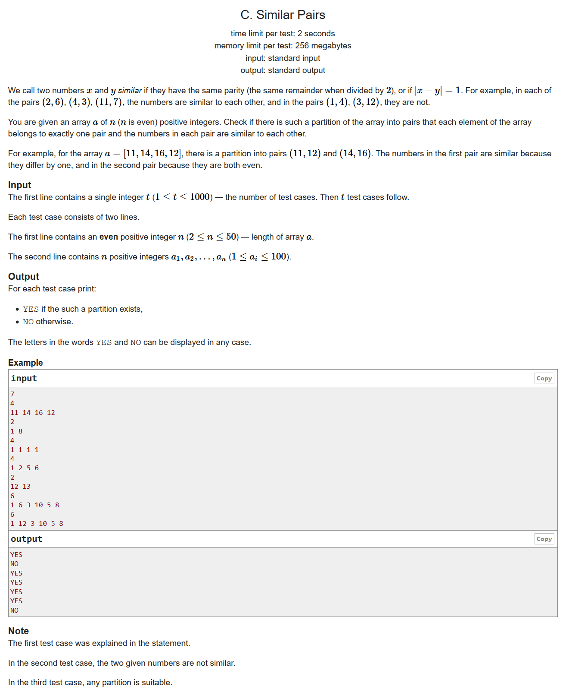
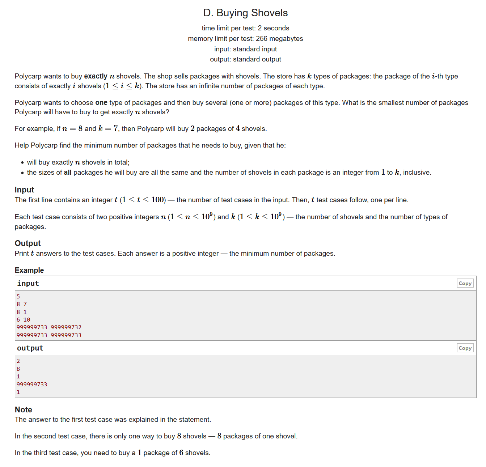
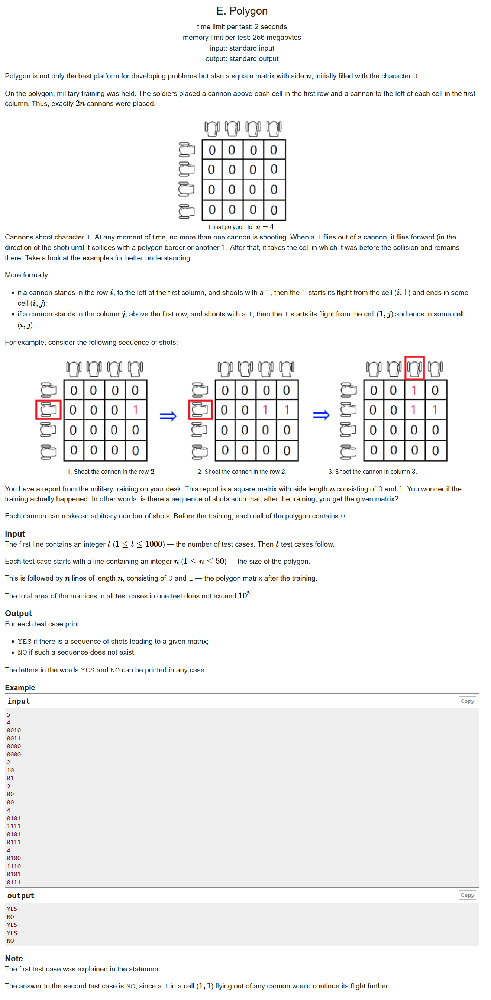
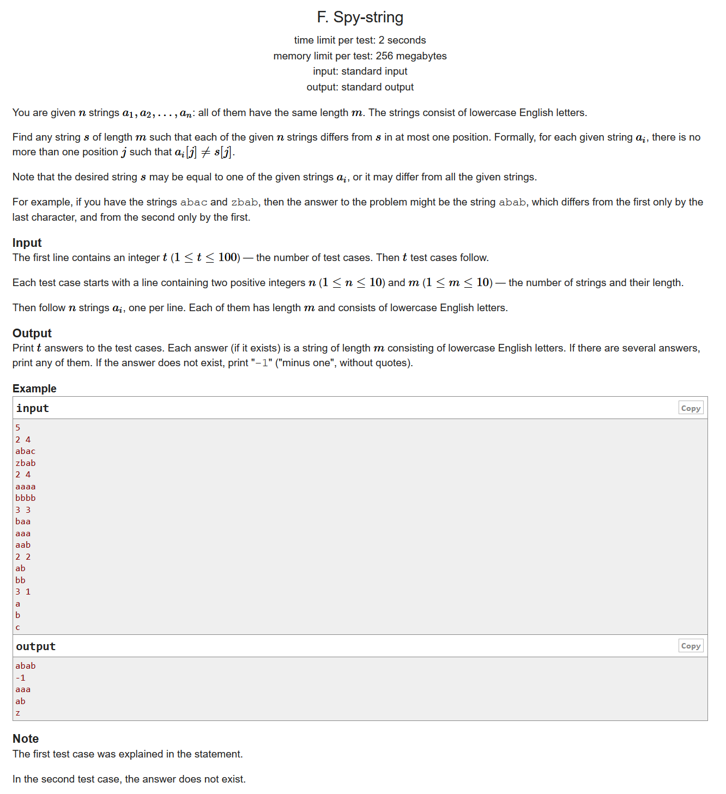
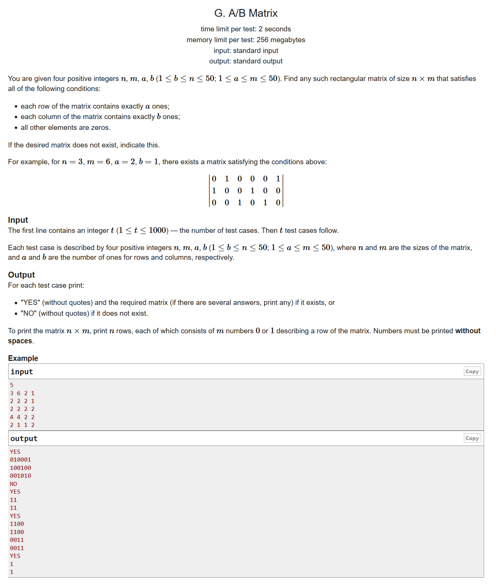
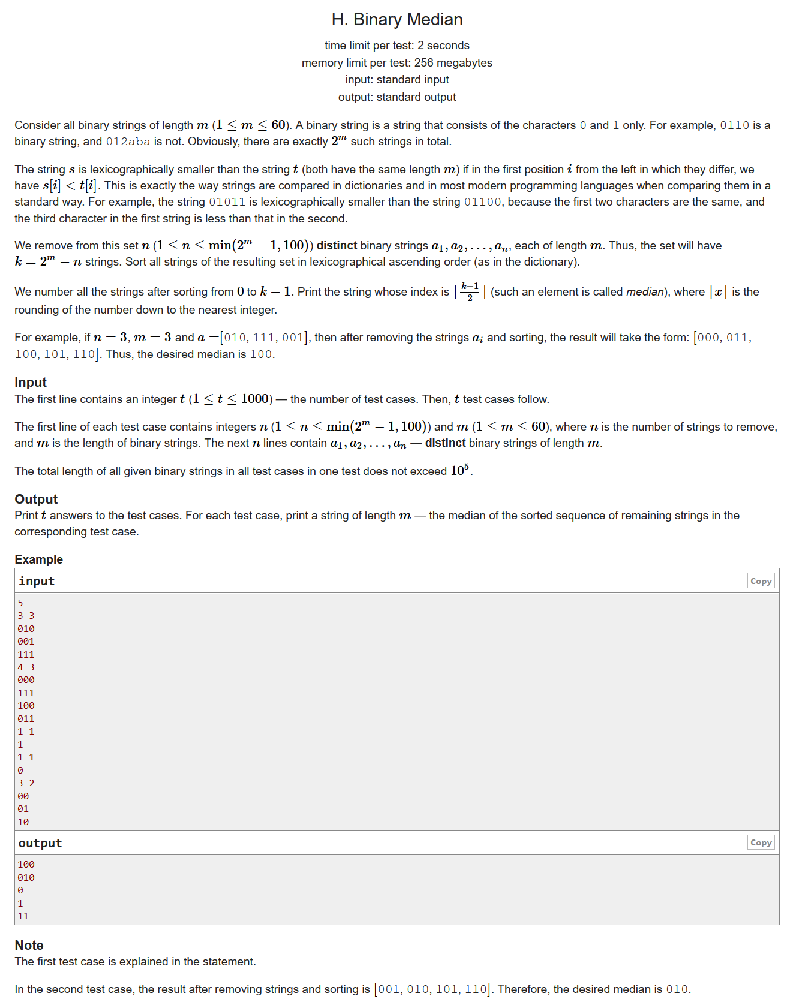

# Codeforces Round #644 (Div. 3)

- https://codeforces.ml/contest/1360/problems

## A. Minimal Square



- 题目大意：给两个相同的矩形的长和宽，求一个可以包含这两个矩形的最小正方形的面积
- 构造题
- 设x为ab当中比较大的那条边，y为ab当中比较小的那条边，如果2*y >= x ，那么正方形的边长就应该是2y；否则的话就是d
  
```cpp
#include <bits/stdc++.h>
using namespace std;
#define LL long long
#define sigma_size 30
#define max_size (int)(1e5+10)
#define MAX (int)(1e5+7)

int ans[max_size];
int main ()
{
	int T ; cin >> T;
	for ( int cas = 1; cas <= T ; cas++ )
	{
		int a , b;
		cin >> a >> b;
		int c = min ( a , b );
		int d = max ( a , b );
		if ( 2*c >= d )
			ans[cas] = 4*c*c;
		else
			ans[cas] = d*d;
	} 
	for ( int i = 1 ; i <= T ; i++ )
		cout << ans[i] << endl;
}
```

## B. Honest Coach



- 题目大意：把一个数列分成两个集合A，B，求A当中的最大值减去B当中的最小值的绝对值的最小值
- 构造题，排序题
- 对数列排个序，比较相邻两个数的差值，取最小即可

```cpp
#include <bits/stdc++.h>
using namespace std;
#define LL long long
#define sigma_size 30
#define max_size (int)(3e3+10)
#define MAX (int)(1e5+7)

int ans[1005];
int main ()
{
	ios::sync_with_stdio(0);
	int T ; cin >> T;
	for ( int cas = 1 ; cas <= T ; cas++ )
	{
		int n; cin >> n;
		int s[1005];
		for ( int i = 1 ; i <= n ; i++ ) cin >> s[i];
		sort ( s+1 , s+1+n , greater<int>() );
		int minx = 0xfffffff;
		for ( int i = 1; i < n ; i++ )
			minx = min ( minx , s[i] - s[i+1] );
		ans[cas] = minx;
	}
	for ( int i = 1 ; i <= T ; i++ )
		cout << ans[i] << endl;
}
```

## C. Similar Pairs



- 题意大意：求问一个数列能否分成若干对，使得这些对要么(1)有相同的奇偶性；(2)相差为1；
- 分治，构造
- 我们可以把奇数的放到一个集合里面，偶数的放到另外一个集合里面。如果奇数集合和偶数集合的元素均为偶数，则输出“YES”；否则的话我们需要判断一下奇数集合和偶数集合当中存不存在相差为1的元素

```cpp
#include <bits/stdc++.h>
using namespace std;
#define LL long long
#define sigma_size 30
#define max_size (int)(2e5+10)
#define MAX (int)(1e5+7)

bool ans[1005];
int main ()
{
	ios::sync_with_stdio(0);
	int T ; cin >> T;
	for ( int cas = 1 ; cas <= T ; cas++ )
	{
		int n ; cin >> n;
		int a[55];
		for ( int i = 1 ; i <= n ; i++ ) cin >> a[i];
		vector <int> p1 , p2;
		for ( int i = 1 ; i <= n ; i++ )
		{
			if ( a[i] & 1 ) p1.push_back(a[i]);
			else p2.push_back(a[i]);
		}
		if ( p1.size() % 2 == 0 && p2.size() % 2 == 0 )
			ans[cas] = 1;
		else
		{
			bool flag = false;
			for ( int i = 0 ; i < p1.size() ; i++ )
			{	
				for ( int j = 0 ; j < p2.size() ; j++ )
					if ( abs(p1[i]-p2[j]) == 1 )
					{
						flag = true;
						break;
					}
				if ( flag ) break;
			}
			ans[cas] = flag;
		}
	}
	for ( int i = 1 ; i <= T ; i++ )
		if ( ans[i] ) cout << "YES" << endl;
		else cout << "NO" << endl;
}
```

## D. Buying Shovels



- 题目大意：找出n的比k小的最大因数
- 枚举

```cpp
#include <bits/stdc++.h>
using namespace std;
#define LL long long
#define sigma_size 30
#define max_size (int)(1e5+10)
#define MAX (int)(1e5+7)

int ans[105];
int main ()
{
	ios::sync_with_stdio(0);
	int T ; cin >> T;
	for ( int cas = 1 ; cas <= T ; cas++ )
	{
		int n , k ;
		cin >> n >> k;
		if ( k >= n )
			ans[cas] = 1;
		else
		{
			int minx = n;
			for ( int i = 1 ; i*i <= n ; i++ )
			{
				if ( n % i ) continue;
				if ( n / i <= k )
					minx = min ( minx , i );
				if ( i <= k )
					minx = min ( minx , n / i ) ;
			}
			ans[cas] = minx;
		}
	}
	for ( int i = 1 ; i <= T ; i++ )
		cout << ans[i] << endl;
}
```

## E. Polygon



- 给定一个矩阵，判断有没有可能是某个发射的序列
- 模拟
- 对于每一个1，如果这个1的右边和下边都是合法的，那么就是不可能达到的

```cpp
#include <bits/stdc++.h>
using namespace std;
#define LL long long
#define sigma_size 30
#define max_size (int)(2e5+10)
#define MAX (int)(1e5+7)

bool ans[1005];
int main ()
{
    ios::sync_with_stdio(0);
    int T ; cin >> T;
    for ( int cas = 1 ; cas <= T ; cas++ )
    {
        int n ; cin >> n;
        char s[55][55];
        for ( int i = 1 ; i <= n ; i++ )
            cin >> s[i] + 1 ;
        
        bool flag = true;
        for ( int i = 1 ; i <= n ; i++ )
        {
            for ( int j = 1 ; j <= n ; j++ )
            {
                if ( s[i][j] == '1' )
                {
                    if ( j < n && i < n && s[i][j+1] == '0' && s[i+1][j] == '0' )
                    {
                        flag = false;
                        break;
                    }
                }
            }
            if ( !flag ) break;
        }
        ans[cas] = flag;
        
    }
    for ( int i = 1 ; i <= T ; i++ )
        if ( ans[i] ) cout << "YES" << endl;
        else cout << "NO" << endl;
}
```

## F. Spy-string



- 暴力

```cpp
#include <bits/stdc++.h>
using namespace std;
#define LL long long
#define ULL unsigned long long
#define sigma_size 30
#define max_size (int)(2e5+10)
#define MAX_SIZE (int)(4e6+7)

int main ()
{
	ios::sync_with_stdio(0);
	int T ; cin >> T ;
	for ( int cas = 1 ; cas <= T ; cas++ )
	{
		int n , m;
		cin >> n >> m;
		string s[15];
		for ( int i = 1 ; i <= n ; i++ ) cin >> s[i];
		string res = s[1];
		string res1 , res2 ;
		string bf[30];
		int flag = 0;
		for ( int i = 2 ; i <= n ; i++ )
		{
			int cnt = 0;
			for ( int j = 0 ; j < m ; j++ )
				if ( res[j] != s[i][j] ) cnt++;
			
			if ( cnt == 0 ) continue;
			if ( cnt >= 3 ) { flag = 3; break;}
			if ( cnt == 1 )
			{
				for ( int j = 1 ; j <= 26 ; j++ )
					bf[j] = res;
				int j ;
				for ( j = 0 ; j < m ; j++ )
					if ( res[j] != s[i][j] )
						break;
				for ( int k = 1 ; k <= 26 ; k++ )
					bf[k][j] = (char)('a' + k - 1);
			}
			if ( cnt == 2 )
			{
				flag = 2;
				res1 = res2 = res;
				int j  ; 
				for ( j = 0 ; j < m ; j++ )
					if ( res[j] != s[i][j] )
					{
						res1[j] = s[i][j];
						break;
					}
				for ( j = j+1 ; j < m ; j++ )
					if ( res[j] != s[i][j] )
					{
						res2[j] = s[i][j];
						break;
					}
				break;
			}
		}
		//cout << flag << endl;
		if ( flag == 3 )
			cout << "-1" << endl;
		else if ( flag == 0 )
			cout << res << endl;
		else if ( flag == 1 )
		{
			int ans = 0;
			for ( int i = 1 ; i <= n ; i++ )
			{
				int a[30] = {0};
				for ( int j = 1 ; j <= 26 ; j++ )
					for ( int k = 0 ; k < m ; k++ )
						if ( bf[j][k] != s[i][k] ) a[j]++;
				for ( int j = 1 ; j <= 26 ; j++ )
					if ( a[j] >= 2 )
						ans |= (1 << j-1 );
			}
			bool flag = false;
			for ( int i = 0 ; i < 26 ; i++ )
				if ( !(ans&(1<<i)) )
				{
					flag = true;
					cout << bf[i] << endl;
					break;
				}
			if ( !flag ) cout << "-1" << endl;
		}
		else if ( flag == 2 )
		{
			int ans = 0;
			for ( int i = 1 ; i <= n ; i++ )
			{
				int a = 0 , b = 0;
				for ( int j = 0 ; j < m ; j++ )
				{
					if ( res1[j] != s[i][j] ) a++;
					if ( res2[j] != s[i][j] ) b++;
				}
				if ( a >= 2 ) ans |= 1;
				if ( b >= 2 ) ans |= 2;
				if ( ans == 3 ) break;
			}
			if ( ans == 3 ) cout << "-1" << endl;
			else if ( ans != 1 ) cout << res1 << endl;
			else if ( ans != 2 ) cout << res2 << endl;
		}
	}
}
```

## G. A/B Matrix



- 构造

```cpp
#include <bits/stdc++.h>
using namespace std;
#define LL long long
#define sigma_size 30
#define max_size (int)(2e5+10)
#define _DEBUG1 freopen("input.txt", "r", stdin);freopen("output.txt", "w", stdout);
#define _DEBUG2 fclose("input.txt");fclose("output.txt");


int main ()
{
	ios::sync_with_stdio(0);
	int t ; cin >> t;
	while (t--)
	{
		int n , m , a , b;
		cin >> n >> m >> a >> b;
		if ( n * a != m * b )
		{
			cout << "NO" << endl;
			continue;
		}
		int ans[55][55];
		memset ( ans , 0 , sizeof(ans) );
		int shift ;
		for ( shift = 1 ; shift < m ; shift++ )
			if ( shift * n % m == 0 ) break;
		for ( int i = 1 , dx = 0 ; i <= n ; i++ , dx += shift )
		{
			for ( int j = 1 ; j <= a ; j++ )
				ans[i][(j-1+dx)%m+1] = 1;
		}
		cout << "YES" << endl;
		for ( int i = 1 ; i <= n ; i++ )
		{	
			for ( int j = 1 ; j <= m ; j++ )
				cout << ans[i][j];
			cout << endl;
		}		
	}
	return 0;
}
```

## H. Binary Median



- 排序

```cpp
#include <bits/stdc++.h>
using namespace std;
#define LL long long
#define sigma_size 30
#define max_size (int)(5e5+10)
#define MAX (int)(1e5+7)
#define _DEBUG1 freopen("input.txt", "r", stdin);freopen("output.txt", "w", stdout);

int main ()
{
	//_DEBUG1
	ios::sync_with_stdio(0);
	int T ; cin >> T;
	for ( int cas = 1 ; cas <= T ; cas++ )
	{
		LL n , m;
		cin >> n >> m;
		LL v[105];
		memset ( v , 0 , sizeof(v) );
		for ( int i = 1 ; i <= n ; i++ )
		{
			string s ; cin >> s;
			for ( int j = 0 ; j < m ; j++ )
				v[i] = v[i]*2 + (int)(s[j]-'0');
		}
		LL cur = ( 1ll << (m-1) ) - 1;
		LL need =  ( (1ll << m) - n - 1 ) / 2 + 1;
		while (1)
		{
			LL left = cur+1;
			bool flag = false;
			for ( int i = 1 ; i <= n ; i++ )
			{
				flag |= v[i] == cur;
				if ( v[i] <= cur ) left--;
			}
			if ( left == need && !flag )
			{
				string s;
				for ( int i = 0 ; i < m ; i++ )
				{
					s += (char)(cur % 2 + '0');
					cur /= 2;
				}
				reverse(s.begin(),s.end());
				cout << s << endl;
				break;
			}
			else if ( left < need ) cur++;
			else cur--;
		}
	}
	return 0;
}
```
