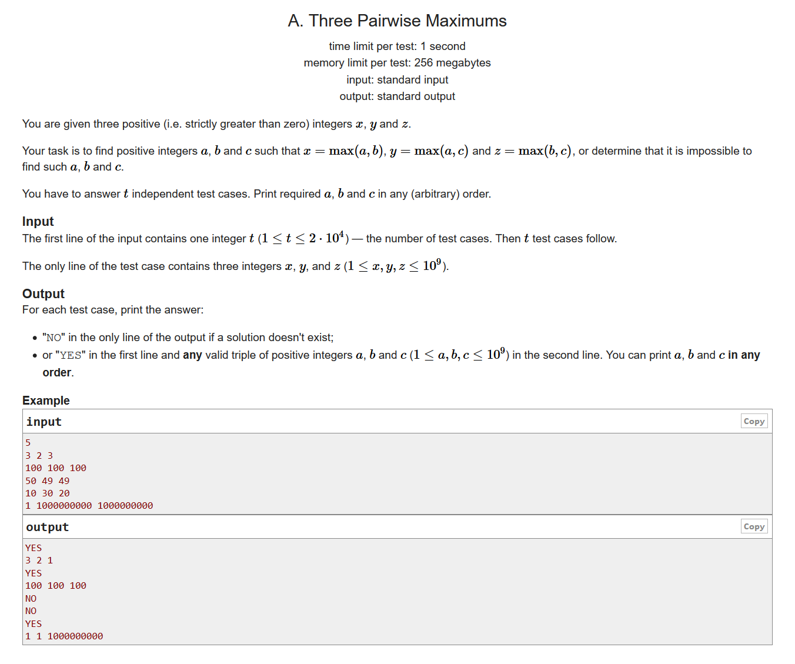
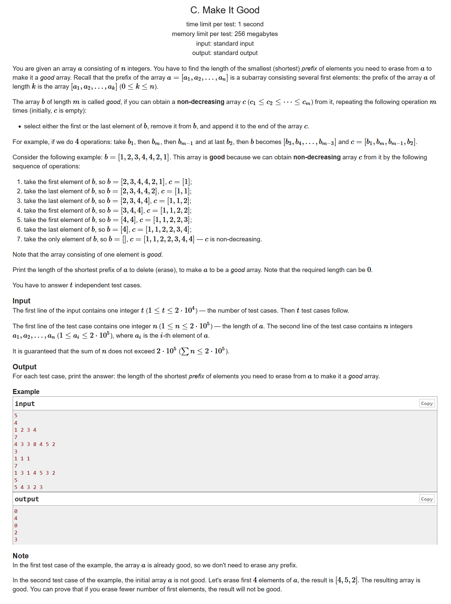
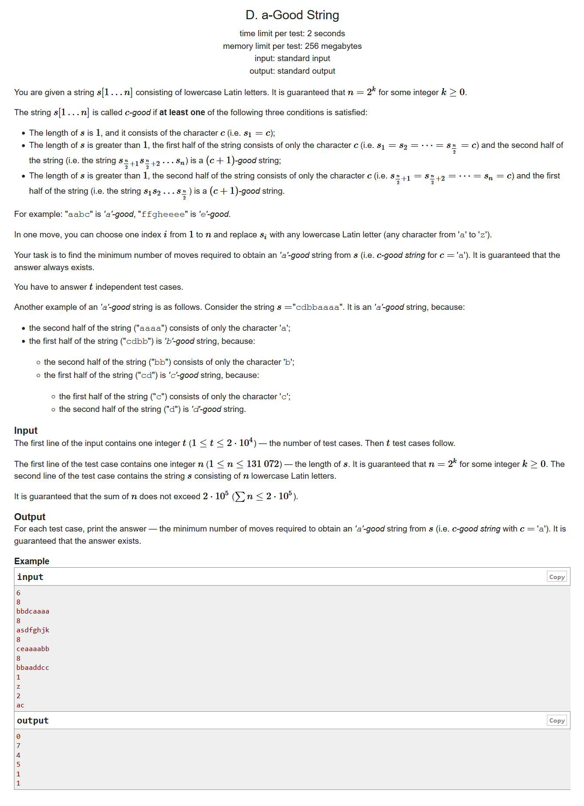
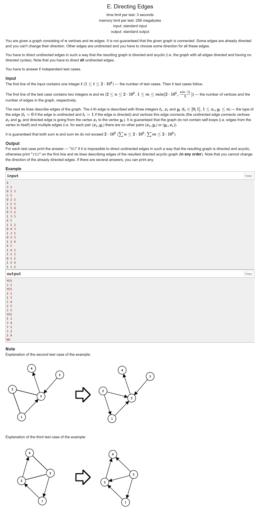
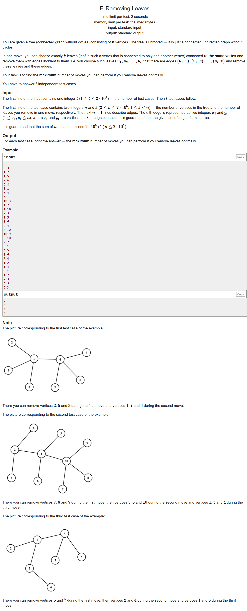
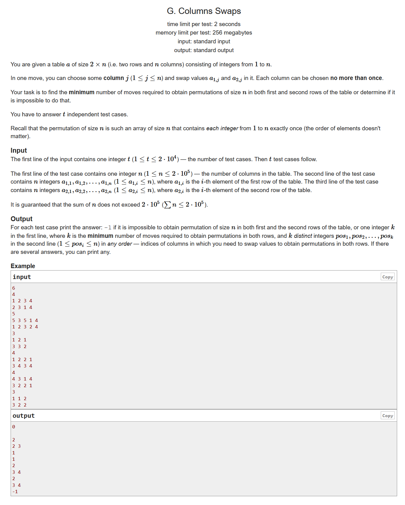

# Codeforces Round #656 (Div. 3)

- https://codeforces.ml/contest/1385/problems

## A. Three Pairwise Maximums



```cpp
#include <bits/stdc++.h>
using namespace std;
#define LL long long
#define sigma_size 30
#define max_size (int)(1e5+10)
#define MAX (int)(1e5+7)
int qread()
{
	char c; int s=0,t=1; while ((c=getchar())<'0' || c>'9') (c=='-' && (t=-1));
	do s=s*10+c-'0'; while ((c=getchar())>='0' && c<='9'); return s*t;
}

int main (){
	int t = qread();
	while (t--)
	{
		int a[3];
		for ( int i = 0 ; i < 3 ; i++ )
			cin >> a[i] ;
		sort ( a , a+3 );
		if ( a[1] == a[2] )
		{
			cout << "YES" << endl;
			printf ( "1 %d %d\n",a[0],a[1] );
		}
		else
			cout << "NO" << endl;
	}
}
```

## B. Restore the Permutation by Merger

```cpp
#include <bits/stdc++.h>
using namespace std;
#define LL long long
#define sigma_size 30
#define max_size (int)(3e3+10)
#define MAX (int)(1e5+7)
int qread()
{
	char c; int s=0,t=1; while ((c=getchar())<'0' || c>'9') (c=='-' && (t=-1));
	do s=s*10+c-'0'; while ((c=getchar())>='0' && c<='9'); return s*t;
}

bool mark[55];

int main ()
{
	int t = qread();
	while (t--)
	{
		memset ( mark , false , sizeof(mark) );
		int n = qread();
		int ans[55] , num = 0;
		for ( int i = 1 ; i <= n*2 ; i++ )
		{
			int x = qread();
			if (!mark[x])
			{
				ans[num++] = x;
				mark[x] = 1;
			}
		}
		for ( int i = 0 ; i < num ; i++ )
		{
			cout << ans[i] ;
			if ( i < num-1 ) cout << " ";
			else 			cout << endl;
		}
	}
}
```

## C. Make It Good

```cpp
#include <bits/stdc++.h>
using namespace std;
#define LL long long
#define sigma_size 30
#define max_size (int)(2e5+10)
#define MAX (int)(1e5+7)
int qread()
{
	char c; int s=0,t=1; while ((c=getchar())<'0' || c>'9') (c=='-' && (t=-1));
	do s=s*10+c-'0'; while ((c=getchar())>='0' && c<='9'); return s*t;
}


int ans[max_size] , tot = 0;
int a[max_size];
int main ()
{
	int t = qread();
	while (t--)
	{
		int n = qread();
		for ( int i = 1 ; i <= n ; i++ )
			a[i] = qread();
		bool flag = false;
		int res = 1;
		for ( int i = n-1 ; i >= 1 ; i-- )
		{
			if ( a[i] >= a[i+1] && !flag )
				res++;
			else if ( a[i] <= a[i+1] )
				res++ , flag = true;
			else if ( flag && a[i] > a[i+1] )
				break;
		}
		ans[tot++] = n - res;
	}
	for ( int i = 0 ; i < tot ; i++ )
		cout << ans[i] << endl;
}
```

## D. a-Good String



```cpp
#include <bits/stdc++.h>
using namespace std;
#define LL long long
#define sigma_size 30
#define max_size (int)(2e4+10)
#define MAX (int)(1e5+7)
int qread()
{
	char c; int s=0,t=1; while ((c=getchar())<'0' || c>'9') (c=='-' && (t=-1));
	do s=s*10+c-'0'; while ((c=getchar())>='0' && c<='9'); return s*t;
}

int ans[max_size];
int n;
string s;
int solve ( int l , int r , char ch )
{
	if ( l == r )
		return !(s[l] == ch);
	int mid = l + r >> 1;
	int a = 0 , b = 0;
	for ( int i = l ; i <= mid ; i++ )
		if ( s[i] != ch ) a++;
	for ( int i = mid+1 ; i <= r ; i++ )
		if ( s[i] != ch ) b++;
	return min ( a + solve(mid+1,r,ch+1) , b + solve(l,mid,ch+1) );
}
int main ()
{
	ios::sync_with_stdio(0);
	int T ; cin >> T;
	for ( int cas = 1 ; cas <= T ; cas++ )
	{
		cin >> n >> s;
		s = ' ' + s;
		ans[cas] = solve(1,n,'a');
	}
	for ( int i = 1 ; i <= T ; i++ )
		cout << ans[i] << endl;
}
```

## E. Directing Edges



```cpp
#include <bits/stdc++.h>
using namespace std;
#define LL long long
#define sigma_size 30
#define max_size (int)(2e5+10)
#define MAX (int)(1e5+7)

vector < pair<int,int> > Edge;
vector <int> G[max_size];
int vis[max_size];
int deg[max_size];
int topu[max_size];
int n , m;
void init()
{
    Edge.clear();
    for ( int i = 0 ; i <= n+5 ; i++ ) G[i].clear();
    memset ( vis , 0 , (n+5)*sizeof(int) );
    memset ( deg , 0 , (n+5)*sizeof(int) );
    memset ( topu , 0 , (n+5)*sizeof(int) );
}

bool dfs ( int u )
{
    vis[u] = 1;
    for ( int i = 0 ; i < G[u].size() ; i++ )
    {
        int v = G[u][i];
        if ( vis[v] == 1 ) return false;
        if ( vis[v] == 2 ) continue;
        if ( !dfs(v) ) return false;
    }
    vis[u] = 2;
    return true;
}
void Topusort ()
{
    stack <int> s;
    int tot = 0;
    for ( int i = 1 ; i <= n ; i++ ) if ( !deg[i] ) s.push(i);
    while ( !s.empty() )
    {
        int u = s.top() ; s.pop();
        topu[u] = ++tot;
        for ( int i = 0 ; i < G[u].size() ; i++ )
        {
            int v = G[u][i];
            if ( --deg[v] == 0 ) s.push(v);
            cout << u << " " << v << endl;
        }
    }
}
int main ()
{
    ios::sync_with_stdio(0);
    int T ; cin >> T;
    while (T--)
    {
        cin >> n >> m;
        init();
        for ( int i = 1 ; i <= m ; i++ )
        {
            int t , u , v;
            cin >> t >> u >> v;
            if ( t == 0 )
                Edge.push_back(make_pair(u,v));
            else if ( t == 1 )
                G[u].push_back(v) , deg[v]++;
        }
        bool flag = true;
        for ( int i = 1 ; i <= n ; i++ )
        {
            if ( vis[i] ) continue;
            if ( !dfs(i) )
            {
                flag = false;
                break;
            }
        }
        if ( !flag )
        {
            cout << "NO" << endl;
            continue;
        }
        cout << "YES" << endl;
        Topusort();
        for ( int i = 0 ; i < Edge.size() ; i++ )
        {
            int u = Edge[i].first;
            int v = Edge[i].second;
            if ( topu[u] < topu[v] ) cout << u << " " << v << endl;
            else cout << v << " " << u << endl;
        }
    }
}
```

## F. Removing Leaves



```cpp
#include <bits/stdc++.h>
using namespace std;
#define LL long long
#define ULL unsigned long long
#define sigma_size 30
#define max_size (int)(2e5+10)
#define MAX_SIZE (int)(4e6+7)

int n , k;
int leaf[max_size], deg[max_size];
vector <int> G[max_size];
void init()
{
	memset ( leaf , 0 , (n+5)*sizeof(int) );
	memset ( deg , 0 , (n+5)*sizeof(int) );
	for ( int i = 0 ; i <= n+5 ; i++ ) G[i].clear();
}

int ans[max_size];
int main ()
{
	ios::sync_with_stdio(0);
	int T ; cin >> T ;
	for ( int cas = 1 ; cas <= T ; cas++ )
	{
		cin >> n >> k;
		init();
		for ( int i = 1 ; i < n ; i++ )
		{
			int u , v;
			cin >> u >> v;
			G[u].push_back(v);
			G[v].push_back(u);
			deg[u]++ , deg[v]++;
		}
		if ( k == 1 )
		{
			ans[cas] = n-1;
			continue;
		}
		for ( int i = 1 ; i <= n ; i++ ) if ( deg[i] == 1 ) leaf[G[i][0]]++;
		queue <int> q;
		int res = 0;
		for ( int i = 1 ; i <= n ; i++ ) if ( leaf[i] >= k ) q.push(i);

		while (!q.empty())
		{
			int u = q.front() ; q.pop();
			int tmp = leaf[u] / k;
			res += tmp;
			leaf[u] -= tmp * k;
			deg[u] -= tmp * k;
			if ( deg[u] == 1 && leaf[u] == 0 )
			{
				deg[u] = 0;
				for ( int i = 0 ; i < G[u].size() ; i++ )
				{
					int v = G[u][i];
					if ( deg[v] <= 1 ) continue;
					leaf[v]++;
					if ( leaf[v] >= k ) q.push(v);
				}
			}
		}
		ans[cas] = res;
	}
	for ( int i = 1 ; i <= T ; i++ )
		cout << ans[i] << endl;
}
```


## G. Columns Swaps



```cpp
#include <bits/stdc++.h>
using namespace std;
#define LL long long
#define sigma_size 30
#define max_size (int)(2e5+10)
#define _DEBUG1 freopen("input.txt", "r", stdin);freopen("output.txt", "w", stdout);
#define _DEBUG2 fclose("input.txt");fclose("output.txt");


int Hash[max_size<<1] , pos1[max_size<<1] , pos2[max_size<<1];
int res[max_size<<1];
int p[max_size<<1];
bool mark[max_size<<1];
int n;
void init()
{
	memset ( Hash , 0 , (n*2+5)*sizeof(int) );
	memset ( pos1 , 0 , (n*2+5)*sizeof(int) );
	memset ( pos2 , 0 , (n*2+5)*sizeof(int) );
	memset ( mark , false , (n*2+5)*sizeof(int) );
	memset ( res , 0 , (n*2+5)*sizeof(int) );
	for ( int i = 1 ; i <= n*2+5 ; i++ ) p[i] = i;
}

int find ( int x ) {
	return p[x] == x ? x : p[x] = find(p[x]);
}
void unite ( int x , int y ) {
	x = find(x) , y = find(y);
	if ( x == y ) return ;
	p[x] = y;
}
int main ()
{
	ios::sync_with_stdio(0);
	int T ; cin >> T;
	while (T--)
	{
		cin >> n;
		init();
		for ( int i = 1 ; i <= n ; i++ )
		{
			int a ; cin >> a;
			Hash[a]++;
			if ( !pos1[a] )
				pos1[a] = 1 , pos2[a] = i;
			else unite ( pos2[a] , i+n ) , unite ( pos2[a]+n , i );
		}
		for ( int i = 1 ; i <= n ; i++ )
		{
			int tmp ; cin >> tmp;
			Hash[tmp]++;
			if ( !pos1[tmp] )	pos1[tmp] = 2 , pos2[tmp] = i;
			else
			{
				if ( pos1[tmp] == 2 )
					unite ( pos2[tmp] , i+n ) , unite ( pos2[tmp]+n , i );
				else if ( pos1[tmp] == 1 )
				{
					if ( pos2[tmp] != i )
						unite ( pos2[tmp] , i ) , unite ( pos2[tmp]+n , i+n );
					else p[i] = -1 , p[i+n] = -1;
				}
				pos1[tmp] = -1;
			}
		}
		
		bool flag = true;
		for ( int i = 1;  i <= n ; i++ )
			if ( Hash[i] != 2 ) { flag = false ; break; }
		if ( !flag ) { cout << "-1" << endl; continue ;}

		for ( int i = 1 ; i <= 2*n ; i++ )
			if ( p[i] != -1 ) p[i] = find ( p[i] );
		for ( int i = 1 ; i <= n ; i++ )
			if ( p[i] != -1 ) res[p[i]]++;
		int ans = 0;
		for ( int i = 1 ; i <= n ; i++ )
		{
			if ( p[i] == -1 ) continue;
			if ( res[p[i]] > 0 && res[p[i+n]] >= 0 )
			{
				if ( res[p[i]] >= res[p[i+n]] )
					res[p[i]] = -1;
				else res[p[i+n]] = -1;
			}
			if ( res[p[i]] > 0 ) mark[i] = 1 , ans++;
		}
		cout << ans << endl;
		for ( int i = 1 ; i <= n ; i++ )
			if ( mark[i] ) cout << i << " ";
		cout << endl;
	}
	return 0;
}
```