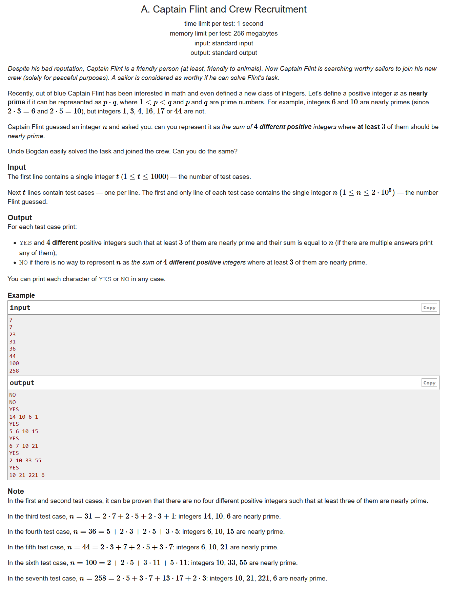
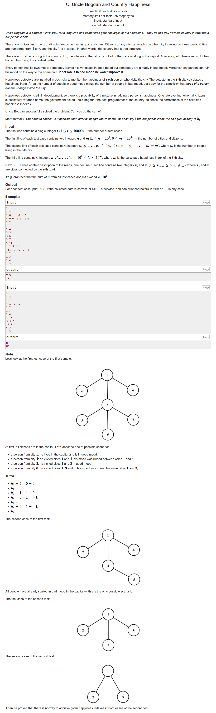
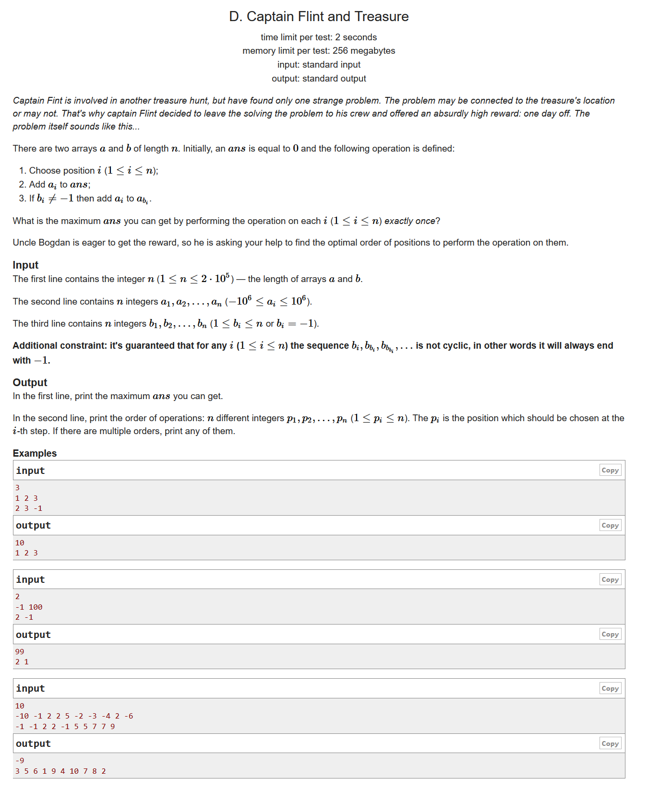

# Codeforces Round #660 (Div. 2)

- https://codeforces.ml/contest/1388/problems

## A. Captain Flint and Crew Recruitment



- 构造题
- 因为题目既要求要有四个不同的正整数，又要求分解出来的两个质数必须不同，这样我们可以首先联想几个最小的数字$2*3=6,2*5=10,2*7=14,3*5=15$，由此我们可以知道，小于等于30的肯定没戏，当然我们还有几个比较特殊的数字，那就是36，40，44，因为他们减去前三个最小的数的时候出现了重复的数字，这个时候我们就特殊处理一下用15代替。

```cpp
#include <bits/stdc++.h>
using namespace std;
#define LL long long
#define sigma_size 30
#define max_size (int)(2e5+10)
#define MAX (int)(1e5+7)

int main (){
	ios::sync_with_stdio(0);
	int T ; cin >> T;
	while(T--)
	{
		int n ;
		cin >> n;
		if ( n <= 30 )
			cout << "NO" << endl;
		else
		{
			if ( n != 40 && n != 36 && n != 44 )
				cout << "YES\n6 10 14 " << n - 30 << endl;
			else cout << "YES\n6 10 15 " << n- 31 << endl;
		}
	}
}
```

## B. Captain Flint and a Long Voyage


- 贪心
- 由贪心的思想我们可以知道，要使得二进制的数字最大，我们就应该要求这个二进制的数字较多，而且1~10里面我们很容易知道只有8和9是四位的，其余都是3位的。同时我们又要使得得到的x最小，那么问题就转变成我们最多可以有多少个末尾的9变成8.

```cpp
#include <bits/stdc++.h>
using namespace std;
#define LL long long
#define sigma_size 30
#define max_size (int)(2e5+10)
#define MAX (int)(1e5+7)


int main ()
{
	ios::sync_with_stdio(0);
	int T ; cin >> T ;
	while (T--)
	{
		int n ; cin >> n;
		int d = n / 4 + ( n % 4 != 0 ) ;
		for ( int i = 1 ; i <= n-d ; i++ )
			cout << "9";
		for ( int i = 1 ; i <= d ; i++ )
			cout << "8";
		cout << endl;
	}
}
```

## C. Uncle Bogdan and Country Happiness




- 模拟
- 我们可以知道叶子结点是最好判断的，所以我们可以通过dfs慢慢地走上去
- 首先我们对于某一个结点，当我们知道了这个结点的经过人数sum以及好人与坏人的差值h，我们就可以知道这个结点经过的好人与坏人的数目，即：

$$
\begin{cases}
    good + bad &= sum \\
    good - bad &= h \\
\end{cases}
$$

- 接下来我们对于某个结点，我们可以用dp[u][1]和dp[u][2]来保存这个结点**最少应该有的好人数**以及最大的坏人数，那么我们对于这个结点的判断就有以下条件是需要满足的：

$$
\begin{cases}
	sum >= h[u] & (人数应该不小于差值) \\
	dp[u][1] <= x & ( 好人的人数应该不小于儿子结点的好人数之和) \\
	( sum + h[u] ) \space mod \space 2 == 0 & (人数不能是半个) \\
\end{cases}
$$


```cpp
#include <bits/stdc++.h>
using namespace std;
#define LL long long
#define sigma_size 30
#define max_size (int)(1e5+10)
#define MAX (int)(1e5+7)

bool ans[max_size];
int n , m;
int p[max_size] , h[max_size];
int dp[max_size][3];
vector <int> G[max_size];
void init() {
	memset ( p , 0 , (n+5)*sizeof(int) );
	memset ( h , 0 , (n+5)*sizeof(int) );
	memset ( dp , 0 , sizeof(dp) );
	for ( int i = 0 ; i <= n ; i++ ) G[i].clear();
}

bool dfs ( int u , int fa )
{
	if ( G[u].size() == 1 && u != 1 )
	{
		if ( p[u] < abs(h[u]) ) return false;
		if ( (p[u]+h[u]) % 2 ) return false;
		dp[u][1] = ( p[u] + h[u] ) / 2;
		dp[u][2] = p[u] - dp[u][1];
		return true;
	}
	for ( int i = 0 ; i < G[u].size() ; i++ )
	{
		int v = G[u][i];
		if ( v == fa )  continue;
		if ( !dfs(v,u) ) return false;
		dp[u][1] += dp[v][1];
		dp[u][2] += dp[v][2];
	}
	dp[u][2] += p[u];
	int sum = dp[u][1] + dp[u][2];
	if ( sum < abs(h[u]) ) return false;
	if ( ( sum + h[u] ) % 2 ) return false;
	int x = ( sum + h[u] ) / 2 ;
	int y = sum - x;
	if ( x < dp[u][1] ) return false;
	dp[u][1] = x , dp[u][2] = y;
	return true;
}
int main ()
{
	ios::sync_with_stdio(0);
	int T ; cin >> T;
	for ( int cas = 1 ; cas <= T ; cas++ )
	{
		cin >> n >> m ; init();
		for ( int i = 1 ; i <= n ; i++ ) cin >> p[i];
		for ( int i = 1 ; i <= n ; i++ ) cin >> h[i];
		for ( int i = 1 ; i < n ; i++ )
		{
			int u , v ; 
			cin >> u >> v;
			G[u].push_back(v);
			G[v].push_back(u);
		}
		ans[cas] = dfs(1,0);
	}
	for ( int i =1 ; i <= T ; i++ )
		if ( ans[i] ) cout << "YES" << endl;
		else cout << "NO" << endl;
}
```

## D. Captain Flint and Treasure



- 拓扑排序
- 首先我们需要对这些数据构建一个图，我们把这个结点会影响的下一个结点连成一条边，即(i,b[i])
- 接下来我们观察一个没有入度的结点V，如果V>0的同时b[v] != -1 ,也就是说这个V会对后面的数产生正向收益，我们就需要先遍历这个V；

	如果V<=0，也就是说这个V不能对后面的结点产生正向收益，我们就需要后遍历这个V，使得我们的损失最小。

	关于先遍历和后遍历我们可以用两个容器now以及after来存放结点，那么我们最后的答案就应该是now+reverse(after)
- 在此之前我们就需要对这个图进行一次拓扑排序

```cpp
#include <bits/stdc++.h>
using namespace std;
#define LL long long
#define sigma_size 30
#define max_size (int)(2e5+10)
#define MAX (int)(1e5+7)

LL a[max_size] , b[max_size];
int n;
vector <int> G[max_size];
vector <int> order;
vector <int> now , after;
int deg[max_size];
void Topusort ()
{
	stack <int> s;
	for ( int i = 1 ; i <= n ; i++ ) if ( deg[i] == 0 ) s.push(i);
	while ( !s.empty() )
	{
		int u = s.top() ; s.pop();
		order.push_back(u);
		for ( int i = 0 ; i < G[u].size() ; i++ )
		{
			int v = G[u][i];
			if ( --deg[v] == 0 ) s.push(v);
		}
	}
}
int main ()
{
	ios::sync_with_stdio(0);
	cin >> n;
	for ( int i = 1 ; i <= n ; i++ ) cin >> a[i];
	for ( int i = 1 ; i <= n ; i++ ) cin >> b[i];
	for ( int i = 1 ; i <= n ; i++ )
	{
		if ( b[i] == -1 ) continue;
		G[i].push_back(b[i]);
		deg[b[i]]++;
	}
	Topusort();
	LL ans = 0;
	for ( int i = 0 ; i < order.size() ; i++ )
	{
		int u = order[i];
		ans += a[u];
		if ( a[u] > 0 ) 
		{
			if ( b[u] != -1 )
				a[b[u]]+=a[u];
			now.push_back(u);
		}
		if ( a[u] <= 0 )
			after.push_back(u);
	}
	reverse ( after.begin() , after.end() );
	cout << ans << endl;
	for ( int i = 0 ; i < now.size() ; i++ )
		cout << now[i] << " ";
	for ( int i = 0 ; i < after.size() ; i++ )
		cout << after[i] << " ";
	cout << endl;
}
```
