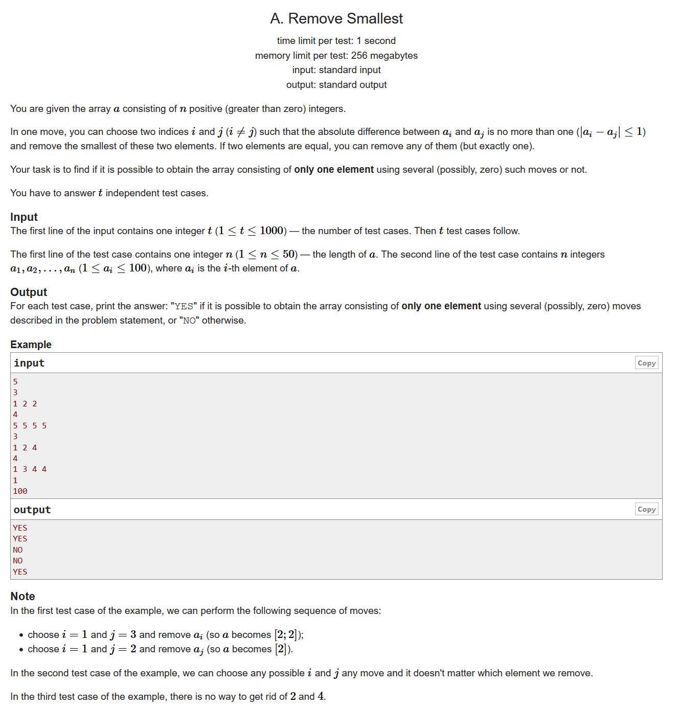
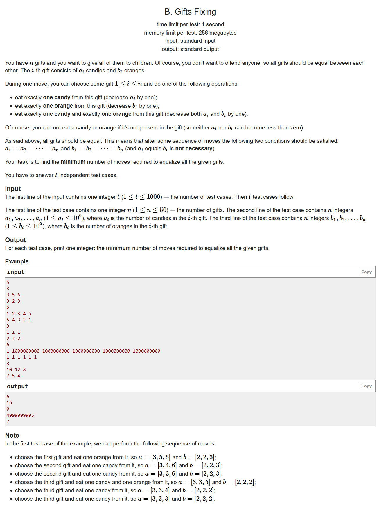
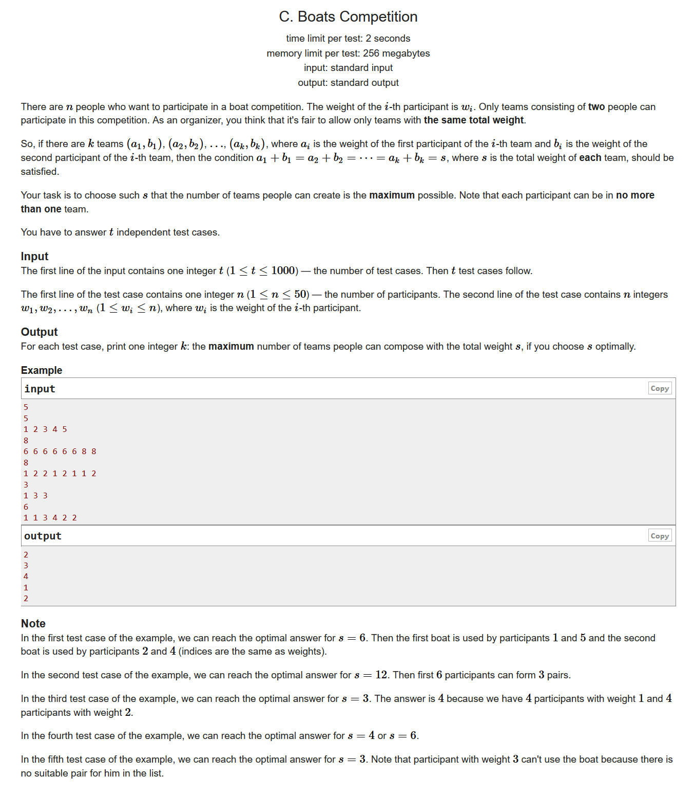
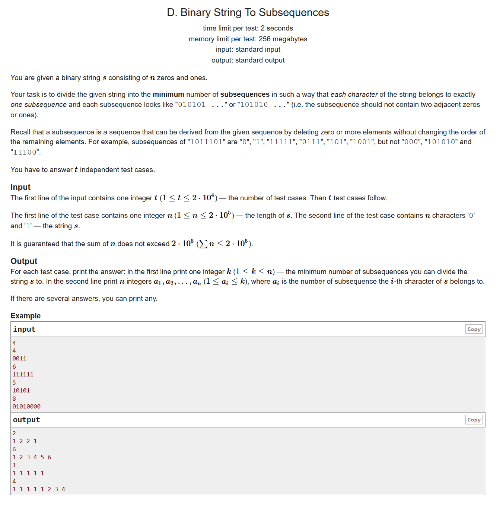
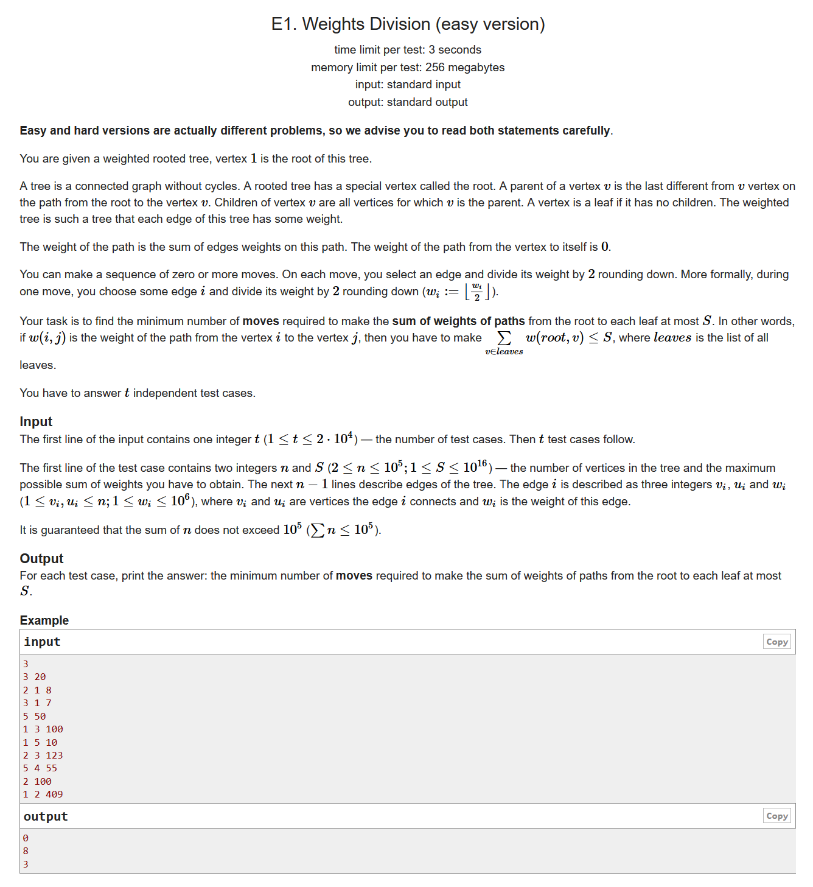
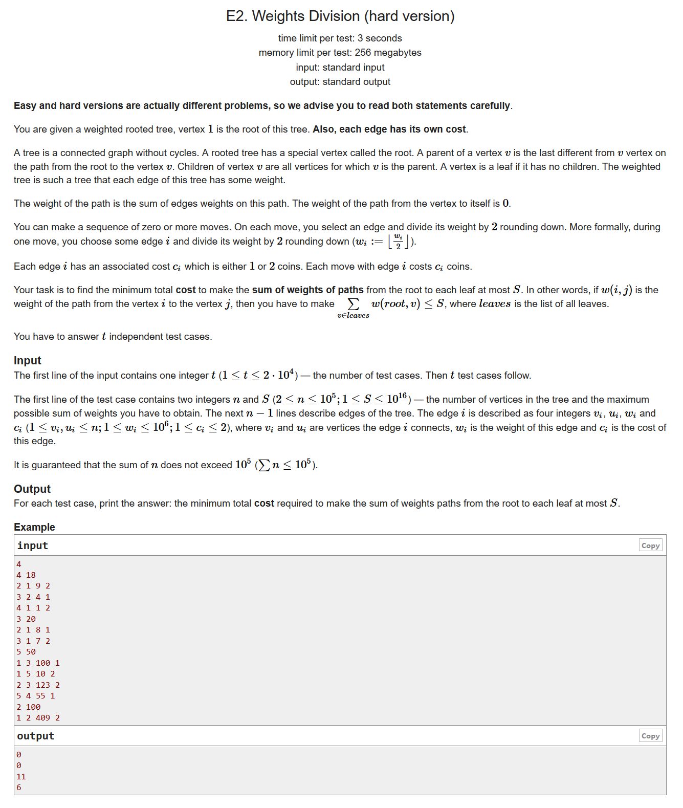
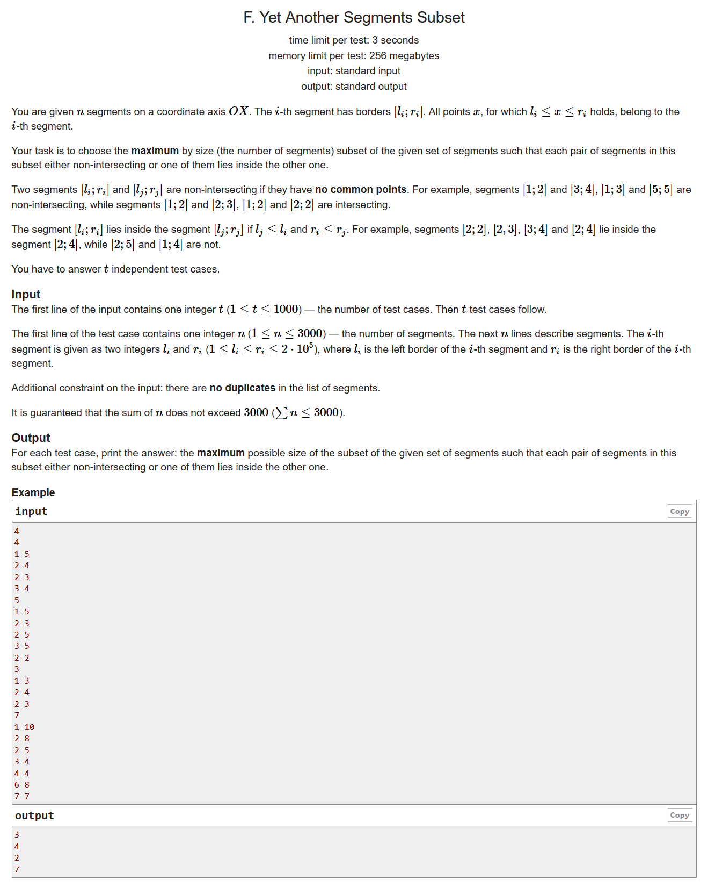

# Codeforces Round #661 (Div. 3)

- https://codeforces.ml/contest/1399/problems

## A. Remove Smallest



```cpp
#include <bits/stdc++.h>
using namespace std;
#define LL long long
#define sigma_size 30
#define max_size (int)(1e6+10)
#define MAX (int)(1e5+7)

int qread()
{
	char c; int s=0,t=1; while ((c=getchar())<'0' || c>'9') (c=='-' && (t=-1));
	do s=s*10+c-'0'; while ((c=getchar())>='0' && c<='9'); return s*t;
}

int ans[max_size];
int Hash[105];
int main ()
{
	ios::sync_with_stdio(0);
	int T;
	cin >> T;
	for ( int cas = 1 ; cas <= T ; cas++ )
	{
		int n;
		cin >> n;
		memset ( Hash , 0 , sizeof(Hash ));
		int minx = 105;
		int maxx = 0;
		for ( int i = 1 ; i <= n ; i++ )
		{
			int x ;
			cin >> x;
			minx = min ( minx , x );
			maxx = max ( maxx , x );
			Hash[x]++;
		}
		bool flag = 1;
		for ( int i = minx ; i <= maxx ; i++ )
			if ( Hash[i] == 0 )
			{
				flag = 0;
				break;
			}
		ans[cas] = flag;
	}
	for ( int i = 1 ; i <= T ; i++ )
		if ( ans[i] )
			cout << "YES"  << endl;
		else cout << "NO" << endl;
}
```

## B. Gifts Fixing


```cpp
#include <bits/stdc++.h>
using namespace std;
#define LL long long
#define sigma_size 30
#define max_size (int)(1e5+10)
#define MAX (int)(1e5+7)
int qread()
{
	char c; int s=0,t=1; while ((c=getchar())<'0' || c>'9') (c=='-' && (t=-1));
	do s=s*10+c-'0'; while ((c=getchar())>='0' && c<='9'); return s*t;
}

LL ans[max_size];
LL a[55] , b[55];
int main ()
{
	ios::sync_with_stdio(0);
	int T;
	cin >> T;
	for ( int cas = 1 ; cas <= T ; cas++ )
	{
		int n;
		cin >> n;
		memset ( a , 0 , sizeof(a) );
		memset ( b , 0 , sizeof(b) );
		LL mina = 1ll << 60 , minb = 1ll << 60;
		for ( int i = 1 ; i <= n ; i++ )
		{
			cin >> a[i];
			mina = min ( a[i] , mina );
		}
		for ( int i = 1 ; i <= n ; i++ )
		{
			cin >> b[i];
			minb = min ( minb , b[i] );
		}
		LL res = 0;
		for ( int i = 1 ; i <= n ; i++ )
		{
			LL da = a[i] - mina , db = b[i] - minb;
			res += max ( da , db ); 
		}
		ans[cas] = res;
	}
	for ( int i = 1 ; i <= T ; i++ )
		cout << ans[i] << endl;
}
```

## C. Boats Competition




```cpp
#include <bits/stdc++.h>
using namespace std;
#define LL long long
#define sigma_size 30
#define max_size (int)(1e3+10)
#define MAX (int)(1e5+7)
int qread()
{
	char c; int s=0,t=1; while ((c=getchar())<'0' || c>'9') (c=='-' && (t=-1));
	do s=s*10+c-'0'; while ((c=getchar())>='0' && c<='9'); return s*t;
}

int ans[1005];
int w[55];
int Hash[105];
int main ()
{
	ios::sync_with_stdio(0);
	int T;
	cin >> T;
	for ( int cas = 1 ; cas <= T ; cas++ )
	{
		int n ;
		cin >> n;
		for ( int i = 1 ; i <= n ; i++ )
			cin >> w[i];
		sort ( w+1 , w+1+n );
		memset ( Hash , 0 , sizeof(Hash) );
		int res = 0;
		for ( int x = 1 ; x <= n ; x++ )
			for ( int y = x+1 ; y <= n ; y++ )
			{
				int s = w[x] + w[y];
				if ( Hash[s] ) continue;
				Hash[s] = 1;
				int i = 1 , j = n;
				int tmp = 0;
				while ( i < j )
				{
					if ( w[i] + w[j] > s )
						j--;
					else if ( w[i] + w[j] < s )
						i++;
					else
					{
						i++;j--;
						tmp++;
					}
				}
				res = max ( tmp , res );
			}
		ans[cas] = res;
	}
	for ( int i = 1 ; i <= T ; i++ )
		cout << ans[i] << endl;
}
```

## D. Binary String To Subsequences



```cpp
#include <bits/stdc++.h>
using namespace std;
#define LL long long
#define sigma_size 30
#define max_size (int)(2e5+10)
#define MAX (int)(1e5+7)
int qread()
{
	char c; int s=0,t=1; while ((c=getchar())<'0' || c>'9') (c=='-' && (t=-1));
	do s=s*10+c-'0'; while ((c=getchar())>='0' && c<='9'); return s*t;
}

int ans[max_size];
int main ()
{
	ios::sync_with_stdio(0);
	int T;
	cin >> T;
	while (T--)
	{
		int n;
		cin >> n;
		string s;
		cin >> s;
		s = ' ' + s;
		memset ( ans , 0 , (n+5)*sizeof(int) );
		int cnt = 1;
		queue <int> s0 , s1;
		for ( int i = 1 ; i < s.length() ; i++ )
		{
			if ( s[i] == '1' )
			{
				if ( !s0.empty() )
				{
					ans[i] = s0.front();
					s1.push(s0.front());
					s0.pop();
				}
				else
				{	
					s1.push(cnt);
					ans[i] = cnt++;
				}
				
			}
			if ( s[i] == '0' )
			{
				if ( !s1.empty() )
				{
					ans[i] = s1.front();
					s0.push(s1.front());
					s1.pop();
				}
				else
				{
					s0.push(cnt);
					ans[i] = cnt++;
				}
			}
		}
		cout << cnt-1 << endl;
		for ( int i = 1 ; i <= n ; i++ )
			cout << ans[i] << " " ;
		cout << endl;
	}
}
```

## E1. Weights Division (easy version)



```cpp
#include <bits/stdc++.h>
using namespace std;
#define LL long long
#define sigma_size 30
#define max_size (int)(1e5+10)
#define MAX (int)(1e5+7)
#define tl(x) (x<<1)
#define tr(x) (x<<1|1)
int qread()
{
	char c; int s=0,t=1; while ((c=getchar())<'0' || c>'9') (c=='-' && (t=-1));
	do s=s*10+c-'0'; while ((c=getchar())>='0' && c<='9'); return s*t;
}

int n ;
LL s;
struct node 
{
    int siz;
    int f;
    int fedge;
    LL fdis;
    vector < pair<int,LL> > arc;
}Node[max_size];
struct edge
{
    LL counts;
    LL val;
    bool operator < ( const edge& rhs ) const {
        return counts*(val-val/2) < rhs.counts*(rhs.val-rhs.val/2);
    }
}Edges[max_size];
int tot = 0;
void init()
{
    tot = 0;
    for ( int i = 1 ; i <= n ; i++ )
        Node[i].f = Node[i].fedge = Node[i].siz =  Node[i].fdis = 0 , Node[i].arc.clear();
    for ( int i = 1 ; i <= n ; i++ )
        Edges[i].counts = Edges[i].val = 0;
}
void dfs ( int u )
{
    if ( Node[u].arc.size() == 1 && u != 1 )
    {
        Node[u].siz = 1;
        return ;
    }
    Node[u].siz = 0;
    for ( int i = 0 ; i < Node[u].arc.size() ; i++ )
    {
        int v = Node[u].arc[i].first;
        if ( v ==  Node[u].f ) continue;
        Node[v].f = u;
        Node[v].fedge = ++tot;
        Node[v].fdis = Node[u].arc[i].second;
        dfs(v);
        Node[u].siz += Node[v].siz;
        Edges[Node[v].fedge].counts = Node[v].siz;
        Edges[Node[v].fedge].val = Node[v].fdis;
    }
}

int ans[max_size];
int main ()
{
    ios::sync_with_stdio(0);
    int T;
    cin >> T;
    for ( int cas = 1 ; cas <= T ; cas++ )
    {
        cin >> n >> s;
        init();
        for ( int i = 1 ; i < n ; i++ ){
            int u , v , w;
            cin >> u >> v >> w;
            Node[u].arc.push_back({v,w});
            Node[v].arc.push_back({u,w});
        }
        Node[1].f = -1;
        dfs(1);
        LL tmp = 0;
        priority_queue <edge> q;
        for ( int i = 1 ; i <= tot ; i++ )
        {    
            tmp += Edges[i].counts*Edges[i].val;
            q.push(Edges[i]);
        }
        int cnt = 0;
        while ( tmp > s )
        {
            edge e = q.top();
            tmp -= e.counts*(e.val - e.val/2);
            q.pop();
            q.push((edge){e.counts,e.val/2});
            cnt++;
        }
        ans[cas] = cnt;
    }
    for ( int i = 1 ; i <= T ; i++ )
        cout << ans[i] << endl;
}   
```

## E2. Weights Division (hard version)



```cpp
#include <bits/stdc++.h>
using namespace std;
#define LL long long
#define sigma_size 30
#define max_size (int)(1e5+10)
#define MAX (int)(1e5+7)
#define tl(x) (x<<1)
#define tr(x) (x<<1|1)
int qread()
{
	char c; int s=0,t=1; while ((c=getchar())<'0' || c>'9') (c=='-' && (t=-1));
	do s=s*10+c-'0'; while ((c=getchar())>='0' && c<='9'); return s*t;
}

const int inf = 1 << 30;
int n ;
LL s;
struct node 
{
    int siz;
    int f;
    int fedge;
    LL fdis;
    vector < pair<int,pair<LL,int> > > arc;
}Node[max_size];
struct edge
{
    LL counts;
    LL val;
    int cost;
    bool operator < ( const edge& rhs ) const {
        return counts*(val-val/2) < rhs.counts*(rhs.val-rhs.val/2);
    }
}Edges[max_size];
int tot = 0;
void init()
{
    tot = 0;
    for ( int i = 1 ; i <= n ; i++ )
        Node[i].f = Node[i].fedge = Node[i].siz =  Node[i].fdis = 0 , Node[i].arc.clear();
    for ( int i = 1 ; i <= n ; i++ )
        Edges[i].counts = Edges[i].val = Edges[i].cost = 0;
}
void dfs ( int u )
{
    if ( Node[u].arc.size() == 1 && u != 1 )
    {
        Node[u].siz = 1;
        return ;
    }
    Node[u].siz = 0;
    for ( int i = 0 ; i < Node[u].arc.size() ; i++ )
    {
        int v = Node[u].arc[i].first;
        if ( v ==  Node[u].f ) continue;
        Node[v].f = u;
        Node[v].fedge = ++tot;
        Node[v].fdis = Node[u].arc[i].second.first;
        dfs(v);
        Node[u].siz += Node[v].siz;
        Edges[Node[v].fedge].counts = Node[v].siz;
        Edges[Node[v].fedge].val = Node[v].fdis;
        Edges[Node[v].fedge].cost = Node[u].arc[i].second.second;
    }
}

vector <LL> get_vec( int dest )
{
    LL cur = 0;
    priority_queue <edge> q;
    for ( int i = 1 ; i < n ; i++ )
    {
        if ( Edges[i].cost == dest )
        {    
            cur += Edges[i].counts*Edges[i].val;
            q.push(Edges[i]);
        }
    }
    vector <LL> res;
    res.push_back(cur);
    while ( cur > 0 && !q.empty() )
    {
        edge e = q.top();
        cur -= e.counts * ( e.val - e.val/2 );
        q.pop();
        q.push((edge){e.counts,e.val/2,e.cost});
        res.push_back(cur);
    }
    return res;
}

int ans[max_size];
int main ()
{
    ios::sync_with_stdio(0);
    int T;
    cin >> T;
    for ( int cas = 1 ; cas <= T ; cas++ )
    {
        cin >> n >> s;
        init();
        for ( int i = 1 ; i < n ; i++ ){
            int u , v , w , c;
            cin >> u >> v >> w >> c ;
            Node[u].arc.push_back({v,{w,c}});
            Node[v].arc.push_back({u,{w,c}});
        }
        Node[1].f = -1;
        dfs(1);
        vector <LL> v1 , v2;
        v1 = get_vec(1);
        v2 = get_vec(2);
        //cout << v1[0] << " " << v2[0] << endl; 
        int pos = (int)v2.size()-1;
        int res = inf;
        for ( int i = 0 ; i < v1.size() ; i++ )
        {
            while ( pos > 0  && v1[i] + v2[pos-1] <= s ) --pos;
            if ( v1[i] + v2[pos] <= s )
                res = min ( res , i + 2 * pos );
        }
        ans[cas] = res;
    }
    for ( int i = 1 ; i <= T ; i++ )
        cout << ans[i] << endl;
}   
```

## F. Yet Another Segments Subset



```cpp
#include <bits/stdc++.h>
using namespace std;
#define LL long long
#define ULL unsigned long long
#define sigma_size 30
#define max_size (int)(1e3+10)
#define MAX_SIZE (int)(4e6+7)
int qread()
{
	char c; int s=0,t=1; while ((c=getchar())<'0' || c>'9') (c=='-' && (t=-1));
	do s=s*10+c-'0'; while ((c=getchar())>='0' && c<='9'); return s*t;
}

vector < vector<int> > dp,rg;

int solve ( int l , int r )
{
	if ( dp[l][r] != -1 ) return dp[l][r];
	dp[l][r] = 0;
	if ( l > r ) return 0;
	int flag = count ( rg[l].begin() , rg[l].end() , r );
	dp[l][r] = max ( dp[l][r] , flag + ( l + 1 > r ? 0 : solve(l+1,r)) );
	for ( int i = 0 ; i < rg[l].size() ; i++ )
	{
		int tr = rg[l][i];
		if ( tr >= r ) continue;
		dp[l][r] = max ( dp[l][r] , flag + solve(l,tr) + ( tr + 1 > r ? 0 : solve(tr+1,r) ) );
	} 
	return dp[l][r];
}
int ans[max_size];
int main ()
{
	ios::sync_with_stdio(0);
	int T;
	cin >> T;
	for ( int cas = 1 ; cas <= T ; cas++ )
	{
		int n;
		cin >> n;
		vector <int> l(n) , r(n);
		vector <int> val;
		for ( int i = 0 ; i < n ; i++ )
		{
			cin >> l[i] >> r[i];
			val.push_back(l[i]);
			val.push_back(r[i]);
		}
		sort ( val.begin() , val.end() );
		val.resize( unique(val.begin(),val.end()) - val.begin() );
		int siz = val.size();
		for ( int i = 0 ; i < n ; i++ )
		{
			l[i] = lower_bound ( val.begin() , val.end() , l[i] ) - val.begin();
			r[i] = lower_bound ( val.begin() , val.end() , r[i] ) - val.begin();
		}
		dp = vector<vector<int>> ( siz , vector<int>(siz,-1) );
		rg = vector<vector<int>> ( siz );
		for ( int i = 0 ; i < n ; i++ )
			rg[l[i]].push_back(r[i]);
		ans[cas] = solve ( 0 , siz-1 ); 
	}
	for ( int i = 1 ; i <= T ; i++ )
		cout << ans[i] << endl;
}
```