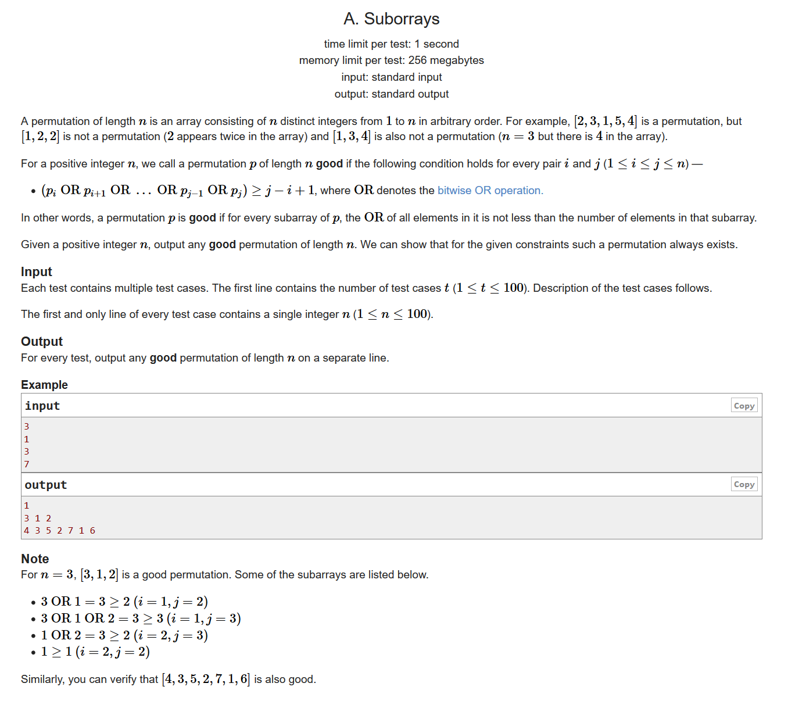
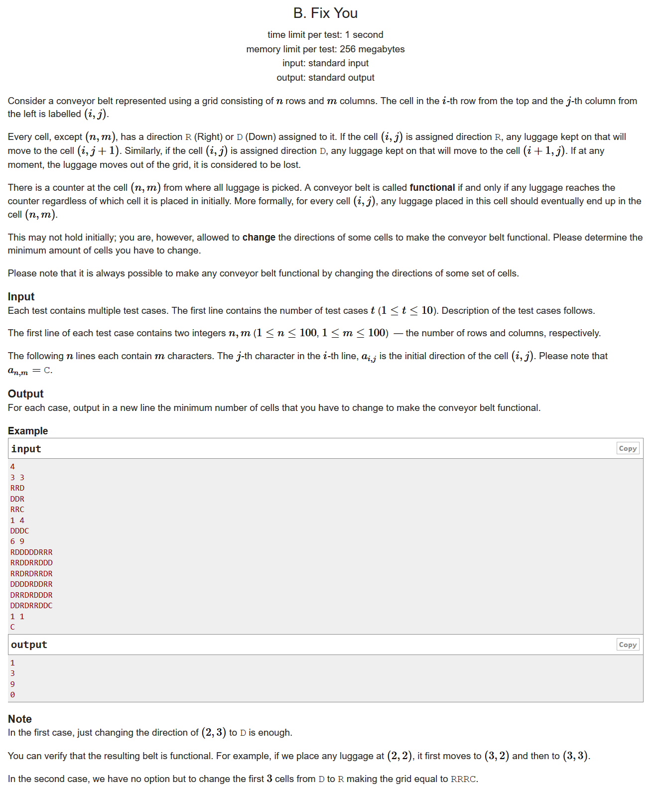
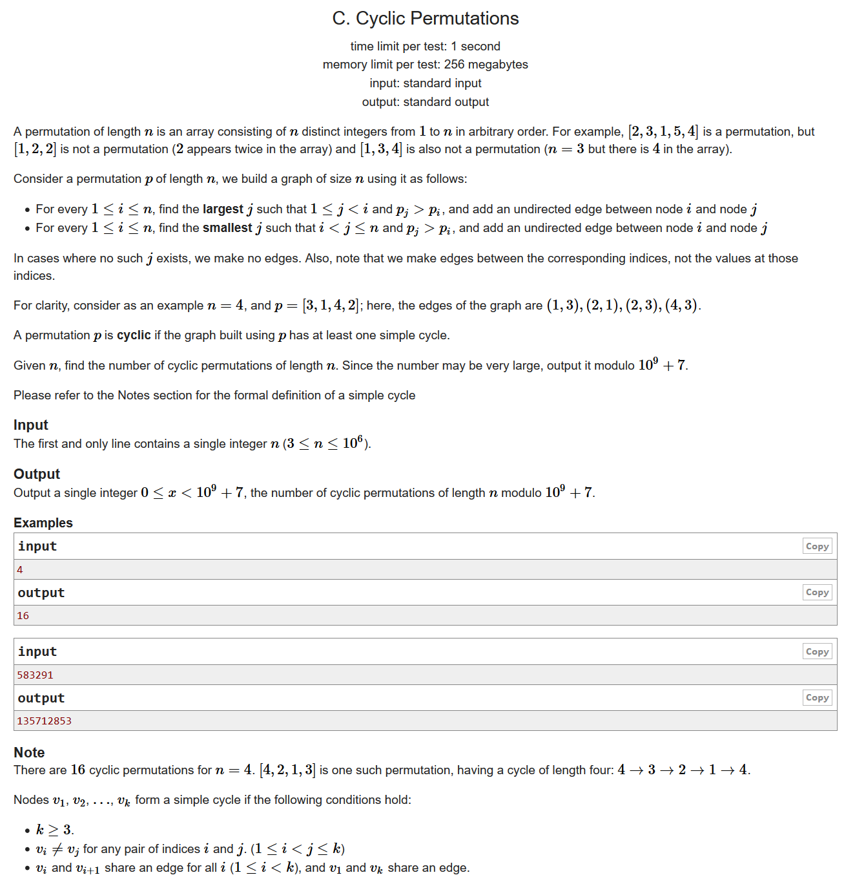
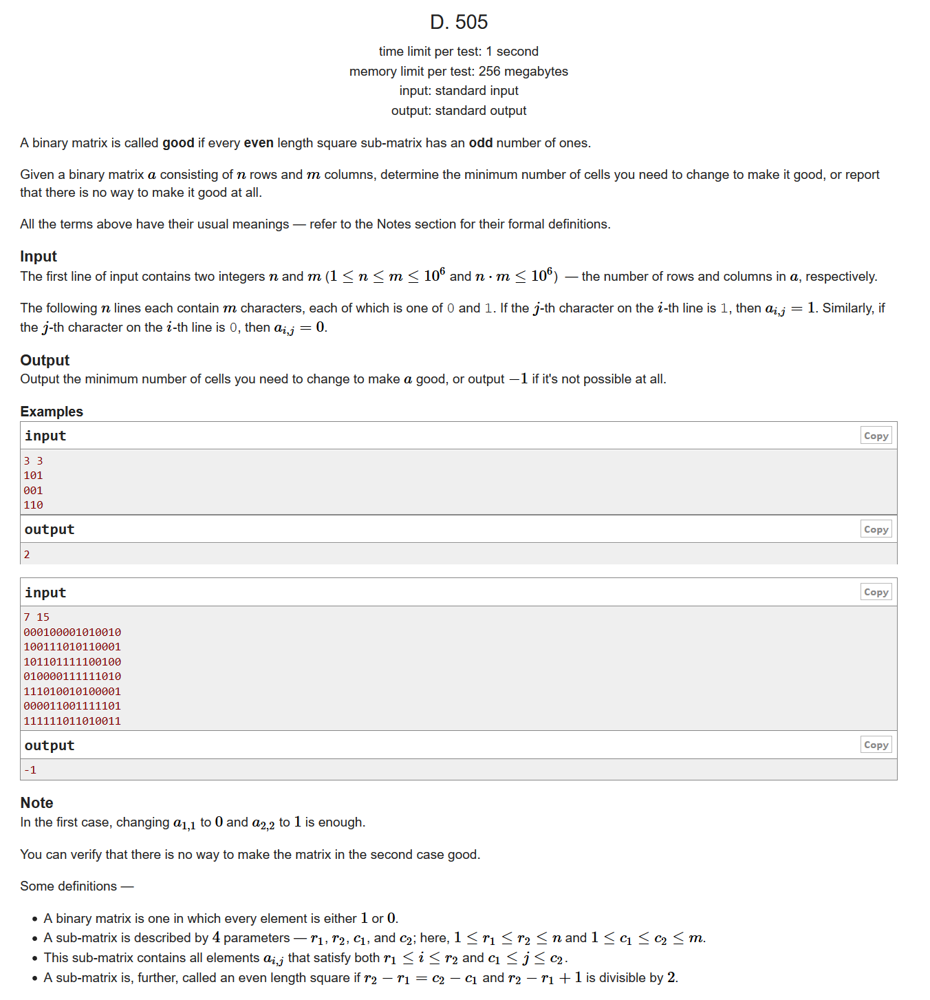
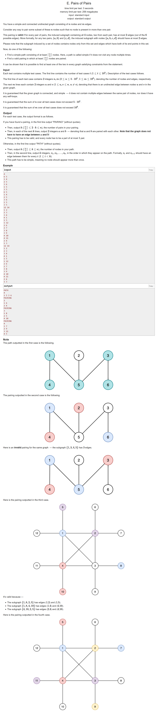

# Codeforces Round #663 (Div. 2)
---
https://codeforces.ml/contest/1391/problems

## A. Suborrays
--- 

- 结论题
- n个数字的OR值肯定是大于n的，所以我们随便输出一下所有数字就行

```cpp
#include <bits/stdc++.h>
using namespace std;
#define LL long long
#define sigma_size 30
#define max_size (int)(2e5+10)
#define MAX (int)(1e5+7)

int main (){
	ios::sync_with_stdio(0);
	int T ; cin >> T;
	while(T--)
	{
		int n ;
		cin >> n;
		for ( int i = n ; i >= 1; i-- )
			cout << i << " ";
		cout << endl;
	}
}
```

<div STYLE="page-break-after: always;"></div>

## B. Fix You
---

- 结论题
- 我们可以知道，不管当前的格子是R还是D，我们都是向着距离终点更近一步的方向进行的，所以我们要修改的就只有最右端的和最下端的顺序而已

```cpp
#include <bits/stdc++.h>
using namespace std;
#define LL long long
#define sigma_size 30
#define max_size (int)(2e5+10)
#define MAX (int)(1e5+7)

int n , m;
char maps[105][105];
int ans[15];


int main ()
{
	ios::sync_with_stdio(0);
	int T ; cin >> T;
	for ( int cas = 1 ; cas <= T ; cas++ )
	{
		cin >> n >> m;
		for ( int i = 1 ; i <= n ; i++ )
			cin >> maps[i]+1;
		int cnt = 0;
		for ( int i = 1 ; i < n ; i++ )
			cnt += (maps[i][m] == 'R');
		for ( int i = 1 ; i < m ; i++ )
			cnt += (maps[n][i] == 'D' );
		ans[cas] = cnt;
	}
	for ( int i = 1 ; i <=T ; i++ )
		cout << ans[i] << endl;
}
```

<div STYLE="page-break-after: always;"></div>

## C. Cyclic Permutations 
---

- 结论题
- 由正难则反的思想，正着数很困难，我们可以数一下没有全的排列
- 首先我们可以确定n个数字能够排成$n!$个序列
- 其次我们可以很容易确定，如果存在某个片段，是先下降再上升的，那么这个片段一定会形成圈；我们为了避免有圈的出现，也就是要使得整个序列一定是先上升后下降的
- 那这样一来问题就简单多了，我们把n放到任意的一个位置，其他的数都可以选择插入到这个n的左边或者是右边，那么对于一个长度为n的序列，不能形成环的序列就会有 $2^{n-1}$ 个
- 因此我们最后的答案就是$n!-2^{n-1}$
```cpp
#include <bits/stdc++.h>
using namespace std;
#define LL long long
#define sigma_size 30
#define max_size (int)(1e6+10)
#define MAX (int)(1e5+7)

const LL MOD = 1e9+7;
LL fac[max_size];
LL two[max_size];
void init()
{
	fac[1] = 1;
	for ( int i = 2 ; i <= 1e6 ; i++ )
		fac[i] = fac[i-1] * i % MOD;
	two[0] = 1;
	for ( int i = 1 ; i <= 1e6 ; i++ )
		two[i] = two[i-1]*2%MOD;
}

int main ()
{
	ios::sync_with_stdio(0);
	init();
	int n;
	cin >> n;
	cout << (fac[n]+MOD-two[n-1])%MOD << endl;
}
```

<div STYLE="page-break-after: always;"></div>

## D. 505
---

- 状态压缩dp
- 首先我们知道如果n.m同时大于3的话是一定无解的。假设我们在长度为2\*2的方阵里面1的个数是奇数个，那么4个2\*2的方阵拼起来1的个数一定是偶数个。不符合题意
- 那么我们需要考虑的就是n为2和n为3的时候。我们可以考虑把同一列的情况全都列出来，一共就会有$(1<<n)$种情况，我们把这些情况变成一个当前的状态state存起来，dp[i][state]表示的就是在第i列state这个状态所需要的代价，其中state可以通过和原来的序列进行比较求得

```cpp
#include <bits/stdc++.h>
using namespace std;
#define LL long long
#define sigma_size 30
#define max_size (int)(1e6+10)
#define MAX (int)(1e5+7)

int n , m;
string s[max_size];
int dp[max_size][10];
int get_diff ( int state , int m )
{
	int res = 0;
	int a[4];
	for ( int i = 1 ; i <= n ; i++ )
		a[i] = state>>(i-1)&1;
	for ( int i = 1 ; i <= n ; i++ )
		if ( a[i] != (int)(s[i][m]-'0') ) res++;
	return res;
}
bool judge ( int i , int j )
{
	int a[4] , b[4];
	for ( int k = 0 ; k < n ; k++ )
		a[k] = i>>k&1 , b[k] = j>>k&1;
	int tmp1 = 0 , tmp2 = 0 , tmp3 = 0;
	if ( a[0] == 1 ) tmp1++;
	if ( b[0] == 1 ) tmp1++;
	if ( a[1] == 1 ) tmp2++;
	if ( b[1] == 1 ) tmp2++;
	if ( n == 2 )
		return ( tmp1+tmp2 ) % 2 ;
	if ( n == 3 )
	{
		if ( a[2] == 1 ) tmp3++;
		if ( b[2] == 1 ) tmp3++;
		return ( ( tmp1+tmp2 ) % 2 && (tmp2+tmp3) % 2 );
	}
}
int solve ()
{
	for ( int i = 1 ; i <= m ; i++ )
		for ( int j = 0 ; j < (1<<n) ; j++ )
			dp[i][j] = 0x3f3f3f3f;
	for ( int i = 0 ; i < (1<<n) ; i++ )
		dp[1][i] = get_diff(i,1);
	int minx = 0x3f3f3f3f;
	for ( int i = 2 ; i <= m ; i++ )
		for ( int j = 0 ; j < (1<<n) ; j++ )
			for ( int k = 0 ; k < (1<<n) ; k++ )
				if ( judge(j,k) )
					dp[i][k] = min ( dp[i][k] , dp[i-1][j] + get_diff(k,i) );
	for ( int i = 0 ; i < (1<<n) ; i++ )
		minx = min ( minx , dp[m][i] );
	return minx;
}
int main ()
{
	ios::sync_with_stdio(0);
	cin >> n >> m;
	for ( int i = 1 ; i <= n ; i++ )
	{
		cin >> s[i];
		s[i] = ' ' + s[i];
	}
	
	if ( n > 3 && m > 3 )	cout << "-1" << endl;
	else
	{
		if ( n == 1 || m == 1 )
			cout << "0" << endl;
		else
			cout << solve() << endl;
	}
}
```
<div STYLE="page-break-after: always;"></div>

## E. Pairs of Pairs
---

- 图论
- 如果$deg[u] \ge \lceil{\frac{n}{2}}\rceil$对于某个结点u成立，那么我们可以找到一条路径。否则的话，最长的一条路径也就$\lfloor{\frac{n}{2}}\rfloor$，我们就可以找到一些合适的对
- 我们可以先通过dfs尝试找到一条路径，寻找的过程当中，我们把u所在的深度用另外一个数组保存起来。如果我们没能够找到合适的路径，处于同一深度的两个结点就会自动配对

```cpp
#include <bits/stdc++.h>
using namespace std;
#define LL long long
#define sigma_size 30
#define max_size (int)(1e6+10)
#define MAX (int)(1e5+7)

int n , m ;
vector <int> G[max_size];
vector <int> V[max_size];
bool vis[max_size];
int dep[max_size];
int par[max_size];
int pairs = 0;
bool flag = 0;

void dfs ( int u )
{
    if ( flag ) return ;
    vis[u] = 1;
    pairs -= V[dep[u]].size() / 2;
    V[dep[u]].push_back(u);
    pairs += V[dep[u]].size() / 2;
    if ( dep[u] >= (n+1) / 2 )
    {
        flag = 1;
        cout << "PATH" << endl;
        int cur = u;
        cout << dep[u] << endl;
        while (cur != 0)
        {
            cout << cur << " ";
            cur = par[cur];
        }
        cout << endl;
    }
    for ( int i = 0 ; i < G[u].size() ; i++ )
    {
        int v = G[u][i];
        if ( vis[v] ) continue;
        par[v] = u;
        dep[v] = dep[u] + 1;
        dfs(v);
    }
}
int main ()
{
    ios::sync_with_stdio(0);
    int T ; cin >> T;
    while (T--)
    {
        cin >> n >> m;
        flag = 0;
        for ( int i = 1 ; i <= n ; i++ )
        {
            G[i].clear() ; V[i].clear();
            vis[i] = 0;
        }
        pairs = 0;
        for ( int i = 1 ; i <= m ; i++ )
        {
            int a , b ; cin  >> a >> b;
            G[a].push_back(b);
            G[b].push_back(a);
        }
        dep[1] = 1;
        dfs(1);
        if ( flag ) continue;
        cout << "PAIRING" << endl;
        cout << pairs << endl;
        for ( int i = 1 ; i < (n+1)/2 ; i++ )
            for ( int j = 0 ; j+1 < V[i].size() ; j+=2 )
                cout << V[i][j] << " " << V[i][j+1] << endl;
    }
}
```