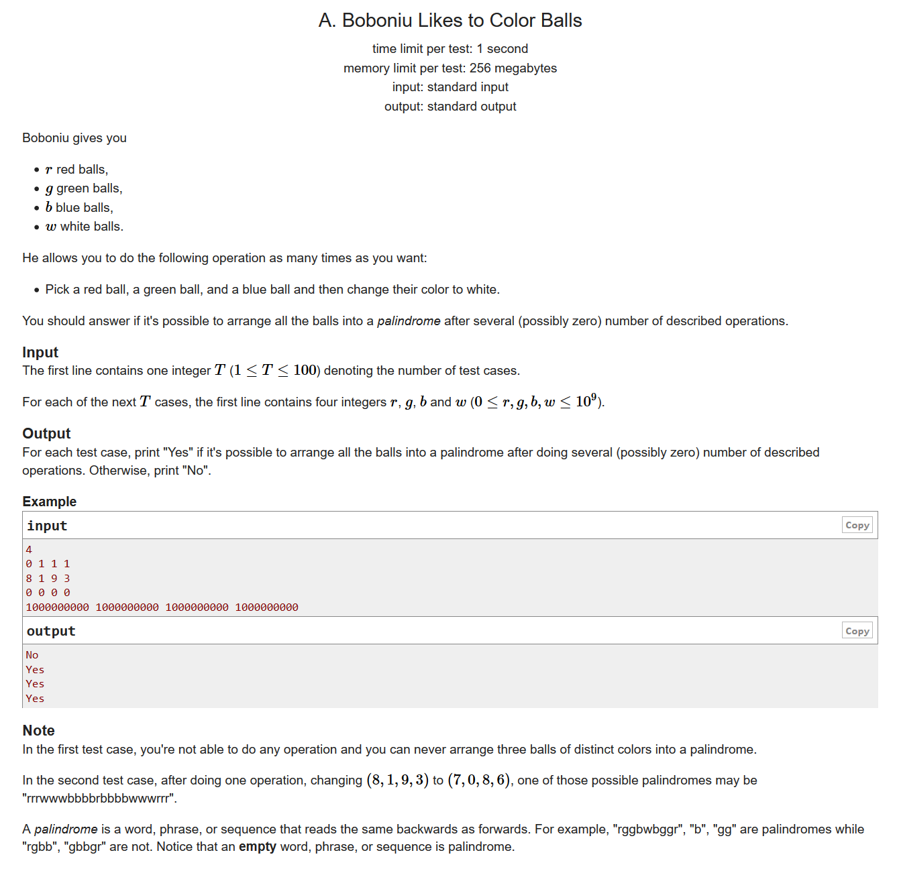
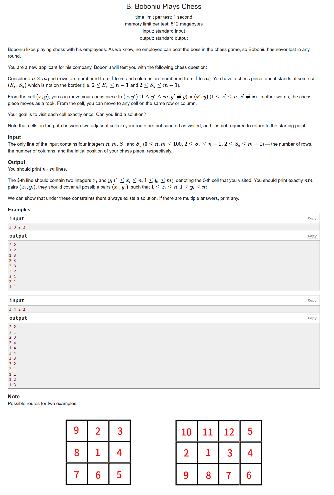
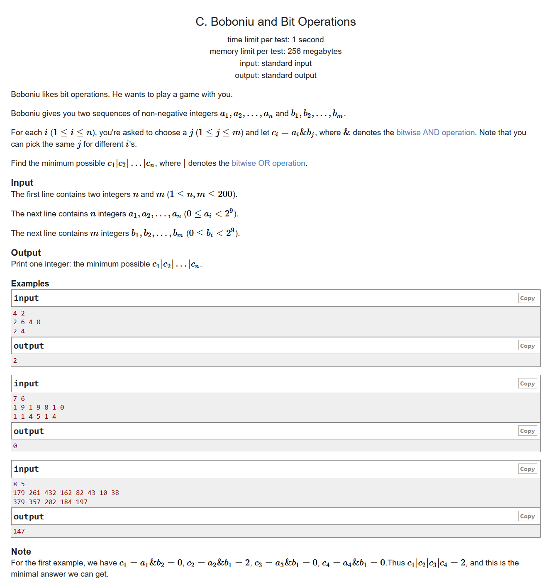
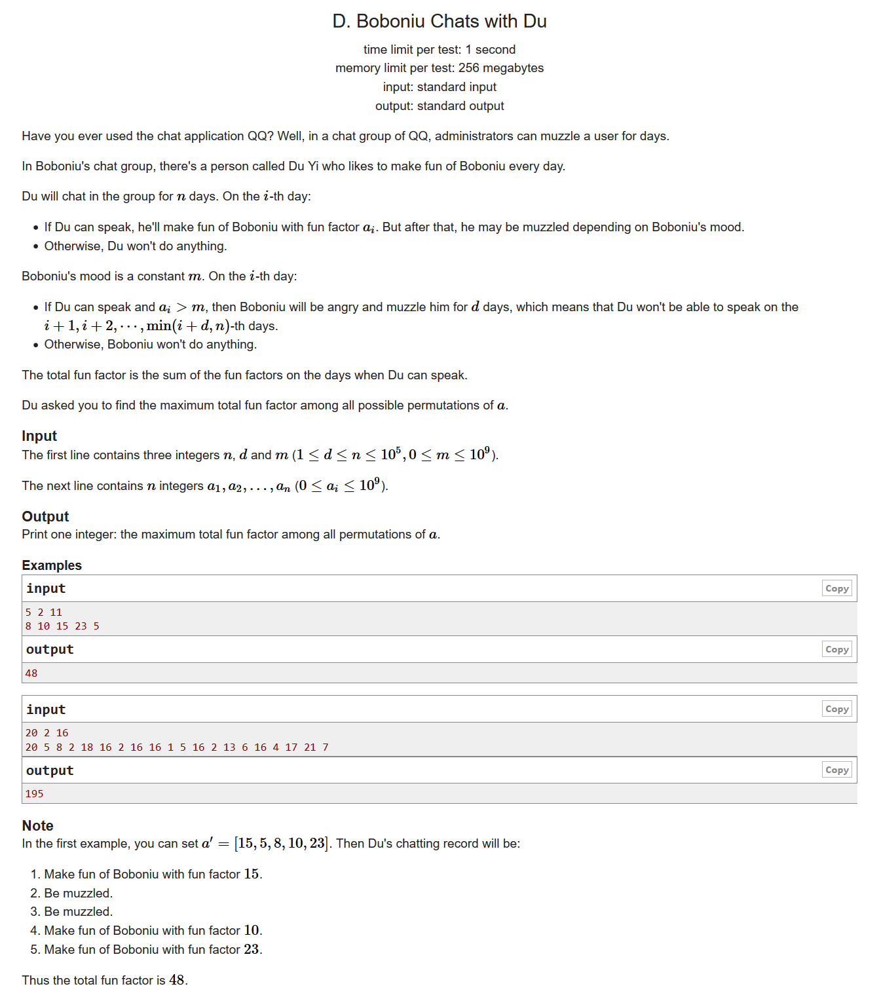
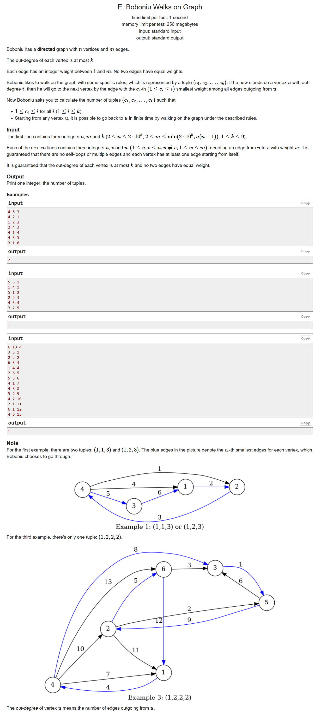

# Codeforces Round #664 (Div. 2)

[题目链接](https://codeforces.ml/contest/1395/problems)

---
## A. Boboniu Likes to Color Balls


- 结论题
- 我们只需要分类讨论一下序列当中奇数的个数
- 如果奇数的个数是1个，那我们只需要把这个奇数放到中间位置即可，所以是可行的
- 如果奇数的个数是两个，那就是不可能
- 如果奇数的个数是3个，我们可以检查一下rgb是不是都大于0，如果是的话，我们就可以变成1个奇数的情况
- 如果全是奇数，那我们可以将他们全都变成偶数，是可行的
  
```cpp
#include <bits/stdc++.h>
using namespace std;
#define LL long long
#define sigma_size 30
#define max_size (int)(2e5+10)
#define MAX (int)(1e5+7)

bool ans[105];
int main ()
{
	ios::sync_with_stdio(0);
	int T ; cin >> T;
	for ( int cas = 1 ; cas <= T ; cas++ )
	{
		LL r , g , b , w;
		cin >> r >> g >> b >> w;
		LL sum = r + g + b + w;
		int odd = 0 ; int even = 0;
		if ( r % 2 ) odd++ ; else even++;
		if ( g % 2 ) odd++ ; else even++;
		if ( b % 2 ) odd++ ; else even++;
		if ( w % 2 ) odd++ ; else even++;
		if ( odd == 2 )
			ans[cas] = 0;
		else if ( odd == 0 )
			ans[cas] = 1;
		else if ( odd == 1 )
			ans[cas] = 1;
		else if ( odd == 3 )
		{
				if ( r > 0 && g > 0 && b > 0 )
					ans[cas] = 1;
				else ans[cas] = 0;
		}
		else if ( odd == 4 )
			ans[cas] = 1;
	}
	for ( int i = 1 ; i <= T ; i++ )
		if ( ans[i] ) cout << "Yes" << endl;
		else cout << "No" << endl;
}
```

## B. Boboniu Plays Chess


- dfs水题，构造题

```cpp
#include <bits/stdc++.h>
using namespace std;
#define LL long long
#define sigma_size 30
#define max_size (int)(2e5+10)
#define MAX (int)(1e5+7)

int n , m , x , y;
bool vis[105][105];
void dfs ( int x , int y )
{
	vis[x][y] = 1;
	cout << x << " " << y << endl;
	if ( !vis[x][(y+m)%m+1] )
		dfs(x,(y+m)%m+1);
	else
	{
		if ( !vis[(x+n)%n+1][y] )
			dfs((x+n)%n+1,y);
	}
}
int main ()
{
	ios::sync_with_stdio(0);
	cin >> n >> m >> x >> y;
	dfs(x,y);
}
```

## C. Boboniu and Bit Operations


### 题解1 ：暴力枚举

- 这是一种比较简单的方法，由于答案 $ans \in[0,1<<9]$，因此我们可以一个一个枚举答案，然后判断一下这个答案可不可行
- 我们可以知道，如果一个ans是可行的，那么就是对于每一个$a_i$都存在一个$b_j$使得$ans|(a_i\&b_j) == ans$

```cpp
#include <bits/stdc++.h>
using namespace std;
#define LL long long
#define sigma_size 30
#define max_size (int)(1e6+10)
#define MAX (int)(1e5+7)

int n , m;
int a[205] , b[205];

int main ()
{
	ios::sync_with_stdio(0);
	cin >> n >> m;
	for ( int i = 1 ; i <= n ; i++ ) cin >> a[i];
	for ( int i = 1 ; i <= m ; i++ ) cin >> b[i];
	int ans = 0;
	while ( ans < (1<<9) )
	{
		bool flag = true;
		for ( int i = 1 ; i <= n ; i++ )
		{	
			bool f = 0;
			for ( int j = 1 ; j <= m ; j++ )
			{
				int tmp = (a[i]&b[j]);
				if ( (ans|tmp) == ans )
				{
					f = 1;
					break;
				}
			}
			if ( !f ) 
			{
				flag = false;
				break;
			}
		}
		if ( flag ) {cout << ans << endl;break;}
		else ans++;
	}
}
```

## D. Boboniu Chats with Du


- 贪心，枚举
- 一开始以为是一个dp，后来看到这个a是可以随便变动位置的
- 我们可以把一开始的序列分成两组，一组都是大于m的，另外一组是小于等于m的。由于每次不管玩笑开得多大，禁言都是d天，根据贪心的思想，我们每次取的都是当前最大的那个玩笑。
- 假设我们在大于m的集合里面取了x个玩笑，由于最后一天的时候我们开玩笑禁言对我们没有影响，所以我们x个玩笑的时候消耗的天数就是$(x-1)*(d+1)+1$，然后我们再去那一堆不超过m的集合里面找到答案即可

```cpp
#include <bits/stdc++.h>
using namespace std;
#define LL long long
#define sigma_size 30
#define max_size (int)(1e5+10)
#define MAX (int)(1e5+7)

int n , d , m;
LL good[max_size] , bad[max_size];
int g , b;
LL sum[max_size];
LL sum2[max_size];
int main ()
{
	ios::sync_with_stdio(0);
	cin >> n >> d >> m;
	for ( int i = 1 ; i <= n ; i++ )
	{
		LL x ; cin >> x;
		if ( x > m ) good[++g] = x;
		else bad[++b] = x;
	}
	sort ( good+1 , good+1+g , greater<LL>() );
	sort ( bad+1 , bad+1+b , greater<LL>() );
	sum[1] = good[1];sum2[1] = bad[1];
	for ( int i = 2 ; i <= g ; i++ ) sum[i] = sum[i-1] + good[i];
	for ( int i = 2 ; i <= n ; i++ ) sum2[i] = sum2[i-1] + bad[i];
	int x = 1;
	LL ans = sum2[n];
	while ( x <= g )
	{
		int tmp = (x-1)*(d+1)+1;
		if ( tmp > n ) break;
		tmp = n - tmp;
		ans = max ( ans , sum2[tmp] + sum[x] ) ;
		x++;
	}
	cout << ans << endl;
}
```

## E. Boboniu Walks on Graph


- 暴力枚举
- 由于k的范围比较小，我们把所有的情况列出来也就k!.现在我们需要解决的问题就是怎么快速判断这个序列是不是合法的
- 对于某个点，我们可以赋值给这个点一个点权，并计算好他们的点权和。判断这个序列是不是合法的也就是我们找一下所有的度数的权值之和是不是等于点权和。即$sum[i][res[i]]$表示的是度数为i的所有点取第i小的边权的点的点权和


```cpp
#include <bits/stdc++.h>
using namespace std;
#define LL long long
#define sigma_size 30
#define max_size (int)(2e5+10)
#define MAX (int)(1e5+7)

const int MOD = 1E9+7;
int n , m , k;
vector < pair<int,int> > G[max_size];
int sum[15][15];
int rd[max_size];
int res[10];
int ans = 0;
int cnt = 0;
void check ()
{
    int v = 0;
    for ( int i =1 ; i <= k ; i++ ) v += sum[i][res[i]];
    if ( v == cnt ) ans++;
    return ;
}
void dfs ( int d )
{
    if ( d > k ) return check();
    for ( res[d] = 1 ; res[d] <= d ; res[d]++ ) dfs(d+1);
}


int main ()
{
    ios::sync_with_stdio(0);
    cin >> n >> m >> k;
    for ( int i = 1 ; i <= m ; i++ )
    {
        int u , v , w;
        cin >> u >> v >> w ;
        G[u].push_back({v,w});
    }
    for ( int i = 1 ; i <= n ; i++ )
        rd[i] = rand()%MOD , cnt+=rd[i];
    for ( int i = 1 ; i <= n ; i++ )
        for ( int j = 0 ; j < G[i].size() ; j++ )
            sum[G[i].size()][j+1] += rd[G[i][j].first];
    dfs(1);
    cout << ans << endl;
}
```