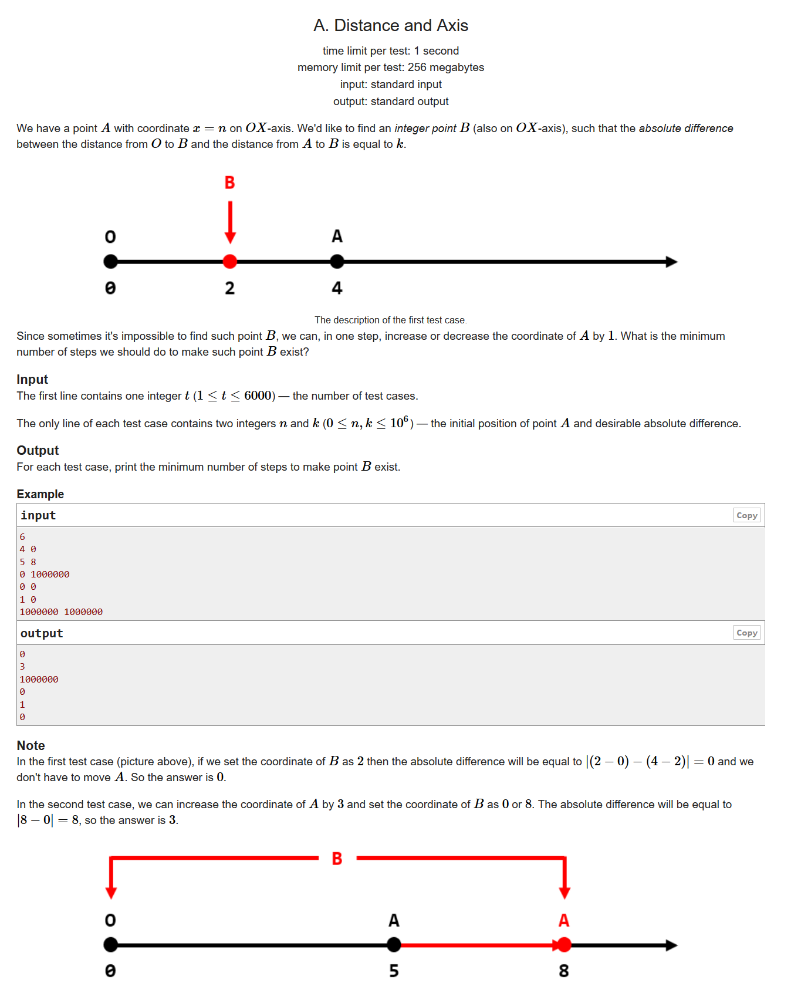
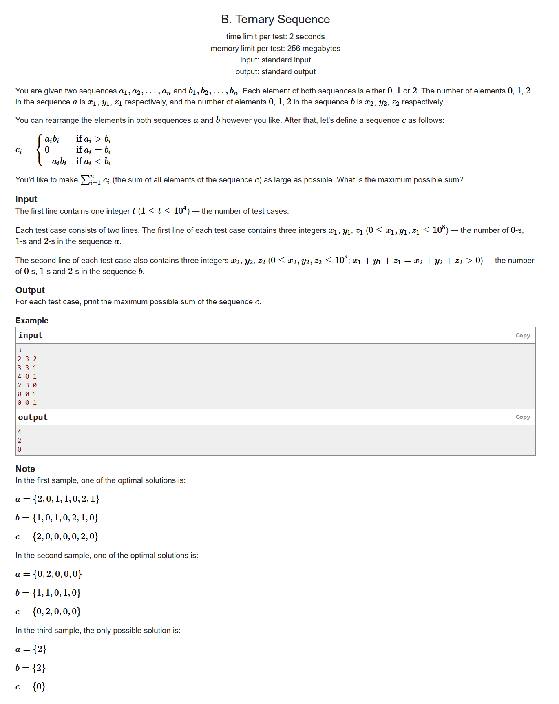
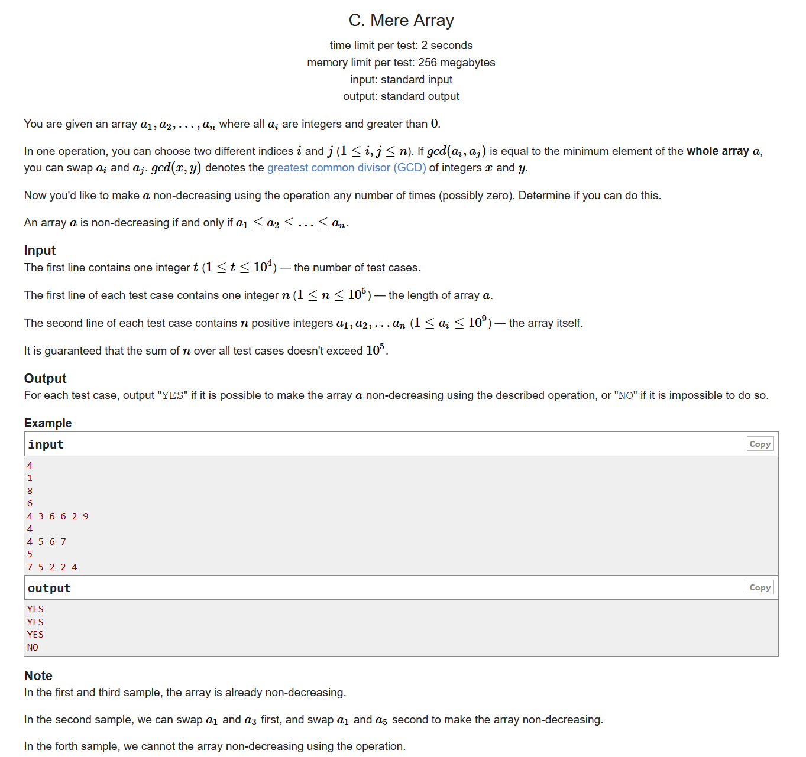
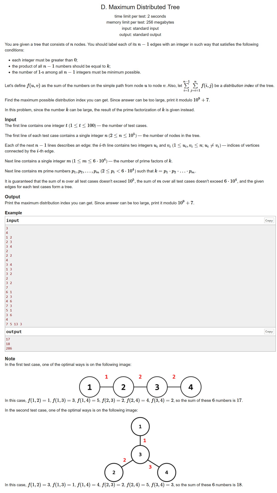
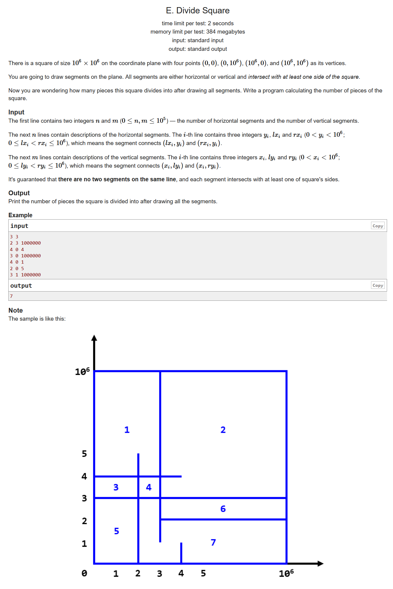

# Codeforces Round #665 (Div. 2)

## 题目链接

- https://codeforces.ml/contest/1401/problems


## A. Distance and Axis



- https://codeforces.ml/contest/1401/problem/A
- 题目大意

	在x轴上给定初始的A的坐标n，问A至少需要移动多少步，才能找到一个点B，使得该点到原点的距离和A到B的距离的绝对值恰好等于k

- 构造题 ， 思维题
- 我们先假定AB均位于k的位置，这样是满足题意的。如果A的起始位置小于k，那么A至少需要移动到k位置才能满足题意；如果A 的起始位置大于k，我们可以知道，每当这个B移动1个距离的时候，A就必须移动两个距离才能满足距离关系，因此我们只需要判断一下A和这个点的距离是奇数还是偶数即可

```cpp
#include <bits/stdc++.h>
using namespace std;
#define LL long long
#define sigma_size 30
#define max_size (int)(1e6+10)
#define MAX (int)(1e5+7)

int qread()
{
	char c; int s=0,t=1; while ((c=getchar())<'0' || c>'9') (c=='-' && (t=-1));
	do s=s*10+c-'0'; while ((c=getchar())>='0' && c<='9'); return s*t;
}

int ans[6005];
int main ()
{
    ios::sync_with_stdio(0);
    int T ; cin >> T;
    for ( int cas = 1 ; cas <= T ; cas++ )
    {
        int n , k;
        cin >> n >> k;
        if ( n <= k )
            ans[cas] = k - n;
        else
        {
            if ( (n-k) % 2 )
                ans[cas] = 1;
            else ans[cas] = 0;
        }
    }
    for ( int i = 1 ; i <= T ; i++ )
        cout << ans[i] << endl;
}
```

## B. Ternary Sequence



- https://codeforces.ml/contest/1401/problem/B
- 题目大意：给定a数组有x1个0，y1个1，z1个2，b数组有x2个0，y2个1，z2个2。c数组的构造关系满足

$$
	c_i \equiv
		\begin{cases}
			a_ib_i & { a_i > b_i } \\ 
			0 & { a_i = b_i } \\ 
			-a_ib_i & { a_i < b_i }\\
		\end{cases}
$$

需要构造a数组以及b数组使得$ \sum_{i=1}^n c_i $ 最大

- 构造题，贪心
- 通过题意我们可以发现，能使得C数组产生正向收益的当且仅当**用a数组的2去匹配b数组的1**。与此同时，我们还需要避免负向收益，即我们应该尽可能减少用a数组的1去匹配b数组的2。那么我们就是用a数组的2去抵消b数组的1之后，我们优先用a数组的0和2去抵消掉b数组的2，已达到损失最小的目的


```cpp
#include <bits/stdc++.h>
using namespace std;
#define LL long long
#define sigma_size 30
#define max_size (int)(1e5+10)
#define MAX (int)(1e5+7)
int qread()
{
	char c; int s=0,t=1; while ((c=getchar())<'0' || c>'9') (c=='-' && (t=-1));
	do s=s*10+c-'0'; while ((c=getchar())>='0' && c<='9'); return s*t;
}

int ans[max_size];
int main ()
{
	ios::sync_with_stdio(0);
	int T ; cin >> T;
	for ( int cas = 1 ; cas <= T ; cas++ )
	{
		int x1 , y1 , z1;
		int x2 , y2 , z2;
		cin >> x1 >> y1 >> z1;
		cin >> x2 >> y2 >> z2;
		int minx = min ( z1 , y2 );
		int res = minx * 2 ;
		z1 -= minx , y2 -= minx ;
		z2 = max ( 0 , z2 - x1 - z1 );
		res -= 2 * z2;
		ans[cas] = res;
	}
	for ( int i  =1 ; i <= T ; i++ )
	cout << ans[i] << endl;
}
```

## C. Mere Array



- https://codeforces.ml/contest/1401/problem/C
- 题目大意：给定一个数列，问是否能够通过若干次交换，使得这个数列是一个递增数列，交换规则是两个数$ a_i,a_j,gcd(a_i,a_j) $等于数列中最小的元素
- 构造题，排序题
- 我们先可以对这个数列进行排序，比较一下排序后的数列和原数列的元素。对于不同的元素，如果这个元素不能够整除数列中最小的元素，那么这个元素是不可能换到其他位置上去的，因此输出“NO”；对于可以整除的元素，我们可以得出结论，他们一定可以交换到适合他们的位置上，因为我们可以假设最小的元素是$a_x$,现在有两个元素$a_y,a_z$，我们可以交换xy，然后交换xz，最后交换xy，这样可以使得x不动，yz进行了一次交换，因此我们可以输出“YES”

```cpp
#include <bits/stdc++.h>
using namespace std;
#define LL long long
#define sigma_size 30
#define max_size (int)(1e5+10)
#define MAX (int)(1e5+7)
int qread()
{
	char c; int s=0,t=1; while ((c=getchar())<'0' || c>'9') (c=='-' && (t=-1));
	do s=s*10+c-'0'; while ((c=getchar())>='0' && c<='9'); return s*t;
}

bool ans[max_size];
int a[max_size];
int b[max_size];
int main ()
{
	ios::sync_with_stdio(0);
	int T ; cin >> T;
	for ( int cas = 1 ; cas <= T ; cas++ )
	{
		int n ; cin >> n;
		for ( int i = 1 ; i <= n ; i++ )	cin >> a[i];
		for ( int i = 1 ; i <= n ; i++ )	b[i] = a[i];
		sort ( b+1 , b+1+n );
		int minx = b[1];
		bool flag = true;
		for ( int i = 1 ; i <= n ; i++ )
		{
			if ( b[i] == a[i] ) continue;
			if ( a[i] % minx )
			{
				flag = false;
				break;
			}
		}
		ans[cas] = flag;
	}
	for ( int i = 1 ; i <= T ; i++ )
		if ( ans[i] ) cout << "YES" << endl;
		else cout << "NO" << endl;
}
```

## D. Maximum Distributed Tree



- https://codeforces.ml/contest/1401/problem/D
- 题目大意：给定一棵树，要求在这棵树上分配权值，使得权值之积为k，然后要求$ \sum_{i=1}^{n-1} \sum_{j=i+1}^nf(i,j) $最大，f(i,j)为i到j的距离
- 贪心，dfs

```cpp
#include <bits/stdc++.h>
using namespace std;
#define LL long long
#define sigma_size 30
#define max_size (int)(1e5+10)
#define MAX (int)(1e5+7)
int qread()
{
	char c; int s=0,t=1; while ((c=getchar())<'0' || c>'9') (c=='-' && (t=-1));
	do s=s*10+c-'0'; while ((c=getchar())>='0' && c<='9'); return s*t;
}

const LL mod = 1e9 + 7;
vector <int> G[max_size];

int tot = 0;
LL p[max_size] , a[max_size] , siz[max_size];
int n , m;
void dfs ( int u , int fa )
{
	siz[u] = 1;
	for ( int i = 0 ; i < G[u].size() ; i++ )
	{
		int v = G[u][i];
		if ( v == fa ) continue;
		dfs (v,u);
		siz[u] += siz[v];
		a[++tot] = siz[v] * ( n - siz[v] );
	}
}


void init()
{
	tot = 0;
	memset ( p , 0 , (n+5)*sizeof(LL) );
	memset ( a , 0 , (n+5)*sizeof(LL) );
	memset ( siz , 0 , (n+5)*sizeof(LL) );
	for ( int i = 0 ; i <= n+5 ; i++ ) G[i].clear();
}
LL ans[105];
int main ()
{
	ios::sync_with_stdio(0);
	int T ; cin >> T;
	for ( int cas = 1 ; cas <= T ; cas++ )
	{
		cin >> n;
		init();
		for ( int i  =1 ; i < n ; i++ )
		{
			int u , v;
			cin >> u >> v;
			G[u].push_back(v);
			G[v].push_back(u);
		}
		dfs(1,0);
		cin >> m;
		for ( int i = 1 ; i <= m ; i++ ) cin >> p[i];
		sort ( p+1 , p+1+m );
		sort ( a+1 , a+n );
		LL res = 0;
		if ( m <= n-1 )
		{
			for ( int i = n-1 , j = m ; j >= 1 ; i-- , j-- )
				res = ( res + a[i] * p[j] % mod ) % mod;
			for ( int i = n - m - 1 ; i >= 1 ; i-- )
				res = ( res + a[i] ) % mod;
			ans[cas] = res;
		}
		else
		{
			for ( int i = m-1 ; i >= n-1 ; i-- )
				p[i] = p[i]*p[i+1]%mod;
			for ( int i = n-1 ; i >= 1 ; i-- )
				res = ( res + a[i]*p[i]%mod ) % mod;
			ans[cas] = res; 
		}
	}
	for ( int i = 1 ; i <= T ; i++ ) cout << ans[i] << endl;
}
```

## E. Divide Square



- https://codeforces.ml/contest/1401/problem/E
- 题目大意：给定若干条平行或者垂直线段，线段至少有一端是，贴着大矩形的，求问这些线段可以把矩形分割成几个区域
- 扫描线，树状数组
- 首先我们可以知道两端都贴着矩形的线段可以使得区域数+1，接下来我们就需要统计有多少条线段是相交的
- 我们对平行的线段(l,r,y)向右延长到矩形的边界，从而得到两个向量(l,y,1),(r,y,-1)，表示这条线段对竖直线的影响；对于每一条竖直线段，统计线段起始点位于这条竖直线左端的平行线段，将这些平行线的y坐标插入到树状数组当中，再根据竖直线的上下边界统计利用一个前缀和的思想统计中间经过了哪些线段

```cpp
#include <bits/stdc++.h>
using namespace std;
#define LL long long
#define sigma_size 30
#define max_size (int)(1e6+10)
#define MAX (int)(1e5+7)

int qread()
{
	char c; int s=0,t=1; while ((c=getchar())<'0' || c>'9') (c=='-' && (t=-1));
	do s=s*10+c-'0'; while ((c=getchar())>='0' && c<='9'); return s*t;
}

int c[max_size];
int lowbit ( int x ) {
    return x & -x ;
}
int sum ( int x ){
    int ret = 0;
    while ( x > 0 ){
        ret += c[x] ; x -= lowbit(x) ;
    }
    return ret;
}
void add ( int x , int d ) {
    while ( x < 1000005 ){
        c[x] += d ; x += lowbit(x);
    }
}

struct Node {
    int x , y , d;
    bool operator < ( const Node & rhs ) const {
        return x < rhs.x;
    }
}Node[max_size<<1];
struct vline {
    int x , l , r;
    bool operator < ( const vline &rhs ) const {
        return x < rhs.x;
    }
}vline[max_size<<1];

int n , m  ;
LL ans = 1;
int main ()
{
    ios::sync_with_stdio(0);
    cin >> n >> m;
    for ( int i = 1 ; i <= n ; i++ )
    {
        int y , l , r;
        cin >> y >> l >> r;
        if ( l == 0 && r == 1000000 ) ans++;
        Node[2*i-1] = { l , y , 1 };
        Node[2*i] = { r+1 , y , -1 };
    }

    for ( int i = 1 ; i <= m ; i++ )
    {
        int x , l , r;
        cin >> x >> l >> r;
        if ( l == 0 && r == 1000000 ) ans++;
        vline[i] = { x , l , r };
    }

    sort ( Node+1 , Node+2*n+1 );
    sort ( vline+1 , vline+1+m );

    for ( int j = 0 , i = 1 ; i <= m ; i++ )
    {
        while ( j < 2*n && Node[j+1].x <= vline[i].x )
        {
            j++;
            add ( Node[j].y + 1 , Node[j].d );
        }
        ans += sum ( vline[i].r + 1 ) - sum ( vline[i].l );
    }
    cout << ans << endl;
    return 0;
}
```
## F. Reverse and Swap


- https://codeforces.ml/problemset/problem/1401/F

```cpp
#include <bits/stdc++.h>
using namespace std;
#define LL long long
#define ULL unsigned long long
#define sigma_size 30
#define max_size (int)(1<<20)
#define MAX_SIZE (int)(4e6+7)
int qread()
{
	char c; int s=0,t=1; while ((c=getchar())<'0' || c>'9') (c=='-' && (t=-1));
	do s=s*10+c-'0'; while ((c=getchar())>='0' && c<='9'); return s*t;
}

int a[max_size] , rev[max_size];

struct Node {
	int left , right;
	LL sum;
}Node[max_size<<1];
void Build ( int x , int l , int r )
{
	Node[x].left = l , Node[x].right = r;
	if ( l == r )
	{
		Node[x].sum = a[l];
		return ;
	}
	int mid = l + r >> 1;
	Build ( x<<1 , l , mid ) , Build ( x<<1|1 , mid+1 , r );
	Node[x].sum = Node[x<<1].sum + Node[x<<1|1].sum;
}
void update ( int l , int r , int x , int pos , int k ,int depth )
{
	if ( l==r )
	{
		Node[x].sum = k;
		return ;
	}
	int mid = l + r >> 1;
	if ( pos <= mid ) update ( l , mid , (x<<1)+(rev[depth]==1) , pos , k , depth-1 );
	else update ( mid+1 , r , (x<<1|1)-(rev[depth]==1) , pos , k , depth-1 );
	Node[x].sum = Node[x<<1].sum + Node[x<<1|1].sum;
}
LL query ( int L , int R , int x , int l , int r , int depth )
{
	if ( l <= L && R <= r ) return Node[x].sum;
	int mid = L + R >> 1;
	LL ans = 0;
	if ( l <= mid ) ans += query ( L , mid , (x<<1)+(rev[depth]==1) , l , r , depth-1 );
	if ( r > mid ) ans += query ( mid+1 , R , (x<<1|1)-(rev[depth]==1) , l , r , depth-1 );
	return ans;
}

int main ()
{
	ios::sync_with_stdio(0);
	int n , q ;
	cin >> n >> q;
	for ( int i = 1 ; i <= (1<<n) ; i++ ) cin >> a[i];

	Build ( 1 , 1 , 1<<n );

	while (q--)
	{
		int op ;
		cin >> op;
		if ( op == 1 )
		{
			int x , k;
			cin >> x >> k;
			update ( 1 , 1 << n , 1 , x , k , n );
		}
		else if ( op == 2 )
		{
			int k;
			cin >> k;
			for ( int i = 0 ; i <= k ; i++ ) rev[i] ^= 1;
		}
		else if ( op == 3 )
		{
			int k ; 
			cin >> k;
			rev[k+1] ^= 1;
		}
		else if ( op == 4 )
		{
			int l , r ;
			cin >> l >> r;
			cout << query ( 1 , 1<<n , 1 , l , r , n ) << endl;
		}
	}
	return 0;
}
```
