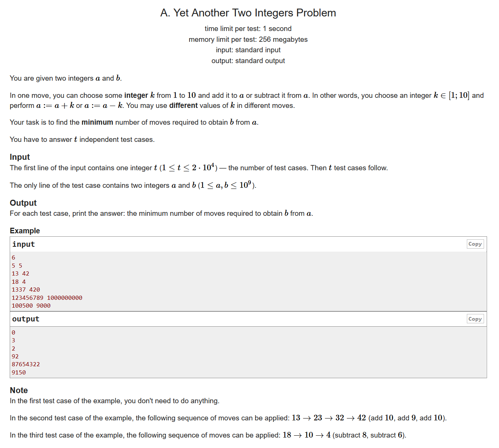
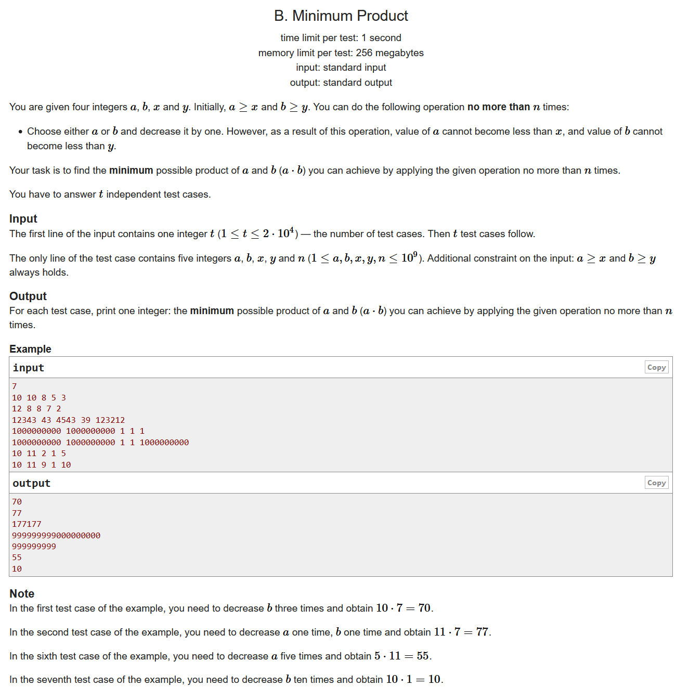
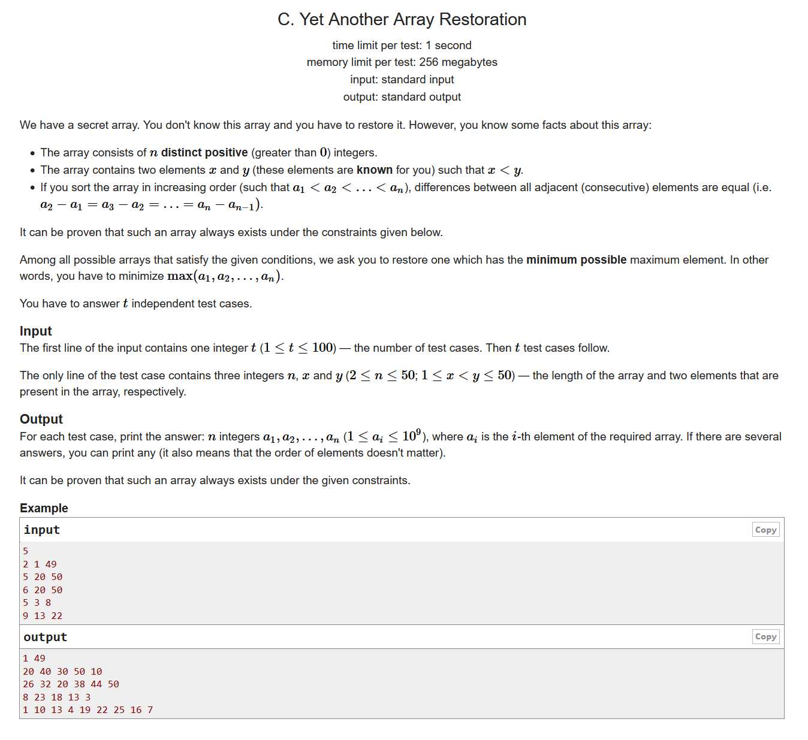
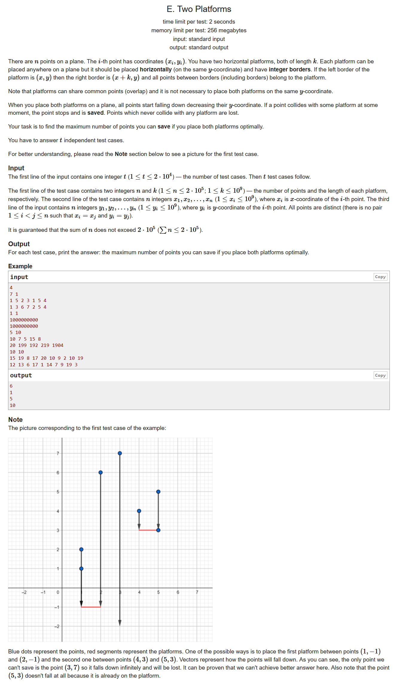
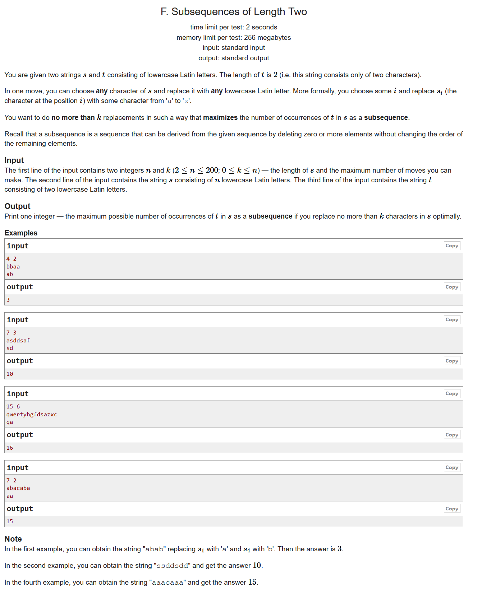

# Codeforces Round #667 (Div. 3)

- https://codeforces.ml/contest/1409/problems

## A. Yet Another Two Integers Problem

- 签到水题
- 计算他们的差值并且每次都取10，看看能取多少次就行了
  
```cpp
#include <bits/stdc++.h>
using namespace std;
#define LL long long
#define sigma_size 30
#define max_size (int)(2e4+10)
#define MAX (int)(1e5+7)

int ans[max_size];
int main ()
{
	ios::sync_with_stdio(0);
	int T ; cin >> T;
	for ( int cas = 1 ; cas <= T ; cas++ )
	{
		int a , b;
		cin >> a >> b;
		int cnt = abs(b-a);
		ans[cas] = cnt / 10 + (cnt % 10 != 0) ;

	}
	for ( int i = 1 ; i <= T ; i++ )
		cout << ans[i] << endl;
}
```
## B. Minimum Product


- 思维题
- 如果觉得减法太麻烦的话可以想想加法
- 我们假设最后最小的数字就是x和y，那么这样的话我们就可能会操作太多次了，我们把多的操作先加到一个数上，再把剩下的数加到另外一个数上
  
```cpp
#include <bits/stdc++.h>
using namespace std;
#define LL long long
#define sigma_size 30
#define max_size (int)(2e4+10)
#define MAX (int)(1e5+7)

LL ans[max_size];
int main ()
{
	ios::sync_with_stdio(0);
	int T ; cin >> T;
	for ( int cas = 1 ; cas <= T ; cas++ )
	{
		LL a , b , x , y , n;
		cin >> a >> b >> x >> y >> n;
		LL d = (a-x) + (b-y) - n;
		if ( d <= 0 )
			ans[cas] = x*y;
		else
		{
			if ( x > y )
			{
				swap(x,y);
				swap(a,b);
			}
			LL maxx = 1ll<<60;
			if ( y + d <= b )
				maxx = min ( maxx , x*(y+d) ) ;
			else
			{
				LL tmp = y + d - b;
				maxx = min ( (x+tmp)*b , maxx ) ;
			}
			if ( x + d <= a )
				maxx = min ( maxx , y*(x+d) );
			else
			{
				LL tmp = x + d - a;
				maxx = min ( maxx , a*(y+tmp));
			}
			ans[cas] = maxx ;
			
		}
		
	}
	for ( int i = 1 ; i <= T ; i++ )
		cout << ans[i] << endl;
}
```

## C. Yet Another Array Restoration


- 构造题
- 题目最后的结论就是要我们构造一个等差数列，并且使得最后的数值是最小的，我们知道，一个数列当中任意的元素都可以表示为$a[i] = a[1] + k*(i-1) , 其中k为公差$，那由这个题目我们就可以通过枚举x和y到底是数列当中的第几项来构造公差，即
   $$k = (y-x) / (n2-n1)$$
   我们再用这个公差去计算一下最大项，取最小的那个就行了
- 时间复杂度：$O(n^3)$
```cpp
#include <bits/stdc++.h>
using namespace std;
#define LL long long
#define sigma_size 30
#define max_size (int)(1e6+10)
#define MAX (int)(1e5+7)

int main ()
{
	ios::sync_with_stdio(0);
	int T ; cin >> T;
	while (T--)
	{
		int n , x , y;
		cin >> n >> x >> y;
		if ( n == 2 )
		{
			cout << x << " " << y << endl;
			continue;
		}
		int n1 , n2 , n3;
		int maxx = 1ll << 30;
		int d ;
		for ( n1 = 0 ; n1 < n ; n1++ )
		{
			for ( n2 = n1+1 ; n2 < n ; n2++ )
			{
				for ( n3 = n2 ; n3 < n ; n3++ )
				{
					if ( (y-x) % (n2-n1) ) continue;
					int k = (y-x) / (n2-n1);
					int m = k * (n3-n1)+x;
					if ( m < maxx && m - k*(n-1) > 0 )
					{
						maxx = m;
						d = k;
					}
				}
			}
		}
		for ( int i = 1 ; i <= n ; i++ )
			cout << maxx - (i-1)*d << " ";
		cout << endl;
	}
}
```

## D. Decrease the Sum of Digits


- 模拟题，前缀和
- 简单来说我们可以把n的每一位拆出来，算一下到了第几位的时候总和已经超过s了。特殊情况，如果刚刚好等于s而且后面的位数全是0，那么$ans=0$。不然的话，我们记录一下这个位置$mark$,然后用$10^{a.size()-mark+1}$减去$mark$到结尾的数字就行了
  
```cpp
#include <bits/stdc++.h>
using namespace std;
#define LL unsigned long long
#define sigma_size 30
#define max_size (int)(2e4+10)
#define MAX (int)(1e5+7)

LL ans[max_size];
int main ()
{
	ios::sync_with_stdio(0);
	int T ; cin >> T;
	for ( int cas = 1 ; cas <= T ; cas++ )
	{
		LL n , s;
		cin >> n >> s;
		vector <int> a;
		while (n)
		{
			a.push_back(n%10);
			n /= 10;
		}
		reverse(a.begin(),a.end());
		int sum[20];
		sum[1] = a[0];
		for ( int i = 1 ; i < a.size() ; i++ )
			sum[i+1] = sum[i] + a[i];
		int mark = 1;
		for ( mark = 1 ; sum[mark] < s && mark <= a.size() ; mark++ );
		if ( mark > a.size() )
		{
			ans[cas] = 0;
			continue;
		}
		if ( sum[mark] == s )
		{
			int d = sum[a.size()] - sum[mark];
			if ( d == 0 )
			{
				ans[cas] = 0;
			}
			else
			{
				int tmp = a.size() - mark + 1 ;
				LL res = 1;
				for ( int i = 1 ; i <= tmp ; i++ )
					res = res * 10 ;
				LL tmp2 = 0;
				for ( int i = mark-1 ; i < a.size() ; i++ )
					tmp2 = tmp2 * 10 + a[i];
				ans[cas] = res - tmp2;
			}
		}
		else
		{
			int tmp = a.size() - mark + 1 ;
				LL res = 1;
				for ( int i = 1 ; i <= tmp ; i++ )
					res = res * 10 ;
				LL tmp2 = 0;
				for ( int i = mark-1 ; i < a.size() ; i++ )
					tmp2 = tmp2 * 10 + a[i];
				ans[cas] = res - tmp2;
		}
		
	}
	for ( int i = 1 ; i <= T ; i++ )
		cout << ans[i] << endl;
}
```

## E. Two Platforms


- 贪心，前缀和
- 我们首先用l[i]表示以i作为右边界的包含的点数的最大值，用r[i]表示以i为左边界的包含的点数的最大值，那么我们最终的答案就是枚举i求$l[i]+r[i+1]$
- 对于l和r的求法，我们都可以用两个指针，防止他们的长度超过k
```cpp
#include <bits/stdc++.h>
using namespace std;
#define LL long long
#define sigma_size 30
#define max_size (int)(2e5+10)
#define MAX (int)(1e5+7)

int ans[max_size];
int a[max_size];
int l[max_size] , r[max_size];

int main ()
{
    ios::sync_with_stdio(0);
    int T ; cin >> T;
    for ( int cas = 1 ; cas <= T ; cas++ )
    {
        int n , k;
        cin >> n >> k;
        for ( int i = 1 ; i <= n ; i++ )
            cin >> a[i];
        for ( int i = 1 ; i <= n ; i++ )
        {
            int y;
            cin >> y;
        }
        sort ( a+1 , a+1+n );
        memset ( l , 0 , (n+5)*sizeof(int) );
        memset ( r , 0 , (n+5)*sizeof(int) );
        int i = 1 ;
        for ( int j = 1 ; j <= n ; j++ )
        {
            while ( a[j] - a[i] > k ) i++;
            l[j] = j-i+1;
            if ( j > 1 ) l[j] = max ( l[j] , l[j-1] );
        }
        i = n;
        for ( int j = n ; j >= 1 ; j-- )
        {
            while ( a[i] - a[j] > k ) i--;
            r[j] = i - j + 1;
            if ( j < n ) r[j] = max ( r[j] , r[j+1] );
        }
        int res = 1;
        for ( int i = 1 ; i < n ; i++ )
            res = max ( res , r[i+1]+l[i] );
        ans[cas] = res;
    }
    for ( int i = 1 ; i <= T ; i++ )
        cout << ans[i] << endl;
}
```

## F. Subsequences of Length Two


- dp
- 设dp[i][j][k]表示已经看了s的前i个字符，用了j次替换，当前s等于t[0]的个数的一个状态。我们用e0表示s[i]是不是等于t[0],用e1表示s[i]是不是等于t[1],e01表示t[0]是不是等于t[1].状态转移方程如下：
- 如果下一个位置不替代，我们有：
  $$dp[i+1][j][k+e0] = max ( dp[i+1][j][k+e0] , dp[i][j][k] + ( e1\space ?\space k :\space 0 )$$
- 如果下一个位置我们选择替换成t[0],那么我们有：
  $$dp[i+1][j+1][k+1] = max ( dp[i+1][j+1][k+1] , dp[i][j][k] + ( e01\space ?\space  k\space :\space 0 )$$
- 如果下一个位置我们选择替换成t[1],那么我们有：
  $$dp[i+1][j+1][k+e01] = max ( dp[i+1][j+1][k+e01] , dp[i][j][k] + (e0 ? k : 0 )$$
```cpp
#include <bits/stdc++.h>
using namespace std;
#define LL long long
#define ULL unsigned long long
#define sigma_size 30
#define max_size (int)(1e6+10)
#define MAX_SIZE (int)(4e6+7)

int n , ck;
string s , t;
int dp[205][205][205];
const int inf = 0x3f3f3f3f;
int gete ( int i , int v )
{
	if ( v == 0 )
		return s[i] == t[0];
	else if ( v == 1 )
		return s[i] == t[1];
	else 
		return t[0] == t[1];
}
int main ()
{
	ios::sync_with_stdio(0);
	cin >> n >> ck;
	cin >> s >> t;
	memset ( dp , -inf , sizeof(dp) ) ;
	dp[0][0][0] = 0;
	for ( int i = 0 ; i < n ; i++ )
	{
		for ( int j = 0 ; j <= ck ; j++ )
		{
			for ( int k = 0 ; k <= n ; k++ )
			{
				dp[i+1][j][k+gete(i,0)] = max ( dp[i+1][j][k+gete(i,0)] , dp[i][j][k] + ( gete(i,1) ? k : 0 ) );
				dp[i+1][j+1][k+1] = max ( dp[i+1][j+1][k+1] , dp[i][j][k] + ( gete(i,2) ? k : 0 ) );
				dp[i+1][j+1][k+gete(i,2)] = max ( dp[i+1][j+1][k+gete(i,2)] , dp[i][j][k] + k );
			}
		}
	}
	int maxx = 0 ;
	for ( int i = 0 ; i <= ck ; i++ )
		for ( int j = 0 ; j <= n ; j++ )
			maxx = max ( dp[n][i][j] , maxx );
	cout << maxx << endl;
}
```