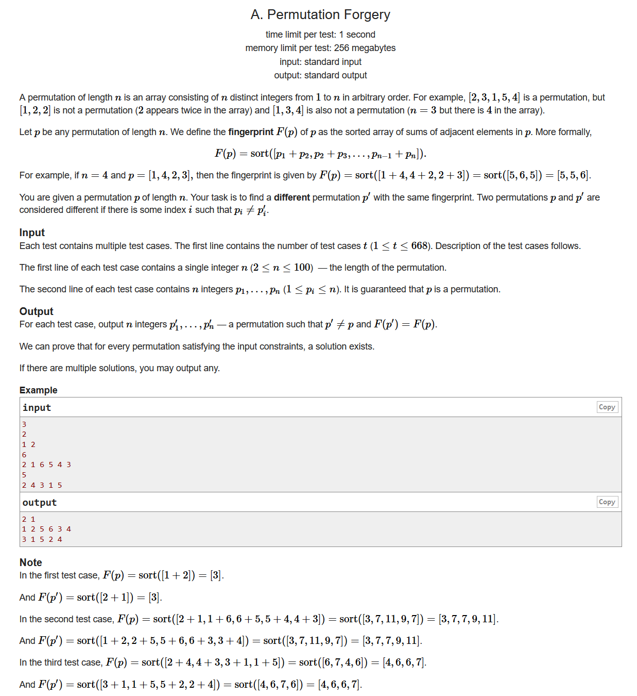
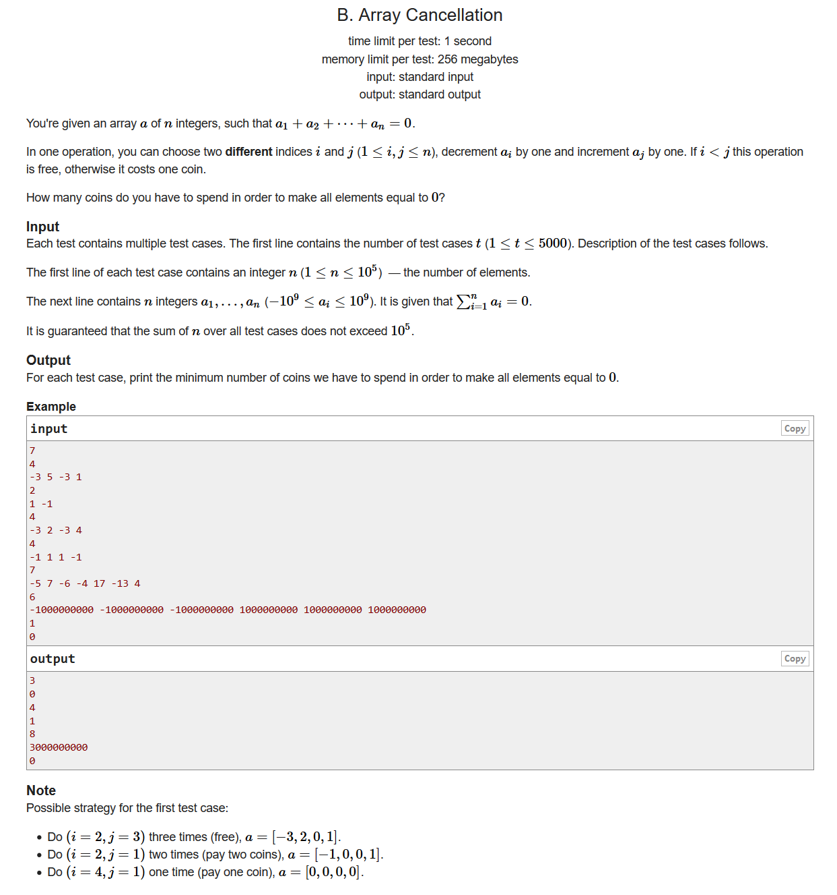
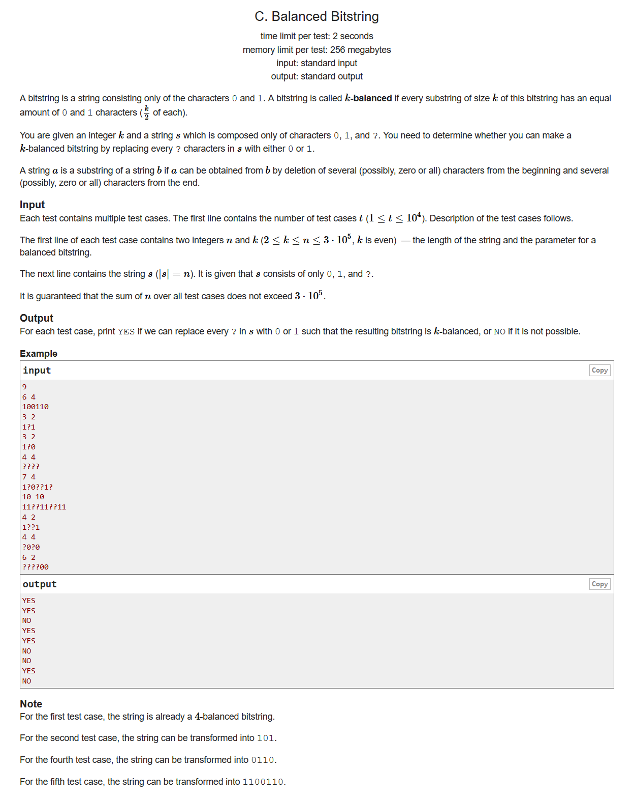
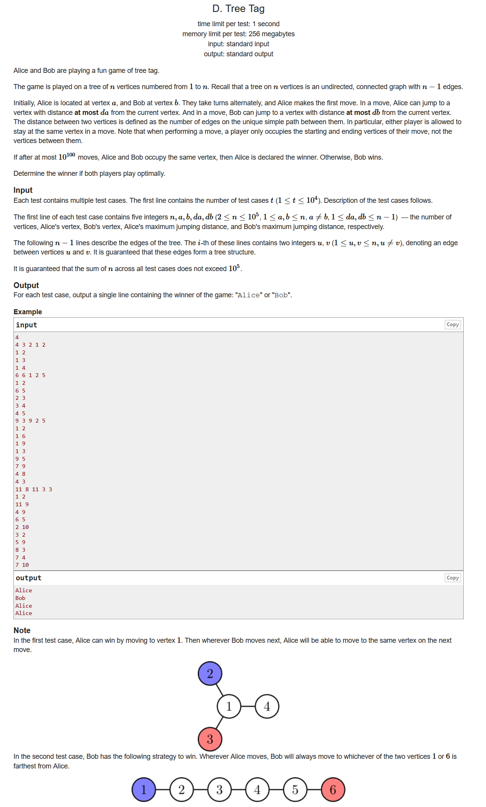
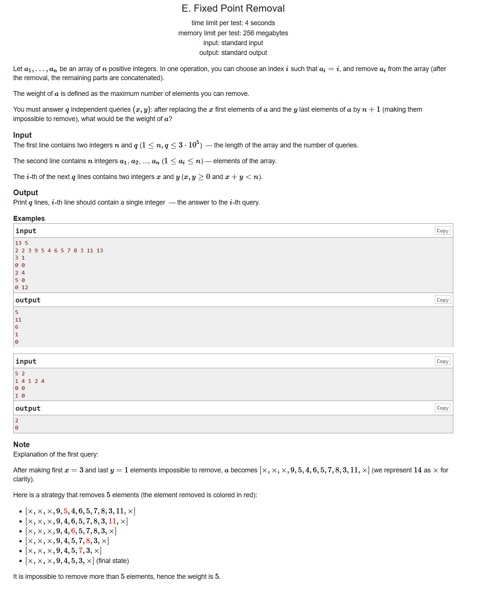

# Codeforces Round #668 (Div. 2)

[题目链接](https://codeforces.ml/contest/1405/problems)
[官方题解](https://codeforces.ml/blog/entry/82366)

## A. Permutation Forgery



- 签到题
- 直接把整个数组反过来就行了

```cpp
#include <bits/stdc++.h>
using namespace std;
#define LL long long
#define sigma_size 30
#define max_size (int)(2e4+10)
#define MAX (int)(1e5+7)

int main ()
{
	ios::sync_with_stdio(0);
	int T ; cin >> T;
	while (T--)
	{
		int n ; 
		vector <int> p;
		cin >> n;
		for ( int i = 1 ; i <= n ; i++ ) 
		{
			int x ; cin >> x;
			p.push_back(x);
		}
		reverse( p.begin() , p.end() );
		for ( int i = 0 ; i < p.size() ; i++ )
			cout << p[i] << " ";
		cout << endl;;
	}
}
```

## B. Array Cancellation



- 贪心
- 我们首先可以知道，如果一个数在最靠近左边的位置而且还是小于0的，那么我们一定会花费代价去提升这个数的值，那么相应的后面就会有一些数字会下降，而且我们知道，最好是那种不仅数字靠后的而且是大于0的数字下降了。
- 这样一来的话，我们就用cur表示位置靠前的并且大于0的这个数字累计了多少能够抬一下后面小于0的数字。当我们遇到一个数字是小于0的时候，我们就用我们累计的cur去把他抬起来。如果cur被消耗完了，我们就得花费相应的代价手动提升这个数字

```cpp
#include <bits/stdc++.h>
using namespace std;
#define LL long long
#define sigma_size 30
#define max_size (int)(1e5+10)
#define MAX (int)(1e5+7)

LL ans[5005];
LL a[max_size];
int main ()
{
	ios::sync_with_stdio(0);
	int T ; cin >> T;
	for ( int cas = 1 ; cas <= T ; cas++ )
	{
		int n ; cin >> n;
		for ( int i = 1 ; i <= n ; i++ ) cin >> a[i];
		LL cur = 0;
		LL cost = 0;
		for ( int i = 1 ; i <= n ; i++ )
		{
			if ( a[i] == 0 ) continue;
			if ( a[i] < 0 )
			{
				cur += a[i];
				if ( cur < 0 )
					cost -= cur , cur = 0;
			}
			else if ( a[i] > 0 )
			{
				cur += a[i];	
			}
		}
		ans[cas] = cost;
	}
	for ( int i = 1 ; i <= T ; i++ )
		cout << ans[i] << endl;
}
```

## C. Balanced Bitstring （补题）



- 结论
- 首先我们有一个很重要的结论，就是对于s的子串t，我们必须有$t_i=t_{i+k}$
- 这样一来的话，我们就只需要遍历一下$t_0t_1...t_{k-1}$之间的字符是不是满足我上面的条件，即检查一下$t_i$是不是等于$s_{i+nk}(n=0,1,2...)$，如果不巧，我们遍历的这些数字全都是'?'的话，那么$t_i$这个字符就无所谓了
- 最后我们还得检查一下前k个字符当中是不是1的数量和0的数量刚好都是k/2这样问题就解决了

```cpp
#include <bits/stdc++.h>
using namespace std;
#define LL long long
#define sigma_size 30
#define max_size (int)(3e5+10)
#define MAX (int)(1e5+7)

bool ans[10005];
int sum[max_size][3];
int res[max_size][2];
int main ()
{
	ios::sync_with_stdio(0);
	int T ; cin >> T;
	for ( int cas = 1 ; cas <= T ; cas++ )
	{
		int n , k ; 
		string s;
		cin >> n >> k;
		cin >> s;
		int num0 = 0 , num1 = 0;
		bool flag = true;
		for ( int i = 0 ; i < k ; i++ )
		{
			int tmp = -1;
			for ( int j = i ; j < n ; j += k )
			{
				if ( s[j] != '?' )
				{
					if ( tmp != -1 && s[j] - '0' != tmp )
					{
						flag = false;
						break;
					}
					tmp = s[j] - '0';
				}
			}
			if ( tmp != -1 )
			{
				if ( tmp == 0 ) num0++;
				if ( tmp == 1 ) num1++;
			}
		}
		if ( num0 > k/2 || num1 > k/2 )
			flag = false;
		
		ans[cas] = flag;
	}
	for ( int i = 1 ; i <= T ; i++ )
		if ( ans[i] ) cout << "YES" << endl;
		else cout << "NO" << endl;
}
```

## D. Tree Tag （补题）



- dfs
- 首先我们有几种情况：
  - $dist(a,b) \le da$
    也就是说Alice一步就可以到达Bob，那么一定是Alice获胜
  - $2*da \ge maxdis$
    这个时候只要Alice找个最长路径的中心位置蹲好，就可以捕捉到Bob了
  - $db \le 2*da$
    这样的话Alice可以把Bob逼到一个死胡同里面，那么当Bob要逃离的时候，Alice就可以捕捉到了
  - $db \ge 2*da$
    这个是Bob唯一能够获胜的情况了
- 现在我们的主要任务就是求前两种情况，我们不妨把a点设成是无向图的根节点，通过dfs我们可以算出b的距离。至于寻找最长的路径我们的求法应该是很自然的从a出发的最长路径len加上第二长的路径
```cpp
#include <bits/stdc++.h>
using namespace std;
#define LL unsigned long long
#define sigma_size 30
#define max_size (int)(1e5+10)
#define MAX (int)(1e5+7)

bool ans[10005];
int n , a , b , da , db ;
int depth[max_size];
vector <int> G[max_size];
int maxdis = 0;
void init()
{
	maxdis = 0;
	for ( int i = 0 ; i <= n ; i++ ) G[i].clear();
	memset ( depth , 0 , (n+5)*sizeof(int) );
}
int dfs ( int u , int fa )
{
	int len = 0;
	for ( int i = 0 ; i < G[u].size() ; i++ )
	{
		int v = G[u][i];
		if ( v == fa ) continue;
		depth[v] = depth[u] + 1;
		int cur = 1 + dfs ( v , u );
		maxdis = max ( maxdis , cur + len );
		len = max ( len , cur );
	}
	return len;
}
int main ()
{
	ios::sync_with_stdio(0);
	int T ; cin >> T;
	for ( int cas = 1 ; cas <= T ; cas++ )
	{
		cin >> n >> a >> b >> da >> db;
		init();
		for ( int i = 1 ; i < n ; i++ )
		{
			int u , v ;
			cin >> u >> v;
			G[u].push_back(v);
			G[v].push_back(u);
		}
		depth[a] = 0;
		dfs ( a , -1 );
		if ( da >= depth[b] )
			ans[cas] = 1;
		else if ( 2*da >= maxdis )
			ans[cas] = 1;
		else if ( db > 2*da )
			ans[cas] = 0;
		else if ( db <= 2*da )
			ans[cas] = 1;
	}
	for ( int i = 1 ; i <= T ; i++ )
		if ( ans[i] ) cout << "Alice" << endl;
		else cout << "Bob" << endl;
}
```

## E. Fixed Point Removal （补题）



- 树状数组
- 预处理。我们可以把每个$a_i$变成是$i-a_i$这样的话，如果$a_i$为0那么这个数字就是可以被移除的
- 构造树状数组。我们设$f(l,r)$表示区间[l,r]当中可以被移除的数字，可以证明，这个f函数是随着区间[l,r]长度的增加而增加的。因此我们可以尝试着固定好一个r，然后我们二分查找一个最大的$l_{max}$使得$f[l_{max},r] \le a[r]$.其中由于我们$a_r$是可能被移除的当且仅当$a_r \ge 0$ && $a_r \le f[1,r-1]$。所以对于$a[r+1]$我们的状态转移就有
  $$f[l,r] = f[l,r-1] + [a[r] \ge 0 \&\& a[pos] \le f[l,r-1]] $$
 于是我们可以发现每次新增加一个数，所有的转移都是一样的，而且只有$f(l,x) \ge a[pos]$的时候才能够转移，这样我们就可以通过树状数组来考虑这个pos对于后面区间的影响。所以我们可以把我们求得的每一个右端点就把所有的询问就拿出来在树状数组上面跑一遍

```cpp
#include <bits/stdc++.h>
using namespace std;
#define LL long long
#define sigma_size 30
#define max_size (int)(3e5+10)
#define MAX (int)(1e5+7)

int n , q;
int ans[max_size];
int a[max_size];
int c[max_size];
int lowbit ( int x ) {
    return x & -x ;
}
int sum ( int x ){
    int ret = 0;
    while ( x > 0 ){
        ret += c[x] ; x -= lowbit(x) ;
    }
    return ret;
}
void add ( int x , int d ) {
    while ( x <= n ){
        c[x] += d ; x += lowbit(x);
    }
}
vector <int> L[max_size];
vector <int> id[max_size];
int main ()
{
    ios::sync_with_stdio(0);
    cin >> n >> q;
    for ( int i = 1  ; i <= n ; i++ )
    {
        cin >> a[i];
        a[i] = i - a[i];
    }
    for ( int i = 1 ; i <= q ; i++ )
    {
        int x , y ; cin >> x >> y;
        int l = 1 + x , r = n - y;
        L[r].push_back(l);
        id[r].push_back(i);
    }
    for ( int r = 1 ; r <= n ; r++ )
    {
        if ( a[r] >= 0 ) 
        {
            int left = 0 , right = r;
            while ( left < right )
            {
                int mid = left + right + 1 >> 1;
                if ( sum(mid) >= a[r] )
                    left = mid;
                else right = mid - 1;
            }
            if ( left != 0 )
            {
                add(1,1);
                add(left+1,-1);
            }
        }
        for ( int j = 0 ; j < L[r].size() ; j++ )
        {
            int l = L[r][j];
            int ID = id[r][j];
            ans[ID] = sum(l);
        }
    }
    for ( int i =1  ; i <= q ; i++ )
        cout << ans[i] << endl;
}
```