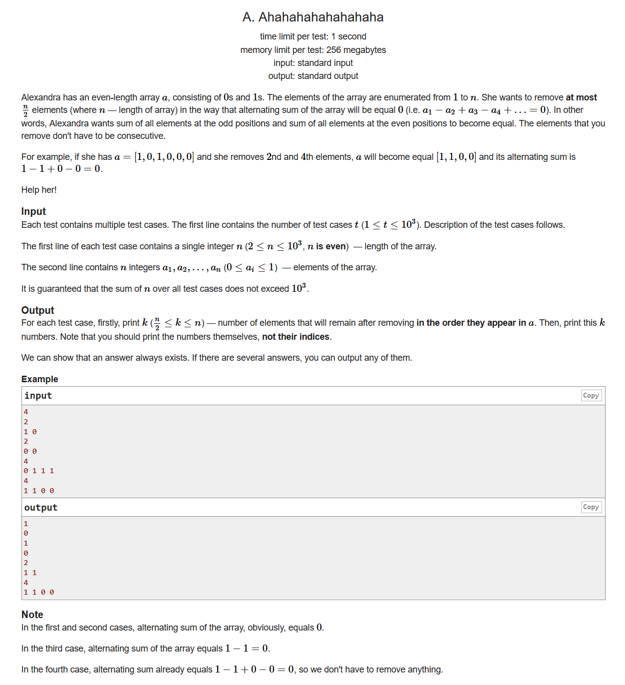
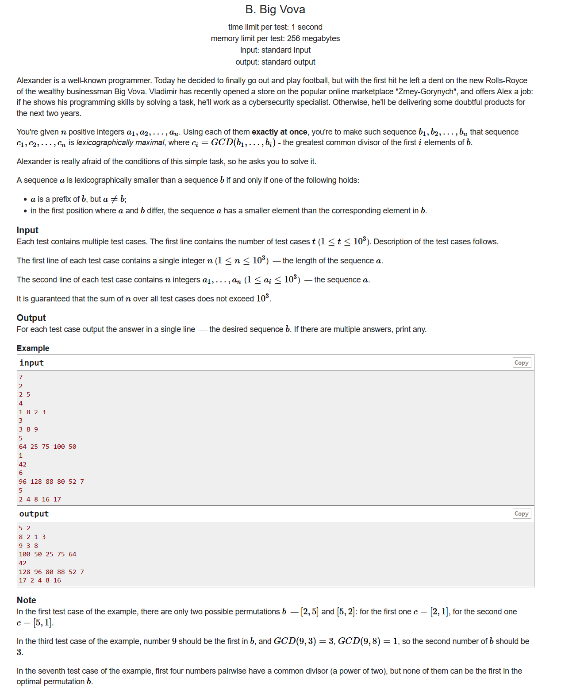
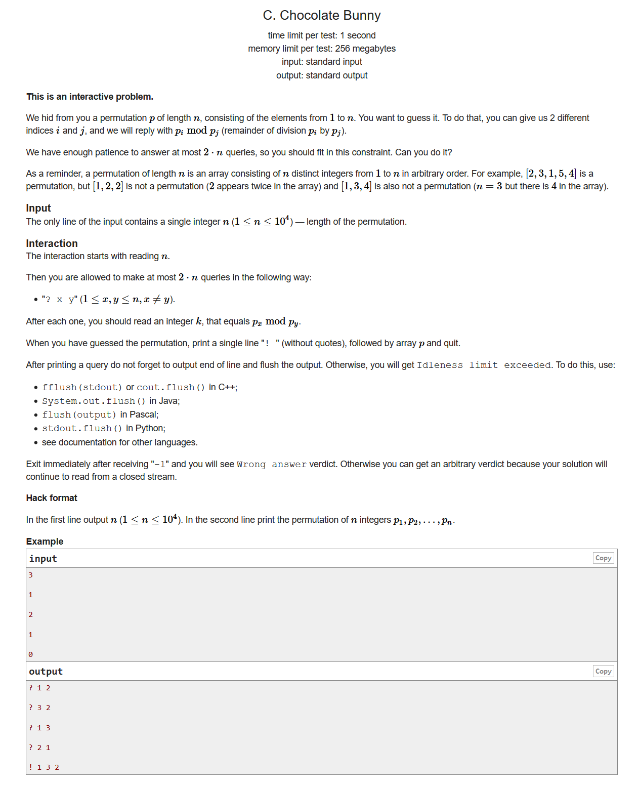
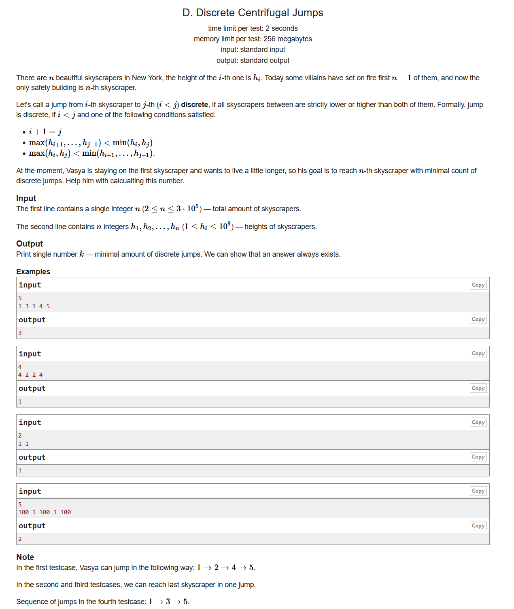
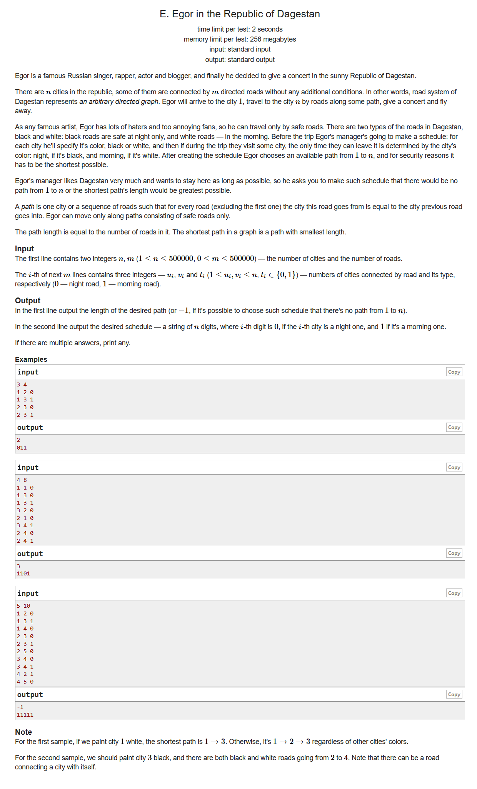

# Codeforces Round #669 (Div. 2)

[题目链接](https://codeforces.ml/contest/1407)
[官方题解](https://codeforces.ml/blog/entry/82417)

## A. Ahahahahahahahaha



- 思维题
- 这道题告诉我们不要把题目往复杂的方面想
- 如果字符串0的个数有一半以上，那就把0打印出来就行了

    如果没有，那就打印偶数个1即可

```cpp
#include <bits/stdc++.h>
using namespace std;
#define LL long long
#define sigma_size 30
#define max_size (int)(1e3+10)
#define MAX (int)(1e5+7)

int a[max_size];
int main ()
{
	ios::sync_with_stdio(0);
	int T ; cin >> T;
	while (T--)
	{
		int n ; cin >> n;
		for ( int i = 1 ; i <= n ; i++ ) cin >> a[i];
		int num0 = 0 , num1 = 0;
		for ( int i = 1 ; i <= n ; i++ )
		{
			if ( a[i] == 0 ) num0++;
			if ( a[i] == 1 ) num1++;
		}
		
		if ( num0 >= n / 2 )
		{
			cout << num0 << endl;
			for ( int i =1  ; i <= num0 ; i++ )
				cout << "0 ";
			cout << endl;
		}
		else if ( num1 >= n / 2 )
		{
			if ( num1 % 2 ) num1--;
			cout << num1 << endl;
			for ( int i = 1 ; i <= num1 ; i++ )
				cout << "1 " ;
			cout << endl;
		}

	}
}
```
---

## B. Big Vova



- 暴力枚举
- 首先我们要使得C的字典序是最大的，我们第一步就是把数组当中最大的那个数字给c。接下来的每一步，我们就是从剩下的数字当中选择能和当前最大公约数$now$组成最大公约数的数字
- 时间复杂度：$O(n^2)$

```cpp
#include <bits/stdc++.h>
using namespace std;
#define LL long long
#define sigma_size 30
#define max_size (int)(1e3+10)
#define MAX (int)(1e5+7)

int a[max_size];
bool Hash[max_size];
int main ()
{
	ios::sync_with_stdio(0);
	int T ; cin >> T;
	while (T--)
	{
		int n ; cin >> n;
		for ( int i = 1 ; i <= n ; i++ ) cin >> a[i];
		sort ( a+1 , a+1+n , greater<int>() );
		memset ( Hash , 0 , (n+5)*sizeof(bool) );
		int now = a[1];
		int i = 2;
		cout << a[1] << " ";
		Hash[1] = 1;
		while ( i <= n ) 
		{
			int maxx = 0;
			int cur ;
			for ( int j = 1 ; j <= n ; j++ )
			{
				if ( __gcd(now,a[j]) > maxx && !Hash[j] )
				{
					cur = j;
					maxx = __gcd(now,a[j]);
				}
			}
			Hash[cur] = 1;
			now = maxx;
			cout << a[cur] << " ";
			i++;
		}
		cout << endl;
	}
}
```

---

## C. Chocolate Bunny



- 交互，思维，数学
- 我们让两个数互相mod一下，就可以知道其中的一个数。证明如下：

    $$
    \begin{aligned}
        p_i \space mod \space p_j &= x_1 \\
        p_j \space mod \space p_i &= x_2 \\ 
    \end{aligned}
    $$
    $$
    \begin{cases}
        p_i = x_1 & { x_1 > x_2 } \\
        p_j = x_2 & { x_1 < x_2 } \\
    \end{cases}
    $$ 
    因为从题目来看，$p_i \space p_j$两个数字肯定一个大一个小，小的mod大的那个是本身，大的mod小的结果肯定比小的还小，所以两个mod出来的结果大的那个就是小数的值
- 重复上面的流程，我们就能够得到$n-1$个数字的值，总共需要$2*(n-1)$次询问，那么剩下的那个数字，我们只需要看看哪个数字还没匹配上就行了

```cpp
#include <bits/stdc++.h>
using namespace std;
#define LL long long
#define sigma_size 30
#define max_size (int)(1e4+10)
#define MAX (int)(1e5+7)

int p[max_size];
int Hash[max_size];
int main ()
{
	ios::sync_with_stdio(0);
	int n ; cin >> n;
	int i = 1 , j = 2;
	while ( i <= n && j <= n )
	{
		if ( i > j ) swap(i,j);
		cout << "? " << i << " " << j << endl;
		cout.flush();
		int x1 ; cin >> x1 ;
		cout << "? " << j << " " << i << endl;
		int x2 ; cin >> x2 ;
		if ( x1 > x2 )
		{	
			p[i] = x1 ; i = j+1 ; Hash[x1] = 1;
		}
		else p[j] = x2 , j++ , Hash[x2] = 1;
	}
	if ( i <= n )
	{
		for ( int k = 1 ; k <= n ; k++ )
			if ( Hash[k] == 0 )
			{
				p[i] = k;
				break;
			}
	}
	else if ( j <= n )
	{
		for ( int k = 1 ; k <= n ; k++ )
			if ( Hash[k] == 0 )
			{
				p[j] = k;
				break;
			}
	}
	cout << "! ";
	for ( int i = 1; i <= n ; i++ )
	{
		cout << p[i] ;
		if ( i < n ) cout << " ";
		else cout << endl
		;
	}
	cout.flush();
}
```
---

## D. Discrete Centrifugal Jumps



- dp
- 我们可以来考虑一下第二种情况，如果对于一个$h_i$，我们找到了一个$h_j$使得$h_i \le h_j$，那么我们可以说$h_i$可以转移到$h_j$，并且不可能再往后转移了。同样的，如果我们对于一个$h_j$，找到了一个$h_i$是$h_i \ge h_j$的，那我们这个数字就可以向左转移(等价于左边那个数字向右转移)
- 对于第三种情况我们可以得到相似的结论
- 我们模拟一下单调栈，从左往右遍历，我们可以找到某个数$h_i$左边第一个比它小的数字；再模拟一次求出左边第一个比他大的数字。从右往左遍历以此类推。
- 最后我们把他们能够转移的点建模变成图，用dp转移求到最后的dp[n]就行了

```cpp
#include <bits/stdc++.h>
using namespace std;
#define LL unsigned long long
#define sigma_size 30
#define max_size (int)(3e5+10)
#define MAX (int)(1e5+7)

int h[max_size];
int lle[max_size] , lge[max_size] , rle[max_size] , rge[max_size];
int dp[max_size];
vector < pair<int,int> > st;
vector <int> jump[max_size];
int main ()
{
	ios::sync_with_stdio(0);
	int n ;
	cin >> n;
	for ( int i = 1 ; i <= n ; i++ ) cin >> h[i];
	for ( int i = 1 ; i <= n ; i++ )
	{
		while ( !st.empty() && st.back().first > h[i] )
			st.pop_back();
		if ( st.empty() ) lle[i] = -1;
		else lle[i] = st.back().second;
		st.push_back({h[i],i});
	}
	st.clear();
	for ( int i = 1 ; i <= n ; i++ )
	{
		while ( !st.empty() && st.back().first < h[i] )
			st.pop_back();
		if ( st.empty() ) lge[i] = -1;
		else lge[i] = st.back().second;
		st.push_back({h[i],i});
	}
	st.clear();
	for ( int i = n ; i >= 1 ; i-- )
	{
		while ( !st.empty() && st.back().first > h[i] )
			st.pop_back();
		if ( st.empty() ) rle[i] = -1;
		else rle[i] = st.back().second;
		st.push_back({h[i],i});
	}
	st.clear();
	for ( int i = n ; i >= 1 ; i-- )
	{
		while ( !st.empty() && st.back().first < h[i] )
			st.pop_back();
		if ( st.empty() ) rge[i] = -1;
		else rge[i] = st.back().second;
		st.push_back({h[i],i});
	}
	memset ( dp , 0x3f3f3f3f , sizeof(dp) );
	dp[1] = 0;
	for ( int i = 1 ; i <= n ; i++ )
	{
		if ( lle[i] != -1 ) jump[lle[i]].push_back(i);
		if ( lge[i] != -1 ) jump[lge[i]].push_back(i);
		if ( rge[i] != -1 ) jump[i].push_back(rge[i]);
		if ( rle[i] != -1 ) jump[i].push_back(rle[i]);
	}
	for ( int i = 1 ; i <= n ; i++ )
	{
		for ( int j = 0 ; j < jump[i].size() ; j++ )
		{
			int v = jump[i][j];
			dp[v] = min ( dp[v] , dp[i] + 1 );
		}
	}
	cout << dp[n] << endl;
}
```
---

## E. Egor in the Republic of Dagestan



- dp，图论，最短路
- 首先我们把图的方向全都反过来，那么我们从n到x的最短路径就是从x到n的最长路径，因为我们对于一个结点c它可以经过的话，当且仅当c这个结点是安全的。

```cpp
#include <bits/stdc++.h>
using namespace std;
#define LL long long
#define sigma_size 30
#define max_size (int)(5e5+10)
#define MAX (int)(1e5+7)

int n , m;
vector <int> bg[max_size] , rg[max_size];
int d[max_size] , r[max_size] , b[max_size];
int col[max_size];
int main ()
{
    ios::sync_with_stdio(0);
    cin >> n >> m;
    for ( int i = 1 ; i <= m ; i++ )
    {
        int u , v , t;
        cin >> u >> v >> t;
        if ( !t ) bg[v].push_back(u);
        else rg[v].push_back(u);
    }
    for ( int i = 1 ; i <= n ; i++ )
        d[i] = b[i] = r[i] = n;

    queue <int> q;
    q.push(n);
    d[n] = b[n] = r[n] = 0;
    while (!q.empty())
    {
        int u = q.front() ; q.pop();
        for ( int i = 0 ; i < bg[u].size() ; i++ )
        {
            int v = bg[u][i];
            if ( b[v] < n ) continue;
            b[v] = d[u] + 1;
            if ( max(b[v] , r[v]) < n )
            {
                q.push(v);
                d[v] = max ( b[v] , r[v] );
            }
        }
        for ( int i = 0 ; i < rg[u].size() ; i++ )
        {
            int v = rg[u][i];
            if ( r[v] < n ) continue;
            r[v] = d[u] + 1;
            if ( max(b[v] , r[v]) < n )
            {
                q.push(v);
                d[v] = max ( b[v] , r[v] );
            }
        }
    }
    if ( d[1] == n ) cout << "-1" << endl;
    else cout << d[1] << endl;
    for ( int i = 1 ; i <= n ; i++ )
    {
        if ( b[i] > r[i] ) col[i] = 0;
        else col[i] = 1;
        cout << col[i];
    }
    cout << endl;
}
```

