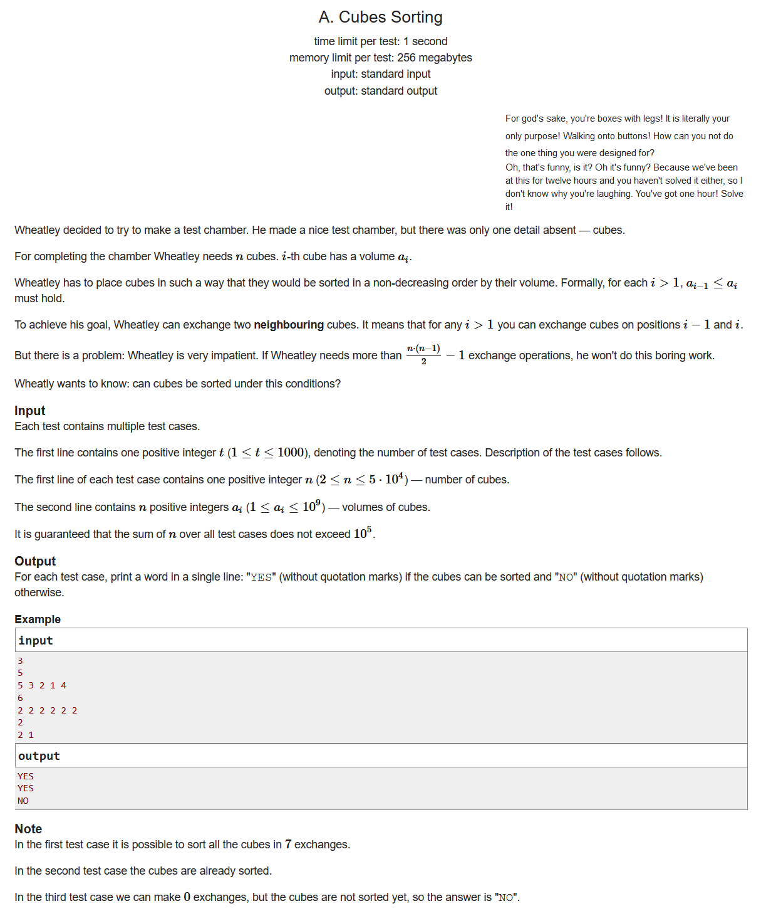
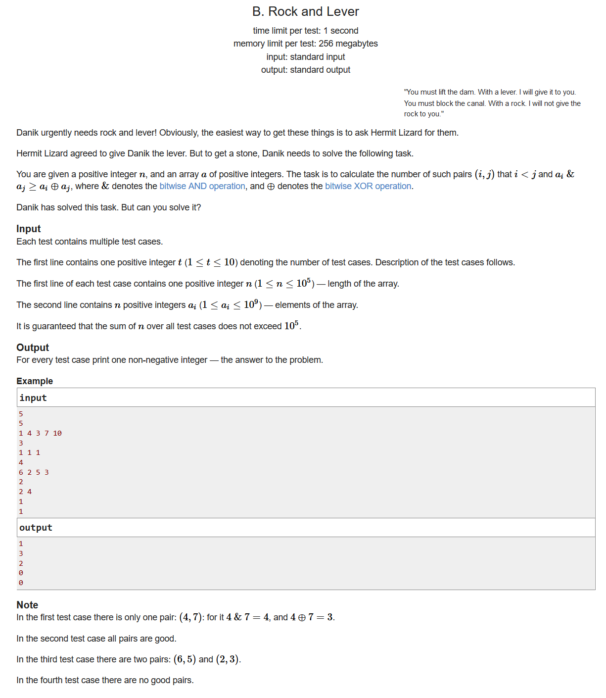
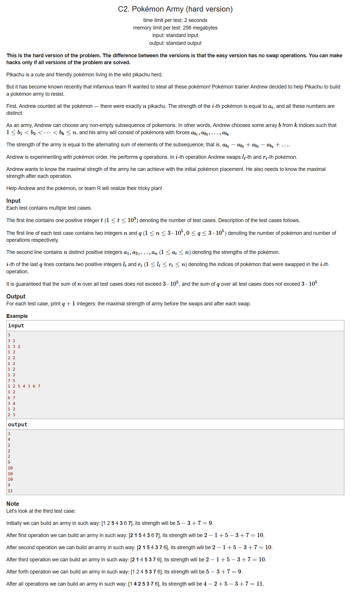
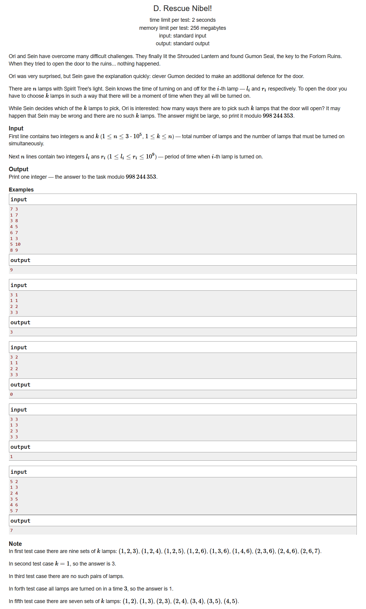

# Codeforces Round #672 (Div. 2)

- [题目链接](https://codeforces.ml/contest/1420)
- [官方题解](https://codeforces.ml/blog/entry/82978)

## A. Cubes Sorting

- 

- 思维题，冒泡排序
- 由题目当中的式子我们可以看出这是冒泡排序的最坏情况，所以我们只需要判断一下数组是不是完全逆序的即可

```cpp
#include <bits/stdc++.h>
using namespace std;
#define LL long long
#define sigma_size 30
#define max_size (int)(5e4+10)
#define MAX (int)(1e5+7)

bool ans[1005];
int a[max_size];
int b[max_size];

int main ()
{
	ios::sync_with_stdio(0);
	int T ; cin >> T;
	for ( int cas = 1; cas <= T ; cas++ )
	{
		int n ; cin >> n;
		for ( int i =1 ; i <= n ; i++ ) cin >> a[i] , b[i] = a[i];
		sort ( a+1 , a+1+n , greater<int>() );
		bool flag =  1;
		for ( int i = 1 ;  i < n ; i++ )
			if ( a[i] == a[i+1] ) 
			{
				flag = 0;
				break;
			}
		if ( !flag ) {ans[cas] = !flag;continue;}
		for ( int i = 1  ; i <= n ; i++ )
			if ( b[i] != a[i] )
			{
				flag = 0;
				break;
			}
		ans[cas] = !flag;
	}
	for ( int i = 1 ; i <= T ; i++ )
		if ( ans[i] ) cout << "YES" << endl;
		else cout << "NO" << endl;
}
```

## B. Rock and Lever

- 

- 思维
- 我们可以得出$a_i \& a_j \ge a_i \bigoplus a_j$当且仅当两个数的最高位是相等的。因此我们只需要统计一下所有数的最高位，把最高位相同的数变成一个集合，任取其中的两个组合都满足条件

```cpp
#include <bits/stdc++.h>
using namespace std;
#define LL long long
#define sigma_size 30
#define max_size (int)(2e4+10)
#define MAX (int)(1e5+7)

LL ans[15];
int a[35];
int main()
{
	ios::sync_with_stdio(0);
	int T ; cin >> T;
	for ( int cas = 1 ; cas <= T ; cas++ )
	{
		int n ; cin >> n;
		memset ( a , 0 , sizeof(a) );
		for ( int i = 1 ; i <= n ; i++ )
		{
			int x ; cin >> x;
			int cnt = 0;
			while (x)
			{
				cnt++;
				x /= 2;
			}
			a[cnt]++;
		}
		LL sum = 0;
		for ( int i = 1 ; i <= 34 ; i++ )
			sum += 1ll * a[i] * (a[i]-1) / 2;
		ans[cas] = sum;
	}
	for ( int i =1 ; i <= T ; i++ )
		cout << ans[i] << endl;
}
```

## C. Pokémon Army

- 

- 暴力
- 首先对于移动之前的数列，我们暴力寻找谷峰和谷底，也就是我们要找到谷峰$a_i > a_{i-1}$且$a_i>a_{i+1}$，还有谷底$a_i < a_{i-1}$且$a_i<a_{i+1}$，谷峰的和减去谷底的和就是答案
- 对于移动的情况，我们就必须考虑移动的这两个数字是不是谷峰和谷底，以及移动之后是不是谷峰谷底，以及移动之后周围的两个数是不是谷峰和谷底，我们这样一来就会考虑最多6个数字的情况

```cpp
#include <bits/stdc++.h>
using namespace std;
#define LL long long
#define sigma_size 30
#define max_size (int)(3e5+10)
#define MAX (int)(1e5+7)

LL ans[max_size];
LL a[max_size];
int Hash[max_size];
int n , q;
int judge ( int i )
{
    if ( i == 1 )
    {
        if ( a[i] > a[i+1] )
            return 1;
        else return 0;
    }
    if ( i == n )
    {
        if ( a[i] > a[i-1] )
            return 1;
        else return 0;
    }
    if ( a[i] > a[i-1] && a[i] > a[i+1] )
        return 1;
    else if ( a[i] < a[i-1] && a[i] < a[i+1] ) 
        return 2;
    else return 0;
}
LL add ( int i )
{
    if ( Hash[i] == 1 ) return a[i];
    if ( Hash[i] == 2 ) return -a[i];
    return 0;
}
int main ()
{
    //freopen ( "input.txt" , "r" ,stdin );
    //freopen ( "output.txt" , "w" , stdout ); 
    ios::sync_with_stdio(0);
    int T ; cin >> T ;
    for ( int cas = 1 ; cas <= T ; cas++ )
    {
        cin >> n >> q;
        memset ( ans , 0 , (q+5)*sizeof(LL) );
        memset ( Hash , 0 , (n+5)*sizeof(int) );
        for ( int i = 1 ; i <= n ; i++ ) cin >> a[i];
        bool flag = 0;
        LL sum = 0;
        LL cur = a[1];
        for ( int i = 2 ; i <= n ; i++ )
        {
            if ( flag == 0 )
            {
                if ( a[i] > cur )
                    cur = a[i];
                else
                {
                    sum += cur;
                    cur = a[i];
                    Hash[i-1] = 1;
                    flag = 1;
                }
            }
            else if ( flag == 1 )
            {
                if ( a[i] < cur )
                    cur = a[i];
                else 
                {
                    sum -= cur;
                    cur = a[i];
                    Hash[i-1] = 2;
                    flag = 0;
                }
            }
        }
        if ( flag == 0 ) sum += cur , Hash[n] = 1 ;
            ans[0] = sum;
        for ( int i = 1 ; i <= q ; i++ )
        {
            int l , r ; cin >> l >> r ;
            if ( Hash[l] == 1 ) sum -= a[l];
            if ( Hash[l] == 2 ) sum += a[l];
            if ( Hash[r] == 1 ) sum -= a[r];
            if ( Hash[r] == 2 ) sum += a[r];
            
            Hash[l] = Hash[r] = 0;
            swap ( a[l] , a[r] );
            Hash[l] = judge(l) , Hash[r] = judge(r);
            sum += add(l) , sum += add(r);

            if ( l > 1 )
            {    
                sum -= add(l-1);
                Hash[l-1] = judge(l-1) ;
                sum += add(l-1);
            }
            if ( l + 1 < r )
            {
                sum -= add(l+1);
                Hash[l+1] = judge(l+1);
                sum += add(l+1);
            }
            if ( r < n )
            {    
                sum -= add(r+1);
                Hash[r+1] = judge(r+1);
                sum += add(r+1);
            }
            if ( l + 1 < r - 1 )
            {
                sum -= add(r-1);
                Hash[r-1] = judge(r-1) ;
                sum += add(r-1);
            }
            ans[i] = sum;
        }
        for ( int i = 0 ; i <= q ; i++ )
            cout << ans[i] << endl;
    }
    
}
```

## D. Rescue Nibel!

- 

```cpp
#include <bits/stdc++.h>
using namespace std;
#define LL long long
#define sigma_size 30
#define max_size (int)(3e5+10)
#define MAX (int)(1e5+7)

const LL mod = 998244353;
int n , k;
LL fac[max_size];
LL inv[max_size];
LL quick_pow ( LL x , LL b )
{
	LL res = 1 ;
	while (b)
	{
		if ( b & 1 ) res = res * x % mod;
		b >>= 1;
		x = x*x % mod;
	}
	return res;
}
LL get_inv ( LL x ) { return quick_pow( x , mod-2 ); }
void get_fac() {
	fac[0] = fac[1] = 1;
	for ( int i = 2 ; i < max_size ; i++ )
		fac[i] = fac[i-1] * i % mod;
	inv[300000] = get_inv(fac[300000]);
	for ( int i = 300000-1 ; i >= 0 ; i-- )
		inv[i] = inv[i+1] * (i+1) % mod;
}

LL C ( LL n , LL k ) {
	if ( k < 0 || k > n ) return 0;
	return fac[n] * inv[k] % mod * inv[n-k] % mod;
}

LL point[max_size<<1];

int main ()
{
	ios::sync_with_stdio(0);
	get_fac();
	cin >> n >> k;
	for ( int i = 1 ; i <= n ; i++ )
	{
		int l , r ; cin >> l >> r;
		point[2*i-1] = l * 2;
		point[2*i] = r * 2 + 1;
	}
	sort ( point+1 , point+2*n+1 );
	LL ans = 0;
	LL b = 0;
	for ( int i = 1 ; i <= 2*n ; )
	{
		int j = i;
		while ( i <= 2*n && point[i] == point[j] )
			i++;
		int added = i - j;
		if ( point[j] % 2 == 0 )
		{
			ans = ( ans + C(b+added , k ) ) % mod;
			ans = ( ans + mod - C(b,k) ) % mod;
			b += added;
		}
		else b -= added;
	}
	cout << ans << endl;
}
```