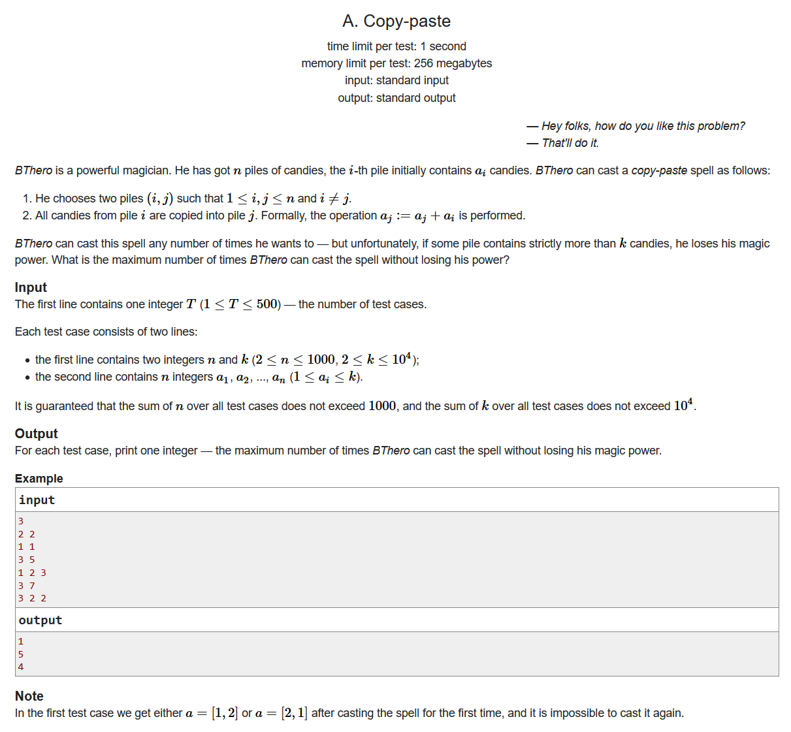
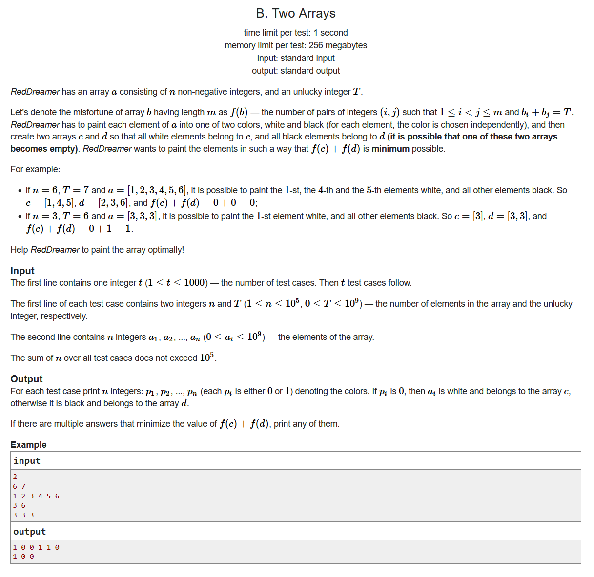
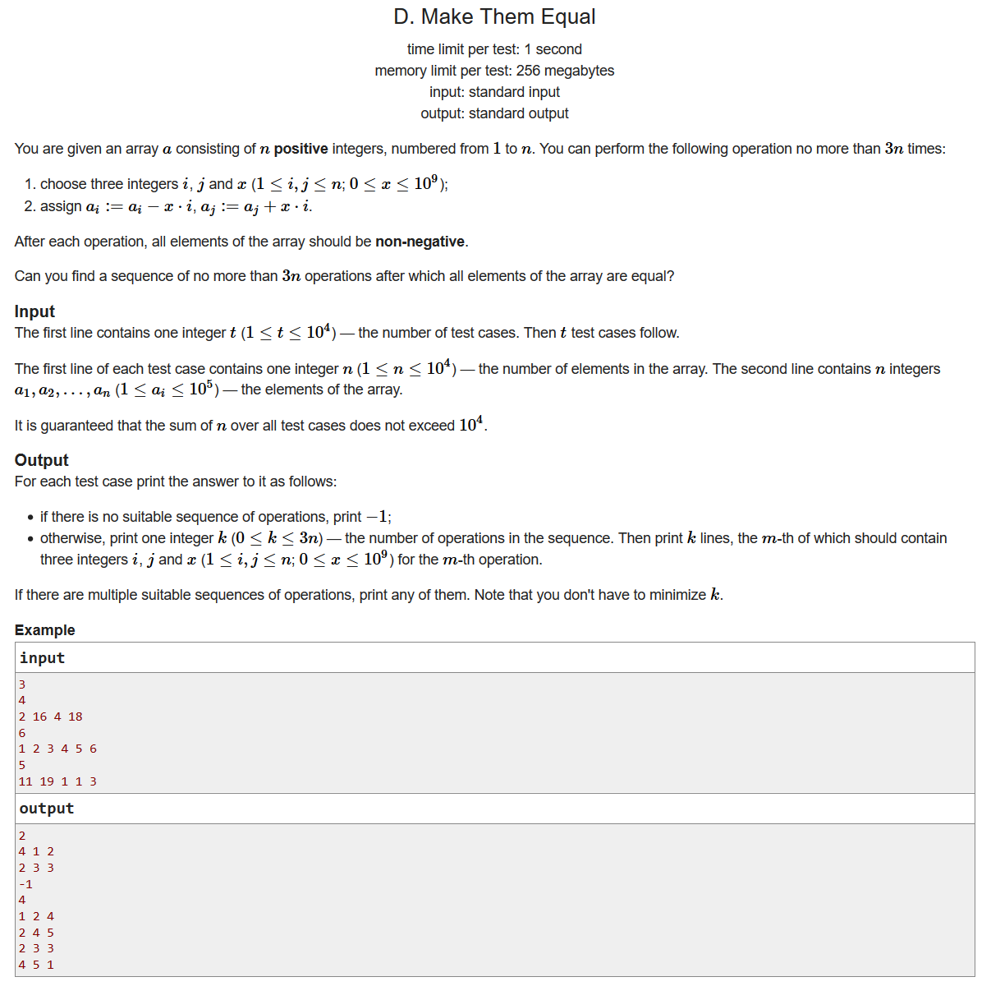
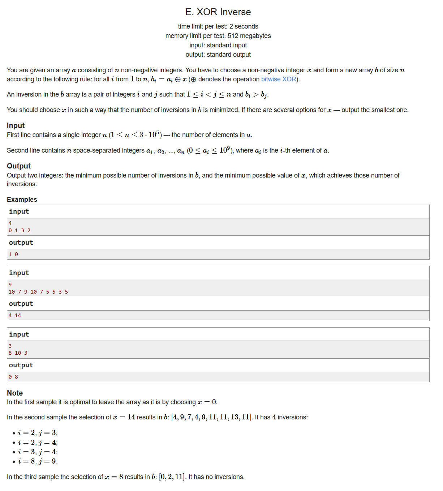

# Codeforces Round #673 (Div. 2)

- [题目链接](https://codeforces.ml/contest/1417)
- [官方题解](https://codeforces.ml/blog/entry/83036)

## A. Copy-paste

- 
- 贪心
- 每次都选序列当中最小的元素去加到其他元素即可

```cpp
#include <bits/stdc++.h>
using namespace std;
#define LL long long
#define sigma_size 30
#define max_size (int)(1e4+10)
#define MAX (int)(1e5+7)

int ans[505];
int n , k;
int a[max_size];
int main ()
{
	ios::sync_with_stdio(0);
	int T ; cin >> T;
	for ( int cas = 1 ; cas <= T ; cas++ )
	{
		cin >> n >> k;
		for ( int i = 1 ; i <= n ; i++ ) cin >> a[i];
		sort ( a+1 , a+1+n ) ;
		int sum = 0;
		for ( int i = 2 ; i <= n ; i++ )
		{
			int tmp = ( k - a[i] ) / a[1];
			sum += tmp;
		}
		ans[cas] = sum;
	}
	for ( int i = 1 ; i <= T ; i++ )
		cout << ans[i] << endl;
}
```

## B. Two Arrays



- 贪心
- 如果T是奇数，那么我们只需要把数列当中奇数的放到一块，偶数的放到一块就行
- 如果T是偶数，我们可以把小于T/2 的放到一个集合里面，把大于T/2的放到另一个集合里面，对于刚好等于T/2的元素，我们将这些元素平分之后放到两个集合里面即可

```cpp
#include <bits/stdc++.h>
using namespace std;
#define LL long long
#define sigma_size 30
#define max_size (int)(1e5+10)
#define MAX (int)(1e5+7)

int a[max_size];
int p[max_size];
int n , T ;

int main ()
{
	ios::sync_with_stdio(0);
	int t ; cin >> t;
	while (t--)
	{
		cin >> n >> T;
		for ( int i = 1 ; i <= n ; i++ ) cin >> a[i];
		if ( T % 2 )
		{
			for ( int i = 1  ; i <= n ; i++ ) 
			{	
				if ( a[i] % 2 )
					p[i] = 0;
				else
					p[i] = 1;	
			}
		}
		else
		{
			int z = 0;
			for ( int i = 1 ; i <= n ; i++ )
			{
				if ( a[i] < T/2 ) p[i]  = 0;
				else if ( a[i] == T / 2 ) p[i] = z , z = !z;
				else if ( a[i] > T/2 ) p[i] = 1; 
			}
		}
		for ( int i = 1 ; i <= n ; i++ )
			cout << p[i] << " ";
		cout << endl;
	}
}
```

## C. k-Amazing Numbers

- 
- 贪心
- 我们先统计一下所有数字间隔最长的距离，这个距离就代表着，当我们需要寻找长度为k的序列时，我们总能碰到这个数字
- 然后我们从小到大遍历一下这些数字，当这个数字的最大距离小于当前的距离的时候，那么这个数字的最大距离以后的数字就是我们要找的答案 

```cpp
#include <bits/stdc++.h>
using namespace std;
#define LL long long
#define sigma_size 30
#define max_size (int)(3e5+10)
#define MAX (int)(1e5+7)

int n;
vector<int> p[max_size];
int d[max_size];
int ans[max_size];
int main ()
{
    ios::sync_with_stdio(0);
    int T ; cin >> T;
    while (T--)
    {
        int n ; cin >> n;
        memset ( ans , -1 , (n+5)*sizeof(int) ); 
        for ( int i = 1 ; i <= n ; i++ ) p[i].clear() , p[i].push_back(0);
        for ( int i = 1 ; i <= n ; i++ )
        {
            int x ; cin >> x;
            p[x].push_back(i);
        }
        for ( int i = 1 ; i <= n ; i++ ) p[i].push_back(n+1);
        for ( int i = 1 ; i <= n ; i++ )
        {
            int maxx = 0;
            for ( int j = 1 ; j < p[i].size() ; j++ )
                maxx = max ( maxx , p[i][j] - p[i][j-1] );
            d[i] = maxx;
        }
        int cur = n+1;
        for ( int i = 1 ; i <= n ; i++ )
        {
            if ( d[i] >= cur ) continue;
            for ( int j = d[i] ; j < cur ; j++ )
                ans[j] = i;
            cur = d[i];
        }
        for ( int i = 1 ; i <= n ; i++ )
            cout << ans[i] << " ";
        cout << endl;
    }
}
```


## D. Make Them Equal



- 构造，思维
- 我们容易知道，最后形成的数列每个元素都是初始数列的平均数，因此平均数不是整数的情况我们就可以排除了
- 我们可以先把其他数字加上某个数之后使其变成能够被i整除的数字，并把这个数字全都交给第一个数字，然后我们再从第一个数字开始一点一点分配给其他数字

```cpp
#include <bits/stdc++.h>
using namespace std;
#define LL long long
#define sigma_size 30
#define max_size (int)(1e4+10)
#define MAX (int)(1e5+7)

LL a[max_size];
int main ()
{
	ios::sync_with_stdio(0);
	int T ; cin >> T;
	while (T--)
	{
		int n ; cin >> n;
		LL sum = 0;
		for ( int i = 1 ; i <= n ; i++ ) cin >> a[i] , sum += a[i];
		if ( sum % n ) { cout << "-1" << endl ; continue ;}
		sum = sum / n ;
		int cnt = 0;
		vector < pair<pair<int,int>,int> > ans;
		for ( int i = 2 ; i <= n ; i++ )
		{
			if ( a[i] <= sum ) continue;
			int x = a[i] / i ;
			a[i] %= i;
			cnt++;
			ans.push_back({{i,1},x});
		}
		for ( int i = 2 ; i <= n ; i++ )
		{
			if ( a[i] == sum )  continue;
			int d = sum - a[i];
			cnt++;
			ans.push_back({{1,i},d});
		}
		cout << (int)ans.size() << endl;
		for ( int i = 0 ;  i < ans.size() ; i++ )
			cout << ans[i].first.first << " " << ans[i].first.second << " " << ans[i].second << endl;
	}
}
```

## E. XOR Inverse

- 
- 字典树+分治
- 构造x的时候可以针对x在某一位上面取1或者取0进行分治，最后得出数列b逆序对最小的情况
- 而对于x数位上到底是0还是1，我们可以对原来所有的数字构造出一棵字典树trie，统计每个结点取1还是取0的数字个数，这样一来我们可以统计出某个结点取1和取0对答案的影响，最后我们递归遍历一下即可

```cpp
#include <bits/stdc++.h>
using namespace std;
#define LL long long
#define sigma_size 30
#define max_size (int)(4e6+10)
#define MAX (int)(1e5+7)

int n ;
LL dp[35][3];
int trie[max_size][3];
int tot = 0;
vector <int> v[max_size];

void insert ( int x , int pos )
{
    int p = 0 ;
    for ( int i = 30 ; i >= 0 ; i-- )
    {
        int t = ( x >> i ) & 1 ;
        if ( trie[p][t] == 0 ) trie[p][t] = ++tot;
        p = trie[p][t];
        v[p].push_back(pos);
    }
}

void dfs ( int p , int pos )
{
    if ( pos == -1 ) return ;
    int l = trie[p][0] , r = trie[p][1];
    LL sz0 = v[l].size() , sz1 = v[r].size();
    LL ans = 0 , tmp = 0;
    for ( int i = 0 ; i < sz0 ; i++ )
    {
        if ( !sz1 ) break;
        while ( tmp < sz1 && v[r][tmp] < v[l][i] ) tmp++;
        ans += tmp;
    }
    dp[pos][0] += ans;
    dp[pos][1] += sz0 * sz1 - ans;
    if ( l != 0 ) dfs ( l , pos-1 );
    if ( r != 0 ) dfs ( r , pos-1 );
}

int main ( )
{
    ios::sync_with_stdio(0);
    cin >> n;
    for ( int i =1 ; i <= n ; i++ )
    {
        int x ; cin >> x;
        insert(x,i);;
    }
    dfs ( 0 , 30 );
    LL ans1 = 0 , ans2 = 0;
    for ( int i = 0 ; i <= 30 ; i++ )
    {
        if ( dp[i][0] <= dp[i][1] )
            ans1 += dp[i][0];
        else
        {
            ans1 += dp[i][1];
            ans2 += ( 1 << i );
        }
    }
    cout << ans1 << " " << ans2 << endl;
}
```

## F. Graph and Queries

