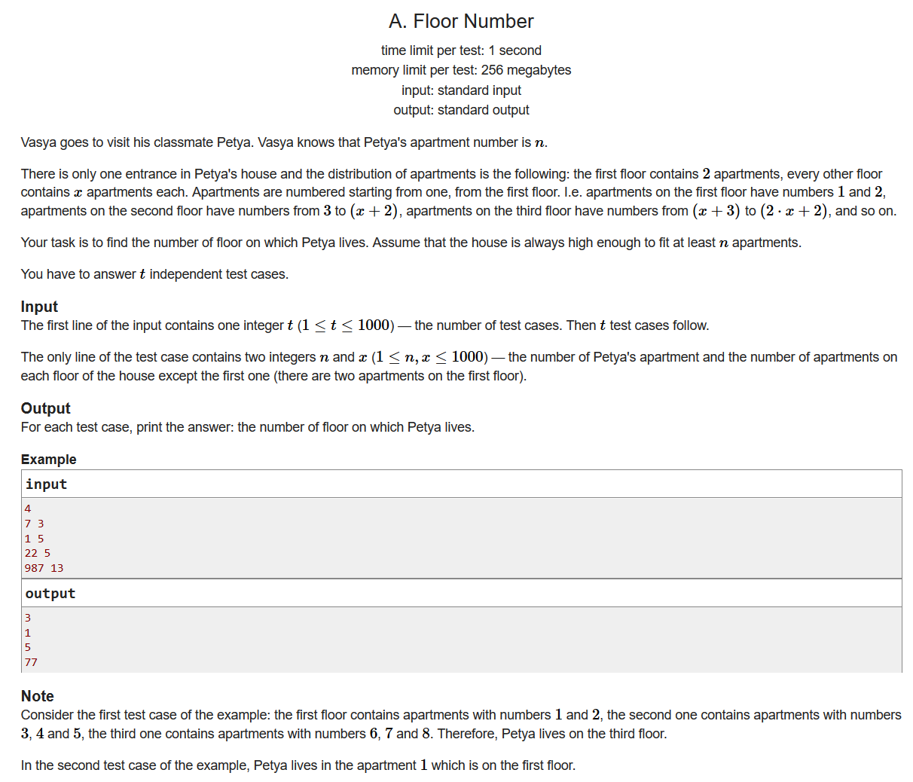
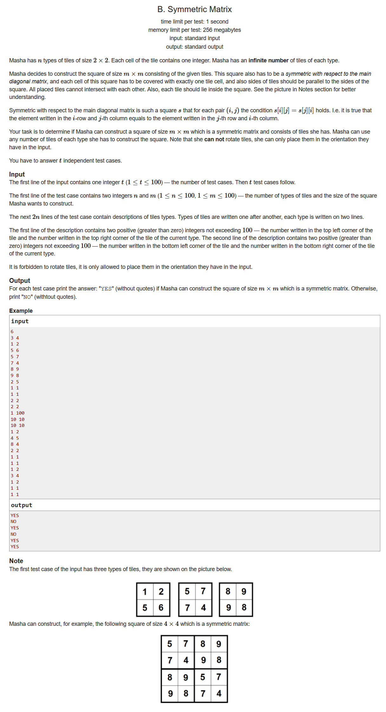
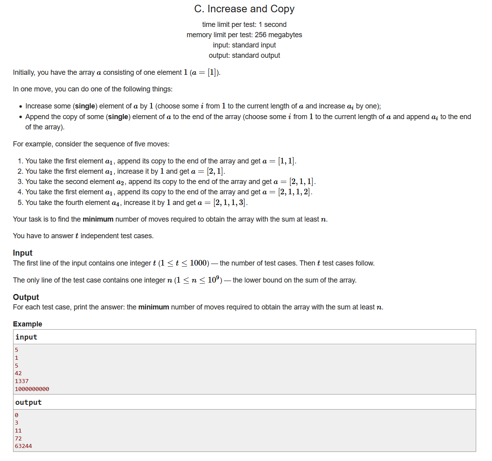
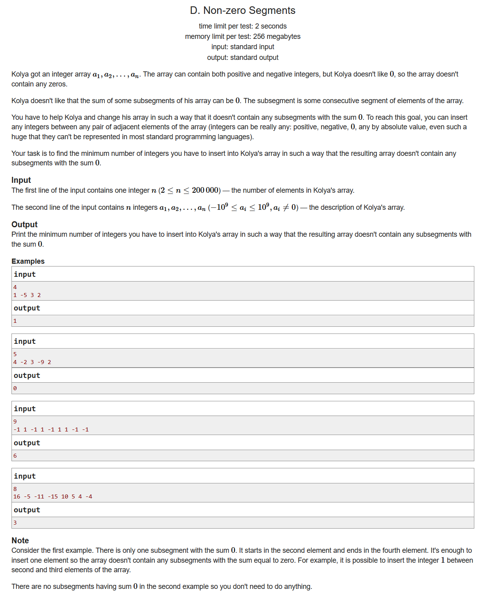
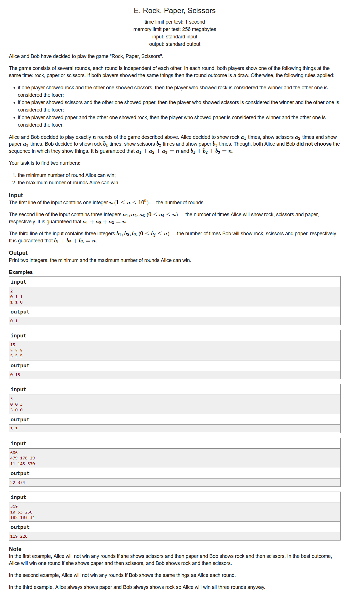
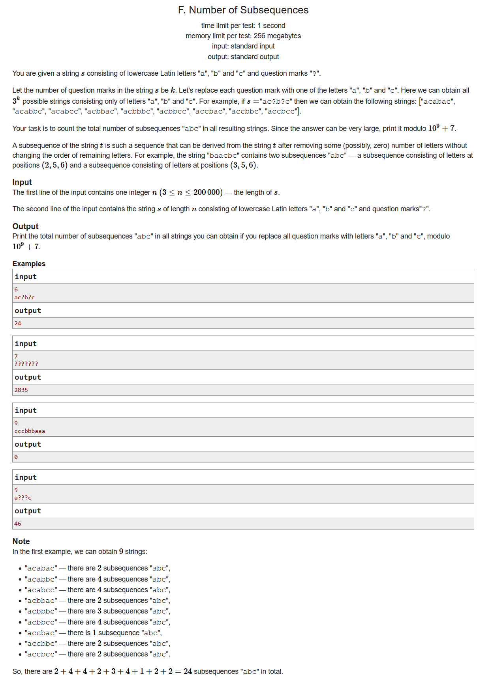

# Codeforces Round #674 (Div. 3)

- [题目链接](https://codeforces.ml/contest/1426)
- [官方题解](https://codeforces.ml/blog/entry/83120)


## A. Floor Number

- 

- 推断题

```cpp
#include <bits/stdc++.h>
using namespace std;
#define LL long long
#define sigma_size 30
#define max_size (int)(1e4+10)
#define MAX (int)(1e5+7)

int ans[1005];
int main ()
{
	ios::sync_with_stdio(0);
	int T ; cin >> T;
	for ( int cas = 1 ; cas <= T ; cas++ )
	{
		int n , x;
		cin >> n >> x;
		int d = n - 2;
		if ( d <= 0 ) { ans[cas] = 1 ; continue;}
		ans[cas] = d / x  + 1 ;
		if ( d % x ) ans[cas]++;
	}
	for ( int i = 1 ; i <= T  ;i++ )
		cout << ans[i]  << endl;
}
```

## B. Symmetric Matrix



- 思维题
- 我们可以得到以下几种情况：
  - 如果m是奇数，那么一定是不可能的；
  - m是偶数的前提下，如果我们能够找到对称的砖块，那么我们就一定可以构造出对称的矩阵
  - 如果找不到完全对称的砖块，我们只要右边的斜对角线相等就行了

```cpp
#include <bits/stdc++.h>
using namespace std;
#define LL long long
#define sigma_size 30
#define max_size (int)(1e5+10)
#define MAX (int)(1e5+7)

bool ans[105];
struct matrix {
	int a[3][3];
}Node[105];
int n , m;

bool judge1()
{
	for ( int i = 1 ; i <= n ; i++ )
		if ( Node[i].a[1][1] == Node[i].a[2][2] && Node[i].a[1][2] == Node[i].a[2][1] )
			return true;
	return false;
}
bool judge2()
{
	for ( int i = 1 ; i <= n ; i++ )
		if ( Node[i].a[2][1] == Node[i].a[1][2] )
			return true;
	return false;
}

int main ()
{
	ios::sync_with_stdio(0);
	int T ; cin >> T;
	for ( int cas = 1 ; cas <= T ; cas++ )
	{
		cin >> n >> m;
		
		for ( int i = 1 ; i <= n ; i++ )
		{
			for ( int j = 1 ; j <= 2 ; j++ )
				for ( int k = 1 ; k <= 2 ; k++ )
					cin >> Node[i].a[j][k];
		}
		if ( m % 2 ) { ans[cas] = 0 ; continue; }
		if ( m == 2 )
		{
			if ( judge2() ) ans[cas] = 1;
			else ans[cas] = 0;
			continue;
		}
		if ( judge1() ) { ans[cas] = 1 ;}
		else
		{
			if ( !judge2() ) ans[cas] = 0;
			else ans[cas] = 1;
		}

	}
	for ( int i = 1;  i <= T ; i++ ) 
		if ( ans[i] ) cout << "YES" << endl;
		else cout << "NO" << endl;
}
```

## C. Increase and Copy



- 贪心
- 我们可以知道，最快到达m的方法应该是，先不断的对一开始的1进行+1操作；执行了若干次之后再不断复制最后找到不小于n的最小次数
- 设x为执行+1的操作次数，y为执行复制的操作次数；

	我们有

	$$
		xy + x + y + 1 \ge n; \\
		取x = y \\
		x*x + 2*x + 1 \ge n; \\
	$$
	这个时候我们可以二分得出x的取值，再看看x-1是否也满足条件，也就是我们决定一下y的取值，最后相加即可

```cpp
#include <bits/stdc++.h>
using namespace std;
#define LL long long
#define sigma_size 30
#define max_size (int)(3e5+10)
#define MAX (int)(1e5+7)

int ans[1005];
LL f( LL x ){
    return x*x + 2*x + 1 ;
}
int main ()
{
    ios::sync_with_stdio(0);
    int T ; cin >> T;
    for ( int cas = 1 ; cas <= T ; cas++ )
    {   
        int n ; cin >> n;
        if ( n == 1 ) { ans[cas] = 0 ; continue; } 
        LL left = 1 , right = 1e5;
        while ( left < right )
        {
            LL mid = left + right >> 1;
            if ( f(mid) >= n )
                right = mid;
            else left = mid+1;
        }
        if ( left*(left-1) + 2*left >= n ) ans[cas] = 2*left-1;
        else ans[cas] = 2*left;
    }
    for ( int i = 1 ; i <= T ; i++ )
        cout << ans[i] << endl;
}
```

## D. Non-zero Segments



- 前缀和，哈希表
- 首先明白一个道理，如果我们找到了一个子序列前缀和为0，我们只需要在这个子序列的最后一个元素之前添加一个无穷大的数字，就一定可以切断这个序列，进而把问题转化为对往后序列的求解
- 那么要怎么判断已经遍历到的序列当中是否有前缀和为0的子序列呢？我们可以用一个哈希表map存放已经遍历到的前缀和，如果到了某个结点的时候这个序列的前缀和出现重复了，那么说明中间一定存在某个子序列之和为0，这个时候我们就从当前元素切断，并且把哈希表清空，继续遍历下去

```cpp
#include <bits/stdc++.h>
using namespace std;
#define LL long long
#define sigma_size 30
#define max_size (int)(2e5+10)
#define MAX (int)(1e5+7)

LL a[max_size];
LL sum[max_size];
map <LL,int> mp;
int main ()
{
	ios::sync_with_stdio(0);
	int n ; cin >> n;
	for ( int i = 1;  i <= n ; i++ ) cin >> a[i];
	for ( int i = 1;  i <= n ; i++ ) sum[i] = sum[i-1] + a[i];
	int res = 0;
	int cur = 0;
	for ( int i = 1 ; i <= n ; i++ )
	{
		if ( sum[i] - sum[cur] == 0 )
		{
			res++;
			cur = i-1;
			mp.clear();
			mp[sum[i]-sum[cur]] = i;
			continue;
		}
		if ( mp.count(sum[i]-sum[cur]) == 0 )
			mp[sum[i]-sum[cur]] = i;
		else
		{
			res++;
			cur = i-1;
			mp.clear();
			mp[sum[i]-sum[cur]] = i;
		}
	}
	cout << res << endl;
}
```

## E. Rock, Paper, Scissors



- 贪心
- 首先我们可以知道Alice能够赢的最大场数应该是$min ( a[0] , b[1] ) + min ( a[1] , b[2] ) + min ( a[2] , b[0] );$
- 至于最小的情况，我们列一下Alice不赢的情况有哪些：
  
  Alice出剪刀，Bob出剪刀或者石头
  Alice出石头，Bob出石头或者布
  Alice出布，Bob出剪刀或者布

  我们把他们遇到的所有可能情况全都枚举一遍，统计最小值即可

```cpp
#include <bits/stdc++.h>
using namespace std;
#define LL long long
#define sigma_size 30
#define max_size (int)(10)
#define MAX (int)(1e5+7)

int a[3] , b[3];
int main ()
{
    int n ; cin >> n;
    for ( int i = 0 ; i < 3 ; i++ ) cin >> a[i];
    for ( int i = 0 ; i < 3 ; i++ ) cin >> b[i];
    int ans2 = min ( a[0] , b[1] ) + min ( a[1] , b[2] ) + min ( a[2] , b[0] );
    int ans1 = INT_MAX;
    vector <pair<int,int> > ord;
    ord.push_back({0,0});
    ord.push_back({0,2});
    ord.push_back({1,1});
    ord.push_back({1,0});
    ord.push_back({2,2});
    ord.push_back({2,1});
    sort (ord.begin(),ord.end());
    do 
    {
        int a1[3] , b1[3];
        memcpy ( a1 , a , sizeof(a) );
        memcpy ( b1 , b , sizeof(b) );
        for ( int i = 0 ; i < 6 ; i++ )
        {
            int cnt = min ( a1[ord[i].first] , b1[ord[i].second] );
            a1[ord[i].first] -= cnt;
            b1[ord[i].second] -= cnt;
        }
        int cur = min ( a1[0] , b1[1] ) + min ( a1[1] , b1[2] ) + min ( a1[2] , b1[0] );
        ans1 = min ( ans1 , cur );
    }while ( next_permutation(ord.begin() , ord.end()));
    cout << ans1 << " " << ans2 << endl;
}
```

## F. Number of Subsequences



- dp
- 设dp[i][j]表示前i个字符当中已经匹配了满足了j个字符的个数，我们可以得到状态转移方程$dp[i+1][j] = dp[i][j] +dp[i][j-1]$
- 对于？，题目也已经提示了，k个？可以组成$3^k$个序列，所以下一个序列的个数就是当前位置的个数*3

```cpp
#include <bits/stdc++.h>
using namespace std;
#define LL long long
#define ULL unsigned long long
#define sigma_size 30
#define max_size (int)(2e5+10)
#define MAX_SIZE (int)(4e6+7)

const LL mod = 1e9 + 7;
LL dp[max_size][5];

int main ()
{
	ios::sync_with_stdio(0);
	int n ; cin >> n;
	string s ; cin >> s;
	s = ' ' + s;
	dp[1][0] = 1;
	for ( int i = 1 ; i <= n ; i++ )
	{
		for ( int j = 0 ; j <= 3 ; j++ ) dp[i+1][j] = dp[i][j];
		if ( s[i] == 'a' ) dp[i+1][1] = ( dp[i+1][1] + dp[i][0] ) % mod;
		if ( s[i] == 'b' ) dp[i+1][2] = ( dp[i+1][2] + dp[i][1] ) % mod;
		if ( s[i] == 'c' ) dp[i+1][3] = ( dp[i+1][3] + dp[i][2] ) % mod;
		if ( s[i] == '?' )
		{
			dp[i+1][0] = dp[i][0] * 3 % mod;
			dp[i+1][1] = ( dp[i][1] * 3 % mod + dp[i][0] ) % mod ;
			dp[i+1][2] = ( dp[i][2] * 3 % mod + dp[i][1] ) % mod;
			dp[i+1][3] = ( dp[i][3] * 3 % mod + dp[i][2] ) % mod;
		}
	}
	cout << dp[n+1][3] << endl;
}
```
