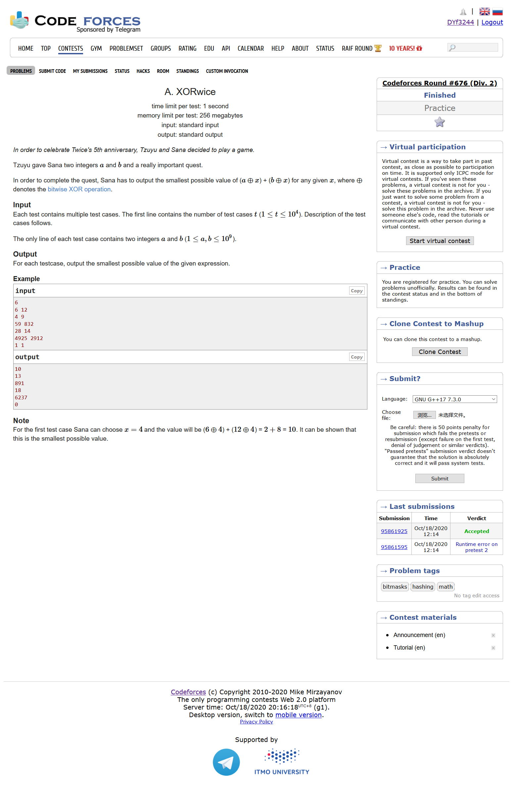
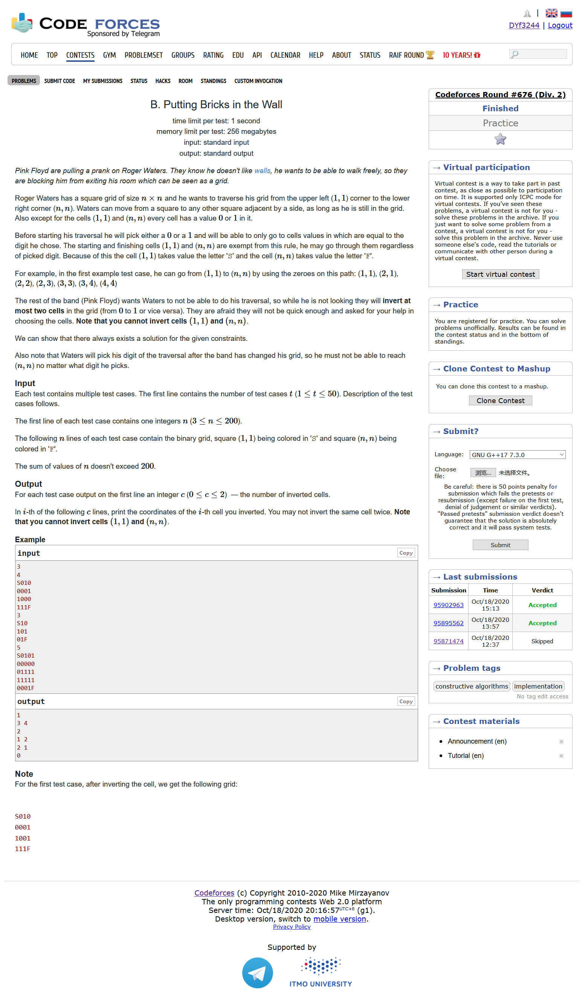
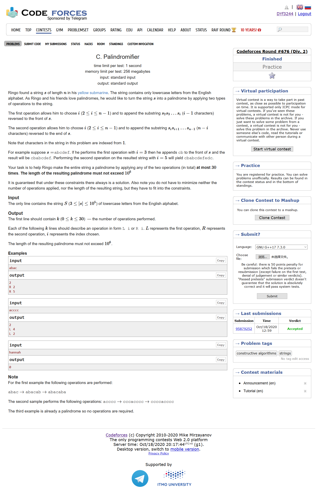
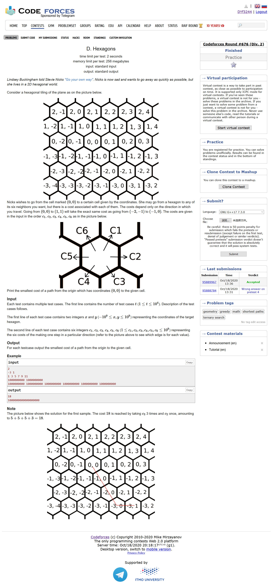
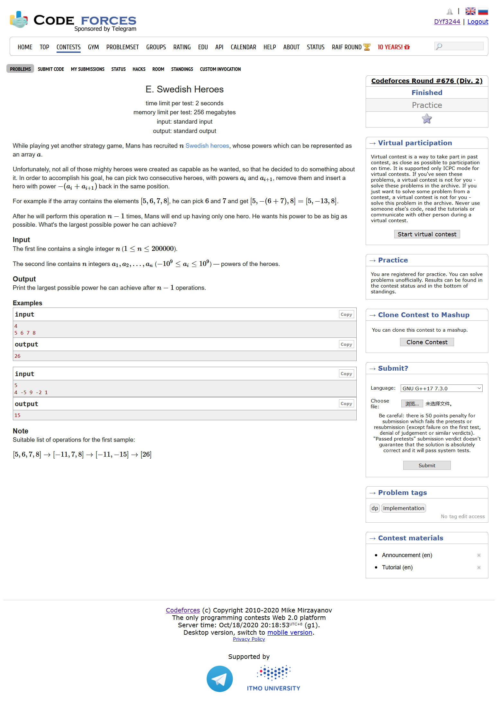

# Codeforces Round #676 (Div. 2)

[官方题解](https://codeforces.ml/blog/entry/83761)

## [A. XORwice](https://codeforces.ml/contest/1421/problem/A)



- 模拟
- 我们考虑一下两个数字每个二进制位，如果两个数在某个位上相同，那么x在这个位置上的数也应该和他们相同；如果两个数在这个位置上的数字不同，那么x不管取什么值，最后的结果都是1
- 化简一下，直接就是两个数的异或即可

```cpp
#include <bits/stdc++.h>
using namespace std;
#define LL long long
#define sigma_size 30
#define max_size (int)(1e6+10)
#define MAX (int)(1e5+7)


int ans[10005];
int main ()
{
	ios::sync_with_stdio(0);
	int T ; cin >> T;
	for ( int cas = 1 ; cas <= T ; cas++ )
	{
		int a , b ;
		cin >> a >> b;
		int x = 0 ;
		int i = 0;
		ans[cas] = a^b;
		
	}
	for ( int i = 1 ; i <= T ; i++ )
		cout << ans[i] << endl;
}
```

## [B. Putting Bricks in the Wall](https://codeforces.ml/contest/1421/problem/B)



- 模拟
- 第一种解决方法：考虑起点和终点边角上的数字，最后我们要使得起点和终点两个数字分别相等并且起点不等于终点，可以证明这样最多改变两个位置
- 第二种解决方法：只考虑最左上角除了起点的5个数字(第2层为2个，第3层为3个)，我们最后要么第二层是00第三层是111，或者是第二层是11，第三层是000

```cpp
#include <bits/stdc++.h>
using namespace std;
#define LL long long
#define sigma_size 30
#define max_size (int)(3e5+10)
#define MAX (int)(1e5+7)

int n;
char mp[205][205];
vector <pair <int,int> >ans[55];
int main ()
{
	ios::sync_with_stdio(0);
	int T ; cin  >> T;
	for ( int cas = 1 ; cas <= T ; cas++ )
	{
		cin >> n;
		for ( int i = 1 ; i <= n ; i++ )
			cin >> mp[i]+1;
		if ( mp[1][2] == mp[2][1] )
		{
			if ( mp[n][n-1] == mp[n-1][n] )
			{
				if ( mp[1][2] == mp[n-1][n] )
				{
					ans[cas].push_back({1,2});
					ans[cas].push_back({2,1});
				}
			}
			else
			{
				if ( mp[n][n-1] == mp[1][2] )
					ans[cas].push_back({n,n-1});
				if ( mp[n-1][n] == mp[1][2] )
					ans[cas].push_back({n-1,n});
			}
		}
		else 
		{
			if ( mp[n-1][n] == mp[n][n-1] )
			{
				if ( mp[1][2] == mp[n-1][n] )
					ans[cas].push_back({1,2});
				if ( mp[2][1] == mp[n-1][n] )
					ans[cas].push_back({2,1});
			}
			else
			{
				if ( mp[1][2] == '0' ) ans[cas].push_back({1,2});
				if ( mp[2][1] == '0' ) ans[cas].push_back({2,1});
				if ( mp[n-1][n] == '1' ) ans[cas].push_back({n-1,n});
				if ( mp[n][n-1] == '1' ) ans[cas].push_back({n,n-1});
			}
			
		}
	}
	for ( int i = 1 ; i <= T ; i++ )
	{
		cout << ans[i].size() << endl;
		for ( int j = 0 ; j < ans[i].size() ; j++ )
			cout << ans[i][j].first << " " << ans[i][j].second << endl;
	}
}
```

## [C. Palindromifier](https://codeforces.ml/contest/1421/problem/C)



- 思维
- 我们可以假设最开始的字符串是$a_1a_2...a_n$,那么我们就可以构造出$a_1a_2...a_na_{n-1}a_{n-2}...a_2$，接着是$a_1a_2...a_na_{n-1}a_{n-2}...a_2a_3$,然后我们再以$a_1$为对称轴，构造出$a_2a_3...a_na_{n-1}...a_2a_1a_2...a_na_{n-1}...a_2a_3$,再把$a_3$放到最前就好了

```cpp
#include <bits/stdc++.h>
using namespace std;
#define LL long long
#define sigma_size 30
#define max_size (int)(2e5+10)
#define MAX (int)(1e5+7)

string s;
vector <pair<char,int> > ans;
int main ()
{
    ios::sync_with_stdio(0);
    cin >> s;
    int n = s.length();
    ans.push_back({'R',2});
    n += n-2;
    ans.push_back({'R',n-1});
    n++;
    ans.push_back({'L',n-1});
    ans.push_back({'L',2});
    cout << ans.size() << endl;
    for ( int i = 0 ; i < ans.size() ; i++ )
        cout << ans[i].first << " " << ans[i].second << endl;
}
```

## [D. Hexagons](https://codeforces.ml/contest/1421/problem/D)



- 贪心
- 由数据范围我们可以知道不是dp，而应该是先疯狂地往某个方向走，再往另外一个方向走
- 假设我们现在位于(x,y),那么从c1到c6位置的变化应该是

|c[i]|x变化|y变化|
|----|----|----|
|1|x+1|y+1|
|2|x|y+1|
|3|x-1|y|
|4|x-1|y-1|
|5|x|y-1|
|6|x+1|y|

- 我们分别枚举先对其x还是先对其y，以及枚举对齐变量的方式，我们贪心地算出每个方案的代价即可

```cpp
#include <bits/stdc++.h>
using namespace std;
#define LL long long
#define sigma_size 30
#define max_size (int)(1e5+10)
#define MAX (int)(1e5+7)

LL tx , ty;
LL c[7];
LL ans[10005];
LL res;
int main ()
{
    ios::sync_with_stdio(0);
    int T ; cin >> T;
    for ( int cas = 1 ; cas <= T ; cas++ )
    {
        cin >> tx >> ty;
        for ( int i = 1 ; i <= 6 ; i++ ) cin >> c[i];
        res = ( 1ll << 63 - 1);
        LL sum = 0;
        
        if ( tx >= 0 )
        {
            LL dx = tx , dy = dx;
            sum += c[1]*dx;
            if ( dy >= ty )
                sum += (dy-ty)*c[5];
            else sum += (ty-dy)*c[2];
            res = min ( sum , res );
            sum = 0 ;
            sum += c[6]*dx;
            if ( ty >= 0 ) sum += ty*c[2];
            else sum += (-ty)*c[5];
            res = min ( res , sum );
        }
        else 
        {
            LL dx = tx , dy = dx;
            sum = 0 ;
            sum += c[4]*(-dx);
            if ( dy >= ty ) sum += (dy-ty)*c[5];
            else sum += (ty-dy)*c[2];
            res = min ( sum , res );
            sum = 0 ;
            sum += c[3]*(-tx);
            if ( ty >= 0 ) sum += ty*c[2];
            else sum += (-ty)*c[5];
            res = min ( res , sum );
        }
        if ( ty >= 0 )
        {
            sum = 0 ;
            sum += c[2]*ty;
            if ( tx >= 0 ) sum += tx*c[6];
            else sum += (-tx)*c[3];
            res = min ( res , sum );
            sum = 0 ;
            LL dy = ty , dx = dy;
            sum += c[1]*dy;
            if ( dx >= tx ) sum += (dx-tx)*c[3];
            else sum += (tx-dx)*c[6];
            res = min ( res , sum );
        }
        else
        {
            sum = 0 ;
            sum += c[5]*(-ty);
            if ( tx >= 0 ) sum += tx*c[6];
            else sum += (-tx)*c[3];
            res = min ( res , sum );
            sum = 0 ;
            LL dy = ty , dx = dy;
            sum += c[4]*(-dy);
            if ( dx >= tx ) sum += (dx-tx)*c[3];
            else sum += (tx-dx)*c[6];
            res = min ( res , sum );
        }
        

        ans[cas] = res;
    }
    for ( int i = 1 ; i <= T ; i++ )
        cout  << ans[i] << endl;
}
```

## [E. Swedish Heroes](https://codeforces.ml/contest/1421/problem/E)



```cpp
#include <bits/stdc++.h>
using namespace std;
#define LL long long
#define sigma_size 30
#define max_size (int)(2e5 + 10)
#define MAX (int)(1e5+7)

int n ; 
pair<LL,int> a[max_size];
LL sum , res = -(1ll<<63-1);
int k;

int main ()
{
    ios::sync_with_stdio(0);
    cin >> n;
    for ( int i = 1 ; i <= n ; i++ ) 
        cin >> a[i].first , a[i].second = i , sum += a[i].first;
    if ( n == 1 ) {
        cout << a[1].first << endl;
    }
    else if ( n == 2 ) {
        cout << -(a[1].first+a[2].first) << endl;
    }
    else if ( n == 3 ) {
        res = a[1].first+a[2].first - a[3].first;
        res = max ( res , -a[1].first + (a[2].first+a[3].first ) );
        cout << res << endl;
    }
    else
    {
        sort ( a+1 , a+1+n );
        k = n / 2 ;
        if ( n % 3 == 1 )
            res = max ( res , sum );
        for ( int i = 1 ; i <= n ; i++ )
        {
            sum -= a[i].first*2;
            if ( a[i].second % 2 == 0 )
                k--;
            if ( (n+i) % 3 == 1 )
            {
                if ( ( k == 0 && i == n/2) || ( k == n/2 && i == (n+1)/2 ) )
                {
                    sum += a[i].first*2;
                    sum -= a[i+1].first*2;
                    res = max ( res , sum );
                    sum += a[i+1].first*2;
                    sum -= a[i].first*2;
                }    
                else res = max ( res , sum );
            }
        }
        cout << res << endl;
    }
}
```