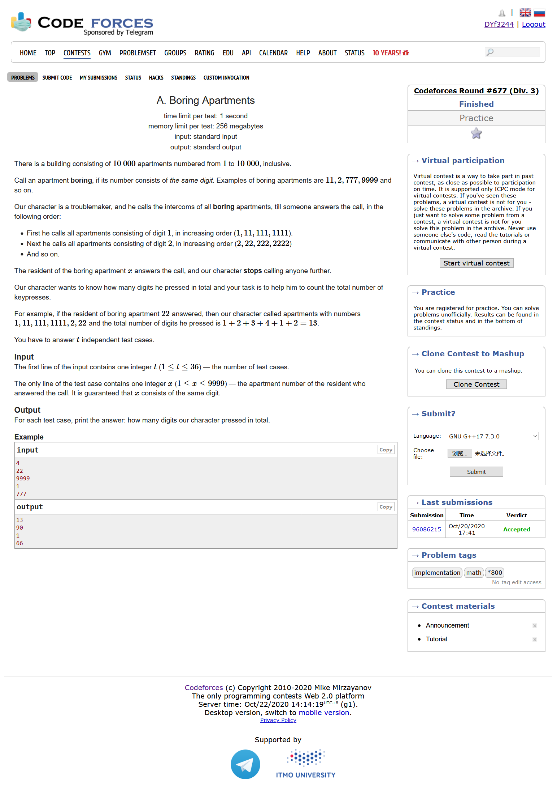
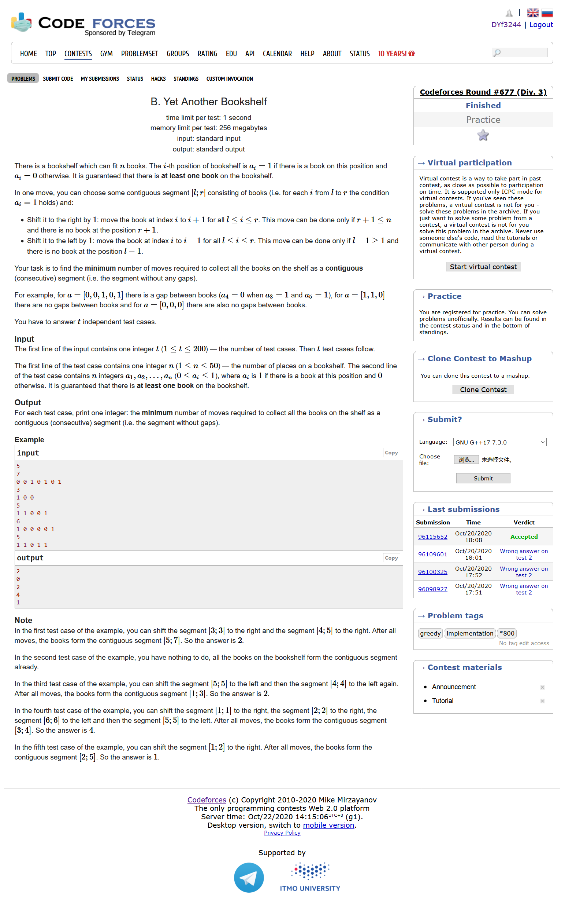
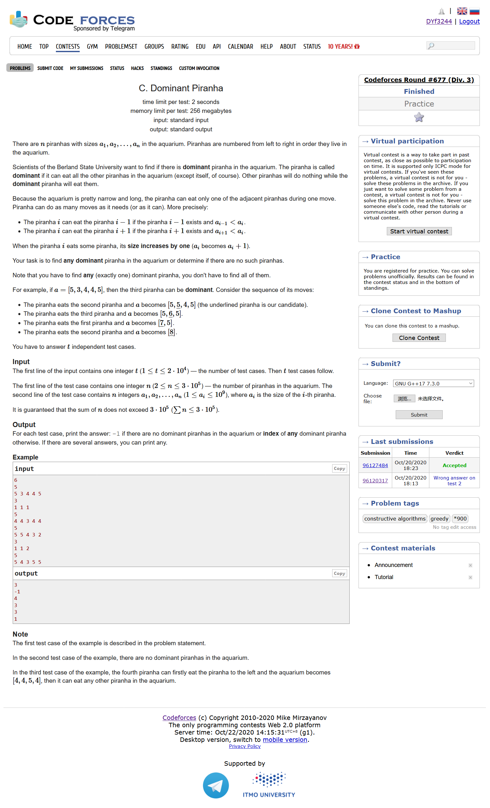
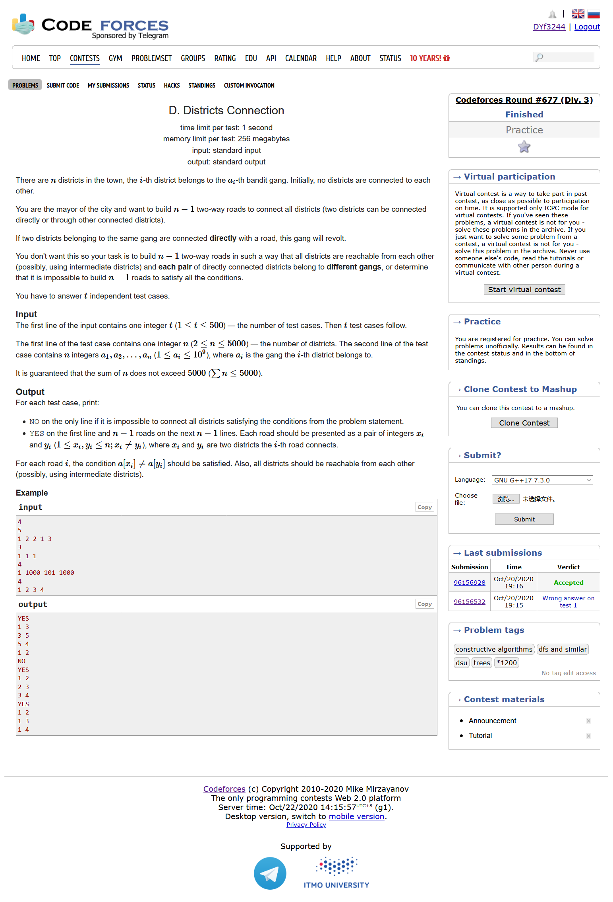
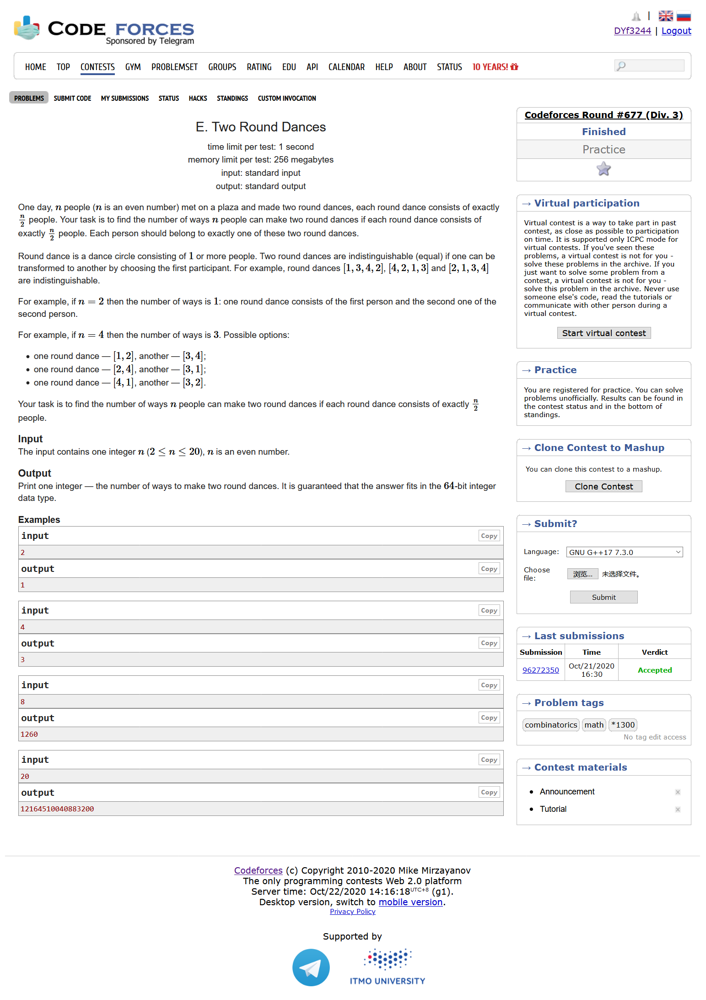
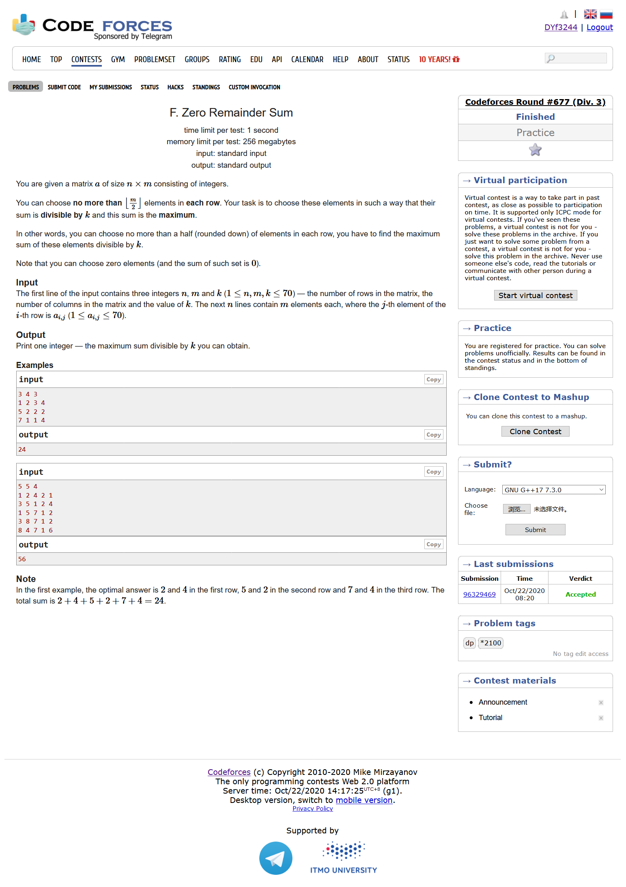
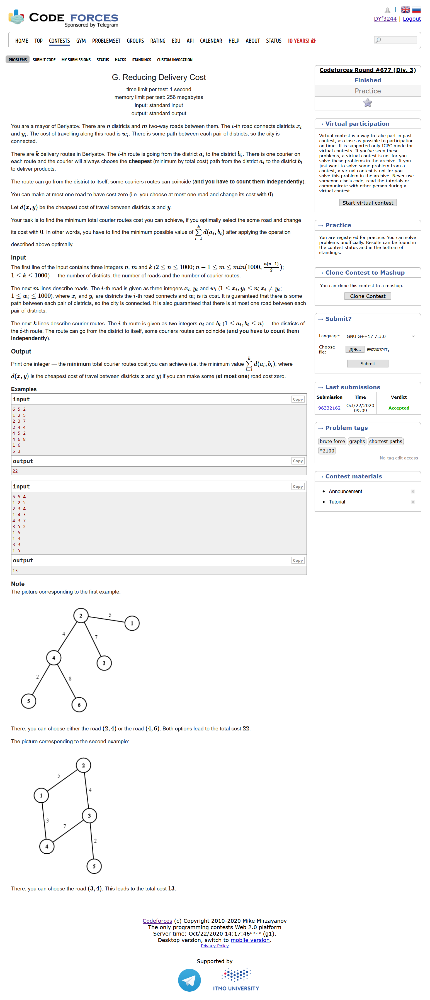

# Codeforces Round #677 (Div. 3)

[官方题解](https://codeforces.ml/blog/entry/83903)

## [A. Boring Apartments](https://codeforces.ml/contest/1433/problem/A)



- 模拟
- 先算出这个数的最高位，那么这个数的最高位-1的任何情况就都能满足，同时这个最高位也决定了余数的个数

```cpp
#include <bits/stdc++.h>
using namespace std;
#define LL long long
#define sigma_size 30
#define max_size (int)(1e6+10)
#define MAX (int)(1e5+7)


int ans[40];
int main ()
{
	ios::sync_with_stdio(0);
	int T  ; cin >> T;
	for ( int cas = 1 ; cas <= T ; cas++ )
	{
		int x ; cin >> x;
		int dights = 0 ;
		int max_dights ;
		while ( x )
		{
			if ( x < 10 ) max_dights = x;
			x /= 10;
			dights++;
		}
		int res = (max_dights-1)*10;
		for ( int i = 1 ; i <= dights ; i++ )
			res += i;
		ans[cas] = res;
	}
	for ( int i = 1 ; i <= T ; i++ )
		cout << ans[i] << endl;
}
```

## [B. Yet Another Bookshelf](https://codeforces.ml/contest/1433/problem/B)



- 贪心
- 双手一合，所有书归位即可

```cpp
#include <bits/stdc++.h>
using namespace std;
#define LL long long
#define sigma_size 30
#define max_size (int)(3e5+10)
#define MAX (int)(1e5+7)

int ans[205];

int main ()
{
	ios::sync_with_stdio(0);
	int T ; cin >> T;
	for ( int cas = 1 ; cas <= T ; cas++ )
	{
		int n ; cin >> n;
		int a[55];
		for ( int i = 1 ; i <= n ; i++ ) cin >> a[i];
		int cnt = 0;
		int first = -1 , last = -1;
		for ( int i = 1 ; i <= n ; i++ ) 
			if ( a[i] )
			{ 
				cnt++ ;
				last = i ;
			}
		for ( int i = n ; i >= 1 ; i-- ) if ( a[i] ) first = i;
		ans[cas] = last - first - 1 - cnt + 2;
	}
	for ( int i = 1 ; i <= T ; i++ )
		cout << ans[i] << endl;
}
```

## [C. Dominant Piranha](https://codeforces.ml/contest/1433/problem/C)



- 模拟
- 只有全部的数字都相等才是不符合条件的。
- 在符合条件的数字当中，我们只需要找到这个数字的最大值，并且这个最大值左右至少能够吃掉一个，就能符合条件

```cpp
#include <bits/stdc++.h>
using namespace std;
#define LL long long
#define sigma_size 30
#define max_size (int)(3e5+10)
#define MAX (int)(1e5+7)

int ans[max_size];
int a[max_size];
int main ()
{
    ios::sync_with_stdio(0);
    int T ; cin >> T;
    for ( int cas = 1 ; cas <= T ; cas++ )
    {
        int n ; cin >> n;
        for ( int i = 1 ;  i <= n ; i++ ) cin >> a[i];
        bool flag = 1;
        int cur = a[1];
        for ( int i = 2 ; i <= n ; i++ )
            if ( a[i] != cur )
            {
                flag = 0;
                break;
            }   
        if ( flag ) { ans[cas] = -1 ;}
        else
        {
            int maxx = 0 ;
            int res = -1;
            for ( int i = 1 ; i <= n ; i++ )
                maxx = max ( maxx , a[i] );
            for ( int i = 1 ; i <= n ; i++ )
            {
                if ( a[i] != maxx ) continue;
                if ( (i > 1 && a[i] > a[i-1]) || ( i < n && a[i] > a[i+1]) )
                {
                    res = i;
                    break;
                }
            }
            ans[cas] = res;
        }
    }
    for ( int i =1  ; i <= T ; i++ )
        cout << ans[i] << endl;
}
```

## [D. Districts Connection](https://codeforces.ml/contest/1433/problem/D)



- 模拟
- 只有所有的数字都相等的时候才输出NO
- 先对所有的数字按照值进行排序，然后我们让最小的值去连接所有与它不一样的值。然后再让最后一个值去连接这个最小值的其他数字即可

```cpp
#include <bits/stdc++.h>
using namespace std;
#define LL long long
#define sigma_size 30
#define max_size (int)(1e5+10)
#define MAX (int)(1e5+7)

int main ()
{
    ios::sync_with_stdio(0);
    int T ; cin >> T;
    while (T--)
    {
        int n ; cin >> n;
        pair <int,int> a[5005];
        for ( int i = 1 ; i <= n ; i++ ) cin >> a[i].first , a[i].second = i;
        sort ( a+1 , a+1+n );
        if ( a[1].first == a[n].first )
        {
            cout << "NO" << endl;
        }
        else
        {
            cout << "YES" << endl;
            int cur = a[1].first;
            int i = 2;
            while ( i <= n && a[i].first == cur ) i++;
            int j = i;
            while ( j <= n )
            {
                cout << a[1].second << " " << a[j].second << endl;
                j++;
            }
            int k = 2 ;
            while ( k < i )
            {
                cout << a[n].second << " " << a[k].second << endl;
                k++;
            }
        }
        
    }
}
```

## [E. Two Round Dances](https://codeforces.ml/contest/1433/problem/E)



- 公式$\frac{n!}{(n/2)^2*2}$

```cpp
#include <bits/stdc++.h>
using namespace std;
#define LL long long
#define sigma_size 30
#define max_size (int)(2e5 + 10)
#define MAX (int)(1e5+7)

LL fac[25];
LL two[25];
void get_fac() {
    fac[0] = fac[1] = 1;
    for ( int i = 2 ; i <= 22 ; i++ )
        fac[i] = fac[i-1] * i;
    two[0] = 1;
    for ( int i = 1 ; i <= 22 ; i++ )
        two[i] = two[i-1] * 2 ;
}

int main ()
{
    get_fac();
    int n ; cin >> n;
    cout << fac[n] / ((n/2)*(n/2)*2) << endl;
}
```

## [F. Zero Remainder Sum ](https://codeforces.ml/contest/1433/problem/F)



- dp
- 我们设dp[i][j][cnt][rem]表示我们访问到了a[i][j]这个数字，并且第i行已经取了cnt个数的情况下，余数为rem的和，因此我们可以有状态转移方程：

$$
dp[i][j+1][cnt][rem] = max ( dp[i][j+1][cnt][rem] , dp[i][j][cnt][rem] ) 不取当前数字的情况 \\
dp[i][j+1][cnt+1][(rem+a[i][j])\% k] = max ( dp[i][j+1][cnt+1][(rem+a[i][j])\% k] , dp[i][j][cnt][rem] + a[i][j] ) 取当前数字的情况
$$
注意一点的是，如果j已经在边缘了，注意往下一行进行转移

```cpp
#include <bits/stdc++.h>
using namespace std;
#define LL long long
#define ULL unsigned long long
#define sigma_size 30
#define max_size (int)(5e5+10)
#define MAX_SIZE (int)(4e6+7)

int n , m , k;
int a[75][75];

int dp[80][80][80][80];

int main ()
{
	ios::sync_with_stdio(0);
	cin >> n >> m >> k;
	for ( int i = 1 ; i <= n ; i++ )
		for ( int j = 1 ; j <= m ; j++ )
			cin >> a[i][j];
	for ( int i = 0 ; i <= n+5 ; i++ ) 	
		for ( int j = 0 ; j <= m+5 ; j++ )
			for ( int cnt = 0 ; cnt <= m ; cnt++ )
				for ( int rem = 0 ; rem <= k ; rem++ )
					dp[i][j][cnt][rem] = - ( 1 << 30 );
	dp[1][1][0][0] = 0 ;
	for ( int i = 1 ; i <= n ; i++ )
		for ( int j = 1 ; j <= m ; j++ )
			for ( int cnt = 0 ; cnt <= m/2 ; cnt++ )
				for ( int rem = 0 ; rem < k ; rem++ )
				{
					if ( dp[i][j][cnt][rem] == - ( 1 << 30) ) continue;
					if ( j < m )
					{
						dp[i][j+1][cnt][rem] = max ( dp[i][j+1][cnt][rem] , dp[i][j][cnt][rem] );
						if ( cnt < m/2 )
							dp[i][j+1][cnt+1][(rem+a[i][j])%k] = max ( dp[i][j+1][cnt+1][(rem+a[i][j])%k] , dp[i][j][cnt][rem] + a[i][j] );
					}
					else
					{
						dp[i+1][1][0][rem] = max ( dp[i+1][1][0][rem] , dp[i][j][cnt][rem] );
						if ( cnt < m/2 )
							dp[i+1][1][0][(rem+a[i][j])%k] = max (dp[i+1][1][0][(rem+a[i][j])%k],dp[i][j][cnt][rem]+a[i][j]);
					}
				}
	cout << max ( 0 , dp[n+1][1][0][0] ) << endl;
}
```

## [G. Reducing Delivery Cost](https://codeforces.ml/contest/1433/problem/G)



- 枚举，Floyd
- 我们先用Floyd函数求出图上任意两个点之间的最短路径，接着我们尝试去删除每一条边的cost，看看删除之后值的变化情况

```cpp
#include <bits/stdc++.h>
using namespace std;
#define LL long long
#define sigma_size 30
#define max_size (int)(1e6+10)
#define _DEBUG1 freopen("input.txt", "r", stdin);freopen("output.txt", "w", stdout);
#define _DEBUG2 fclose("input.txt");fclose("output.txt");

int n , m , k;
int dp[1005][1005];
struct Edge {
	int u , v , w;
};
vector <Edge> edges;
int a[1005] , b[1005];
int main ()
{
	ios::sync_with_stdio(0);
	cin >> n >> m >> k;
	for ( int i = 1 ; i <= n ; i++ )
		for ( int j = 1 ; j <= n ; j++ )
		{	
			if ( i != j )
				dp[i][j] = 1 << 28;
			else dp[i][j] = 0;
		}
	for ( int i = 1 ; i <= m ; i++ )
	{
		int x , y , w;
		cin >> x >> y >> w;
		edges.push_back({x,y,w});
		dp[x][y] = dp[y][x] = w;
	}
	for ( int i = 1 ; i <= k ; i++ )
		cin >> a[i] >> b[i];
	for ( int k = 1 ; k <= n ; k++ )
	for ( int i = 1 ; i <= n ; i++ )
	for ( int j = 1 ; j <= n ; j++ )
		dp[i][j] = min ( dp[i][j] , dp[i][k] + dp[k][j] );
	int minx = INT_MAX;
	for ( int w = 0 ; w < edges.size() ; w++ )
	{
		int x = edges[w].u , y = edges[w].v;
		int sum = 0 ;
		for ( int i = 1 ; i <= k ; i++ )
			sum += min ( dp[a[i]][b[i]] , min ( dp[a[i]][x] + dp[y][b[i]] , dp[a[i]][y] + dp[x][b[i]] ) ) ;
		minx = min ( minx , sum );
	}
	cout << minx << endl;
}
```