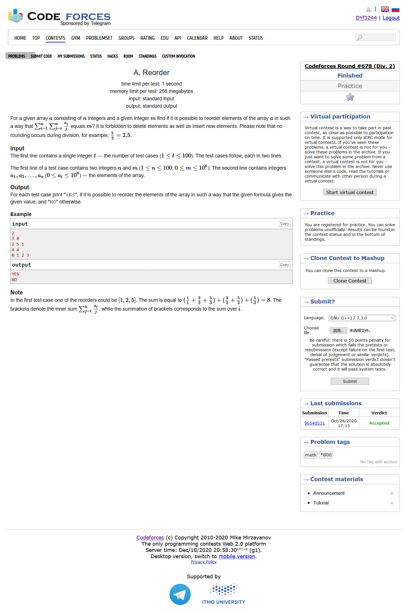
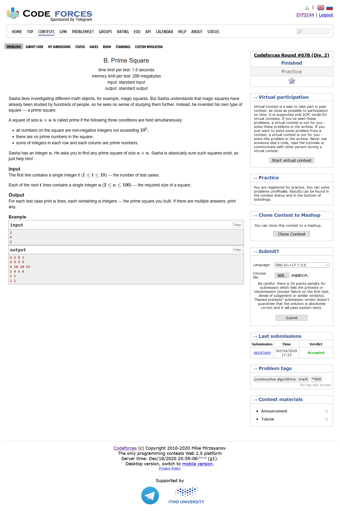
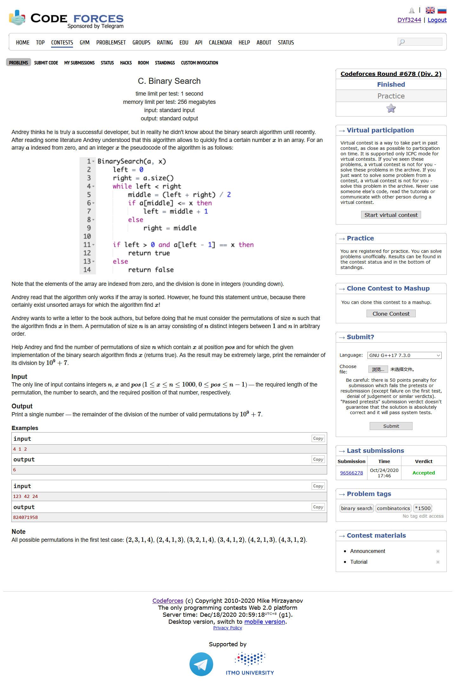
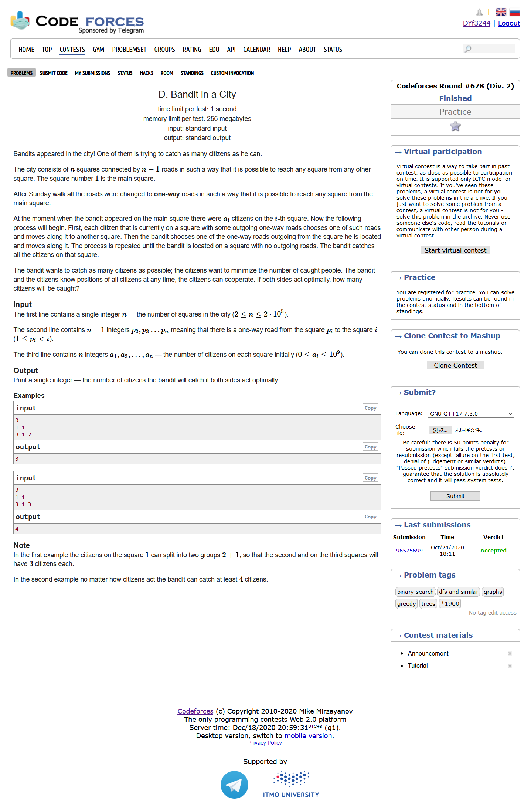
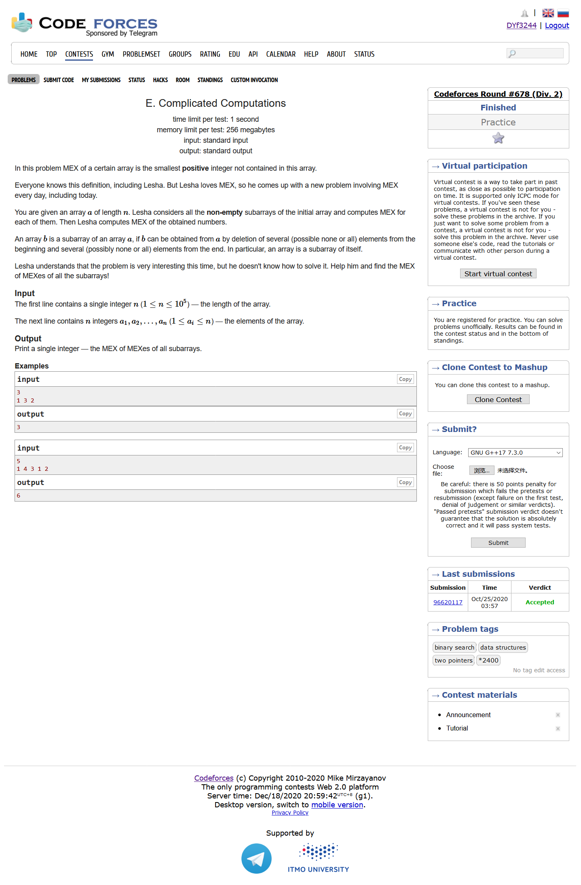

# Codeforces Round #678 (Div. 2)

[官方题解](https://codeforces.ml/blog/entry/84024)

## [A. Reorder](https://codeforces.ml/contest/1436/problem/A)



- 思维题
- 题目大意：给定一个数列，你可以按照将他们按照任意的顺序排序，最后使得$\sum_{i=1}^n\sum_{j=i}^n\frac{a[j]}{j} = m$
- 乍一看很吓人，但其实模拟一下就会发现，位置为3的一个数会被计算3次，位置为i的一个数会被计算i次，所以我们只需要判断一下整个数列的总和是否等于m即可

```cpp
#include <bits/stdc++.h>
using namespace std;
#define LL long long
#define sigma_size 30
#define max_size (int)(1e4+10)
#define MAX (int)(1e5+7)


bool ans[105];
int main ()
{
	ios::sync_with_stdio(0);
	int T ; cin >> T;
	for ( int cas = 1 ; cas <= T ; cas++ )
	{
		int n  , m;
		cin >> n >> m;
		int sum  = 0 ;
		for ( int i = 1 ; i <= n ; i++ )
		{
			int x ; cin >> x;
			sum += x;
		}
		if ( sum == m ) ans[cas] = 1;
		else ans[cas] =  0;
	}
	for ( int i = 1 ; i <= T ; i++ )
		if ( ans[i] ) cout << "YES" << endl;
		else cout << "NO" << endl;
}
```

## [B. Prime Square](https://codeforces.ml/contest/1436/problem/B)



- 构造题
- 题目大意：给定一个n，要求构造一个$n*n$的方阵，使得方阵上的每个数字都是非负整数，并且都不是质数，最后要求每一行每一列的和都是质数
- 我们首先应该想到要用最赖皮的1和0，因为他们构造质数是最方便的。我们试图构造2和3两个质数，即我们的矩阵形式可以长这样：
  
$$
\begin{matrix}
    1 & 1 & 0 & 0 & ...\\
    1 & 1 & 0 & 0 & ...\\
    0 & 0 & 1 & 1 & ...\\
    0 & 0 & 1 & 1 & ...\\
    ... & ... & ... & ... \\
\end{matrix}
$$

```cpp
#include <bits/stdc++.h>
using namespace std;
#define LL long long
#define sigma_size 30
#define max_size (int)(1e5+10)
#define MAX (int)(1e5+7)

int main ()
{
	ios::sync_with_stdio(0);
	int T ; cin >> T;
	while (T--)
	{
		int n ; cin >> n;
		int a[105][105];
		memset ( a , 0 , sizeof(a) );
		
			for ( int i = 1 ; i <= n ; i+=2 )
			{
				a[i][i] = 1;
				a[i][i+1] = 1;
				a[i+1][i] = 1;
				a[i+1][i+1] = 1;
			}
		if ( n % 2 )
		{
			a[1][n] = a[n][1] = 1;
		}
		for ( int i = 1 ; i <= n ; i++ )
			for ( int j = 1 ; j <= n ; j++ )
			{
				cout << a[i][j] ;
				if ( j < n ) cout << " ";
				else cout << endl;
			}
	}
}
```

## [C. Binary Search](https://codeforces.ml/contest/1436/problem/C)



- 排列组合
- 题目大意：给定一个数列的长度n，需要通过二分查找的数字x，以及告诉你x的位置pos，要求有多少个数列可以使得根据题目中的二分函数来找到x
- 整个题目的要求对于我们可以找到的数列的限制就是中途我们每次二分出来的mid值，要求$a[mid]$的值必须满足我们的数字大小条件，比如如果当前mid > pos ,我们就必须有$a[mid]>x$。根据这些限制条件，我们设small表示必须拿出small个比x小的数字，big表示必须拿出比x大的数字，剩下的数字我们随便排列一下就好，同时，我们拿出来的数字也应该排列组合一下,最后的结果为:

$$
\left( \begin{matrix} 
    x-1 \\ 
    small \\
\end{matrix} \right)
small!*
\left( 
    \begin{matrix} 
        n-x \\ 
        big \\
    \end{matrix} 
\right)
big! * 
(n-small-big-1) !
$$


```cpp
#include <bits/stdc++.h>
using namespace std;
#define LL long long
#define sigma_size 30
#define max_size (int)(3e5+10)
#define MAX (int)(1e5+7)

const LL mod = 1e9 + 7;
int n , x , pos;

LL fac[1005];
LL inv[1005];
LL quick_pow ( LL n , LL k ) {
    LL res = 1;
    while (k)
    {
        if ( k & 1 )  res = res * n % mod;
        n = n * n % mod;
        k >>= 1;
    }
    return res;
}
void get_fac() {
    fac[0] = fac[1] = 1;
    for ( int i = 2 ; i <= 1000 ; i++ )
        fac[i] = fac[i-1] * i % mod;
    inv[1000] = quick_pow(fac[1000],mod-2);
    for ( int i = 999 ; i >= 0 ; i-- )
        inv[i] = inv[i+1] * (i+1) % mod;
}
LL C ( LL n , LL k ) {
    if ( k > n ) return 0;
    return fac[n] * inv[k] % mod * inv[n-k] % mod;
}
int main () 
{
    get_fac();
    cin >> n >> x >> pos;
    int small = 0 , big = 0 ;
    int left = 0 , right = n;
    while ( left < right ) 
    {
        int mid = left + right >> 1;
        if ( mid <= pos )
        {    
            left = mid+1 ;
            if ( mid < pos )
                small++;
        }
        else right = mid , big++;
    }
    LL s = C (x-1,small) * fac[small] % mod;
    LL b = C (n-x , big) * fac[big] % mod;
    LL res = s * b % mod * fac[n-small-big-1] % mod;
    cout << res << endl;
}
```

## [D. Bandit in a City](https://codeforces.ml/contest/1436/problem/D)



- DFS
- 题目大意：给你一棵树，树只能从顶点走向分枝。一开始的时候树的每个结点有若干个市民，市民可以从树走向任意一个子节点，走到叶子结点为止。市民之间可以通力合作，使得最后市民数量最多的叶子结点最少
- 我们单独地考虑一下某个结点u，它的儿子有v1,v2,v3,v4，首先我们考虑一下是不是有某个儿子特别大，使得u的市民不管怎么合理分配都不能超过这个儿子；如果没有的话，那么这个根节点以及它的子节点最后的最大值就应该是$\frac{u+\sum_{i=1}^4\limits{v_i}}{leaf[u]}$
- 每个结点u拥有两个属性，maxx以及sum，maxx代表当这个u为根节点的时候所获得的最大值是多少，sum表示这个根节点以及子节点的总和
- 我们逐层递归回去，最后我们要求的就是结点1的maxx

```cpp
#include <bits/stdc++.h>
using namespace std;
#define LL long long
#define sigma_size 30
#define max_size (int)(2e5+10)
#define MAX (int)(1e5+7)

int n ;
LL a[max_size];
vector <int> G[max_size];
struct node {
    int leaf;
    LL maxx;
    LL sum;
}Node[max_size];
void dfs ( int u ) 
{
    if ( G[u].empty() )
    {
        Node[u].leaf = 1;
        Node[u].maxx = Node[u].sum = a[u];
        return ;
    }
    Node[u].sum = a[u];
    for ( int i = 0 ; i < G[u].size() ; i++ )
    {
        int v = G[u][i];
        dfs(v);
        Node[u].leaf += Node[v].leaf;
        Node[u].maxx = max ( Node[u].maxx , Node[v].maxx );
        Node[u].sum += Node[v].sum;
    }
    Node[u].maxx = max ( Node[u].maxx , Node[u].sum / Node[u].leaf + (Node[u].sum % Node[u].leaf ? 1 : 0) );
}
int main ()
{
    ios::sync_with_stdio(0);
    cin >> n;
    for ( int i = 2 ; i <= n ; i++ )
    {
        int x ; cin >> x;
        G[x].push_back(i);
    }
    for ( int i = 1 ; i <= n ; i++ ) cin >> a[i];
    dfs(1);
    cout << Node[1].maxx << endl;
}
```

## [E. Complicated Computations](https://codeforces.ml/contest/1436/problem/E)



- 题目大意：
- 树状数组
- 

```cpp
#include <bits/stdc++.h>
using namespace std;
#define LL long long
#define sigma_size 30
#define max_size (int)(1e5 + 10)
#define MAX (int)(1e5+7)

int n ; 
int a[max_size];
int c[max_size];
int lowbit ( int x ) {
    return x & (-x);
}
void add ( int x , int k ) {
    while ( x < n+5 ) {
        c[x] = max ( c[x] , k ) ;
        x += lowbit(x);
    }
}
int qry ( int x ) {
    int res = 0 ;
    while (x) {
        res = max ( res , c[x] );
        x -= lowbit(x);
    }
    return res;
}
vector <int> G[max_size];

int main ()
{
    ios::sync_with_stdio(0);
    cin >> n;
    for ( int i = 1 ; i <= n ; i++ ) cin >> a[i];
    for ( int i = 1 ; i <= n+1 ; i++ ) G[i].push_back(0);
    for ( int i = 1 ; i <= n ; i++ ) G[a[i]].push_back(i);
    for ( int i = 1 ; i <= n+1 ; i++ ) G[i].push_back(n+1);
    int ans = 1;
    for ( int i = 1 ; i <= n+1 ; i++ )
    {
        int flag = 0 ;
        if ( G[i].size() == n+2 ) { ans = i ; break; }
        for ( int j = 1 ; j < G[i].size() ; j++ )
        {
            int f = qry ( G[i][j-1] + 1 );
            if ( f < G[i][j] ) flag = 1;
        }
        if ( !flag ) break;
        for ( int j = 1 ; j < G[i].size() ; j++ )
        {
            int f = G[i][j-1] + 1;
            add(f , G[i][j] );
        }
        ans = i+1;
    }
    cout << ans << endl;
}
```

## F. Sum Over Subsets