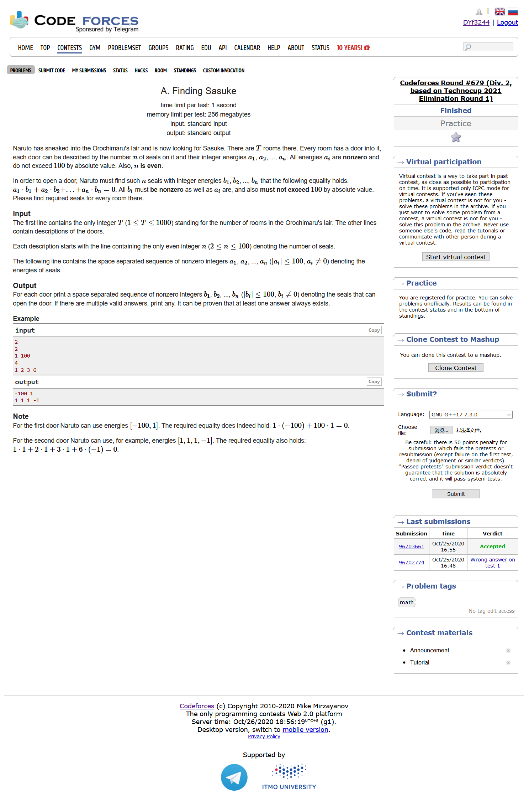
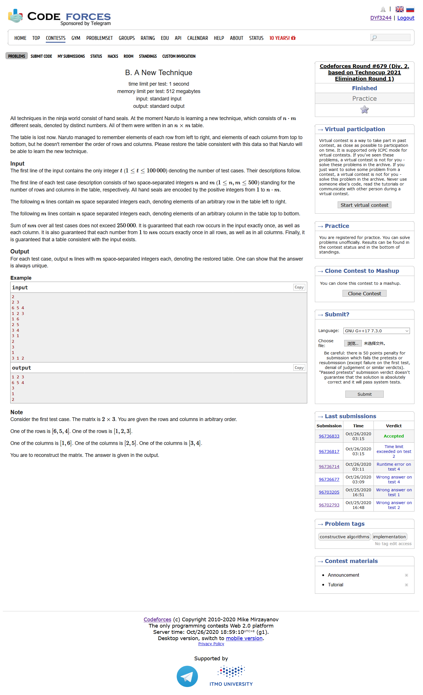
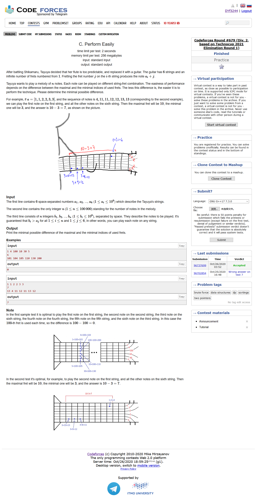
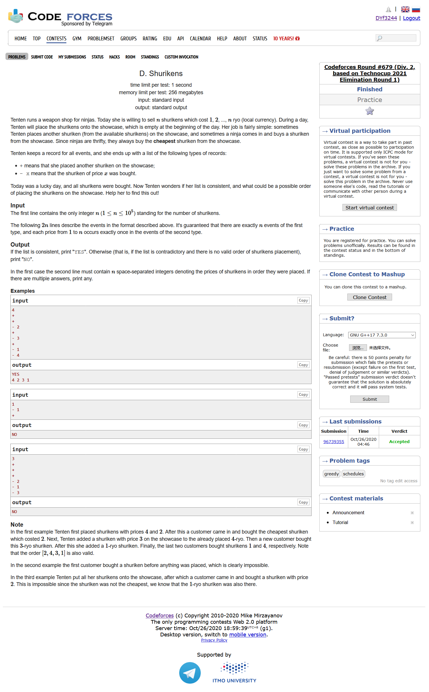

# Codeforces Round #679 (Div. 2)

[官方题解](https://codeforces.ml/blog/entry/84056)

## [A. Finding Sasuke](https://codeforces.ml/contest/1435/problem/A)



- 签到
- 题目大意：给定一个长度为n的数组(n为偶数)，求构造一个同等长度的非负数组b，使得$\sum_{i=1}^n\limits{a_ib_i} = 0$
- 观察一下为什么n要是偶数呢，其实我们只需要每2项乘积为0即可

```cpp
#include <bits/stdc++.h>
using namespace std;
#define LL long long
#define sigma_size 30
#define max_size (int)(1e4+10)
#define MAX (int)(1e5+7)

vector<int> ans[1005];
int main ()
{
	ios::sync_with_stdio(0);
	int T ; cin >> T;
	for ( int cas = 1 ; cas <= T ; cas++ )
	{
		int n ; cin >> n;
		int a[105];
		for ( int i = 1 ; i <= n ; i++ ) cin >> a[i];
		for ( int i = 1 ; i <= n ; i+=2 )
		{
			ans[cas].push_back(-a[i+1]);
			ans[cas].push_back(a[i]);
		}
	}
	for ( int i = 1 ; i <= T ; i++ )
	{
		for ( int j = 0 ; j < ans[i].size() ; j++ )
		{
			cout << ans[i][j];
			if ( j < ans[i].size() - 1 ) cout << " ";
			else cout << endl;
		}
	}
}
```

## [B. A New Technique](https://codeforces.ml/contest/1435/problem/B)



- 模拟
- 题目大意：给定一个n*m的矩阵，每一行代表实际矩阵每行的从左到右的元素，随后给定一个m\*n的矩阵，每一行代表实际矩阵每行的从上到下的顺序，求原来的n\*m矩阵

```cpp
#include <bits/stdc++.h>
using namespace std;
#define LL long long
#define sigma_size 30
#define max_size (int)(1e5+10)
#define MAX (int)(1e5+7)

int pos[250005];
int main ()
{
	ios::sync_with_stdio(0);
	int T ; cin >> T;
	while (T--)
	{
		int a[505][505];
		int b[505][505];
		int n , m ;
		cin >> n >> m;
		for ( int i = 1 ; i <= n ; i++ )
			for ( int j = 1 ; j <= m ; j++ )
				cin >> a[i][j];
		for ( int i = 1 ; i <= m ; i++ )
			for ( int j = 1 ; j <= n ; j++ )
				cin >> b[i][j];


		for ( int i = 1 ; i <= n ; i++ )
			pos[a[i][1]] = i;
		int posi = 1;
		while ( posi <= m )
		{
			int flag = 0 ;
			for ( int i = 1 ; i <= n ; i++ )
				if ( a[i][1] == b[posi][1] )
				{
					flag = 1;
					break;
				}
			if ( flag ) break; 
			posi++;
		}
		int ans[505][505];
		for ( int i = 1 ; i <= n ; i++ )
		{
			int j = pos[b[posi][i]];
			for ( int k = 1 ; k <= m ; k++ )
				ans[i][k] = a[j][k];
		}
		for ( int i = 1 ; i <= n ; i++ )
			for ( int j = 1 ; j <= m ; j++ )
			{
				cout << ans[i][j];
				if ( j < m ) cout << " ";
				else cout << endl;
			}
	}
}
```

## [C. Perform Easily](https://codeforces.ml/contest/1435/problem/C)



- 贪心
- 题目大意：一个吉他给定你6根弦，每根弦有相应的属性。再给你n个需要你打出来的音符，每个音符都可以由任意一根弦加上一个j得到。现在要构建一个可行的方案，使得最大的j和最小的j差距最小
- 拟定一个pair，first代表每一个b[i]-a[j]，second代表能够对应哪个音符。然后我们对于这个pair进行排序，用两个指针遍历，当若干个pair的second值覆盖了1~n的时候，我们计算一下此时的first差值。最后对所有取得的first的差值取一个最小值即可

```cpp
#include <bits/stdc++.h>
using namespace std;
#define LL long long
#define sigma_size 30
#define max_size (int)(1e5+10)
#define MAX (int)(1e5+7)

LL a[7];
int n;
LL b[max_size];
vector <pair<int,int> > v;
int Hash[max_size] , cnt;

int main ()
{
    ios::sync_with_stdio(0);
    for ( int i = 1 ; i <= 6 ; i++ ) cin >> a[i];
    cin >> n;
    for ( int i = 1 ; i <= n ; i++ ) cin >> b[i];
    for ( int i = 1 ; i <= n ; i++ )
    {
        for ( int j = 1 ; j <= 6 ; j++ )
            v.push_back( {b[i]-a[j] , i} );
    }
    sort ( v.begin() , v.end() );
    int left = 0 , right = 0 ;
    int minx = INT_MAX;
    while ( right < v.size() )
    {
        if ( cnt < n )
        {
            while ( cnt < n && right < v.size() )
            {
                if ( Hash[v[right].second] == 0 ) cnt++;
                Hash[v[right].second]++;
                right++;
            }
            if ( right == v.size() && cnt < n ) break;
            right--;
        }
        minx = min ( minx , v[right].first - v[left].first );
        while ( Hash[v[left].second] != 1 )
        {
            minx = min ( minx , v[right].first - v[left].first );
            Hash[v[left].second]--;
            left++;
        }
        minx = min ( minx , v[right].first - v[left].first );
        Hash[v[left].second]--;
        cnt--;
        left++;
        right++;
    }
    cout << minx << endl;
}
```

## [D. Shurikens](https://codeforces.ml/contest/1435/problem/D)



- 贪心，堆
- 题目大意：给2n个操作指令，'+'表示售货员往柜台上放了某件物品，'- a'表示顾客从柜台上拿走了价值为a的物品。已知顾客每次都会拿当前最便宜的物品，求售货员一种放置物品的顺序，使得能够满足顾客拿走物品的顺序。如果不存在这种顺序，则输出-1
- 如果当前拿走了一件价值为x的物品，那么说明之前所有的物品价格都是大于等于x的，我们可以假设某种极端情况：拿走一个价值为3的物品的下一步拿走了价值为2的物品，这显然是不合法的，拿走两件物品的中间事件当中必然会添加物品，这样才能接受。
- 我们知道一个物品最后放进来的时候对于整个结果的影响应该是最小的，所以我们应该尽可能的把比较小的物品最后放进来，因为如果太靠前放最小物品，就会导致很容易地取到最小值
- 假设物品的拿进拿出应该是合法的。我们不妨用一个栈来存放添加物品所在的序列号，每当需要拿走什么物品的时候，我们就把这个物品放在栈顶位置所对应的序列号当中。这样一来我们就保证了，每次拿走的都应该是最后放进来的最小值，同时我们也保证了剩下的物品都应该比拿走的物品价值大
- 最后我们用一个小根堆来判断一下我们放置物品的顺序是否合法即可

```cpp
#include <bits/stdc++.h>
using namespace std;
#define LL long long
#define sigma_size 30
#define max_size (int)(2e5+10)
#define MAX (int)(1e5+7)

int n;
char c[max_size];
int a[max_size];
int main ()
{
    ios::sync_with_stdio(0);
    cin >> n ;
    for ( int i = 1 ; i <= 2*n ; i++ )
    {
        cin >> c[i];
        if ( c[i] == '-' ) cin >> a[i];
    }
    bool flag = 1 ; 
    stack <int> st;
    for ( int i = 1 ; i <= 2*n ; i++ )
    {
        if ( c[i] == '+' ) st.push(i);
        else
        {
            if ( st.empty() ) { flag = 0 ; break; }
            a[st.top()] = a[i];
            st.pop();
        } 
    }
    if ( !st.empty() ) flag = 0 ;
    if ( !flag ) cout << "NO" << endl;
    else
    {
        set <int> S;
        for ( int i = 1 ; i <= 2*n ; i++ )
        {
            if ( c[i] == '+' ) S.insert(a[i]);
            else
            {
                if ( S.empty() || *S.begin() != a[i] ) { flag = 0 ; break ; }
                else S.erase(S.begin());
            }
        }
        if ( !flag ) cout << "NO" << endl;
        else
        {
            cout << "YES" << endl;
            for ( int i = 1 ; i <= 2*n ; i++ )
                if ( c[i] == '+' )
                    cout << a[i] << " ";
            cout << endl;
        }
    }
}
```

## [E. Solo mid Oracle](https://codeforces.ml/contest/1435/problem/E)


- 如果$a>bc$则输出-1，因为每次造成一点伤害之后还恢复不过来，慢慢的肯定生命值越来越小
- 我们需要考虑的只是$t<c$的情况，很好理解，因为随着$bc\ge a$，后面的生命值应该能够更大程度的回复。我们设我们能够造成的伤害是$a-tb$，每次$t=dk$的时候我们可能造成最大伤害，那么式子就变成$a-bdk$我们要求的就是使得$a\ge bdk$的最大的k，此时我们能够造成的最大伤害值就是：

$$
a(k+1) - \frac{k(k+1)}{2}bd
$$

```cpp
#include <bits/stdc++.h>
using namespace std;
#define LL long long
#define sigma_size 30
#define max_size (int)(1e5 + 10)
#define MAX (int)(1e5+7)

LL a , b , c , d;
LL ans[max_size];

int main ()
{
    ios::sync_with_stdio(0);
    int T ; cin >> T;
    for ( int cas = 1 ; cas <= T ; cas++ )
    {
        cin >> a >> b >> c >> d;
        if ( a > b*c ) { ans[cas] = -1 ; continue ;}
        LL left = 0 , right = a ;
        while ( left < right ) {
            LL mid = left + right + 1 >> 1;
            if ( a >= b*d*mid )
                left = mid;
            else right = mid - 1;
        }
        ans[cas] = a*(left+1) - left*(left+1)/2*b*d;
    }
    for ( int i = 1 ; i <= T ; i++ )
        cout << ans[i] << endl;
}
```