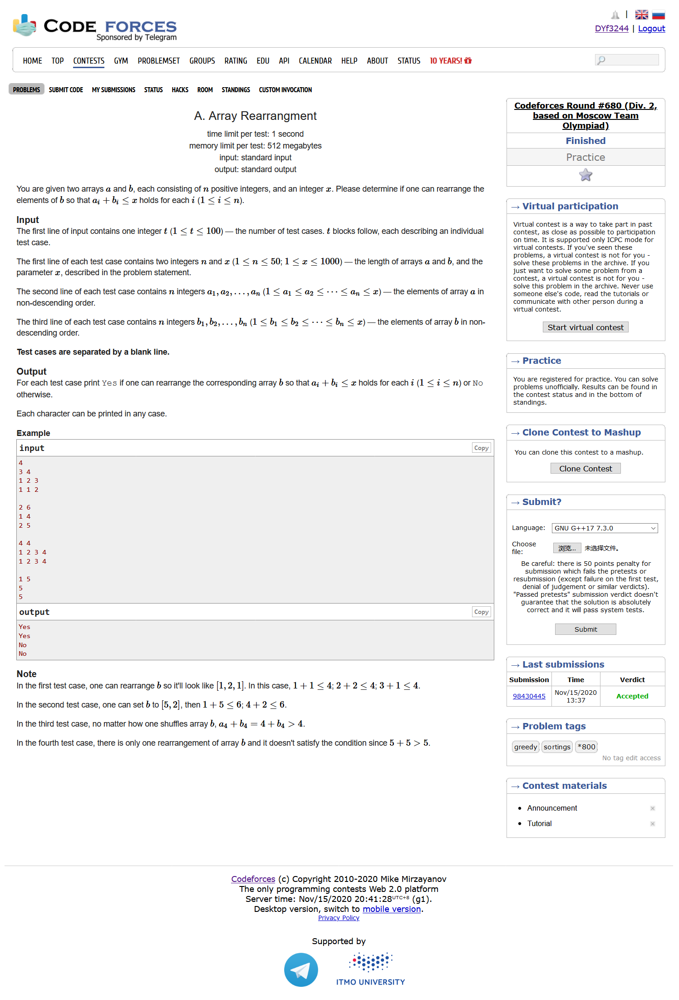
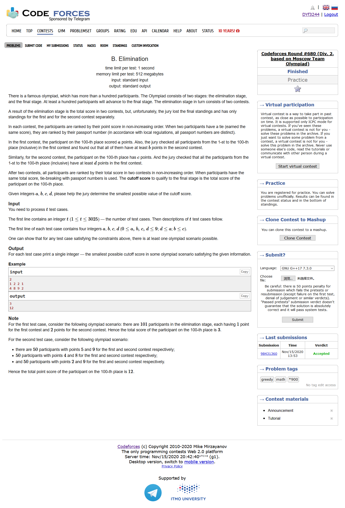
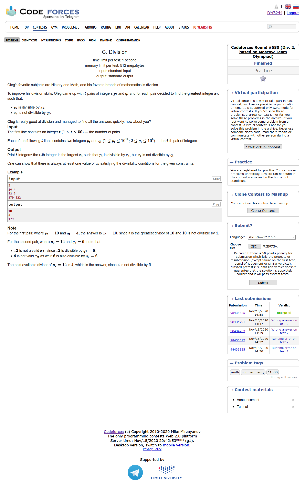

# Codeforces Round #680 (Div. 2, based on Moscow Team Olympiad)

## [A. Array Rearrangment](https://codeforces.ml/contest/1445/problem/A)



- 思维
- 题目大意：给定a，b数组，问是否存在某种情况，使得$\sum_{i=1}^n{a_i + b_i}\le x$恒成立
- 对于ab数组我们一个从小到大排序，一个从大到小排序，判断一下每个对应位置上的和是不是符合条件即可

```cpp
#include <bits/stdc++.h>
using namespace std;
#define LL long long
#define sigma_size 30
#define max_size (int)(1e4+10)
#define MAX (int)(1e5+7)

bool ans[105];
int main ()
{
	ios::sync_with_stdio(0);
	int T ; cin >> T;
	for ( int cas = 1 ; cas <= T ; cas++ )
	{
		int n , x ;
		cin >> n >> x;
		int a[55] , b[55];
		for ( int i = 1 ; i <= n ; i++ ) cin >> a[i];
		for ( int i = 1 ; i <= n ; i++ ) cin >> b[i];
		sort ( a + 1 , a + 1 + n ) ;
		sort ( b + 1 , b + 1 + n );
		bool flag = 1;
		for ( int i = 1 ; i <= n ; i++ )
		{
			if ( a[i] + b[n-i+1] > x )
			{
				flag = 0 ;
				break;
			} 
		}
		ans[cas] = flag ;
	}
	for ( int i = 1 ; i <= T ; i++ )
		if ( ans[i] ) cout << "Yes" << endl;
		else cout << "No" << endl;
}
```

## [B. Elimination](https://codeforces.ml/contest/1445/problem/B)



- 思维
- 题目大意：现在有两场比赛，比赛的管理员不知道他们的总和成绩，但是知道他们每场比赛第100名的成绩以及这100个人在另一场比赛的最低分，求两场比赛第100成绩的最低分数
- 直接取一下a+b，c+d的最大值即可

```cpp
#include <bits/stdc++.h>
using namespace std;
#define LL long long
#define sigma_size 30
#define max_size (int)(1e5+10)
#define MAX (int)(1e5+7)

int ans[4000];
int main ()
{
	ios::sync_with_stdio(0);
	int T ; cin >> T;
	for ( int cas = 1 ; cas <= T ; cas++ )
	{
		int a , b , c , d;
		cin >> a >> b >> c >> d;
		ans[cas] = max ( a + b , c + d );
	}
	for ( int i = 1 ; i <= T ; i++ )
		cout << ans[i] << endl;
}
```

## [C. Division](https://codeforces.ml/contest/1445/problem/C)



- 数论
- 题目大意：给定两个数字p，q，求出一个最大的x，使得p能够被x整除，且x不能整除q
- 如果p< q,或者p不能够整除q，那么答案就是p。否则就是p能够整除q的情况
- 由于我们知道，任何一个数q都可以表示为$q = p_1^{k_1}p_2^{k_2}...p_n^{k_n}$,因此我们可以考虑拿p去去掉一些属于q的因子，使得剩下的数不能够被q整除，我们再剩下的数字取最大值即可
- 比如q当中质数2的倍数有5个，那么我们可以构造一个2的倍数只有4个的数字，p一直除以2直到2的倍数为4，对q当中的每个质因数都这么处理，最后取得最大值即可

```cpp
#include <bits/stdc++.h>
using namespace std;
#define LL long long
#define sigma_size 30
#define max_size (int)(1e6+10)
#define MAX (int)(1e5+7)

LL pri[max_size];
bool mark[max_size];
int tot;
void get_pri() {
    tot = 0 ;
    for ( int i = 2 ; i < 1e6 ; i++ )
    {
        if ( !mark[i] ) pri[++tot] = i;
        for ( int j = 1 ; j <= tot && i*pri[j] < 1e6 ; j++ )
        {    
            mark[i*pri[j]] = 1;
            if ( i % pri[j] == 0 ) break;
        }
    }
}

LL ans[55];
int main ()
{
    ios::sync_with_stdio(0);
    get_pri();
    int T ; cin >> T;
    for ( int cas = 1 ; cas <= T ; cas++ )
    {
        LL sp , q;
        cin >> sp >> q;
        LL p = sp;
        if ( p < q || p % q )
            ans[cas] = p;
        else
        {
            vector <pair<int,int> > nump , numq;
            for ( int i = 1 ; i <= tot && pri[i] <= q ; i++ )
            {
                if ( q % pri[i] ) continue;
                int cnt = 0 ;
                while ( q % pri[i] == 0  )
                {
                    q /= pri[i];
                    p /= pri[i];
                    cnt++;
                }
                numq.push_back({i,cnt});
                while ( p % pri[i] == 0 )
                {
                    p /= pri[i];
                    cnt++;
                }
                nump.push_back({i,cnt});
            }
            bool flag = 0 ;
            LL big_pri;
            if ( q != 1 )
            {
                big_pri = q;
                flag = 1;
                numq.push_back({tot,1});
                int cnt = 0 ;
                while ( p % q == 0 )
                {
                    p /= q;
                    cnt++;
                }
                nump.push_back({tot,cnt});
            }
            p = sp;
            LL res = 0;
            for ( int i = 0 ; i < numq.size() ; i++ )
            {    
                LL tmp = p;
                for ( int j = 1 ; j <= nump[i].second-numq[i].second+1 ; j++ )
                {   
                    if ( i < numq.size()-1 || !flag ) 
                        tmp /= pri[nump[i].first];
                    else if ( i == numq.size()-1 && flag )
                        tmp /= big_pri;
                }
                res = max ( res , tmp );
            }
            ans[cas] = res;
        }
    }
    for ( int i = 1 ; i <= T ; i++ )
        cout << ans[i] << endl;
}
```

## [D. Divide and Sum](https://codeforces.ml/contest/1445/problem/D)

- 思维，排列组合
- 题目大意：将一个2*n的数组分成两组p，q，其中p单调递增，q单调递减。令$f(p,q) = \sum_{i=1}^n\left|p_i-q_i\right|$,求所有情况下的f(p,q)的和
- 可以知道，不管怎么分，任何一个f(p,q)都是一样的，因此，我们只需要求出把2n的数字分成两个n的数组有多少种分法即可

```cpp
#include <bits/stdc++.h>
using namespace std;
#define LL long long
#define sigma_size 30
#define max_size (int)(3e5+10)
#define MAX (int)(1e5+7)

const LL mod = 998244353;
int n;
LL a[max_size];

LL fac[max_size];
LL inv[max_size];
LL quick_pow ( LL n , LL k )
{
    LL res = 1;
    while (k)
    {
        if ( k & 1 ) res = res * n % mod;
        k >>= 1 ;
        n = n*n % mod;
    }
    return res;
}
void get_fac() {
    fac[0] = fac[1] = 1;
    for ( int i = 2 ; i <= 300000 ; i++ )
        fac[i] = fac[i-1] * i % mod;
    inv[300000] = quick_pow(fac[300000] , mod-2) ;
    for ( int i = 299999 ; i >= 0 ; i-- )
        inv[i] = inv[i+1] * (i+1) % mod;
}

LL res;
LL sum[2];
int main ()
{
    ios::sync_with_stdio(0);
    get_fac();
    cin >> n;
    for ( int i = 1 ; i <= 2*n ; i++ ) cin >> a[i];
    sort ( a+1 , a+1+2*n );
    for ( int i = 1 ; i <= n ; i++ ) sum[0] += a[i];
    for ( int i = n + 1 ; i <= 2*n ; i++ ) sum[1] += a[i];
    res = ( sum[1] - sum[0] + mod ) % mod * fac[2*n] % mod * inv[n] % mod * inv[n] % mod;
    cout << res << endl;
}
```

## [E. Team-Building](https://codeforces.ml/contest/1445/problem/E)


```cpp
#include <bits/stdc++.h>
using namespace std;
#define LL long long
#define sigma_size 30
#define max_size (int)(1e6 + 10)
#define MAX (int)(1e5+7)

int n , m , k ;
int a[max_size] , b[max_size];
int c[max_size];
int p[max_size];
int rk[max_size];
bool color[max_size];
int find ( int x ) { return p[x] == x ? x : find(p[x]) ;}
void init() {
    for ( int i = 1 ; i <= 1e6 ; i++ )
        p[i] = i , rk[i] = 1;
}

struct revo {
    int px , py,rkx , rky;
};
stack <revo> st;
void merge ( int x , int y ) {
    int px = find(x) , py = find(y);
    revo tmp = { px , py , rk[px] , rk[py] };
    st.push(tmp);
    if ( rk[px] > rk[py] )
        swap(px,py);
    p[px] = py;
    rk[py] = max ( rk[py] , rk[px] + 1 );
}

void revocation ( int k ) {
    while (k--)
    {
        revo node = st.top() ; st.pop();
        p[node.px] = node.px;
        p[node.py] = node.py;
        rk[node.px] = node.rkx;
        rk[node.py] = node.rky;
    }
}
map < pair<int,int> , vector<pair<int,int> > > mp;
LL ans;
int main ()
{
    ios::sync_with_stdio(0);
    init();
    cin >> n >> m >> k;
    for ( int i = 1 ; i <= n ; i++ ) cin >> c[i];
    for ( int i = 1 ; i <= m ; i++ ) cin >> a[i] >> b[i];
    for ( int i = 1 ; i <= m ; i++ )
    {
        if ( c[a[i]] == c[b[i]] )
        {
            int x = find(a[i]) , y = find(b[i]);
            if ( x != y )
                merge ( a[i] , b[i]+n ) , merge( b[i] , a[i]+n );
            else color[c[a[i]]] = 1;
        }
    }
    for ( int i = 1 ; i <= m ; i++ )
    {
        if ( c[a[i]] == c[b[i]]) 
            continue;
        if ( color[c[a[i]]] || color[c[b[i]]] )
            continue;
        if ( c[a[i]] > c[b[i]] ) 
            swap ( a[i] , b[i] );
        mp[{c[a[i]],c[b[i]]}].emplace_back(a[i],b[i]);
    }
    for ( auto node:mp )
    {
        int cnt = 0 ;
        for ( auto it:node.second )
        {
            int x , y;
            tie(x,y) = it;
            int px = find(x) , py = find(y);
            if ( px != py )
                merge( x , y+n ) , merge( y , x+n ) , cnt+=2;
            else
            {
                ans--;
                break;
            }
        }
        revocation ( cnt );
    }
    LL cnt = 0 ;
    for ( int i = 1 ; i <= k ; i++ )
        if ( !color[i] )
            cnt++;
    ans += cnt*(cnt-1)/2;
    cout << ans << endl;
}
```

