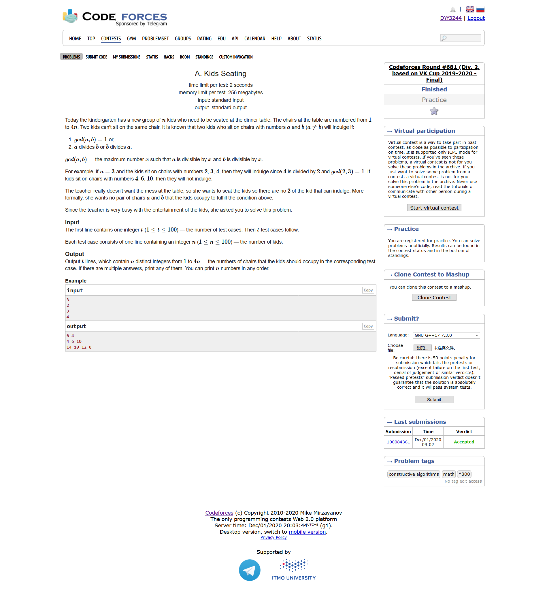
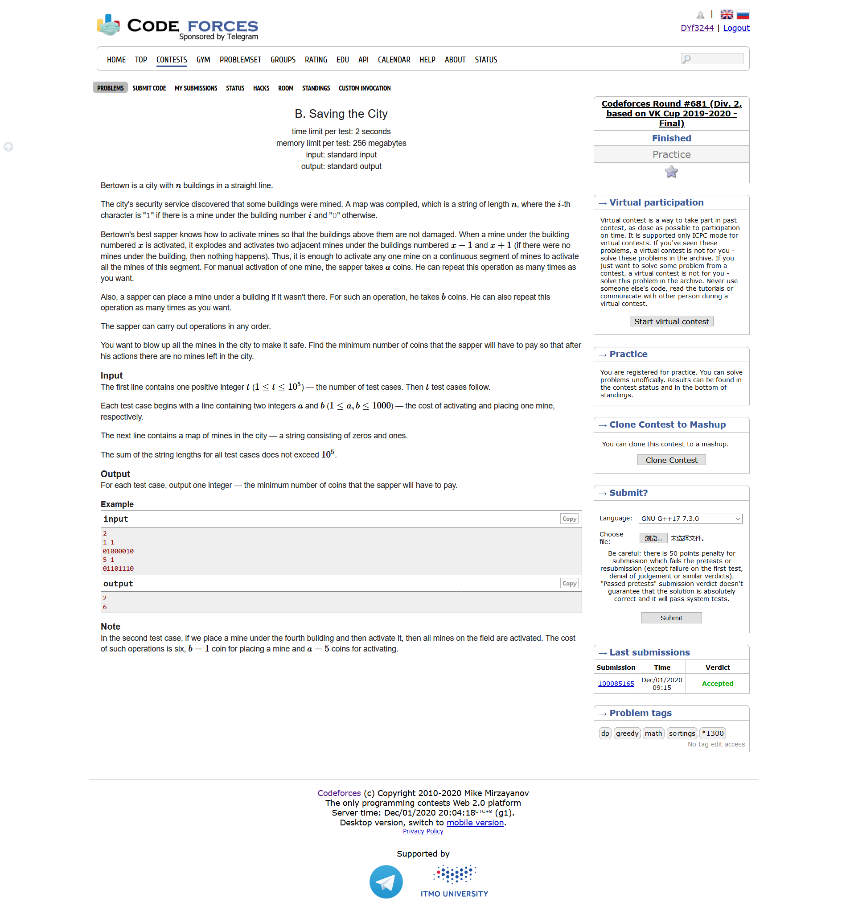
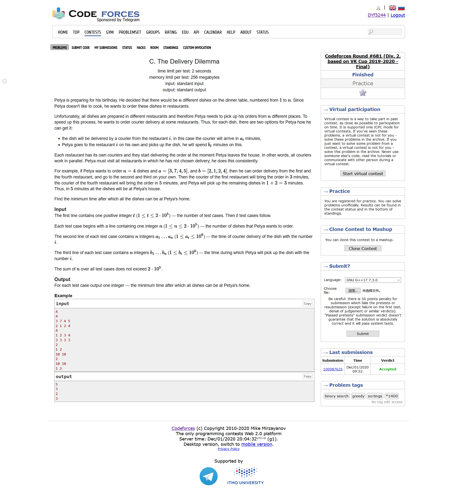
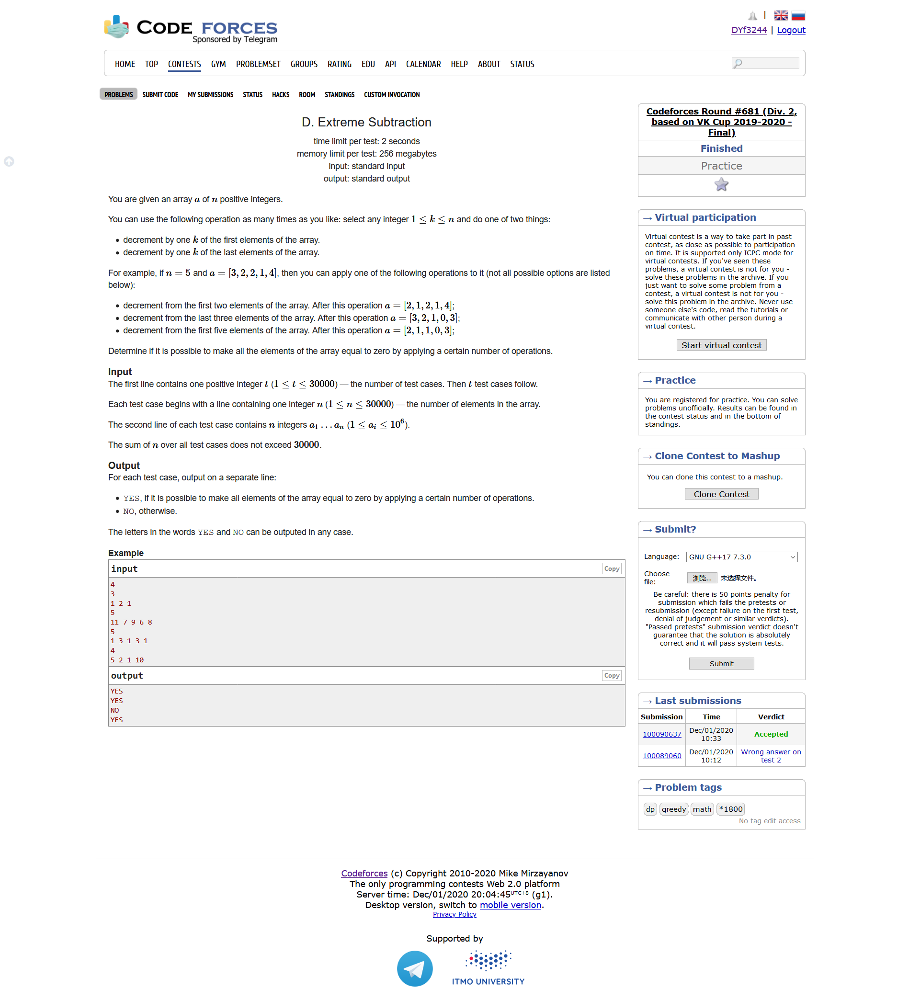
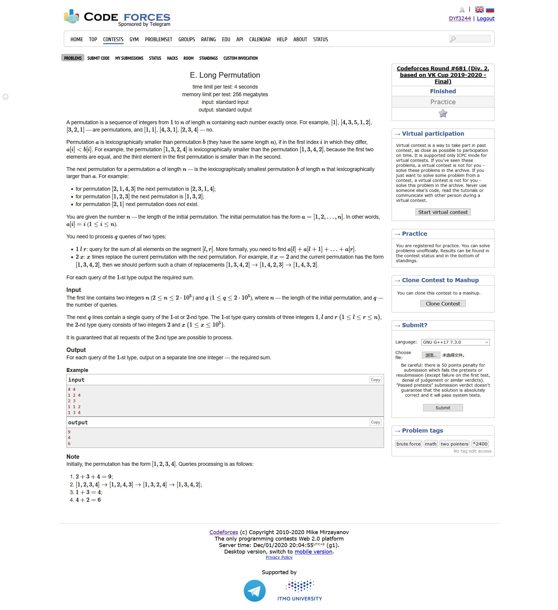
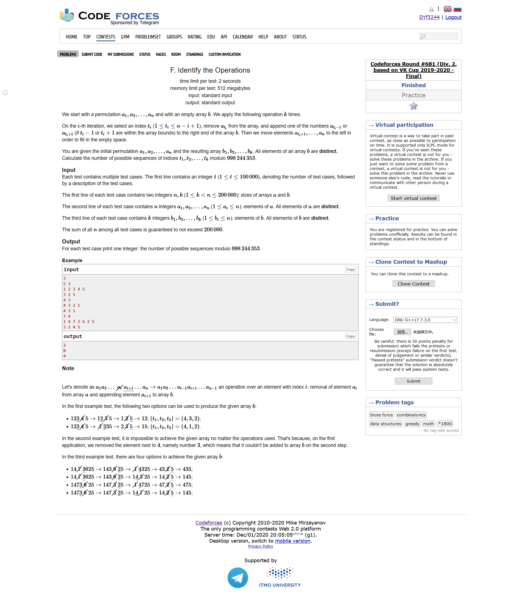

# Codeforces Round #681 (Div. 2, based on VK Cup 2019-2020 - Final)

https://codeforces.ml/contest/1443

https://codeforces.ml/blog/entry/84298

## [A. Kids Seating](https://codeforces.ml/contest/1443/problem/A)



- 题目大意：给定一个数字n，要求输出n个数字，每个数字都应该在$[1,4n]$范围内，且任意两个数字都应该满足$gcd(x,y)\neq 1$并且两个数字不是整除关系
- 思维，构造
- 输出$2n+2,2n+4,...,4n$即可

```cpp
#include <bits/stdc++.h>
using namespace std;
#define LL long long
#define sigma_size 30
#define max_size (int)(1e5+10)
#define MAX (int)(1e5+7)


int main ()
{
	ios::sync_with_stdio(0);
	int T ; cin >> T;
	for ( int cas = 1 ;cas <= T ; cas++ )
	{
		int n ; cin >> n;
		for ( int i = 1 ; i <= n ; i++ )
			cout << 2*n + 2*i << " ";
		cout << endl;
	}
}
```

## [B. Saving the City](https://codeforces.ml/contest/1443/problem/B)



- 题目大意：给定一个字符串s，1表示地雷，每次引爆一个地雷，周围的地雷也会被引爆。现在引爆一个地雷需要的代价是a，填一个雷的代价是b，求最小的代价把所有的地雷都给清空
- 枚举，贪心
- 我们把相邻两组地雷中间的空白地段的长度存起来，按照从小到大的顺序进行排序。枚举我们需要填充多少个空白的地段，最后结果我们取最小值即可

```cpp
#include <bits/stdc++.h>
using namespace std;
#define LL long long
#define sigma_size 30
#define max_size (int)(2e5+10)
#define MAX (int)(1e5+7)

int ans[max_size];
string s;
int main ()
{
	ios::sync_with_stdio(0);
	int T ; cin >> T;
	for ( int cas = 1 ; cas <= T ; cas++ )
	{
		int a , b ; cin >> a >> b;
		cin >> s ;
		bool flag = false;
		int cnt = 0 ;
		vector <int> v0;
		for ( int i = 0 ; i < s.length() ; i++ )
		{
			if ( s[i] == '1' )
			{
				flag = true;
				while ( i < s.length() && s[i] == '1' ) i++ ;
				i--;
				cnt++;
			}
			else if ( s[i] == '0' && flag )
			{
				int cur = 0 ; 
				while ( i < s.length() && s[i] == '0' ) i++ , cur++;
				if ( i < s.length() ) 
					v0.push_back(cur);
				i--;
			}
		}
		int res = cnt * a ;
		sort ( v0.begin() , v0.end() );
		int sum = 0 ; 
		for ( int i = 0 ; i < v0.size() ; i++ )
		{
			sum += v0[i];
			res = min ( res , (cnt-1-i)*a + sum*b );
		}
		ans[cas] = res;
	}
	for ( int i = 1 ; i <= T ; i++ )
		cout << ans[i] << endl;
}
```

## [C. The Delivery Dilemma](https://codeforces.ml/contest/1443/problem/C)



- 题目大意：你需要准备n种饭菜，每种饭菜的选择方式可以是让餐厅送外卖，也可以是自己亲自去买，a数组表示餐厅送每顿外卖所需要的时间，b数组表示自己出去买所需要的时间。餐厅送外卖是可以同时进行的，求最小的时间可以准备好所有的饭菜
- 贪心
- 我们知道，准备好所有菜的时间要么就是点的外卖的最长时间，要么就是自己出去买的时间之和；并且我们知道，每次我们点了一个外卖，所有时间比它小的外卖也会被我们点到，因此可以直接枚举哪些饭我们选择外卖，那么时间比这个饭长的我们就需要自己去买了，时间代价是$max(外卖，自己买的总时间)$

```cpp
#include <bits/stdc++.h>
using namespace std;
#define LL long long
#define sigma_size 30
#define max_size (int)(1e6+10)
#define MAX (int)(1e5+7)

LL a[max_size] , b[max_size];
int r[max_size];
bool cmp ( int i , int j ) 
{
    return a[i] > a[j];
}
LL ans[max_size];
int main ()
{
    ios::sync_with_stdio(0);
    int T ; cin >> T;
    for ( int cas = 1 ; cas <= T ; cas++ )
    {
        int n ; cin >> n;
        for ( int i = 1 ; i <= n ; i++ ) cin >> a[i];
        for ( int i = 1 ; i <= n ; i++ ) cin >> b[i];
        for ( int i = 1 ; i <= n ; i++ ) r[i] = i;
        sort ( r+1 , r+1+n , cmp );
        LL res = a[r[1]];
        LL sum = b[r[1]];
        for ( int i = 2 ; i <= n ; i++ )
        {
            int x = r[i];
            res = min ( res , max(a[x] , sum) ) ;
            sum += b[x]; 
        }
        res = min ( res , sum );
        ans[cas] = res;
    }
    for ( int i = 1 ; i <= T ; i++ )
        cout << ans[i] << endl;
}
```

## [D. Extreme Subtraction](https://codeforces.ml/contest/1443/problem/D)



- 题目大意：我们每次可以选择从头的几个数字让这些数字全都下降1，也可以从尾开始数几个数字让这些数字全都下降1，问是否可能让这些数字最后都等于0
- 模拟
- 把所有的数字抽象成为山峰形状，当我们遇到波峰的时候，把波峰移动到上一个波谷的位置时，两个峰的高度差就是后面所有数字需要移动的代价。判断一下是否会出现小于0的情况即可

```cpp
#include <bits/stdc++.h>
using namespace std;
#define LL long long
#define sigma_size 30
#define max_size (int)(1e6+10)
#define MAX (int)(1e5+7)

bool ans[max_size];
int a[max_size];
int minx[max_size];
int main ()
{
    ios::sync_with_stdio(0);
    int T ; cin >> T;
    for ( int cas = 1 ; cas <= T ; cas++ )
    {
        int n ; cin >> n;
        for ( int i = 1 ; i <= n ; i++ ) cin >> a[i];
        memset ( minx , 0xfffffff , (n+5)*sizeof(int) );
        minx[n] = a[n];
        for ( int i = n - 1 ; i >= 1 ; i-- )
            minx[i] = min ( a[i] , minx[i+1] );
        LL sum = 0 ; 
        LL low_num = a[1];
        LL high_num = a[1];
        bool flag = 0 ; 
        bool res = 1;
        for ( int i = 2 ; i <= n ; i++ )
        {
            if ( a[i] > a[i-1] )
            {
                if ( flag )
                    low_num = a[i-1];
                flag = 0;
            }
            else if ( a[i] < a[i-1] )
            {
                if ( !flag )
                {    
                    high_num = a[i-1];
                    sum += high_num - low_num;
                    if ( minx[i] - sum < 0 ) 
                    {
                        res = 0 ; 
                        break;
                    }
                }
                flag = 1;
            }
        }
        ans[cas] = res;
    }
    for ( int i = 1 ; i <= T ; i++ )
        if ( ans[i] ) cout << "YES" << endl;
        else cout << "NO" << endl;
}
```

## [E. Long Permutation](https://codeforces.ml/contest/1443/problem/E)



- 题目大意：给定从1到n的初始数列，有两种操作，一种是求某个区间的和，另一种是将数列按照字典序向后移动x个位置
- 康拓序列板题

```cpp
#include <bits/stdc++.h>
using namespace std;
#define LL long long
#define sigma_size 30
#define max_size (int)(2e5 + 10)
#define MAX (int)(1e5+7)

int n , q;
LL c[max_size] , fac[max_size];
int lowbit ( int x ) {
    return x & (-x);
}
LL query ( int x ) {
    LL res = 0 ;
    while (x) {
        res += c[x];
        x -= lowbit(x);
    }
    return res;
}
void add ( int x , int k ) {
    while ( x <= n ) {
        c[x] += k;
        x += lowbit(x);
    }
}

int v[20] , a[20] , p[max_size];
void upd ( LL sum ) {
    for ( int i = 1 ; i <= 15 ; i++ ) v[i] = 1;
    LL tmp = sum;
    for ( int i = 1 ; i <= 15 ; i++ )
    {
        int t = tmp / fac[15-i];
        int cnt = 0 ;
        for ( int j = 1 ; j <= 15 ; j++ )
        {
            if ( v[j] )
            {
                if ( cnt == t )
                {
                    a[i] = j;
                    v[j] = 0 ;
                    break;
                }
                ++cnt;
            }
        }
        tmp %= fac[15-i];
    }
    if ( n < 15 )
    {
        int d = 15 - n;
        for ( int i = 1  ; i <= n ; i++ )
        {
            add ( i , -p[i] );
            p[i] = a[i+d] - d;
            add ( i , p[i] );
        }
    }
    else
    {
        int d = n - 15 ;
        for ( int i = n-14 ; i <= n ; i++ )
        {
            add ( i , -p[i] );
            p[i] = a[15-(n-i)] + d;
            add ( i , p[i] );
        }
    }
}

vector <LL> ans;
int main ()
{
    ios::sync_with_stdio(0);
    cin >> n >> q;
    for ( int i = 1 ; i <= n ; i++ ) add(i,i);
    for ( int i = 1 ; i <= n ; i++ ) p[i] = i ;
    fac[0] = 1;
    for ( int i = 1 ; i <= 15 ; i++ ) fac[i] = fac[i-1] *  i;   
    
    LL res = 0 ; 
    for ( int i = 1  ; i <= q ; i++ )
    {
        int op ; cin >> op;
        if ( op == 1 )
        {
            int l , r;
            cin >> l >> r;
            ans.push_back(query(r)-query(l-1));
        }
        else
        {
            int x ; cin >> x;
            res += x;
            upd (res);
        }
    }
    for ( auto x : ans )
        cout << x << endl;
}
```

## [F. Identify the Operations](https://codeforces.ml/contest/1443/problem/F)



- 题目大意：给定互不相同的数列a，每次选定某个数字删除，那么周边的两个数字将会选择一个进入到b当中，为了构造出b数组，我们可以有多少种构造方式
  

```cpp
#include <bits/stdc++.h>
using namespace std;
#define LL long long
#define ULL unsigned long long
#define sigma_size 30
#define max_size (int)(2e5+10)
#define MAX_SIZE (int)(4e6+7)


const LL mod = 998244353;

LL ans[max_size];
int a[max_size] , b[max_size];
bool st[max_size];
int pos[max_size];
int main ()
{
	ios::sync_with_stdio(0);
	int T ; cin >> T;
	for ( int cas = 1 ; cas <= T ; cas++ )
	{
		int n , k ;
		cin >> n >> k;
		for ( int i = 1 ; i <= n ; i++ ) cin >> a[i] , pos[a[i]] = i ;
		for ( int i = 1 ; i <= k ; i++ )
		{
			cin >> b[i];
			st[b[i]] = 1;
		}
		LL res = 1;
		for ( int i = 1 ; i <= k ; i++ )
		{
			st[b[i]] = 0 ; 
			LL t = 0 ;
			if ( pos[b[i]]-1 >= 1 && !st[a[pos[b[i]]-1]] )
				t++;
			if ( pos[b[i]]+1 <= n && !st[a[pos[b[i]]+1]] ) 
				t++;
			res = res * t % mod;
		}
		ans[cas] = res;
	}	
	for ( int i = 1 ; i <= T ; i++ )
		cout << ans[i] << endl;
}
```