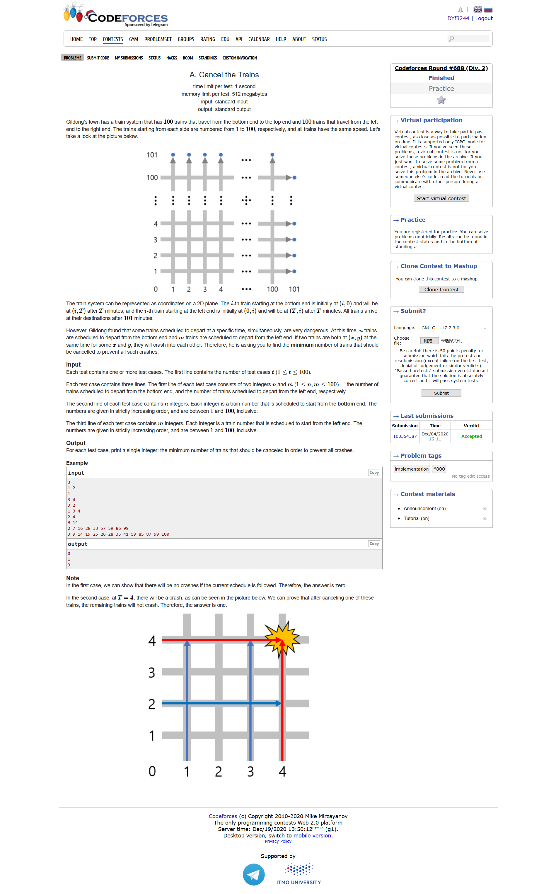
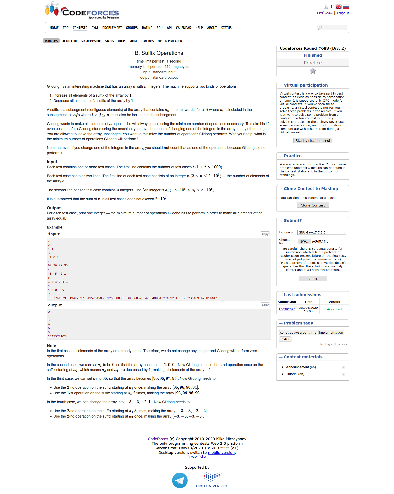
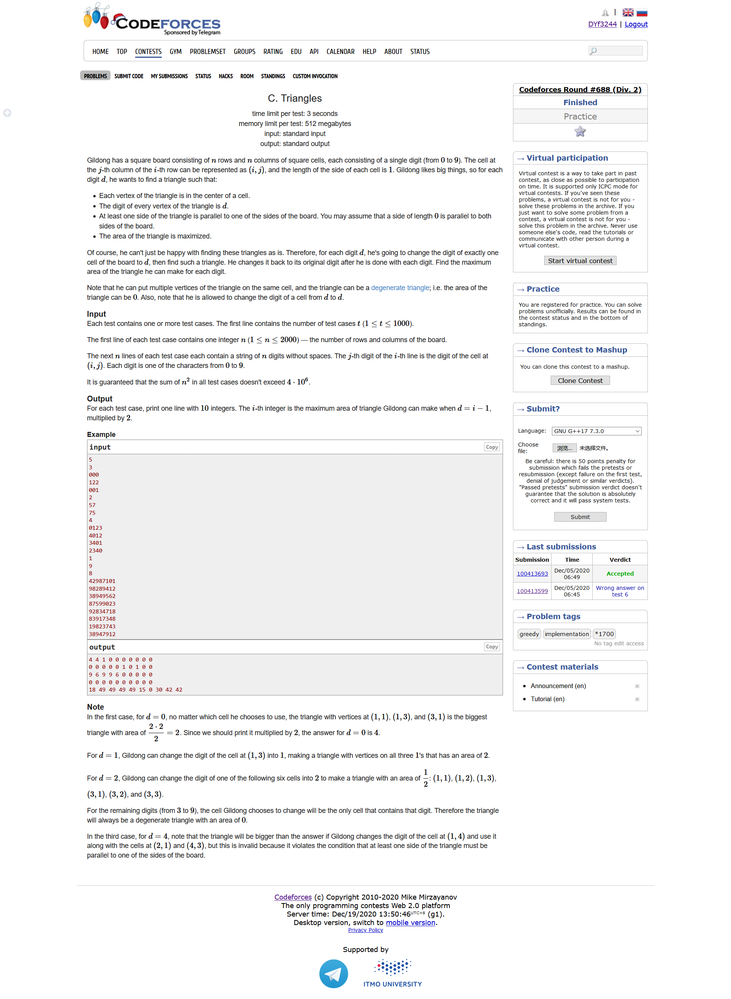
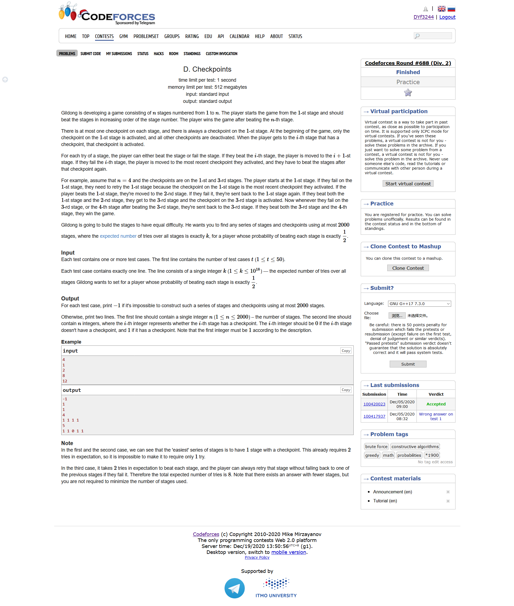
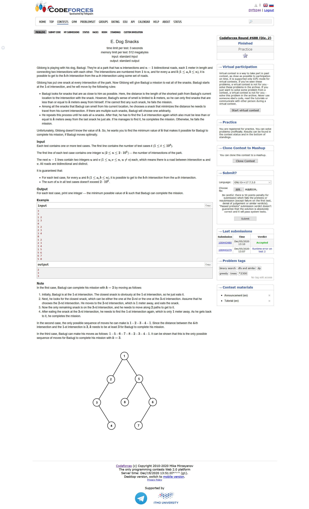
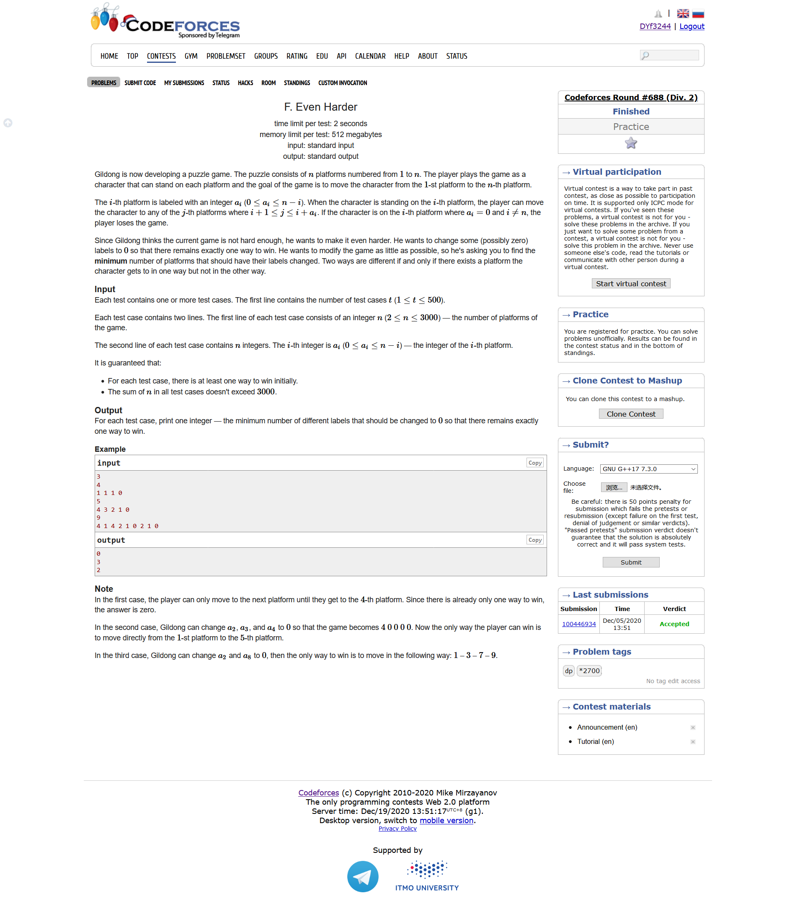

# Codeforces Round #688 (Div. 2)

https://codeforces.ml/contest/1453/problems

https://codeforces.ml/blog/entry/85288

## [A. Cancel the Trains](https://codeforces.ml/contest/1453/problem/A)



- 题目大意：给定若干个坦克从底部冲向顶部，以及若干个坦克从左边冲向右边，求问有多少坦克会发生碰撞
- 模拟

```cpp
#include <bits/stdc++.h>
using namespace std;
#define LL long long
#define sigma_size 30
#define max_size (int)(1e5+10)
#define MAX (int)(1e5+7)

int ans[max_size];
int Hash[105];
int main ()
{
	ios::sync_with_stdio(0);
	int T ; cin >> T;
	for ( int cas = 1 ;cas <= T ; cas++ )
	{
		int n , m ;
		cin >> n >> m;
		memset ( Hash , 0 , sizeof(Hash) );
		for ( int i = 1 ; i <= n ; i++ )
		{
			int x ; cin >> x;
			Hash[x]++;
		}
		int cnt = 0 ;
		for ( int i = 1 ; i <= m ; i++ )
		{
			int x ; cin >> x;
			if ( Hash[x] ) cnt++;
		}
		ans[cas] = cnt;
	}
	for ( int i = 1 ; i <= T ; i++ )
		cout << ans[i] << endl;
}
```

## [B. Suffix Operations](https://codeforces.ml/contest/1453/problem/B)



- 题目大意：给定一个数列a，每次可以从尾部选择连续的若干个数字进行整体的上移下移操作，并且你可以在所有的操作之前选择一个数字变成任何你想要的数字，求问最少的操作次数是多少
- 波峰波谷模拟问题
- 我们把整个数列看做是波峰波谷，那么我们需要移动的代价就是求相邻的波峰或者波谷的距离。
- 但是现在我们还可以对一个数字进行修改，很自然的我们会知道这个数字一定要是波峰或波谷，不然的话修改了对于我们并没有什么意义。我们将这个数字改到和它周围的两个数字的其中一个相等即可。那么这个时候，我们就应该从它周围的两个数字当中选择一个合适的数字来取代成为波峰或者波谷

```cpp
#include <bits/stdc++.h>
using namespace std;
#define LL long long
#define sigma_size 30
#define max_size (int)(2e5+10)
#define MAX (int)(1e5+7)

LL ans[max_size];
LL a[max_size];
int main ()
{
	ios::sync_with_stdio(0);
	int T ; cin >> T;
	for ( int cas = 1 ; cas <= T ; cas++ )
	{
		int n ; cin >> n;
		for ( int i = 1 ; i <= n ; i++ ) cin >> a[i];
		
		vector<int> pos;
		pos.push_back(n);
		for ( int i = n-1 ; i > 1 ; i-- )
		{
			if ( a[i] >= a[i+1] && a[i] >= a[i-1] )
				pos.push_back(i);
			else if ( a[i] <= a[i+1] && a[i] <= a[i-1] )
				pos.push_back(i);
		}
		pos.push_back(1);
		LL res = 0 ; 
		for ( int i = 1 ; i < pos.size() ; i++ )
			res += abs(a[pos[i-1]]-a[pos[i]]);
		LL tmp = 0;
		LL sum = res;
		for ( int i = 0 ; i < pos.size() ; i++ )
		{
			tmp = sum;
			if ( i == 0  )
			{
				tmp -= abs( a[n]-a[pos[1]] );
				tmp += abs( a[n-1]-a[pos[1]] );
				res = min ( res , tmp );
			}
			else if ( i == pos.size()-1 )
			{
				tmp -= abs ( a[1]-a[pos[i-1]] );
				tmp += abs ( a[2]-a[pos[i-1]] );
				res = min ( res , tmp );
			}
			else
			{
				tmp -= abs ( a[pos[i]]-a[pos[i-1]] );
				tmp -= abs ( a[pos[i]]-a[pos[i+1]] );
				int cut = pos[i];
				LL cur;
				if ( a[cut] >= a[cut-1] && a[cut] >= a[cut+1] )
					cur = max ( a[cut-1] , a[cut+1] );
				else if ( a[cut] <= a[cut-1] && a[cut] <= a[cut+1] )
					cur = min ( a[cut-1] , a[cut+1] );
				tmp += abs ( a[pos[i+1]]-cur );
				tmp += abs ( a[pos[i-1]]-cur );
				res = min ( res , tmp );
			}
		}
		ans[cas] = res;
	}
	for ( int i = 1 ; i <= T ; i++ )
		cout << ans[i] << endl;
}
```

## [C. Triangles](https://codeforces.ml/contest/1453/problem/C)



- 题目大意：给定一个矩阵，矩阵中的每个元素都是0到9当中的一个数字，现在我们要求当$d$从0变到9的时候，选择跟$d$相等的数字作为三角形的顶点，并且我们要求三角形的一条边必须和边界平行，并且我们可以将矩阵当中的任意一个数字变成d，求每个d所能构造的三角形的面积最大值是多少
- 贪心
- 对于某个d，我们来研究一下某个值等于d的坐标$(i,j)$，如果我们将这个点当成是三角形的一条平行边，那么它的底就应该是$\max(j-1,n-j)$，高会是$\max(max_row[d]-i,i-min_row[d])$；同理，如果我们将这个点当成是三角形的一条垂直边，那么它的底就是$max(i-1,n-i)$，它的高就是$max(max_col[d]-j,j-min_col[d])$
- 综上所述，我们的答案为

$$
\max_{(i,j)=d} =\begin{cases}
    \max(j-1,n-j)*\max(max_row[d]-i,i-min_row[d]) \\
    \max(i-1,n=i)*\max(max_col[d]-j,j-min_col[d]) 
\end{cases}
$$

```cpp
#include <bits/stdc++.h>
using namespace std;
#define LL long long
#define sigma_size 30
#define max_size (int)(1e6+10)
#define MAX (int)(1e5+7)

string maps[2005];
int ans[1005][15];
int max_row[15] , min_row[15];
int max_col[15] , min_col[15];
int main ()
{
    ios::sync_with_stdio(0);
    int T ; cin >> T;
    for ( int cas = 1 ; cas <= T ; cas++ )
    {
        int n ; cin >> n;
        for ( int i = 1 ; i <= n ; i++ )
            cin >> maps[i] , maps[i] = ' ' + maps[i];
        memset ( max_row , 0 , sizeof(max_row) );
        for ( int i = 0 ; i <= 10 ; i++ ) min_row[i] = 1e9;
        memset ( max_col , 0 , sizeof(max_col) );
        for ( int i = 0 ; i <= 10 ; i++ ) min_col[i] = 1e9;
        for ( int i = 1 ; i <= n ; i++ )
        {
            for ( int j = 1 ; j <= n ; j++ )
            {
                max_row[maps[i][j]-'0'] = max ( max_row[maps[i][j]-'0'] , i );
                max_col[maps[i][j]-'0'] = max ( max_col[maps[i][j]-'0'] , j );
                min_row[maps[i][j]-'0'] = min ( min_row[maps[i][j]-'0'] , i );
                min_col[maps[i][j]-'0'] = min ( min_col[maps[i][j]-'0'] , j );
            }
        }
        //for ( int i = 0 ;  i <= 2 ; i++ )
            //cout << min_row[i] << " " << max_row[i] << " " << min_col[i] << " " << max_col[i] << endl;
        for ( int i = 1 ; i <= n ; i++ )
        {
            for ( int j = 1 ; j <= n ; j++ )
            {
                int d = maps[i][j] - '0';
                int res1 = max(j-1,n-j) * max( max_row[d]-i , i-min_row[d] );
                int res2 = max(i-1,n-i) * max( max_col[d]-j , j-min_col[d] );
                //cout << d << " " << res1 << " " << res2 << endl;
                ans[cas][d] = max ( ans[cas][d] , max(res1,res2) );
            }
        }
    }
    for ( int i = 1 ; i <= T ; i++ )
    {
        for ( int j = 0 ; j <= 9 ; j++ )
        {
            cout << ans[i][j] << " ";
        }
        cout << endl;
    }
}
```

## [D. Checkpoints](https://codeforces.ml/contest/1453/problem/D)




```cpp
#include <bits/stdc++.h>
using namespace std;
#define LL long long
#define sigma_size 30
#define max_size (int)(1e6+10)
#define MAX (int)(1e5+7)

int a[2005];
int main ()
{
    ios::sync_with_stdio(0);
    int T ; cin >> T;
    while (T--)
    {
        LL k ; cin >> k;
        if ( k & 1 ) cout << "-1" << endl;
        else
        {
            
            memset ( a , 0 , sizeof(a) );
            a[1] = 1;
            int cur = 1;
            while (k)
            {
                int c ;
                for ( c = 1 ; ( 1ll << (c+1) ) - 2 <= k ; c++ );
                cur += c-1;
                //cout << cur << endl;
                a[cur] = 1;
                k -= (1ll<<c) - 2;
            }
            cout << cur-1 << endl;
            for ( int i = 1 ; i < cur ; i++ )
                cout << a[i] << " ";
            cout << endl;
        }
    }
}
```

## [E. Dog Snacks](https://codeforces.ml/contest/1453/problem/E)



- 题目大意：从1作为顶点的树出发，每次都会选择一个没有访问过的距离自己最近的结点去访问，并且要求这个距离不能超过k，最后还要成功返回根节点，求问最小的k可以是多少
- DFS
- 由于最后还要返回根节点，所以我们的k必须是从根节点出发距离最远的点，如果从根节点链接出去的两个最远的子节点都是一条单独的长链，则我们的答案会+1

```cpp
#include <bits/stdc++.h>
using namespace std;
#define LL long long
#define sigma_size 30
#define max_size (int)(2e5 + 10)
#define MAX (int)(1e5+7)

vector <int> G[max_size];
int n ; 
bool vis[max_size];
int res;
void init () {
    for ( int i = 1 ; i <= n+5 ; i++ ) G[i].clear();
    memset ( vis , 0 , sizeof(bool)*(n+5) );
}

int dfs ( int u , int f )
{
    if ( G[u].size() == 1 && u != 1 )
        return 1;
    vector <int> vec;
    for ( auto v : G[u] )
    {
        if ( v == f ) continue;
        vec.push_back(dfs(v,u));
    }
    sort ( vec.begin() , vec.end() );
    if ( vec.size() > 1 )
    {
        if ( u == 1 )
            res = max ( {res , vec.back(), vec[vec.size()-2]+1 } );
        else res = max ( res , vec.back() + 1 );
    }
    res = max ( res , vec[0] );
    return vec[0] + 1 ;
}


int ans[max_size];
int main()
{
    ios::sync_with_stdio(0);
    int T ; cin >> T;
    for ( int cas = 1 ; cas <= T ; cas++ )
    {
        cin >> n;
        init();
        for ( int i = 1 ; i < n ; i++ ) 
        {
            int u , v ; cin >> u >> v;
            G[u].push_back(v);
            G[v].push_back(u);
        }
        res = 0 ;
        dfs ( 1 , 0  );
        ans[cas] = res;
    }
    for ( int i = 1 ; i <= T ; i++ )
        cout << ans[i] << endl;
}
```

## [F. Even Harder](https://codeforces.ml/contest/1453/problem/F)



- 题目大意：每次站在一个点i的时候，我们可以选择$i+1到i+a_i$这个区间进行转移，如果某个点是0，那么玩家将会输掉游戏。现在如果我们想使得从起点到终点的路径时唯一的，我们最少需要将多少个点设置为0
- DP
- 设$dp[i][x](i\le x)$为我们为了使得只剩下一种方案到达i应该清除的数据最小个数，也就是说我们只留下唯一的一个平台k使得k可以直接到达i这个位置。也就是说，$dp[i][x]$只是考虑了所有的k值，我们选择一个最小的当前的需要清理的数字
- 设$cnt$表示有多少个数字是$j<y<i并且y+a_y\ge i$的。一开始cnt为0，现在我们从$i-1到1$进行遍历，当我们看到一个数字是$j+a_j\ge i$的时候，我们用$dp[j][i-1]$去更新$dp[i][j+a_j]$的最小值，随之cnt+1。这就表示我们已经清除了所有位于$j+1$和$i-1$的让j平台能够到达i平台，并且可能到达$j+a_j$的平台。注意到所有的k当在计算$dp[j][i-1]$的时候已经被清理了，我们只需要计算$j+1$到$i-1$之间的平台即可
- 因为$dp[i][x]$表示的是从i平台到x平台所需要的的最小的需要清理的平台，因此我们再计算一下前缀最小值$dp[i][i...n]$即可。

```cpp
#include <bits/stdc++.h>
using namespace std;
#define LL long long
#define ULL unsigned long long
#define sigma_size 30
#define max_size (int)(2e5+10)
#define MAX_SIZE (int)(4e6+7)


int ans[max_size];
int a[3005];
int dp[3005][3005];
const int inf = 1<<30;
int main ()
{
	ios::sync_with_stdio(0);
	int T ; cin >> T;
	for ( int cas = 1  ;cas <= T ; cas++ )
	{
		int n ; cin >> n;
		for ( int i = 1 ; i <= n ; i++ ) cin >> a[i];
		for ( int i = 1 ; i <= n ; i++ )
			for ( int j = 1 ; j <= n ; j++ )
				dp[i][j] = inf;
		for ( int i = 1 ; i <= n ; i++ )
		{
			int cnt = 0 ;
			for ( int j = i-1 ; j >= 1 ; j-- )
			{
				if ( j + a[j] >= i )
				{
					dp[i][j+a[j]] = min ( dp[i][j+a[j]] , dp[j][i-1] + cnt );
					cnt++;
				}
			}
			for ( int j = i ; j <= n ; j++ )
				dp[i][j] = min ( dp[i][j-1] , dp[i][j] );
		}
		ans[cas] = dp[n][n];
	}
	for ( int i = 1 ; i <= T ; i++ )
		cout << ans[i] << endl;
}
```

