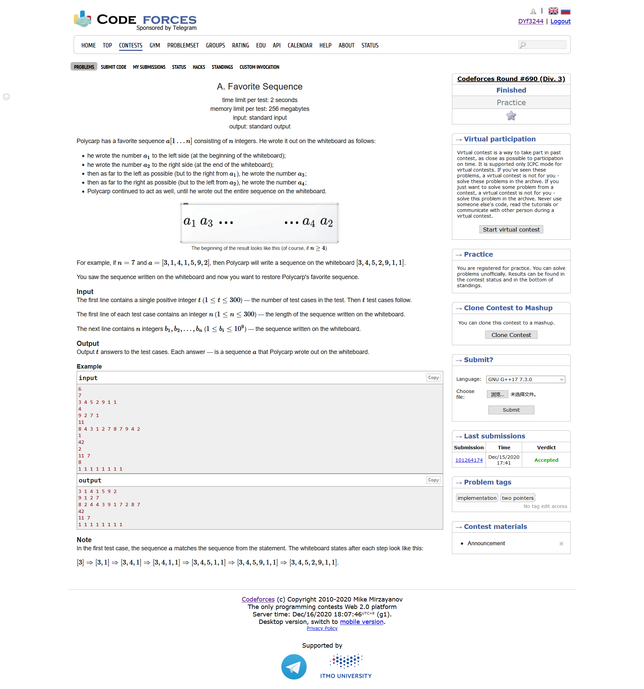
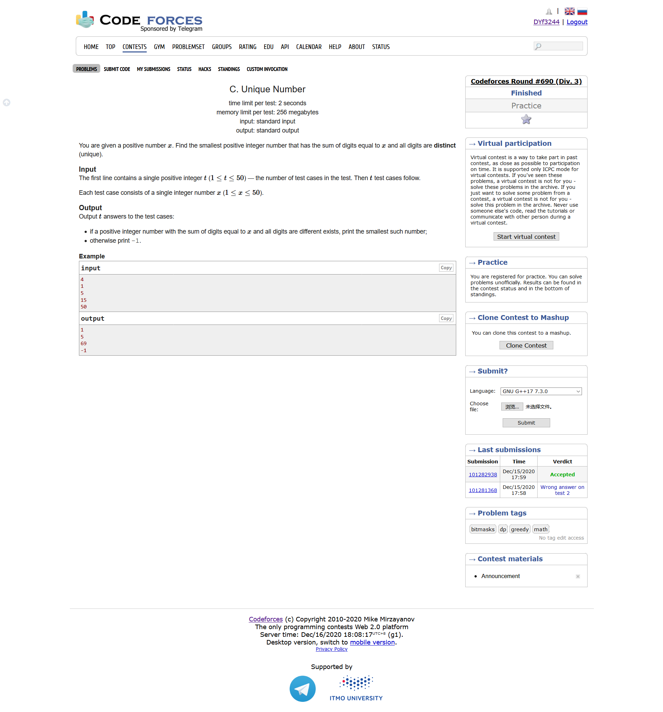
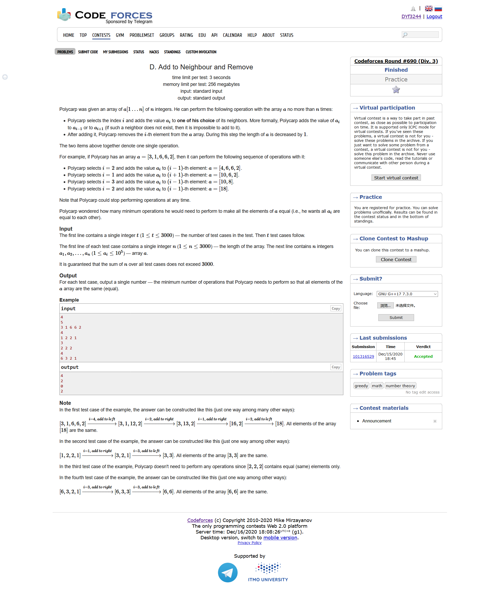
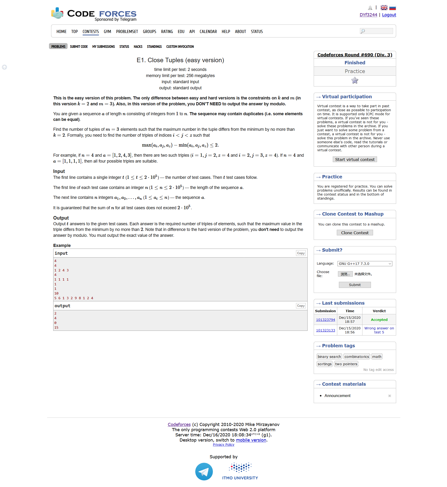
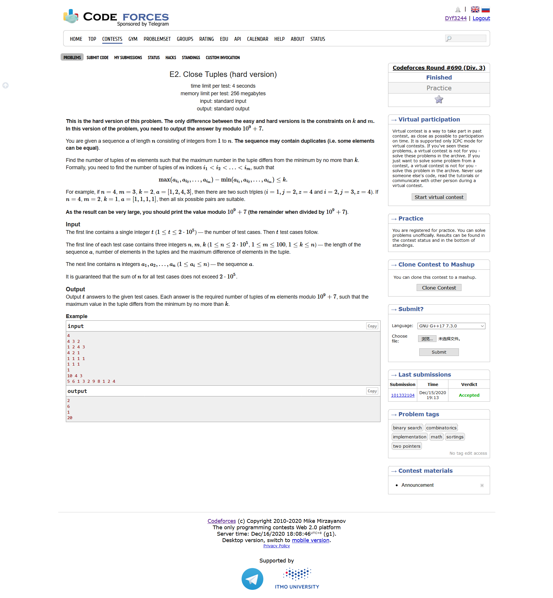
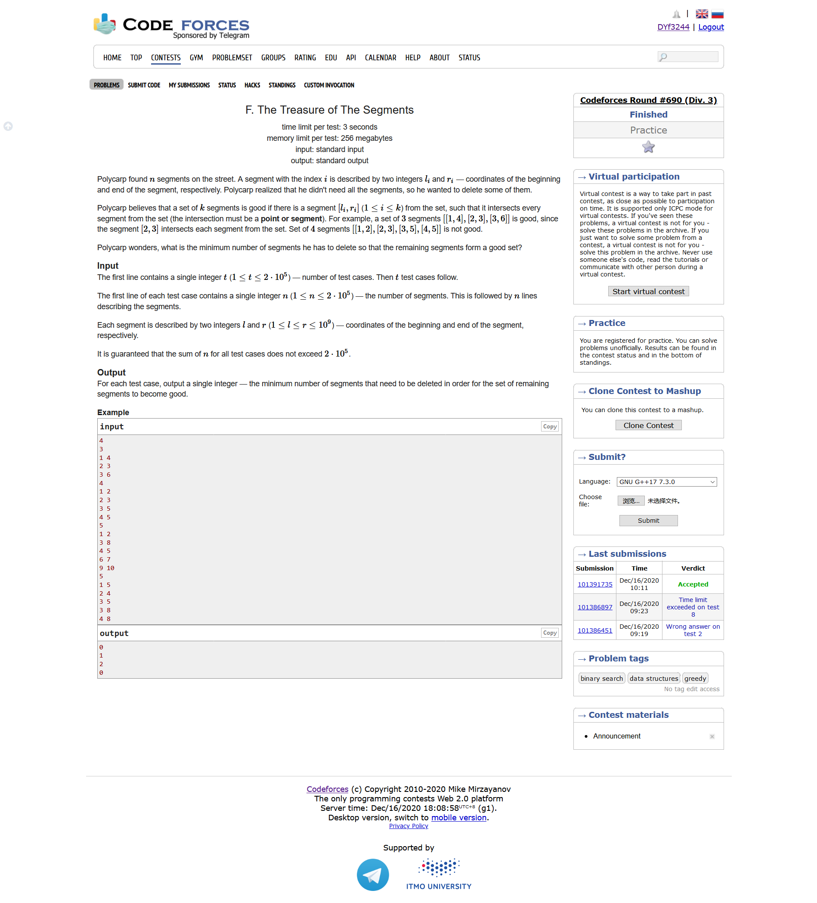

# Codeforces Round #690 (Div. 3)

## [A. Favorite Sequence](https://codeforces.ml/contest/1462/problem/A)



- 题目大意：给定一个输入规律是$a_1,a_3,\dots,a_4,a_2$的数列，输出原数列
- 模拟
- 把给定的数列前$\frac{n+1}{2}$个位置放到答案的奇数位置上，把后面的位置放到答案的偶数位置上即可

```cpp
#include <bits/stdc++.h>
using namespace std;
#define IOS ios::sync_with_stdio(0)
#define LL long long
#define maxn (int)(2e5 + 10)

int a[maxn];
int ans[maxn];
int main ()
{
    IOS;
    int T ; cin >> T;
    for ( int cas = 1 ; cas <= T ; cas++ )
    {
        int n  ; cin >> n;
        for ( int i = 1 ; i <= n ; i++ ) cin >> a[i];
        for ( int i = 1 ; i <= (n+1)/2 ; i++ )
            ans[2*i-1] = a[i];
        for ( int i = n ; i > (n+1)/2 ; i-- )
            ans[(n-i+1)*2] = a[i];
        for ( int i = 1 ; i <= n ; i++ )
            cout << ans[i] << " ";
        cout << endl;
    }
    
}
```

<div STYLE="page-break-after:always;"></div>

## [B. Last Year's Substring](https://codeforces.ml/contest/1462/problem/B)


- 题目大意：求问给定一个字符串当中，能够通过至多一次删除若干个连续的字符串，使得最后剩下的字符串只有2020
- 模拟
- 反过来思考一下，无非就是问2020这个串能够通过一次插入若干个字符得到题目所给的串，那么插入的位置要么是在中间要么是在两边。因此，问题我们就可以转化为开头的几个字符和结尾的几个字符能否拼成2020即可

```cpp
#include <bits/stdc++.h>
using namespace std;
#define IOS ios::sync_with_stdio(0)
#define LL long long
#define maxn (int)(2e5 + 10)

bool ans[maxn];
const string res = " 2020";
int main ()
{
    IOS;
    int T ; cin >> T;
    for ( int cas = 1 ; cas <= T ; cas++ )
    {
        int n ; cin >> n;
        string s; cin >> s;
        s = ' ' + s;
        int cnt1 , cnt2;
        cnt1 = cnt2 = 0;
        for ( int i = 1 ; i <= n ; i++ )
        {
            if ( s[i] == res[i] )
                cnt1++;
            else break;
        }
        int d = 4;
        for ( int i = n ; i >= n-3 ; i-- , d--)
        {
            if ( s[i] == res[d] )
                cnt2++;
            else break;
        }
        if ( cnt1 + cnt2 >= 4 ) ans[cas] = 1;
        else ans[cas] = 0 ;
    }
    for ( int i = 1 ; i <= T ; i++ )
        if ( ans[i] ) cout << "YES" << endl;
        else cout << "NO" << endl;
}
```

<div STYLE="page-break-after:always;"></div>

## [C. Unique Number](https://codeforces.ml/contest/1462/problem/C)



- 题目大意：给定一个数字x，求一个最小的数字，使得这个数字各个位置上的和加起来刚好等于x，并且要求数字之间不能有重复
- 模拟
- 首先我们对45以上的数字进行特判，因为1到9的数字加起来最多只有45
- 要使得我们构造的数字是最小的，我们就应该尽量让末位的数字尽可能大，因此，我们让x从d=9开始减，减到最后$x\le d$的时候，我们所得到的数字拼起来，就是我们要的答案

```cpp
#include <bits/stdc++.h>
using namespace std;
#define IOS ios::sync_with_stdio(0)
#define LL long long
#define maxn (int)(2e5 + 10)

LL ans[maxn];

int main ()
{
    IOS;
    int T ; cin >> T;
    for ( int cas = 1 ; cas <= T ; cas++ )
    {
        int x ; cin >> x;
        if ( x > 45 )
            ans[cas] = -1;
        else if ( x <= 9 )
            ans[cas] = x;
        else
        {
            vector <int> res;
            int d = 9 ;
            while ( x > d )
            {
                res.push_back(d);
                x -= d;
                d --;
            }
            res.push_back(x);
            sort(res.begin(),res.end());
            LL cnt = 0 ; 
            for ( auto y : res )
                cnt = cnt * 10 + y;
            ans[cas] = cnt;
        }
        
    }
    for ( int i = 1 ; i <= T ; i++ )
        cout << ans[i] << endl;
}
```

<div STYLE="page-break-after:always;"></div>

## [D. Add to Neighbour and Remove](https://codeforces.ml/contest/1462/problem/D)



- 题目大意：我们现在有如下的操作：一个数列当中选择一个数字加到它的左边或者右边的位置上，然后移除这个数字。求问要使得最后的数列每个元素都应该相等，我们至少应该进行多少次操作
- 前缀和，因数分解
- 题目中所提供的操作无非就是连续的几个数字求和，要使得最后每个元素都相同，我们把问题转为把连续的几个数字加起来能否组成最后想要的数列当中对应的元素
- 首先我们对整个数列进行求和，同时我们对数列进行求前缀和操作。
- 接着我们找这个数列的和的因数，即有可能最后要的数列的每个元素的大小，通过前缀和进行遍历，看看这种情况可不可行，最后我们取最小的那种方案就行了

```cpp
#include <bits/stdc++.h>
using namespace std;
#define IOS ios::sync_with_stdio(0)
#define LL long long
#define maxn (int)(2e5 + 10)

int ans[maxn];
int a[maxn];

int pre[maxn];

int main ()
{
    IOS;
    int T ; cin >> T;
    for ( int cas = 1 ; cas <= T ; cas++ )
    {
        int n ; cin >> n;
        int sum = 0 ;
        memset ( pre , 0 , (n+5)*sizeof(int) );
        for ( int i = 1 ; i <= n ; i++ ) cin >> a[i] , sum += a[i];
        pre[1] = a[1];
        for ( int i = 2 ; i <= n ; i++ ) pre[i] = pre[i-1] + a[i];
        int res = 1 << 30;
        for ( int i = 1 ; i*i <= sum ; i++ )
        {
            if ( sum % i ) continue;
            int fac = sum / i;
            int cur = 0 ;
            bool flag = 1;
            for ( int j = 1 ; j <= n ; j++ )
            {
                if ( pre[j] - pre[cur] > i )
                {
                    flag = 0;
                    break;
                }
                else if ( pre[j] - pre[cur] == i )
                    cur = j ;

                if ( j == n && j != cur ) 
                    flag = 0 ;
            }
            if ( flag )
                res = min ( res , n -fac );
            cur = 0 ;
            flag = 1;
            for ( int j = 1 ; j <= n ; j++ )
            {
                if ( pre[j] - pre[cur] > fac )
                {
                    flag = 0;
                    break;
                }
                else if ( pre[j] - pre[cur] == fac )
                    cur = j ;

                if ( j == n && j != cur ) 
                    flag = 0 ;
            }
            if ( flag )
                res = min ( res , n-i );
        }
        ans[cas] = res;
    }
    for ( int i = 1 ; i <= T ; i++ )
        cout << ans[i] << endl;
}
```

<div STYLE="page-break-after:always;"></div>

## [E1. Close Tuples (easy version)](https://codeforces.ml/contest/1462/problem/E1)



- 题目大意：给定一个数列，找到其中三个数字，使得三个数字当中最大的数字和最小的数字的差值不会超过2，求这样的三个数字在数列当中有多少个
- 贪心
- 我们对数组进行排序，假设我们得到的一个最小的数字是$a_1$，最后一个比它大不超过2的位置是$a_s$，也就是说，我们可以从2到s当中挑选两个不一样的数字，那么对答案的贡献就是$C_{s-1}^2$

```cpp
#include <bits/stdc++.h>
using namespace std;
#define IOS ios::sync_with_stdio(0)
#define LL long long
#define maxn (int)(2e5 + 10)

LL ans[maxn];
int a[maxn];
int main ()
{
    IOS;
    int T ; cin >> T;
    for ( int cas = 1 ; cas <= T ; cas++ )
    {
        int n ; cin >> n;
        for ( int i = 1  ; i <= n ; i++ ) cin >> a[i];
        sort ( a+1 , a+1+n );
        LL res = 0 ;
        for ( int i = 1 ; i <= n-2 ; i++ )
        {
            int pos ;
            if ( a[i] + 2 > a[n] ) pos = n;
            else pos = upper_bound(a+1,a+1+n,a[i]+2) - a - 1;
            LL tmp = pos - i ;
            res += tmp*(tmp-1)/2;
        }
        ans[cas] = res;
    }   
    for ( int i = 1 ; i <= T ; i++ )
        cout << ans[i] << endl;
}
```

<div STYLE="page-break-after:always;"></div>

## [E2. Close Tuples (hard version)](https://codeforces.ml/contest/1462/problem/E2)



- 接E1
- 进一步地，如果要跳远m个数字，我们只要找到了满足条件的$a_s$，我们对答案的贡献就是$C_{s-1}^{m-1}$

```cpp
#include <bits/stdc++.h>
using namespace std;
#define IOS ios::sync_with_stdio(0)
#define LL long long
#define maxn (int)(2e5 + 10)


const LL mod = 1e9 + 7;
int  m , k ;
LL fac[maxn];
LL inv[maxn];
LL quick_pow ( LL n , LL k )
{
    LL res = 1 ;
    while ( k )
    {
        if ( k & 1 ) res = res * n % mod;
        n = n * n % mod;
        k >>= 1;
    }
    return res;
}

LL get_inv ( LL n ) {
    return quick_pow ( n , mod-2 ); 
}
void get_fac()
{
    fac[0] = 1;
    for ( int i = 1 ; i <= 2e5 ; i++ )
        fac[i] = fac[i-1] * i % mod;
    inv[200000] = get_inv(fac[200000]);
    for ( int i = 200000-1 ; i >= 0 ; i-- )
        inv[i] = inv[i+1] * (i+1) % mod;
}
LL C ( int n ) {
    if ( n < m-1 ) return 0;
    return fac[n] * inv[m-1] % mod * inv[n-m+1] % mod;
}
LL ans[maxn];
int a[maxn];
int main ()
{
    IOS;
    get_fac();
    int T ; cin >> T;
    for ( int cas = 1 ; cas <= T ; cas++ )
    {
        int n ; cin >> n;
        cin >> m >> k;
        for ( int i = 1  ; i <= n ; i++ ) cin >> a[i];
        sort ( a+1 , a+1+n );
        LL res = 0 ;
        for ( int i = 1 ; i <= n-m+1 ; i++ )
        {
            int pos ;
            if ( a[i] + k > a[n] ) pos = n;
            else pos = upper_bound(a+1,a+1+n,a[i]+k) - a - 1;
            LL tmp = pos - i ;
            res = ( res + C(tmp) ) % mod;
        }
        ans[cas] = res;
    }   
    for ( int i = 1 ; i <= T ; i++ )
        cout << ans[i] << endl;
}
```

<div STYLE="page-break-after:always;"></div>

## [F. The Treasure of The Segments](https://codeforces.ml/contest/1462/problem/F)



- 题目大意：给定若干个线段，求问至少应该删除多少条线段，使得最后留下来的线段至少存在一条线段和其他线段都有交界
- 贪心，二分
- 我们对所有线段的左端点进行排序，对所有线段的右端点进行排序。
- 对于某一条线段，我们需要比较它的左端点比所有线段当中多少右端点要小，也就是说，左半边能够至多和多少线段进行交界；同时我们比较右端点比多少线段的左端点大，也就是说右半边能和多少线段进行交界。我们取能够交界的最大线段，剩下线段我们删去即可

```cpp
#include <bits/stdc++.h>
using namespace std;
#define IOS ios::sync_with_stdio(0);
#define LL long long
#define maxn (int)(2e5 + 10)

int L[maxn] , R[maxn];
int ans[maxn];
int main ()
{
    IOS;
    int T ; cin >> T;
    for ( int cas = 1 ; cas <= T ; cas++ )
    {
        int n ; cin >> n;
        vector <int> l , r;
        for ( int i = 1 ; i <= n ; i++ ) 
        {
            cin >> L[i] >> R[i];
            l.push_back(L[i]);
            r.push_back(R[i]);
        }
        
        sort ( l.begin() , l.end() );
        sort ( r.begin() , r.end() );
        int res = 1 << 30;
        int cnt = 0 ;
        for ( int i = 1 ; i <= n ; i++ )
        {
            cnt = 0 ;
            int pos = lower_bound(r.begin(),r.end(),L[i]) - r.begin();
            cnt += pos + (r[pos] < L[i]);
		    pos = upper_bound(l.begin(),l.end(), R[i]) - l.begin(); 
		    cnt += n - pos;
		    res = min(cnt, res);	 		
        }
        ans[cas] = res;
        l.clear() , r.clear();
    }
    for ( int i = 1 ; i <= T ; i++ )
        cout << ans[i] << endl;
}
```

