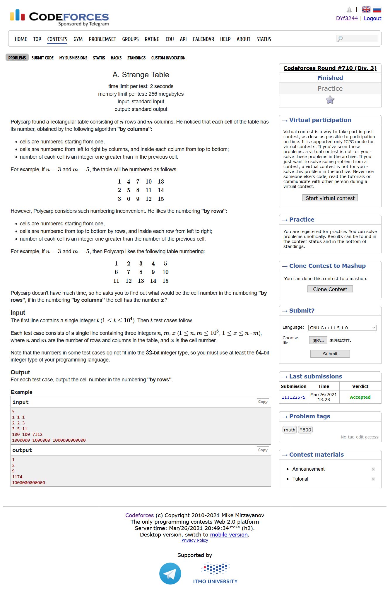
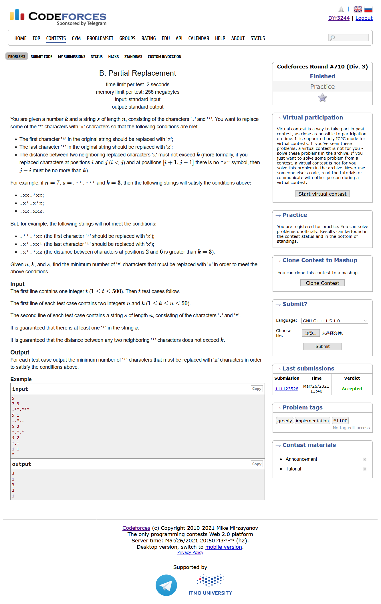
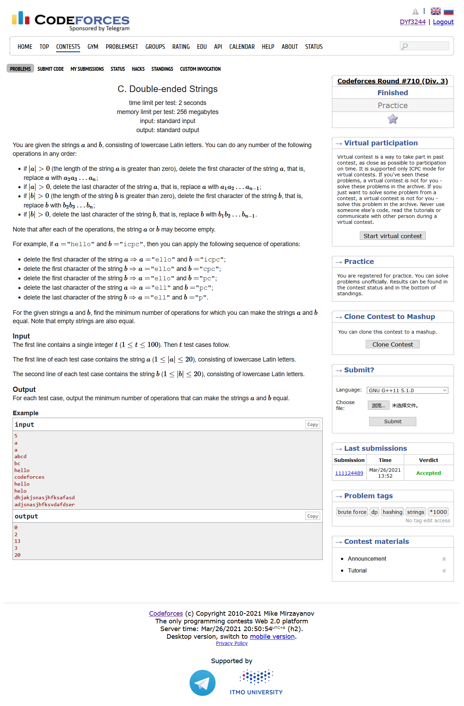
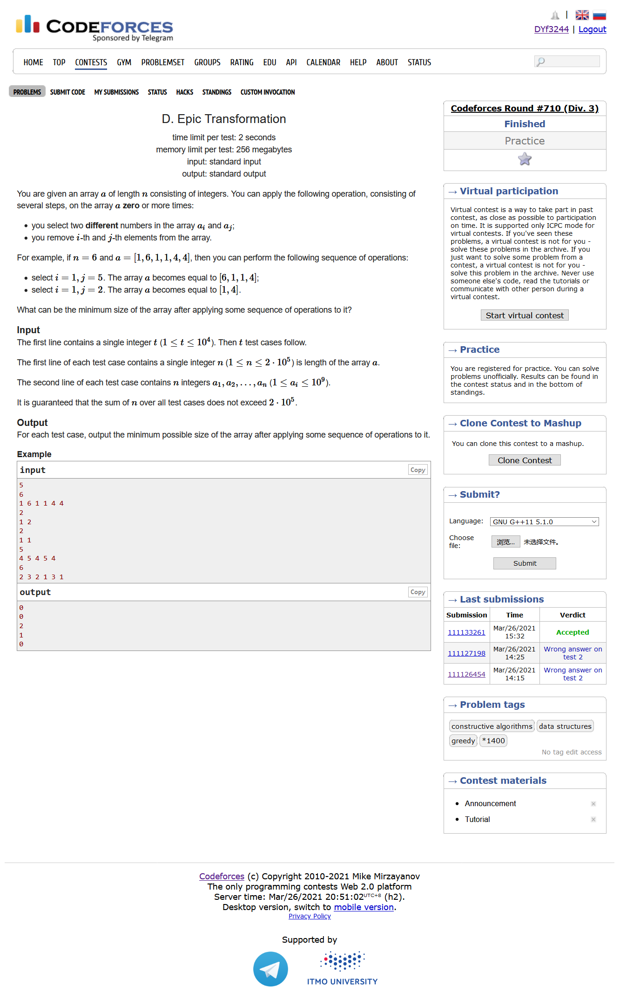
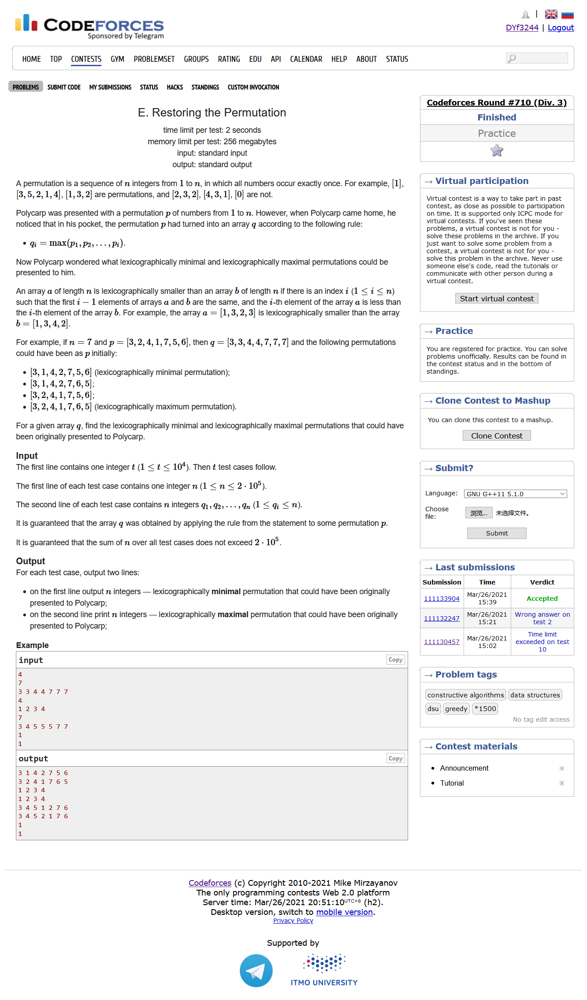

# [Codeforces Round #710 (Div. 3)](https://codeforces.ml/contest/1506)

## A. Strange Table



```cpp
#include <bits/stdc++.h>
using namespace std;
#define IOS ios::sync_with_stdio(0)
#define LL long long
#define maxn (int)(2e5 + 10)


LL ans[maxn];
int main ()
{
    IOS;
    int T ; cin >> T;
    for ( int cas = 1 ; cas <= T ; cas++)
    {
        LL n , m , x ;
        cin >> n >> m >> x ;
        LL col = x / n ;
        LL row = x % n ;
        if ( row ) col ++ ;
        if ( !row ) row = n ;
        ans[cas] = ( row - 1 ) * m + col ;
    }
    for ( int i = 1 ; i <= T ; i++ )
        cout << ans[i] << endl;
}
```

## B. Partial Replacement



```cpp
#include <bits/stdc++.h>
using namespace std;
#define IOS ios::sync_with_stdio(0)
#define LL long long
#define maxn (int)(2e5 + 10)

int ans[maxn];

int main ()
{
    IOS;
    int T ; cin >> T;
    for ( int cas = 1 ; cas <= T ; cas++)
    {
        int n , k; cin >> n >> k ;
        string s ; cin >> s;
        vector <int> v;
        for ( int i = 0 ; i < n ; i++ )
            if ( s[i] == '*' ) 
                v.push_back(i);
        int cnt = 0 ;
        for ( int i = 0 ; i < v.size() ; i++ )
        {
            int x = v[i];
            cnt++;
            while ( i < v.size() && v[i] - x <= k )
                i++;
            if ( i == v.size() ) { 
                if ( i != 1 )
                    cnt++ ; 
                break; 
            }
            i -= 2;
        }
        ans[cas] = cnt;
    }
    for ( int i = 1 ; i <= T ; i++ )
        cout << ans[i] << endl;
}
```

## C. Double-ended Strings



```cpp
#include <bits/stdc++.h>
using namespace std;
#define IOS ios::sync_with_stdio(0)
#define LL long long
#define maxn (int)(1e6 + 10)

int ans[105];

int main  ()
{
    IOS;
    int T ; cin >> T;
    for ( int cas = 1 ; cas <= T ; cas++)
    {
        string a , b ;
        cin >> a >> b;
        int n = a.length() , m = b.length();
        a = ' ' + a ; b = ' ' + b ;
        int maxx = 0 ;
        for ( int i = 1 ; i <= n ; i++ )
        {
            for ( int j = 1 ; j <= m ; j++ )
            {
                int cnt = 0 ;
                if ( a[i] != b[j] ) continue;
                int w = i ;
                int k = j ;
                while ( w <= n && k <= m && a[w] == b[k] ) 
                {
                    cnt++;
                    w++ ; k++;
                }
                maxx = max ( maxx , cnt );
            }
        }
        ans[cas] = n + m - 2*maxx ;
    }
    for ( int i = 1 ; i <= T ; i++ )
        cout << ans[i] << endl;
}
```

## D. Epic Transformation



```cpp
#include <bits/stdc++.h>
using namespace std;
#define IOS ios::sync_with_stdio(0)
#define LL long long
#define maxn (int)(2e5 + 10)


int ans[maxn];
int a[maxn];
int main()
{
    IOS;
    int T ; cin >> T;
    for ( int cas = 1 ; cas <= T ; cas++)
    {
        int n ; cin >> n;
        for ( int i = 1; i <= n ; i++ ) cin >> a[i];
        sort ( a+1 , a+1+n );
        vector<int> v;
        for ( int i = 1; i <= n ; i++ )
        {
            int cnt = 0 ;
            int x = a[i];
            while ( i <= n && a[i] == x )
            {
                cnt ++;
                i++;
            }
            i--;
            v.push_back(cnt);
        }
        priority_queue<int> q;
        for ( int x : v ) 
            q.push(x);
        while ( q.size() >= 2 )
        {
            int cnt1 = q.top();
            q.pop();
            int cnt2 = q.top();
            q.pop();
            cnt1-- ; cnt2-- ;
            if ( cnt1 )
                q.push(cnt1);
            if ( cnt2 )
                q.push(cnt2);
        }
        if ( q.empty() )
            ans[cas] = 0 ;
        else 
            ans[cas] = q.top();
    }
    for ( int i = 1 ; i <= T ; i++ )
        cout << ans[i] << endl;
}
```

## E. Restoring the Permutation



```cpp
#include <bits/stdc++.h>
using namespace std;
#define IOS ios::sync_with_stdio(0)
#define LL long long
#define maxn (int)(2e5 + 10)

int T ; 
int n ; 
int a[maxn];
vector<int> ans[maxn];
bool Hash[maxn];
void get_min( int cas )
{
    int x = 0 ;
    int cnt = 1 ;
    for ( int i = 1 ; i <= n ; i++ )
    {
        x = a[i];
        if (!Hash[x]) ans[cas].push_back(x) , Hash[x] = 1;
        else 
        {
            while (Hash[cnt]) cnt++;
            ans[cas].push_back(cnt++);
        }
    }
}
void get_max ( int cas )
{
    int x = 0 ;
    stack<int> st;
    for ( int i = 1 ; i <= n ; i++ )
    {
        if ( x != a[i] ) 
        {
            x = a[i];
            if ( x > 1 && !Hash[x-1] )
                st.push(x-1);
            ans[cas].push_back(x);
            Hash[x] = 1;
        }
        else 
        {
            int &cnt = st.top();
            Hash[cnt] = 1 ;
            ans[cas].push_back(cnt--);
            if ( Hash[cnt] || cnt == 0 ) st.pop();
        }
    }
}
int main ()
{
    IOS;
    cin >> T;
    for ( int cas = 1 ; cas <= T ; cas++ )
    {
        cin >> n ;
        for ( int i = 1 ; i <= n ; i++ ) cin >> a[i];
        ans[cas].push_back(0);
        memset ( Hash , 0 , sizeof(bool)*(n+5) );
        get_min(cas);
        memset ( Hash , 0 , sizeof(bool)*(n+5) );
        get_max(cas);
    }
    for ( int i = 1 ; i <= T ; i++ )
    {
        int tmp = (ans[i].size()-1) / 2;
        for ( int j = 1 ; j <= tmp ; j++ )
            cout << ans[i][j] << " ";
        cout << endl;
        for ( int j = tmp+1 ; j <= 2*tmp ; j++ )
            cout << ans[i][j] << " ";
        cout << endl;
    }
}
```