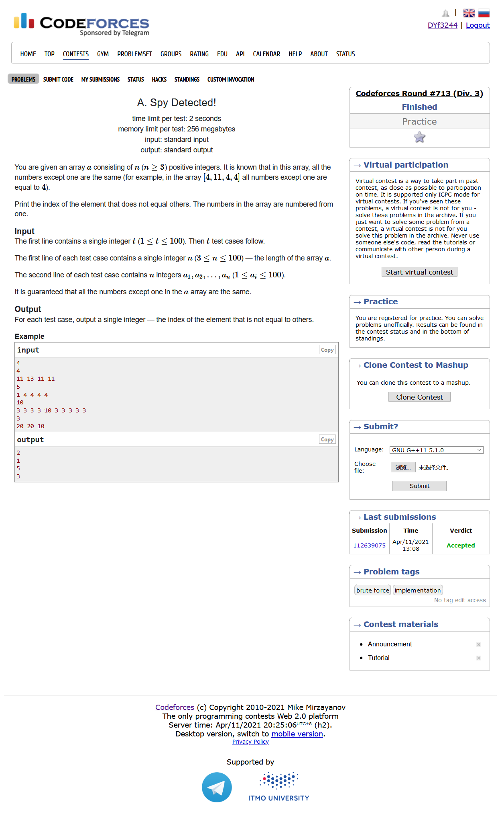
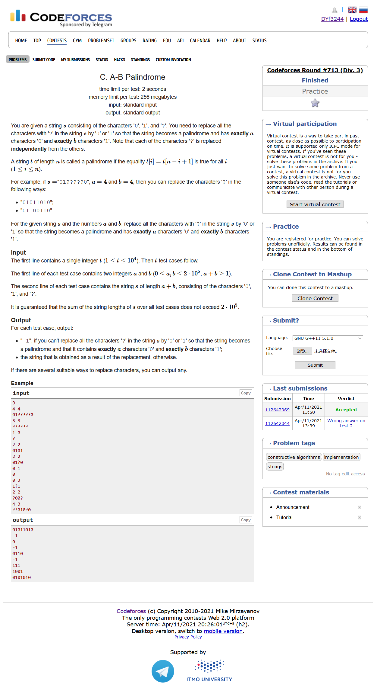
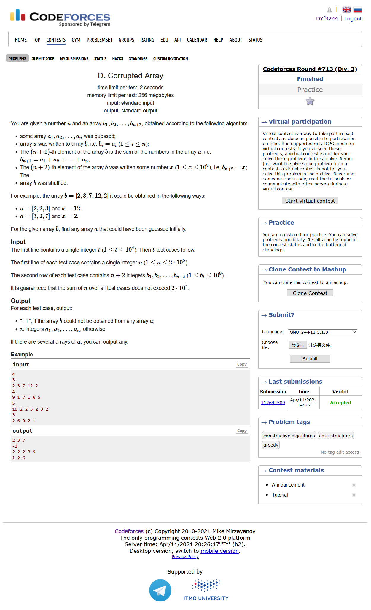
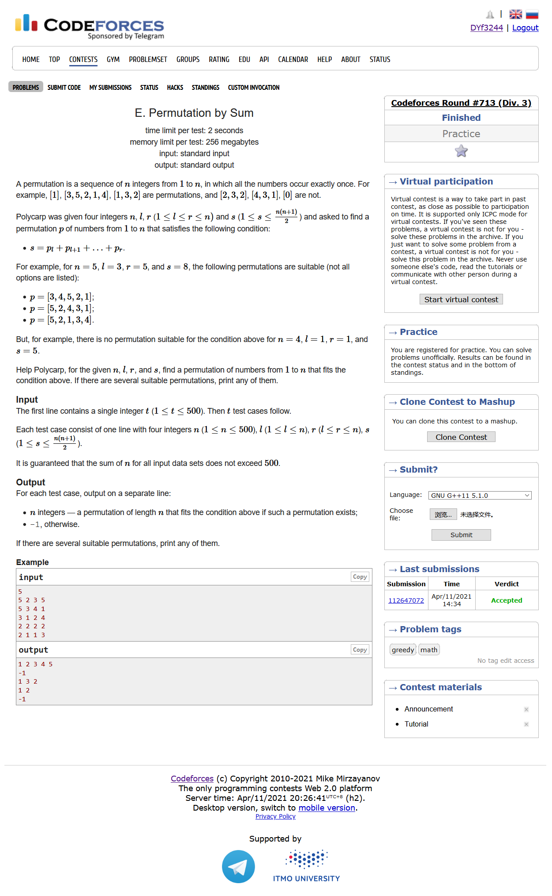
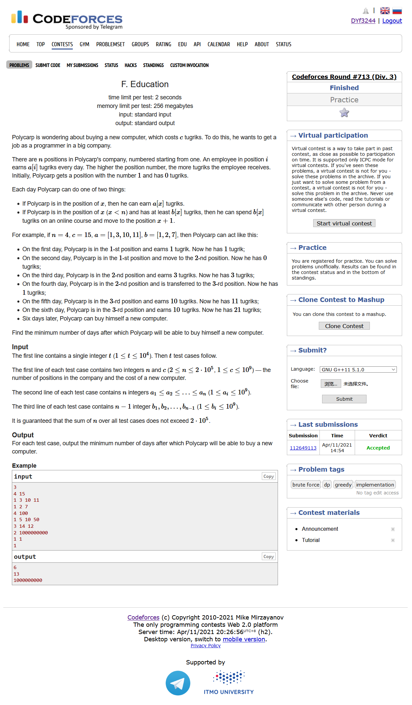
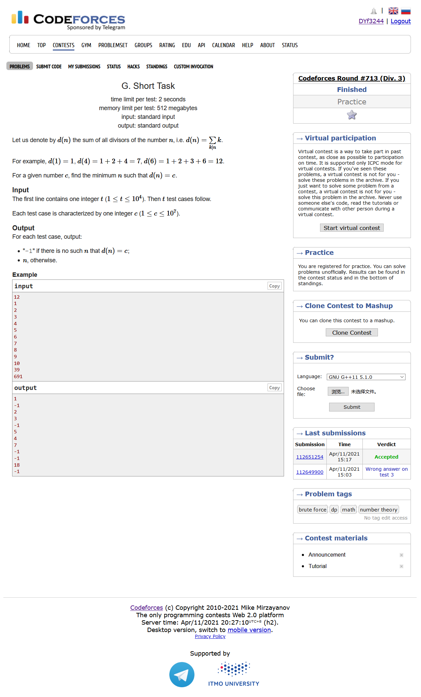

# Codeforces Round #713 (Div. 3)

## A. Spy Detected!



```CPP
#include <bits/stdc++.h>
using namespace std;
#define IOS ios::sync_with_stdio(0)
#define LL long long
#define maxn (int)(2e5 + 10)


int a[maxn];
int b[maxn];
int ans[maxn];
int main ()
{
    IOS;
    int T ; cin >> T;
    for ( int cas = 1 ; cas <= T ; cas++)
    {
        int n ; cin >> n ;
        for ( int i = 1; i <= n ; i++ ) cin >> a[i];
        memcpy( b , a , (n+5)*sizeof(int));
        sort ( b+1 , b+1+n ) ;
        int x ;
        if ( b[1] == b[2] ) x = b[n];
        else x = b[1];
        for ( int i = 1 ; i <= n ; i++ )
        {
            if ( a[i] == x ) 
            {
                ans[cas] = i ;
                break;
            }
        }
    }
    for ( int i = 1 ; i <= T ; i++ )
        cout << ans[i] << endl;
}
```

## B. Almost Rectangle


```CPP
#include <bits/stdc++.h>
using namespace std;
#define IOS ios::sync_with_stdio(0)
#define LL long long
#define maxn (int)(2e5 + 10)

int main ()
{
    int T ; cin >> T ;
    while (T--)
    {
        int n ; cin >> n ;
        string s[500];
        for ( int i = 1 ; i <= n ; i++ )
            cin >> s[i] , s[i] = ' ' + s[i];
        struct Point {
            int x ; int y ;
        };
        vector<Point> v;
        for ( int i = 1 ; i <= n ; i++ ) 
            for ( int j = 1 ; j <= n ; j++ )
                if ( s[i][j] == '*' ) 
                    v.push_back({i,j});
        Point a , b ;
        a = v.front() , b = v.back();
        if ( a.x != b.x && a.y != b.y )
            s[a.x][b.y] = s[b.x][a.y] = '*';
        else if ( a.x == b.x )
        {
            int d = 1;
            if ( a.x - d >= 1 )
                s[a.x-d][a.y] = s[a.x-d][b.y] = '*';
            else s[a.x+d][a.y] = s[a.x+d][b.y] = '*';
        }
        else if ( a.y == b.y )
        {
            int d = 1;
            if ( a.y - d >= 1 )
                s[a.x][a.y-d] = s[b.x][b.y-d] = '*';
            else s[a.x][a.y+d] = s[b.x][b.y+d] = '*';
        }
        for ( int i = 1 ; i <= n ; i++ )
        {
            for ( int j = 1 ; j <= n ; j++ )
                cout << s[i][j] ;
            cout << endl;
        }
    }
    
}
```

## C. A-B Palindrome



```CPP
#include <bits/stdc++.h>
using namespace std;
#define IOS ios::sync_with_stdio(0)
#define LL long long
#define maxn (int)(1e6 + 10)

string s;
bool ans_flag[maxn];
string ans[maxn];

int main ()
{
    IOS;
    int T ; cin >> T;
    for ( int cas = 1 ; cas <= T ; cas++)
    {
        int a , b ; cin >> a >> b ;
        cin >> s; s = ' ' + s ; 
        int n = a+b;
        if ( (a & 1) && (b & 1) )
            ans_flag[cas] = 0;
        else
        {  
            bool flag = 1;
            int cnt0 = 0 , cnt1 = 0 ;
            for ( int i = 1 ; i <= n ; i++ )
            {
                if ( s[i] == '0' )
                {
                    if ( s[n-i+1] == '1' )
                    {
                        flag = 0 ; break;
                    }
                    cnt0++;
                }
                else if ( s[i] == '1' )
                {
                    if ( s[n-i+1] == '0' )
                    {
                        flag = 0 ; break;
                    }
                    cnt1++;
                }
                else if ( s[i] == '?' )
                {
                    if ( s[n-i+1] == '0' )
                    {
                        s[i] = '0';
                        cnt0++;
                    }
                    else if ( s[n-i+1] == '1' )
                    {
                        s[i] = '1';
                        cnt1++;
                    }
                }
            }
            if ( cnt0 > a || cnt1 > b ) flag = 0 ;
            if ( a & 1 && s[n/2+1] == '1' ) flag = 0 ;
            if ( b & 1 && s[n/2+1] == '0' ) flag = 0 ;
            ans_flag[cas] = flag ;
            if ( flag )
            {
                if ( n & 1 && s[n/2+1] == '?' )
                    if ( a & 1 ) s[n/2+1] = '0' , a--;
                    if ( b & 1 ) s[n/2+1] = '1' , b--;
                a -= cnt0 ; b -= cnt1 ;
                for ( int i = 1 ; i <= n/2 ; i++ )
                {
                    if ( s[i] != '?' ) continue;
                    if (a > 0) s[i] = s[n-i+1] = '0' , a -= 2;
                    else if (b > 0) s[i] = s[n-i+1] = '1' , b -= 2;
                }
            }
            for ( int i = 1 ; i <= n ; i++ )
                ans[cas].push_back(s[i]);
        }
    }
    for ( int i = 1 ; i <= T ; i++ )
        if ( ans_flag[i] )
            cout << ans[i] << endl;
        else cout << "-1" << endl;
}
```

## D. Corrupted Array



```CPP
#include <bits/stdc++.h>
using namespace std;
#define IOS ios::sync_with_stdio(0)
#define LL long long
#define maxn (int)(2e5 + 10)

vector<int> ans[maxn];
LL a[maxn];
int n;

int is_the_last() 
{
    LL sum = 0 ;
    for ( int i = 1 ; i < n ; i++ )
        sum += a[i];
    for ( int i = 1 ; i < n ; i++ )
    {
        if ( sum - a[i] == a[n] )
            return i;
    }
    return -1;
}
int main ()
{
    IOS;
    int T ; cin >> T;
    for ( int cas = 1 ; cas <= T ; cas++)
    {
        cin >> n;
        n += 2;
        for ( int i = 1; i <= n ; i++ ) cin >> a[i];
        sort ( a+1 , a+1+n );
        int res = is_the_last();
        if ( res != -1 )
        {
            for ( int i = 1 ; i < n ; i++ )
            {
                if ( i == res ) continue;
                ans[cas].push_back(a[i]);
            }
        }
        else 
        {
            LL sum =  0;
            for ( int i = 1 ; i <= n-2 ; i++ )
                sum += a[i];
            if ( sum == a[n-1] )
            {
                for ( int i = 1 ; i <= n-2 ; i++ )
                    ans[cas].push_back(a[i]);
            }
            else ans[cas].push_back(-1);
        }
    }
    for ( int i = 1 ; i <= T ; i++ )
    {
        for ( int x : ans[i] )
            cout << x << " ";
        cout << endl;
    }
}
```

## E. Permutation by Sum



```CPP
#include <bits/stdc++.h>
using namespace std;
#define IOS ios::sync_with_stdio(0)
#define LL long long
#define maxn (int)(2e5 + 10)

vector<int> ans[505];
int n , l , r , s;
int main ()
{
    IOS;
    int T ; cin >> T;
    for ( int cas = 1 ; cas <= T ; cas++)
    {
        cin >> n >> l >> r >> s;
        int d = r - l + 1 ;
        int minx = d*(d+1)/2 , maxx = ( 2*n-d+1 ) * d / 2;
        if ( s < minx || s > maxx )
        {
            ans[cas].push_back(-1);
            continue;
        }
        int cnt = 0 ;
        while ( minx < s )
        {
            minx = minx + n - cnt - d ;
            d-- ; cnt++ ;
        }
        vector<int> v;
        if ( minx > s )
        {
            int dis = minx - s ;
            v.push_back(n-cnt+1-dis);
            cnt--;
        }
        for ( int i = 1 ; i <= d ; i++ )
            v.push_back(i);
        for ( int i = n ; i >= n-cnt+1 ; i-- )
            v.push_back(i);
        bool vis[505] = {false};
        for ( int x : v ) vis[x] = 1;
        int cur = 1 ;
        for ( int i = 1 ; i < l ; i++ )
        {
            while(vis[cur++]);
            cur--;
            ans[cas].push_back(cur);
            vis[cur] = 1;
        }
        for ( int x : v )
            ans[cas].push_back(x);
        for ( int i = r+1 ; i <= n ; i++ )
        {
            while(vis[cur++]);
            cur--;
            ans[cas].push_back(cur);
            vis[cur] = 1;
        }
    }
    for ( int i = 1 ; i <= T ; i++ )
    {
        for ( int x : ans[i] )
            cout << x << " ";
        cout << endl;
    }
}
```

## F. Education



```CPP
#include <bits/stdc++.h>
using namespace std;
#define IOS ios::sync_with_stdio(0);
#define LL long long
#define maxn (int)(2e5 + 10)

LL ans[maxn];
LL a[maxn] , b[maxn];
LL days[maxn] , leave[maxn];
int n , c ;

LL get_day( LL x , LL y )
{
    if ( y <= 0 ) return 0;
    //if ( y <= x ) return 1;
    LL day = y / x ;
    if ( y % x ) day++;
    return day;
}
int main ()
{
    IOS;
    int T ; cin >> T;
    for ( int cas = 1 ; cas <= T ; cas++)
    {
        cin >> n >> c ;
        for ( int i = 1; i <= n ; i++ ) cin >> a[i];
        for ( int i = 1; i < n ; i++ ) cin >> b[i];
        leave[1] = 0 ;
        days[1] = get_day(a[1],b[1]) + 1;
        leave[2] = a[1]*get_day(a[1],b[1]) - b[1];
        for ( int i = 2 ; i < n ; i++ )
        {    
            LL day = get_day(a[i],b[i]-leave[i]);
            days[i] = days[i-1] + day + 1;
            leave[i+1] = leave[i] + a[i]*day - b[i];
        }

        LL minx = 1ll << 60 ;
        for ( int i = 1 ; i <= n ; i++ )
        {
            minx = min ( minx , days[i-1] + get_day(a[i],c-leave[i]));
        }
        ans[cas] = minx ;
    }
    for ( int i = 1 ; i <= T ; i++ )
        cout << ans[i] << endl;
}
```

## G. Short Task



```CPP
#include <bits/stdc++.h>
using namespace std;
#define IOS ios::sync_with_stdio(0);
#define LL long long
#define maxn (int)(1e7 + 10)

int ans[maxn];
int d[maxn];
LL s[maxn];
int res[maxn];
void get_fac()
{
	d[1] = 1;
	for (int i = 2; i * i < maxn; i++)
	{
		if (!d[i])
		{
			d[i] = i;
			for (int j = i * i; j < maxn; j += i)
				if (!d[j])
					d[j] = i;
		}
	}
	s[1] = 1;
	for ( int i = 2 ; i < maxn ; i++ )
	{
		if (!d[i])
		{
			d[i] = i ;
			s[i] = i+1;
		}
		else
		{
			int j = i ;
			s[i] = 1;
			while ( j % d[i] == 0 )
			{
				j /= d[i];
				s[i] = s[i] * d[i] + 1;
			}
			s[i] *= s[j];
		}
	}
	for ( int i = maxn-1 ; i > 0 ; i-- )
		if ( s[i] < maxn )
			res[s[i]] = i;
}

int main()
{
	IOS;
	get_fac();
	int T;
	cin >> T;
	for (int cas = 1; cas <= T; cas++)
	{
		int n;
		cin >> n;
		ans[cas] = res[n];
	}
	for (int i = 1; i <= T; i++)
		if (ans[i] == 0)
			cout << "-1" << endl;
		else
			cout << ans[i] << endl;
}
```