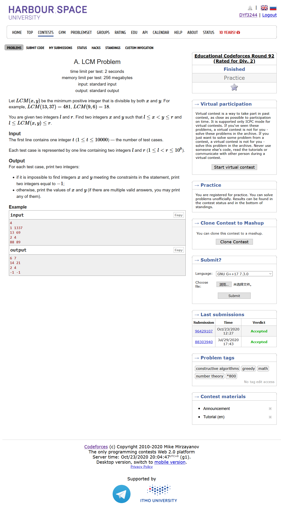
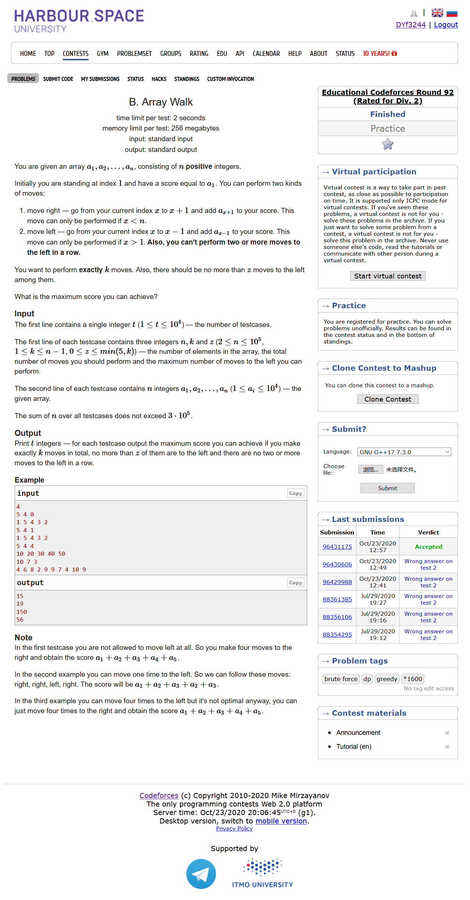
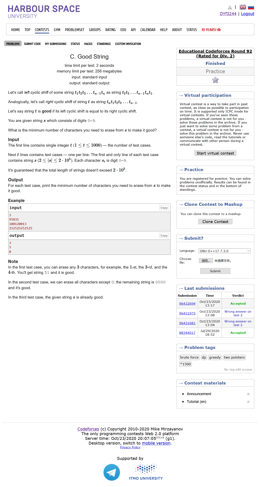
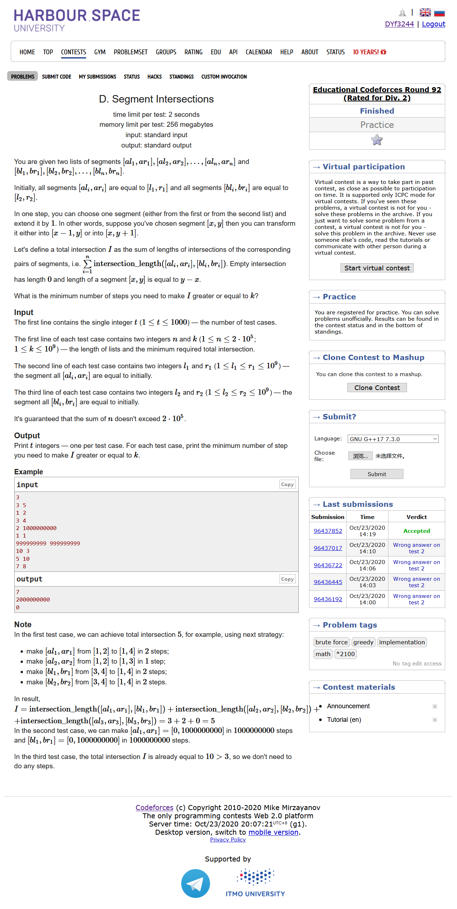
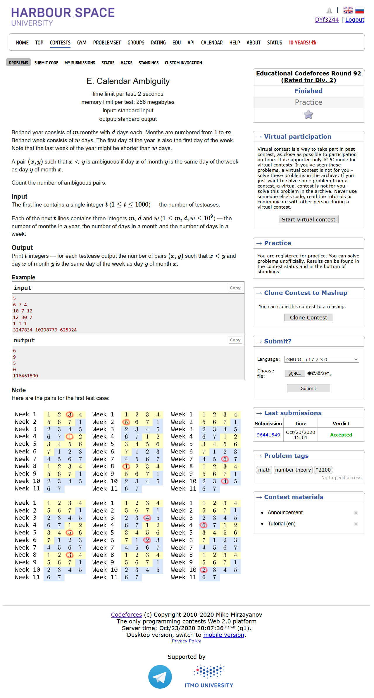

# Educational Codeforces Round 92 (Rated for Div. 2)

[官方题解](https://codeforces.ml/blog/entry/80809)

## [A. LCM Problem](https://codeforces.ml/contest/1389/problem/A)



- 构造
- 输出l和l*2（当l\*2不大于r的时候）

```cpp
#include <bits/stdc++.h>
using namespace std;
#define LL long long
#define sigma_size 30
#define max_size (int)(1e4+10)
#define MAX (int)(1e5+7)


pair<int,int> ans[max_size];
int main ()
{
	ios::sync_with_stdio(0);
	int T  ; cin >> T;
	for ( int cas = 1 ; cas <= T ; cas++ )
	{
		int l , r;
		cin >> l >> r;
		if ( 2*l <= r )
			ans[cas] = {l,2*l};
		else ans[cas] = {-1,-1};
	}
	for ( int i = 1 ; i <= T ; i++ )
		cout << ans[i].first << " " << ans[i].second << endl;
}
```

## [B. Array Walk](https://codeforces.ml/contest/1389/problem/B)



- 模拟，前缀和
- 我们应该枚举最后所停留的位置在哪里，由于每左移一次，就会有两个数字会被重复计算1次，我们先构造前缀和统计前d个数字当中最大的两个数字相加应该是多少
- 我们首先从1走到k+1的位置,然后我们把最后两个数字拿走，再加上前k个位置哪两个数的和的最大值，接着我们再把当前的位置-2，重复上述流程...

```cpp
#include <bits/stdc++.h>
using namespace std;
#define LL long long
#define sigma_size 30
#define max_size (int)(1e5+10)
#define MAX (int)(1e5+7)

LL ans[max_size];
LL a[max_size];
LL sum[max_size];
int main ()
{
	ios::sync_with_stdio(0);
	int T ; cin >> T;
	for ( int cas = 1 ; cas <= T ; cas++ )
	{
		int n , k , z;
		cin >> n >> k >> z;
		for ( int i = 1 ; i <= n ; i++ )
			cin >> a[i];
		LL tmp = 0 ;
		for ( int i = 1 ; i <= k+1 ; i++ )
			tmp += a[i];
		LL res = tmp;

		memset ( sum , 0 , sizeof(LL)*(n+5) );
		sum[1] = a[1]+a[2];
		for ( int i = 2 ; i < n ; i++ )
			sum[i] = sum[i-1] - a[i-1] + a[i+1] ;
		for ( int i = 2 ; i <= k ; i++ )
			sum[i] = max ( sum[i-1] , sum[i] );
		int d = k+1;
		for ( int i = 1 ; i <= z ; i++ )
		{
			tmp -= ( a[d] + a[d-1] );
			tmp += i*sum[d-1];
			res = max ( res , tmp );
			if ( d <= 2 ) break;
			tmp -= i*sum[d-1];
			d -= 2 ;
		}
		ans[cas] = res;
	}
	for ( int i = 1 ; i <= T ; i++ )
		cout << ans[i] << endl;
}
```

## [C. Good String](https://codeforces.ml/contest/1389/problem/C)



- 最后满足条件的字符串无非两种情况
  - 要么从头到尾都是相等的
  - 要么是偶数段，并且排列的方式应该是ijijijij

```cpp
#include <bits/stdc++.h>
using namespace std;
#define LL long long
#define sigma_size 30
#define max_size (int)(3e5+10)
#define MAX (int)(1e5+7)

int ans[1005];
int main()
{
    ios::sync_with_stdio(0);
    int T ; cin >> T;
    for ( int cas = 1 ; cas <= T ; cas++ )
    {
        string s; cin >> s;
        int Hash[10] ;
        memset ( Hash , 0 , sizeof(Hash) );
        for ( int i = 0 ; i < s.length() ; i++ )
            Hash[s[i]-'0']++;
        int minx = 0;
        for ( int i = 0 ; i < 10 ; i++ )
            minx = max ( Hash[i] , minx );
        minx = s.length() - minx ;
        for ( int i = 0 ; i < 10 ; i++ )
            for ( int j = 0 ; j < 10 ; j++ )
            {
                if ( i == j ) continue;
                int cnt = 0;
                bool flag = 0 ;
                for ( int k = 0 ; k < s.length() ; k++ )
                {
                    if ( flag == 0 && s[k]-'0' == i )
                    {
                        flag = 1;
                        cnt++;
                    }
                    else if ( flag == 1 && s[k]-'0' == j )
                    {
                        flag = 0 ;
                        cnt++;
                    }
                }
                if ( cnt % 2 ) cnt--;
                cnt = s.length() - cnt;
                minx = min ( minx , cnt );
            }
        ans[cas] = minx ;
    }
    for ( int i = 1 ; i <= T ; i++ )
        cout << ans[i] << endl;
}
```

## [D. Segment Intersections](https://codeforces.ml/contest/1389/problem/D)



- 贪心
- 情况挺复杂的一个题

```cpp
#include <bits/stdc++.h>
using namespace std;
#define LL long long
#define sigma_size 30
#define max_size (int)(1e5+10)
#define MAX (int)(1e5+7)

LL ans[1005];
int n , k;
LL l1 , r1 , l2 , r2;
int main()
{
    ios::sync_with_stdio(0);
    int T ; cin >> T;
    for ( int cas = 1 ; cas <= T ; cas++ )
    {
        cin >> n >> k;
        cin >> l1 >> r1 >> l2 >> r2 ;
        if ( l1 > l2 )
        {
            swap(l1,l2);
            swap(r1,r2);
        }
        LL cur = 0 ;
        if ( r1 >= r2 ) cur = max ( cur , (r2-l2)*n );
        else cur = max ( cur , (r1-l2)*n );
        if ( cur >= k )
            ans[cas] = 0;
        else
        {
            LL res = 0 ;
            LL minx = (1ll<<60);
            for ( int i = 1 ; i <= n ; i++ )
            {
                LL r = max ( r1 , r2 );
                if ( cur == k ) break;
                LL d;
                if ( r1 >= r2 )
                    d = r1-r2 ;
                else if ( r1 >= l2 )
                    d = r2 - r1;
                else if ( r1 < l2 )
                    d = r2 - l2;
                if ( cur + d < k )
                {
                    cur += d;
                    res += r - min ( r1 , r2 );
                }
                else
                {
                    res += k - cur;
                    if ( r1 < l2 )
                        res += l2 - r1;
                    cur = k;
                }
                if ( cur + l2 - l1 < k )
                {
                    cur += l2 - l1;
                    res += l2 - l1;
                }
                else 
                {
                    res += k - cur;
                    cur = k;
                }
                minx = min ( minx , res + ( k - cur ) * 2 ) ;
            }
            if ( cur == k ) ans[cas] = min ( minx , res );
            else ans[cas] = minx;
        }
    }
    for ( int i = 1 ; i <= T ; i++ )
        cout << ans[i] << endl;
}
```

## [E. Calendar Ambiguity](https://codeforces.ml/contest/1389/problem/E)



- 数论
- $(x-y)(d-1) \equiv 0 ( \mod w ) $

```cpp
#include <bits/stdc++.h>
using namespace std;
#define LL long long
#define sigma_size 30
#define max_size (int)(2e5 + 10)
#define MAX (int)(1e5+7)

LL ans[1005];
LL m , d , w;
int main ()
{
    int T ; cin >> T;
    for ( int cas = 1 ; cas <= T ; cas++ )
    {
        cin >> m >> d >> w;
        LL w2 = w / __gcd(d-1,w);
        LL minx = min ( d , m );
        LL cnt = minx / w2;
        ans[cas] = (2*(minx-w2) - w2*(cnt-1)) * cnt / 2 ;
    }
    for ( int i = 1 ; i <= T ; i++ )
        cout << ans[i] << endl;
}
```

## [F. Bicolored Segments](https://codeforces.ml/contest/1389/problem/F)

## [G. Directing Edges](https://codeforces.ml/contest/1389/problem/G)

