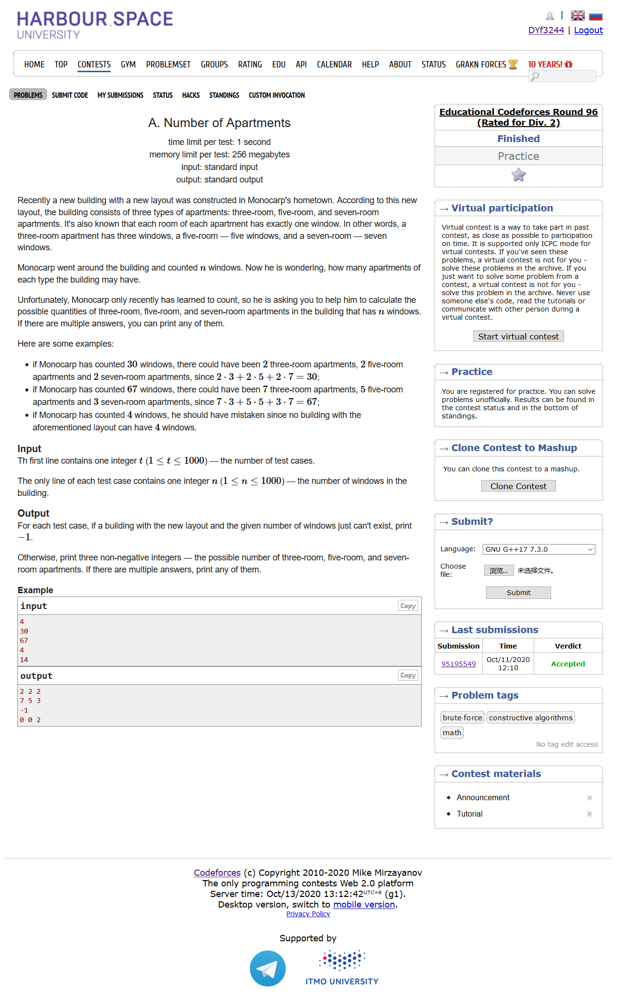
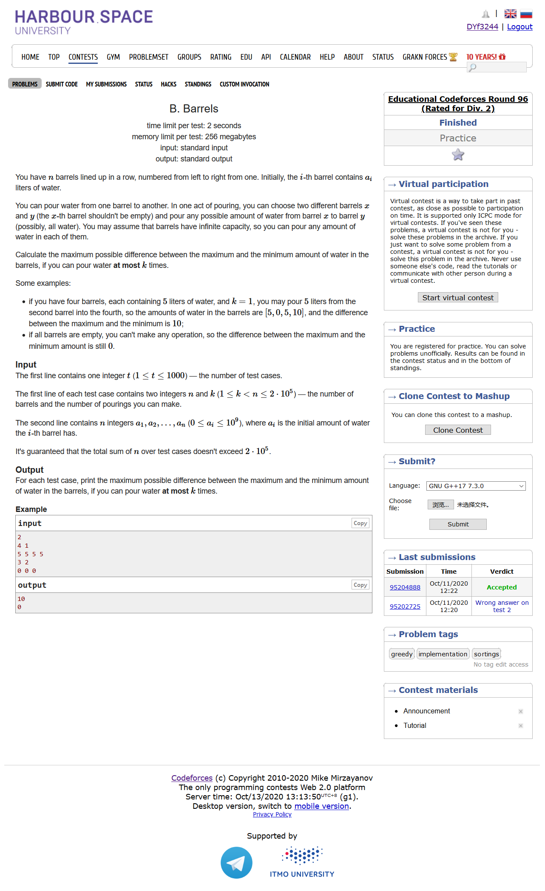
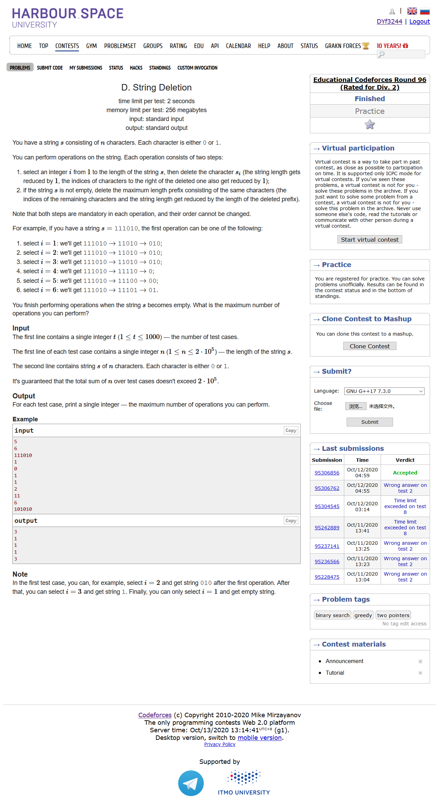

# Educational Codeforces Round 96 (Rated for Div. 2)

- [官方题解](https://codeforces.ml/blog/entry/83614)

## [A. Number of Apartments](https://codeforces.ml/contest/1430/problem/A)

- 
- 枚举

```cpp
#include <bits/stdc++.h>
using namespace std;
#define LL long long
#define sigma_size 30
#define max_size (int)(1e6+10)
#define MAX (int)(1e5+7)

int main ()
{
	ios::sync_with_stdio(0);
	int T ; cin >> T;
	while (T--)
	{
		int n ; cin >> n;
		bool flag = 0;
		int a , b , c;
		for ( int i = 0 ; i*3 <= n ; i++ )
		{
			for ( int j = 0 ; j*5 + i*3 <= n ; j++ )
			{
				for ( int k = 0 ; k*7 + j*5 + i*3 <= n ; k++ )
				{
					if ( i*3 + j*5 + k*7 == n )
					{
						flag = 1;
						a = i , b = j , c = k;
						break;
					}
				}
				if ( flag ) break;
			}
			if ( flag ) break;
		}
		if ( flag )
			cout << a << " " << b << " " << c << endl;
		else cout << "-1" << endl;
	}
}
```

## [B. Barrels](https://codeforces.ml/contest/1430/problem/B)

- 
- 模拟

```cpp
#include <bits/stdc++.h>
using namespace std;
#define LL long long
#define sigma_size 30
#define max_size (int)(2e5+10)
#define MAX (int)(1e5+7)

LL ans[max_size];
int n , k;
LL a[max_size];
int main ()
{
	ios::sync_with_stdio(0);
	int T ; cin >> T;
	for ( int cas = 1 ; cas <= T ; cas++ )
	{
		cin >> n >> k;
		for ( int i = 1 ; i <= n ; i++ )	cin >> a[i];
		sort ( a+1 , a+1+n );
		LL cur = a[n] ;
		int i = n-1;
		while ( k-- )
		{
			cur += a[i--];
		}
		ans[cas] = cur;
	}
	for ( int i = 1 ; i <= T ; i++ )
		cout << ans[i] << endl;
}
```

## [C. Numbers on Whiteboard](https://codeforces.ml/contest/1430/problem/C)

- 
- 思维，贪心
- 我们不妨考虑一下从1到n的数字之和，因为每次我们都会删除两个数字同时加上两个数字的和的一半，并且一共执行n-1次，要使得最后剩下的数字最小，也就是让最后剩下的和是最小的，所以我们每次都应该尽可能地取当前最大的两个数字删除掉。为了便于构造，我们尽可能的取和相加为偶数的两个数进行删除。
- 经过模拟我们总是可以得到最后剩下的数字就是2

```cpp
#include <bits/stdc++.h>
using namespace std;
#define LL long long
#define sigma_size 30
#define max_size (int)(1e6+10)
#define MAX (int)(1e5+7)

int main ()
{
    ios::sync_with_stdio(0);
    int T ; cin >> T;
    while (T--)
    {
        int n ; cin >> n;
        cout << "2" << endl;
        if ( n == 2 )
        {
            cout << "1 2" << endl;
            continue;
        }
        cout << n-2 << " " << n << endl;
        cout << n-1 << " " << n-1 << endl;
        for ( int i = 3 ; i <= n-1 ; i++ )
        {
            cout << n-i << " " << n-i+2 << endl;
        }
    }
}
```

## [D. String Deletion](https://codeforces.ml/contest/1430/problem/D)

- 
- 贪心，模拟
- 由于每次执行完之后最头的几个相同字符都会被删除掉，所以我们应该尽可能地考虑先删除掉最前面的几个元素当中的其中一个。
- 但是有一种情况就是当前最前面的相同元素个数只有一个，例如"1000110..."，这个时候我们应该考虑拿走一个后面的紧接着的0，待最前面的1被删除之后，我们再手动删除一次最前面的0，再被删除一个0...
- 因此我们一开始把整个字符串分成元素相同的若干段，用一个deque存放每一段的长度，如"111000101"可存放为"33111"，用sum表示为如果当前最靠前的元素为1的时候，我们可以还可以从后面找一个大于1的值，让这个值-1。(可以发现如果sum为0，那么后面已经全都是1了，这个时候剩下的元素只能删掉一半的长度)。同时，我们还需要一个临时变量tmp表示已经从后面借走了多少个1，后面要还的

```cpp
#include <bits/stdc++.h>
using namespace std;
#define LL long long
#define sigma_size 30
#define max_size (int)(1e5+10)
#define MAX (int)(1e5+7)

int ans[1005];
int main ()
{
    ios::sync_with_stdio(0);
    int T ; cin >> T;
    for ( int cas = 1 ; cas <= T ; cas++ )
    {
        int n ; cin >> n;
        string s;
        cin >> s;
        deque <int> v;
        char cur = s[0];
        int sum = n;
        for ( int i = 0 ; i < n ; )
        {
            int cnt = 0;
            while ( s[i] == cur && i < n )
            {
                cnt++;
                i++;
            }
            v.push_back(cnt);
            if ( i < n )
                cur = s[i];
        }
        sum -= (int)v.size();
        int tmp = 0;
        int res = 0;
        while ( !v.empty() )
        {
            if ( sum <= 0 )
            {
                res += ( v.size() + 1 ) / 2;
                break;
            }
            else
            {
                if ( v.front() == 1 )
                {
                    tmp++;
                    res++;
                    sum--;
                    v.pop_front();
                }
                else
                {
                    if ( tmp + 1 < v.front() )
                    {
                        res++;
                        sum -= ( v.front() - tmp - 1 );
                        tmp = 0;
                        v.pop_front();
                    }
                    else
                    {
                        tmp -= ( v.front() - 1 );
                        v.front() = 1;
                        continue;
                    }
                }
            }
        }
        ans[cas] = res;
    }
    for ( int i =1  ; i <= T ; i++ )
        cout << ans[i] << endl;
}
```

## [E. String Reversal](https://codeforces.ml/contest/1430/problem/E)

- [](./E.png)
- 树状数组
- 要使整个字符串逆序，我们手动模拟一下就是，先把整个字符串颠倒过来(记为t)，我们看t的最开头的字母在原来的字符串s的最前面的位置在哪里，我们把这个位置上的字母移动到最前面，就完成了一个字母的转移，在这个字母后面的字母转移的时候次数也会-1，这个时候我们考虑用树状数组处理
- 转移完成后，我们就把s的头元素删掉，因为剩下的字母的转移已经和这个头元素没有关系了。我们对接下来的字母再执行相同的操作……
- 我们可以先存放一下每个字母所有出现的位置，用一个队列queue保存，把每个位置的影响加入到树状数组当中。接着我们反向遍历字符串s(相当于反转字符串)，由于每个字母的位置都是递增的，因此我们可以得到每个位置上的字母的当前最靠前的位置，统计一下移动次数。统计完成后，我们把这个位置的字母删掉即可

```cpp
#include <bits/stdc++.h>
using namespace std;
#define LL long long
#define sigma_size 30
#define max_size (int)(2e5 + 10)
#define MAX (int)(1e5+7)

int n;
string s;
int c[max_size];
int lowbit ( int x )
{
    return x & (-x);
}
void add ( int x , int v ){
    while ( x <= n )
    {
        c[x] += v;
        x += lowbit(x);
    }
}
int sum ( int x )
{
    int res = 0;
    while ( x )
    {
        res += c[x];
        x -= lowbit(x);
    }
    return res;
}
int main ()
{
    ios::sync_with_stdio(0);
    cin >> n;
    cin >> s;
    s = ' ' + s;
    queue <int> q[30];
    for ( int i = 1 ;  i<= n ; i++ )
    {
        q[s[i]-'a'].push(i);
        add(i,1);
    }   
    LL ans = 0;
    for ( int i = n ; i >= 1 ; i-- )
    {
        int x = q[s[i]-'a'].front();
        q[s[i]-'a'].pop();
        ans += sum(x) - 1;
        add(x,-1);
    }
    cout << ans << endl;
}
```

## [F. Realistic Gameplay](https://codeforces.ml/contest/1430/problem/F)

- [](./F.png)
- 贪心
- 一开始我的想法是如果两个区间触碰了，那么就把两个区间合并一下。当然这样是不合理的，因为前一个区间的怪物可能老早就消灭完了，这样合并就毫无意义。
- 所以我们给每个怪物加一个属性dp，p[i].dp就表示如果我在最边界的位置不打最后k个子弹，这个区间会剩余多少怪物(注意最小是0，也就是说这个时候该区间的怪物应该老早就打完了)。那么对于某一波怪物i，$(1 \le i < n )$，该区间应该消灭的怪物x=p[i].a，如果该区间和右边的区间有接触了，那么x还应该加上右边剩余的怪物(x+=p[i].dp)。如果某个区间不能消灭完这x个怪物那么就输出-1.
- 接下来我们设x为当前子弹的剩余量($x\le k$)，我们每次都应该假设可以贪心地只打完所有怪物即可，不要丢弃最后的x个子弹，那么好了，万一这个x小于下一个区间的剩余怪物，那么我们就得在上一个区间打完之后丢掉剩下的x个子弹，此时x重新装弹为k个

```cpp
#include <bits/stdc++.h>
using namespace std;
#define LL long long
#define ULL unsigned long long
#define sigma_size 30
#define max_size (int)(2e5+10)
#define MAX_SIZE (int)(4e6+7)

struct node {
	LL l , r , a , dp;
}p[2005];
int n , k;
int main ()
{
	ios::sync_with_stdio(0);
	cin >> n >> k;
	bool flag = 1;
	for ( int i = 1 ; i <= n ; i++ ) cin >> p[i].l >> p[i].r >> p[i].a , p[i].dp = 0;
	for ( int i = n ; i >= 1 ; i-- )
	{
		LL x = p[i].a;
		if ( i < n && p[i].r == p[i+1].l ) x += p[i+1].dp;
		if ( k*(p[i].r-p[i].l+1) < x ) 
		{
			flag = 0;
			break;
		}
		p[i].dp = max ( 0ll , x - (p[i].r-p[i].l)*k );
	}
	if ( !flag ) { cout << "-1" << endl; return 0 ;}
	LL x = k;
	LL res = 0 ;
	for ( int i = 1 ; i <= n ; i++ )
	{
		if ( x < p[i].dp )
		{
			res += x;
			x = k;
		}
		res += p[i].a;
		if ( x >= p[i].a )
			x -= p[i].a;
		else
		{
			LL d = p[i].a - x;
			x = k - d % k ;
		}
	}
	cout << res << endl;
}
```