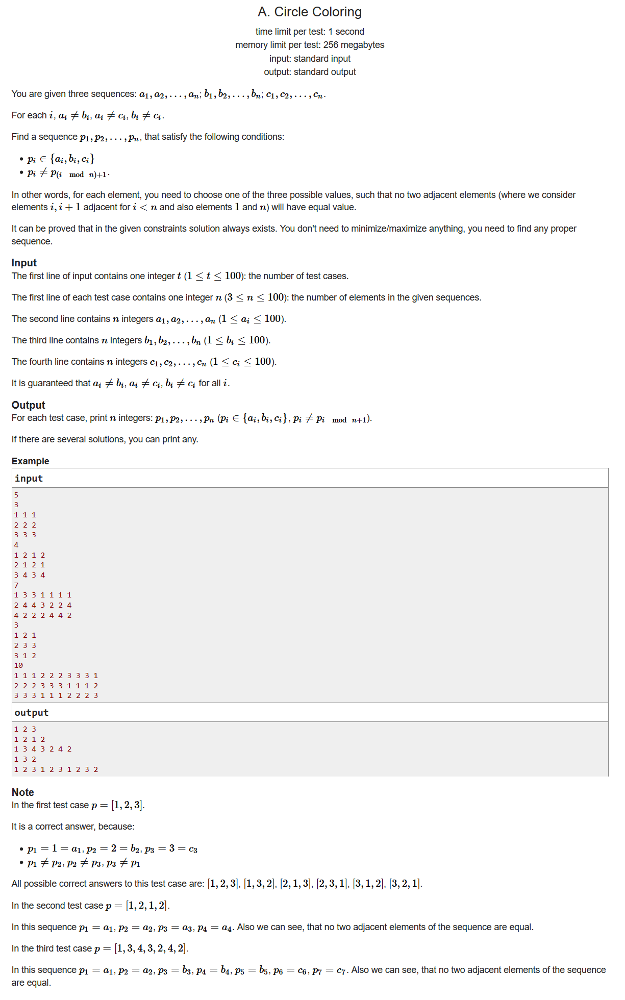
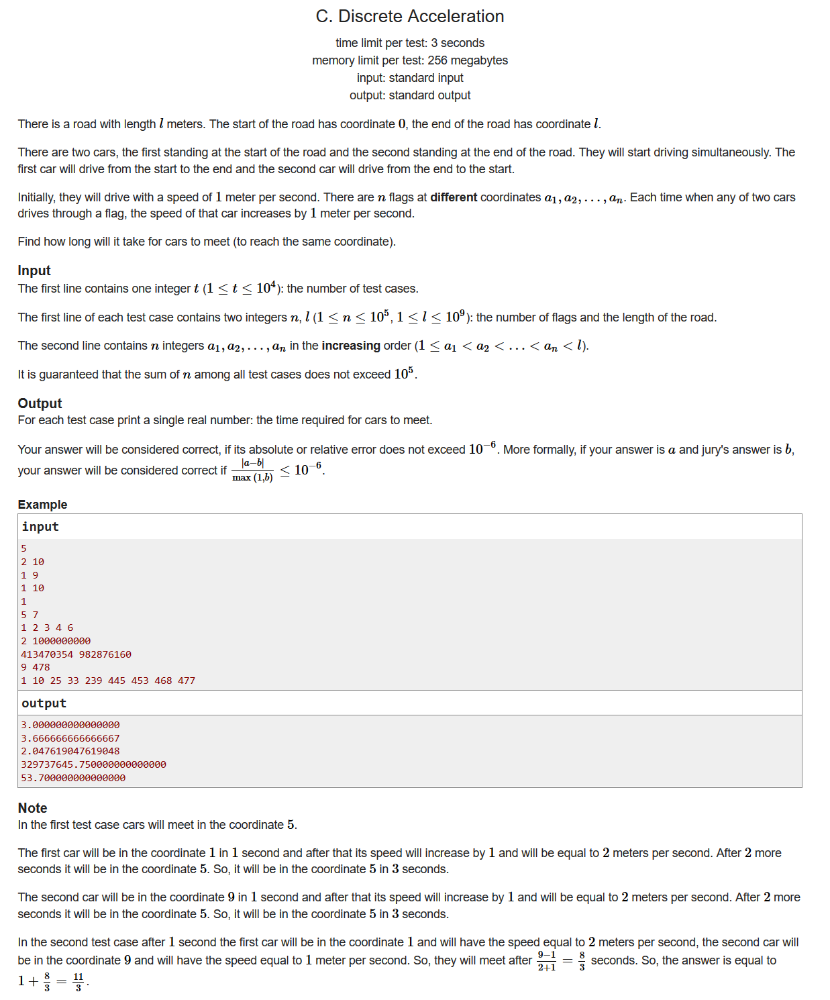
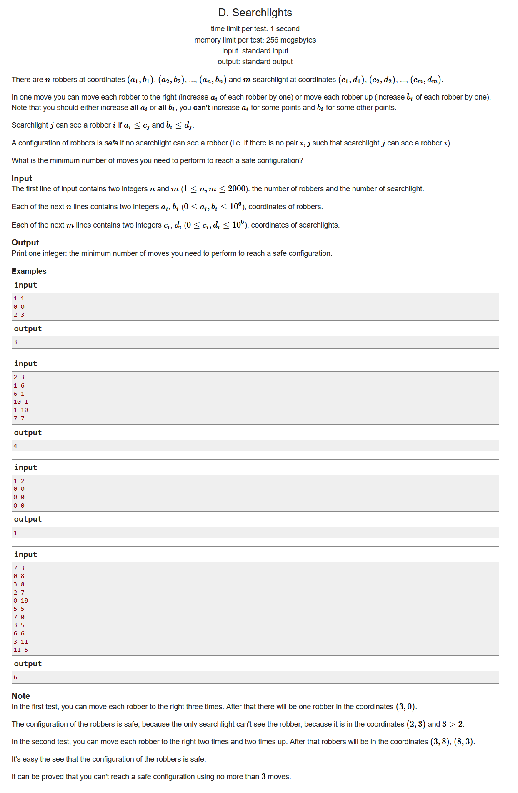
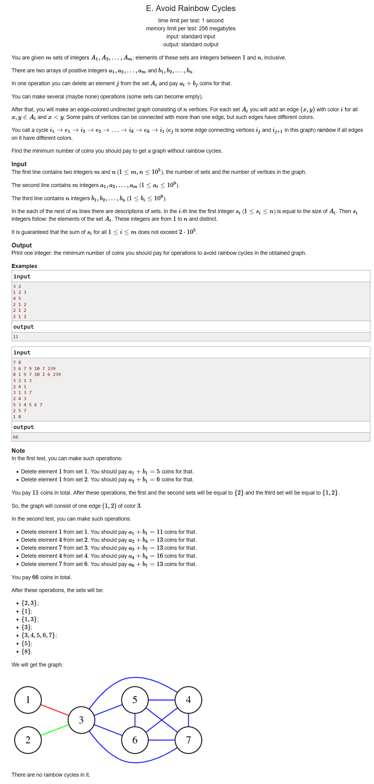
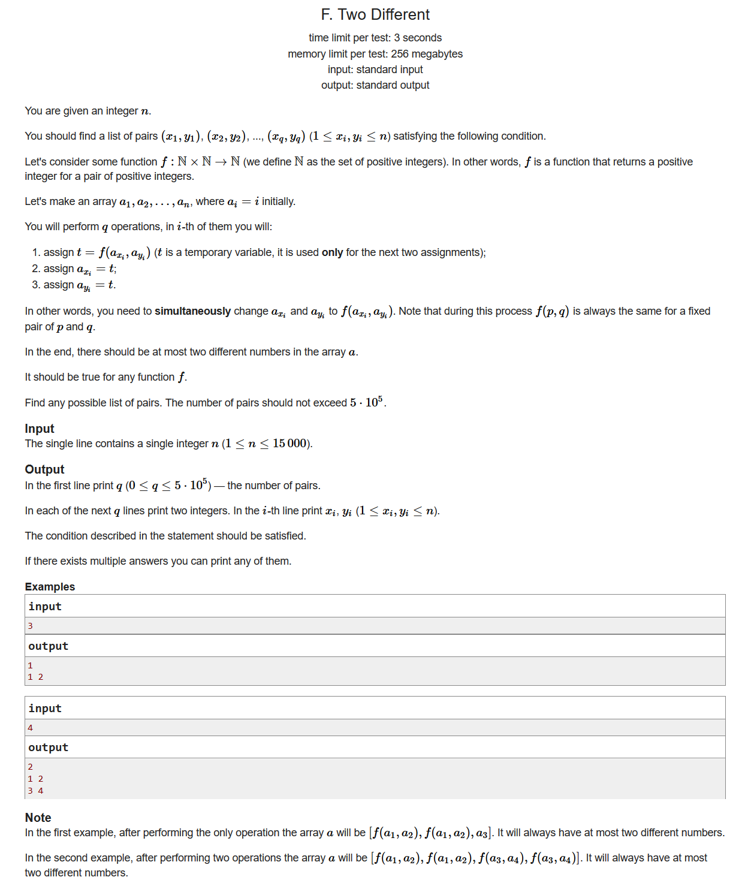

# Grakn Forces 2020

- [题目链接](https://codeforces.ml/contest/1408)
- [官方题解](https://codeforces.ml/blog/entry/83233)

## A. Circle Coloring

- 
- 题目大意：给定三个数列A,B,C，数列保证相同下标的数各不相同，求构造出一个数列p，使得p数列首尾相接之后相邻元素各不相同
- 构造
- 懒，不想写

```cpp
#include <bits/stdc++.h>
using namespace std;
#define LL long long
#define sigma_size 30
#define max_size (int)(1e4+10)
#define MAX (int)(1e5+7)

int a[105];
int b[105];
int c[105];
int main ()
{
	ios::sync_with_stdio(0);
	int T  ;cin >> T;
	while (T--)
	{
		int n ; cin >> n;
		for ( int i = 1 ; i <= n ; i++ ) cin >> a[i];
		for ( int i = 1 ; i <= n ; i++ ) cin >> b[i];
		for ( int i = 1 ; i <= n ; i++ ) cin >> c[i];
		cout << a[1] << " ";
		int last = a[1];
		for ( int i = 2 ; i < n ; i++ )
		{
			if ( a[i] != last ) 
			{
				cout << a[i] << " " ;
				last = a[i];
				continue;
			}
			if ( b[i] != last )
			{
				cout << b[i] << " ";
				last = b[i];
				continue;
			} 
			cout << c[i] << " ";
			last = c[i];
		}
		if ( a[n] != last && a[n] != a[1] )
			cout << a[n] << endl;
		else if ( b[n] != last && b[n] != a[1] ) 
			cout << b[n] << endl;
		else cout << c[n] << endl;
	}
}
```

## B. Arrays Sum

- 
- 题目大意：对于给定一个单调不减的数列A，需要构造出m组单调不减的数列B，每一组B的元素个数和A相同，并且要求对应的下标加起来应该和A对应下标的数字相等。同时，还要求B的元素种类不能超过k，求是否存在这种构造方式，如果存在，最小的m是多少
- 贪心，思维
- 我们构造的思路应该是，在每组B当中，我们都可以拿A数组当中当前最小的几个元素放到B的最开始几个位置当中，后面的元素就填充B最开始几个元素的最后一个元素即可，这样既保证了我们充分利用B的元素个数不能超过k这个条件，也使得每一次填充能够消灭尽可能多的A的元素个数
- 我们先统计一下A当中的元素种类个数cnt，当且仅当k为1并且cnt>1的时候无解；接下来我们需要注意的是，第一次构造B的时候可以消灭掉A当中k个不同的元素，后面每一次都只能消灭掉(k-1)个不同的元素

```cpp
#include <bits/stdc++.h>
using namespace std;
#define LL long long
#define sigma_size 30
#define max_size (int)(1e5+10)
#define MAX (int)(1e5+7)

int ans[105];
int n , k;
int a[105];
int main ()
{
	ios::sync_with_stdio(0);
	int T ; cin >> T;
	for ( int cas = 1  ; cas <= T ; cas++ )
	{
		cin >> n >> k;
		for ( int i = 1 ; i <= n ; i++ ) cin >> a[i];
		int cnt = 1;
		for ( int i = 2 ; i <= n ; i++ )
			if ( a[i] != a[i-1] ) 
				cnt++;
		if ( k == 1 && cnt > 1 ) { ans[cas] = -1 ; continue; }
		if ( cnt <= k ) { ans[cas] = 1 ; continue ;}
		cnt -= k;
		int res = 1 ;
		res = res + cnt / ( k - 1 ) ;
		if ( cnt % (k-1) ) res++;
		ans[cas] = res;
	}
	for ( int i = 1 ; i <= T ; i++ )
		cout << ans[i] << endl;
}
```

## C. Discrete Acceleration

- 
- 题目大意：两辆车分别从头和从尾相向而行，沿途会有几个flag，每次经过一个flag的时候速度就会+1，求问他们相遇时花费了多长时间
- 模拟
- 首先我们可以很容易计算出A车从左到右行驶的时候到达每一个flag所需要的时间time1[i]，再计算出B车从右往左的时候所需要的时间time2[i]。
- 然后我们从左往右一个个去比较每个flag两辆车的时间，直到我们发现某个结点$time1[i] < time2[i]$，这个时候就说明，两辆车相遇的地点是在$a_{i-1}以及a_i$中间，这个时候我们可以设他们相遇时时间为t，则有:

    $$
        (t-time1[i-1])*v_1 + ( t-time2[i] )*v_2 = a[i]-a[i-1]
    $$

- 不过需要注意一下特殊情况，即他们相遇的地方刚好是在某个flag上，我们单独拿出来处理即可

```cpp
#include <bits/stdc++.h>
using namespace std;
#define LL long long
#define sigma_size 30
#define max_size (int)(1e5+10)
#define MAX (int)(1e5+7)

double ans[max_size];
int n , l;
int a[max_size];
double time1[max_size] , time2[max_size];
int main ()
{
    ios::sync_with_stdio(0);
    int T ; cin >> T;
    for ( int cas = 1 ; cas <= T ; cas++ )
    {
        cin >> n >> l;
        for ( int i = 1 ; i <= n ; i++ ) cin >> a[i];
        a[n+1] = l;
        double t = 0.0;
        t += 1.0 * a[1];
        time1[1] = t;
        for ( int i = 2 ; i <= n+1 ; i++ )
        {
            t += 1.0 * ( a[i] - a[i-1] ) / i;
            time1[i] = t;
        }
        t = 0.0;
        time2[n+1] = 0.0;
        for ( int i = n ; i >= 0 ; i-- )
        {
            t += 1.0 * ( a[i+1] - a[i] ) / ( n - i + 1 );
            time2[i] = t;
        }
        for ( int i = 1 ; i <= n+1 ; i++ )
        {
            if ( time1[i] < time2[i] ) continue;
            if ( time1[i] == time2[i] )
            {
                double d = 1.0 * ( a[i+1] - a[i-1] );
                d += time1[i-1] * i + time2[i+1] * ( n - i + 1 );
                ans[cas] = d / ( n + 1 ) ;
                break;
            }
            double d = 1.0 * ( a[i] - a[i-1] );
            d += time1[i-1] * i + time2[i] * ( n - i + 2 );
            ans[cas] = d / ( n + 2 );
            break;
        }
    }
    for ( int i =1 ;  i<= T ; i++ )
        printf( "%.8lf\n" , ans[i] ) ;
}
```

## D. Searchlights

- 
- 题目大意：有n个强盗，每个强盗位于相应的坐标；同时有m个探照灯，每个探照灯也位于相应的坐标。现在需要让所有的强盗同时向上平移若干步，向右平移若干步，使得所有的强盗都能不被探照灯找到(强盗被探照灯找到当且仅当$a_i \le c_j \space and \space b_i \le d_j$)，求最小的移动步数
- 设x表示所有强盗向右移动的步数，y表示所有强盗向上移动的步数，设r[x]表示当向右移动的步数为x步时，向上最小移动的步数为多少。
- 每个强盗不让探照灯找到，那就是$x + a_i > c_j || y + b_i > d_j$也就是说，如果$x \le c_j - a_i$那么我们就必须$y \ge d_j - b_i + 1$，此时$r[x] = max ( d_j - b_i + 1 )$，我们可以在nm次数之内求出某些x的最大的r[x]，剩下的我们可以用后缀最大值来解决

```cpp
#include <bits/stdc++.h>
using namespace std;
#define LL long long
#define sigma_size 30
#define max_size (int)(1e6+10)
#define MAX (int)(1e5+7)

int n , m ;
int a[max_size] , b[max_size];
int c[max_size] , d[max_size];
int r[max_size];
int main ()
{
	ios::sync_with_stdio(0);
	cin >> n >> m;
	for ( int i = 1 ; i <= n ; i++ ) cin >> a[i] >> b[i];
	for ( int i = 1 ; i <= m ; i++ ) cin >> c[i] >> d[i];
	for ( int i = 1 ; i <= n ; i++ )
		for ( int j = 1 ; j <= m ; j++ )
			if ( c[j] - a[i] >= 0 )
				r[c[j]-a[i]] = max ( r[c[j]-a[i]] , d[j] - b[i] + 1 );
	for ( int i = 1e6-1 ; i >= 0 ; i-- )
		r[i] = max ( r[i] , r[i+1] ) ;
	int res = INT_MAX;
	for ( int i = 0 ; i <= 1e6 ; i++ )
		res = min ( res , i + r[i] );
	cout << res << endl;
}
```

## E. Avoid Rainbow Cycles

- 
- 题目大意：有m个集合，每个集合有若干的数字，当我们删去第i个集合的第j个数字的时候，所需要的代价是$a_i + b_j$，删掉之后的集合里面的数会当成结点形成图，结点之间的连线颜色就是集合的编号，要求任意一个闭环上边的颜色不能够完全不相同，求删掉元素的最小代价
- 最大生成树，二分图
- 我们首先把m个集合全都放在左边，把每个集合最多有n个数字放在右边，这样形成一个二分图，可以证明，为了不形成彩虹圈，他们之间的连线就不能形成相交于同一个结点的闭环。那么我们可以把问题等价于在二分图上找到一个最大生成树，边权就是每个集合删除某个数字所需要的代价

```cpp
#include <bits/stdc++.h>
using namespace std;
#define LL long long
#define sigma_size 30
#define max_size (int)(5e5 + 10)
#define MAX (int)(1e5+7)

int n , m;
int tot = 1;
LL w[max_size] ;
int u[max_size] , v[max_size];
int p[max_size] , r[max_size];
int cmp ( const int i , const int j ) { return w[i] > w[j] ;}
int find ( int x ) { return p[x] == x ? x : p[x] = find(p[x]) ;}
LL Kruskal () {
    LL ans = 0;
    for ( int i = 0 ; i <= n + m  ; i++ ) p[i] = i;
    for ( int i = 0 ; i <= tot ; i++ ) r[i] = i;
    sort ( r+1 , r+tot , cmp );
    for ( int i = 1 ; i < tot ; i++ ) {
        int e = r[i] ; int x = find(u[e]) ; int y = find(v[e]);
        if ( x != y ) { ans += w[e] ; p[x] = y ;}
    }
    return ans;
}

LL a[max_size] , b[max_size];
LL sum = 0;
int main ()
{
    ios::sync_with_stdio(0);
    cin >> m >> n;
    for ( int i = 1 ; i <= m ; i++ ) cin >> a[i];
    for ( int i = 1 ; i <= n ; i++ ) cin >> b[i];
    for ( int i = 1 ; i <= m ; i++ )
    {
        int s ; cin >> s;
        for ( int j = 1 ; j <= s ; j++ )
        {
            int x ; cin >> x;
            u[tot] = i;
            v[tot] = m + x;
            w[tot] = a[i] + b[x];
            sum += w[tot];
            tot++;
            
        }
    }
    cout << sum - Kruskal() << endl;
}
```

## F. Two Different

- 
- 题目大意：给定从1到n的数列，要求构造出一系列的坐标组，每个坐标组对应的两个数都会变成相等的数字，要求最后整个数列的元素种类个数不超过2，求任意的一组合适的构造方式
- 分治
- 我们可以假设对于一个$2^k$的数列，如果前面$2^{k-1}$个元素全都相等，后面$2^{k-1}$个元素也相等，那么我们就可以按顺序输出$i+2^{k-1}$使得这个数列全都相等。至于怎么让前面一半的元素和后面一半的元素全部相等，我们用分治的思路进行解决
- 对于整个数列，我们可以先找到$2^k\le n$的最大k值，然后搞定前面$2^k$个数字，接着搞定后面$2^k$个数字

```cpp
#include <bits/stdc++.h>
using namespace std;
#define LL long long
#define ULL unsigned long long
#define sigma_size 30
#define max_size (int)(2e5+10)
#define MAX_SIZE (int)(4e6+7)

vector < pair<int,int> > ans;
void make_the_same ( int i , int j )
{
	if ( i == j ) return ;
	int mid = i + j >> 1;
	make_the_same ( i , mid );
	make_the_same ( mid + 1 , j );
	for ( int left = i , k = 1 ; left <= mid ; left++ , k++ )
		ans.push_back({left,k+mid});
}

int main ()
{
	int n ; cin >> n;
	int k = 0;
	while ( 1 << k <= n ) k++;
	k--;
	make_the_same ( 1 , 1 << k );
	make_the_same ( n - (1 << k) + 1 , n );
	cout << ans.size() << endl;
	for ( int i = 0 ; i < ans.size() ; i++ )
		cout << ans[i].first << " " << ans[i].second << endl;
}
```